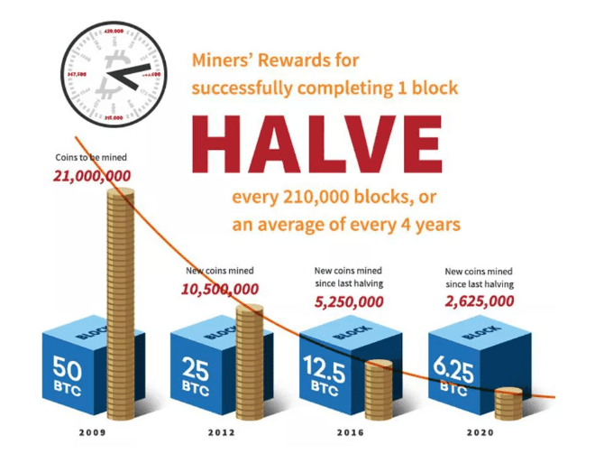

## Table of Contents

## What is Bitcoin Classic?

Bitcoin Classic is a type of software that some people use to help run the Bitcoin network. It is similar to the original Bitcoin software but has some changes that some people think make it better. The main change is that it allows for bigger groups of transactions, called blocks, to be processed at one time. This is supposed to help the network handle more transactions faster.

Not everyone agrees that Bitcoin Classic is a good idea. Some people worry that making the blocks bigger could cause problems for the network. They think it might make it harder for regular people to run the software on their computers. Because of these disagreements, Bitcoin Classic is not used by everyone who uses Bitcoin. Instead, it is just one of several different versions of the software that people can choose from.

## How does Bitcoin Classic differ from Bitcoin Core?

Bitcoin Classic and Bitcoin Core are two different versions of software that help run the Bitcoin network. The main difference between them is the size of the blocks they use to process transactions. Bitcoin Classic wants to use bigger blocks, up to 8 megabytes, while Bitcoin Core sticks with smaller blocks of 1 megabyte. Bitcoin Classic supporters believe that bigger blocks will allow the network to handle more transactions more quickly, which could make Bitcoin more useful for everyday purchases.

However, not everyone agrees with this idea. Some people who support Bitcoin Core worry that bigger blocks could make it harder for regular people to run the software on their home computers. They think that if blocks get too big, only big companies with powerful computers will be able to keep up with the network. This could make the network less secure and less fair. Because of these different views, Bitcoin Classic and Bitcoin Core have become two separate paths that people can choose from when they want to use Bitcoin.

## What are the main features of Bitcoin Classic?

Bitcoin Classic is a type of software that helps run the Bitcoin network. The main feature of Bitcoin Classic is that it allows for bigger blocks of transactions. Normally, Bitcoin uses blocks that are 1 megabyte in size, but Bitcoin Classic wants to use blocks that are up to 8 megabytes. This means that more transactions can be processed at one time, which could make Bitcoin faster and more useful for everyday buying and selling.

However, not everyone agrees that bigger blocks are a good idea. Some people worry that if the blocks get too big, only big companies with powerful computers will be able to keep up with the network. This could make the network less safe and less fair for everyone. Because of these different opinions, Bitcoin Classic is just one choice among several different versions of Bitcoin software that people can use.

## How does Bitcoin Classic aim to improve transaction speeds?

Bitcoin Classic aims to improve transaction speeds by allowing for bigger blocks of transactions. Normally, Bitcoin uses blocks that are 1 megabyte in size, but Bitcoin Classic wants to use blocks that are up to 8 megabytes. This means that more transactions can be packed into each block, so the network can process more transactions at one time. When more transactions can be processed together, it makes the whole system faster, which is good for people who want to use Bitcoin for everyday buying and selling.

However, not everyone thinks that bigger blocks are a good idea. Some people worry that if the blocks get too big, only big companies with powerful computers will be able to keep up with the network. This could make the network less safe and less fair for everyone. Because of these different opinions, Bitcoin Classic is just one choice among several different versions of Bitcoin software that people can use.

## What is the block size limit in Bitcoin Classic and why is it important?

The block size limit in Bitcoin Classic is set to 8 megabytes. This is bigger than the 1 megabyte limit used in Bitcoin Core. The reason for this bigger limit is to allow more transactions to be processed at one time. When more transactions can fit into a block, the whole network can work faster. This is important because it can make Bitcoin more useful for everyday buying and selling.

However, not everyone agrees that a bigger block size is a good idea. Some people worry that if blocks get too big, only big companies with powerful computers will be able to keep up with the network. This could make the network less safe and less fair for everyone. Because of these different opinions, Bitcoin Classic is just one choice among several different versions of Bitcoin software that people can use.

## How does Bitcoin Classic handle scalability issues?

Bitcoin Classic tries to solve scalability issues by making the blocks bigger. Normally, Bitcoin uses blocks that are 1 megabyte, but Bitcoin Classic uses blocks that are up to 8 megabytes. This means more transactions can fit into each block, so the network can process more transactions at one time. When more transactions can be processed together, it makes the whole system faster. This is good for people who want to use Bitcoin for everyday buying and selling because it can handle more transactions quickly.

However, not everyone thinks that bigger blocks are a good solution for scalability. Some people worry that if the blocks get too big, only big companies with powerful computers will be able to keep up with the network. This could make the network less safe and less fair for everyone. Because of these different opinions, Bitcoin Classic is just one choice among several different versions of Bitcoin software that people can use.

## What are the potential security implications of using Bitcoin Classic?

Using Bitcoin Classic can change the security of the Bitcoin network. Bitcoin Classic wants to use bigger blocks, up to 8 megabytes, instead of the usual 1 megabyte blocks. This means more transactions can fit into each block, which can make the network faster. But some people worry that bigger blocks might make the network less safe. If the blocks get too big, only big companies with powerful computers might be able to keep up with the network. This could make it easier for those big companies to control the network and make it less fair for everyone else.

Another worry is that bigger blocks could make it easier for someone to attack the network. If only a few big companies can handle the bigger blocks, it might be easier for someone to take control of those companies and then control the whole network. This could lead to problems like double-spending, where someone spends the same Bitcoin twice. Because of these concerns, not everyone agrees that using Bitcoin Classic is a good idea. It's important for people to think about these security issues when deciding whether to use Bitcoin Classic or another version of Bitcoin software.

## How does the governance model of Bitcoin Classic work?

Bitcoin Classic's governance model is different from other Bitcoin software because it's run by a group of people who believe in bigger blocks. These people make decisions about how the software should work and what changes should be made. They talk about their ideas online and try to agree on what to do. If most of them agree on a change, they can update the software and tell everyone who uses it to download the new version.

But not everyone who uses Bitcoin Classic has a say in these decisions. Only the people who are part of the group that runs Bitcoin Classic can vote on changes. This means that if you use Bitcoin Classic, you have to trust that the group is making good choices for the software. Some people like this way of making decisions because it can be quick, but others worry that it might not be fair to everyone who uses Bitcoin Classic.

## What has been the adoption rate of Bitcoin Classic among miners and users?

Bitcoin Classic tried to get more people to use it by letting blocks be bigger, but it did not become very popular with miners and users. Miners are the people who help keep the Bitcoin network running by solving hard math problems. They did not switch to Bitcoin Classic in large numbers because they were worried about the changes. Users, who are the people who buy and sell things with Bitcoin, also did not switch to Bitcoin Classic much. They were not sure if the bigger blocks would really help and were worried about the risks.

The adoption rate of Bitcoin Classic was low because there were other versions of Bitcoin software that people liked better. Bitcoin Core, which keeps the blocks at 1 megabyte, stayed more popular. People trusted Bitcoin Core more because it had been around longer and more people were using it. Even though Bitcoin Classic had some good ideas, it did not get enough support from miners and users to become the main way to use Bitcoin.

## What are the economic implications of implementing Bitcoin Classic?

If Bitcoin Classic were implemented, it could change how Bitcoin works in a big way. Bitcoin Classic wants to make blocks bigger, up to 8 megabytes instead of the usual 1 megabyte. This means more transactions could be processed at once, making the network faster. Faster transactions could make Bitcoin more useful for everyday buying and selling, which might attract more people to use it. More users could increase the demand for Bitcoin, possibly making its value go up. Businesses might also find it easier to accept Bitcoin for payments, leading to more places where you can use it.

However, there are also risks to consider. Some people worry that bigger blocks might make the network less safe. If only big companies with powerful computers can handle the bigger blocks, they might have too much control over the network. This could make it less fair for everyone else. Also, if the network becomes less secure, it might scare people away and make the value of Bitcoin go down. Because of these concerns, not everyone thinks that Bitcoin Classic is a good idea. The economic impact would depend a lot on how well the network can handle the changes and how people feel about them.

## How does Bitcoin Classic interact with other cryptocurrencies and blockchain technologies?

Bitcoin Classic is a type of software that some people use to run the Bitcoin network. It does not directly interact with other cryptocurrencies like Ethereum or Litecoin. Each [cryptocurrency](/wiki/cryptocurrency) has its own network and rules, so Bitcoin Classic only works with Bitcoin. However, the ideas behind Bitcoin Classic, like bigger blocks, have influenced other cryptocurrencies and blockchain projects. Some other cryptocurrencies have also tried using bigger blocks to make their networks faster.

Even though Bitcoin Classic does not work directly with other cryptocurrencies, it can affect them indirectly. If Bitcoin Classic were to become more popular, it could change how people think about Bitcoin and other cryptocurrencies. For example, if Bitcoin Classic made Bitcoin faster and easier to use, more people might want to use other cryptocurrencies too. On the other hand, if Bitcoin Classic caused problems for Bitcoin, it might make people less interested in other cryptocurrencies as well. So, while Bitcoin Classic does not connect directly with other blockchain technologies, its success or failure could have a big impact on the whole cryptocurrency world.

## What are the long-term prospects and potential challenges for Bitcoin Classic?

The long-term prospects for Bitcoin Classic are not very clear. It wants to make Bitcoin faster by using bigger blocks, which could make it more useful for everyday buying and selling. If more people start using Bitcoin for regular purchases, the value of Bitcoin might go up. This could be good for Bitcoin Classic if it becomes the main way to use Bitcoin. But right now, not many people are using Bitcoin Classic, so it's hard to say if it will ever become popular.

There are also some big challenges for Bitcoin Classic. One big problem is that not everyone agrees with the idea of bigger blocks. Some people worry that bigger blocks could make the network less safe and less fair. If only big companies with powerful computers can keep up with the network, it might be easier for those companies to control Bitcoin. This could scare people away and make the value of Bitcoin go down. Because of these concerns, it's hard for Bitcoin Classic to get more people to use it. So, while Bitcoin Classic has some good ideas, it faces a lot of challenges in the long run.

## References & Further Reading

1. Nakamoto, S. (2008). Bitcoin: A Peer-to-Peer Electronic Cash System. This foundational paper by Satoshi Nakamoto introduces Bitcoin, the first decentralized cryptocurrency, laying the groundwork for subsequent developments, including Bitcoin Classic.

2. Antonopoulos, A. M. (2017). Mastering Bitcoin: Unlocking Digital Cryptocurrencies (2nd Edition). O'Reilly Media. A comprehensive guide to understanding Bitcoin's mechanics, providing valuable insights into blockchain technology applicable to Bitcoin Classic.

3. Narayanan, A., Bonneau, J., Felten, E., Miller, A., & Goldfeder, S. (2016). Bitcoin and Cryptocurrency Technologies: A Comprehensive Introduction. Princeton University Press. This book offers an academic introduction to cryptocurrencies, crucial for understanding the technical challenges and innovations of Bitcoin Classic.

4. De Filippi, P., & Wright, A. (2018). Blockchain and the Law: The Rule of Code. Harvard University Press. This work examines the intersection of blockchain technology and legal frameworks, relevant to the evolving regulatory environment impacting Bitcoin Classic.

5. Poon, J., & Dryja, T. (2015). The Bitcoin Lightning Network: Scalable Off-Chain Instant Payments. Though not directly about Bitcoin Classic, this paper explores solutions to the scalability issues it seeks to address.

6. Mougayar, W. (2016). The Business Blockchain: Promise, Practice, and Application of the Next Internet Technology. Wiley. This book provides perspectives on the potential applications and future directions of blockchain technology, with implications for Bitcoin Classic's evolution.

7. Evidence from algorithmic trading: The study by J. D. Farmer and S. Skouras (2013) on how algorithms impact trading strategies, published in "Algorithmic Trading and its Impact on Financial Markets" by Oxford University Press, informs potential applications of Bitcoin Classic in trading.

8. Bitcoin Classic Official Forum and GitHub Repository. Ongoing technical discussions and updates about Bitcoin Classic can be followed on its official forum and through its GitHub repository, featuring the latest code developments.

9. Schwab, K. (2017). The Fourth Industrial Revolution. Portfolio. This book discusses emerging technologies, including blockchain, providing a context for Bitcoin Classic's role in digital transformation.

10. News and analysis: Websites like Coindesk.com and CoinTelegraph offer regular news, analysis, and opinion pieces regarding Bitcoin Classic and broader cryptocurrency trends.

These resources provide a comprehensive view for anyone seeking to understand Bitcoin Classic's position within the broader context of cryptocurrency and blockchain technology.

