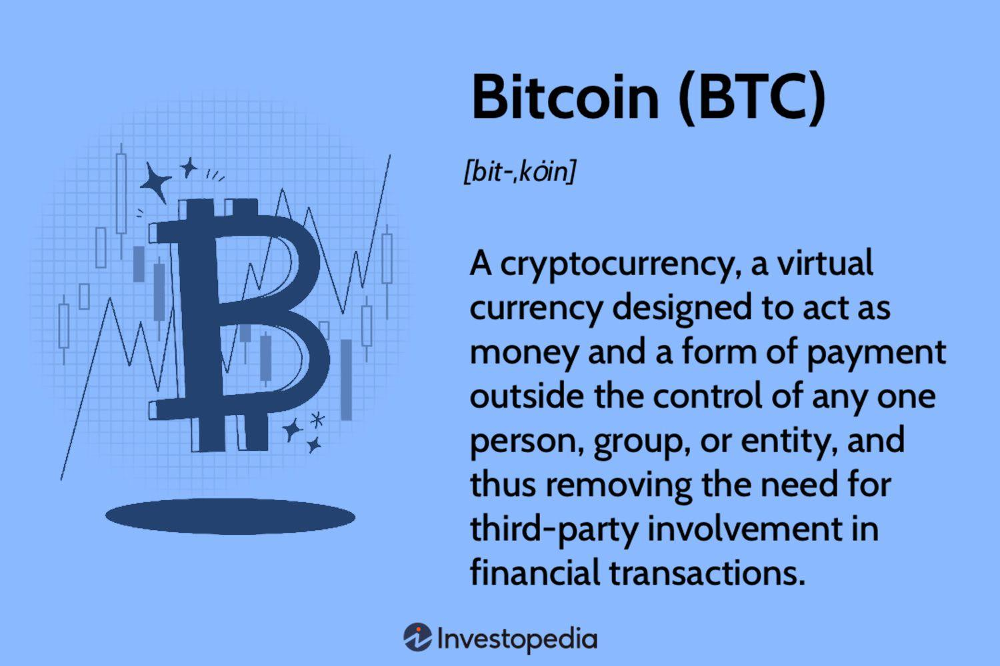

The emergence of cryptocurrencies, digital currencies, and blockchain technology has significantly reshaped the financial landscape. Digital assets such as Bitcoin and Ethereum have gained popularity due to their ability to facilitate secure, private, and decentralized transactions. This aspect of digital currencies addresses traditional financial systems' limitations, which often involve intermediaries and are susceptible to centralized control. Blockchain, the underlying ledger technology enabling cryptocurrencies, enhances this by introducing unprecedented levels of transparency and security. Its distributed nature ensures that data integrity is maintained, preventing unauthorized alterations and providing a trustless system for various transactions.

Moreover, the incorporation of algorithmic trading, commonly known as 'algo trading,' has further transformed the trading dynamics of these digital assets. By employing advanced computational methods to optimize trading decisions, algo trading improves efficiency and reduces human error, allowing for trades to be executed at optimal times for maximum profitability. This has made trading in volatile markets, such as those involving cryptocurrencies, more accessible and potentially more rewarding for traders equipped with the right tools and strategies.



As these technologies continue to develop, they are set to redefine traditional concepts of finance, prompting stakeholders to adapt and explore new opportunities in this rapidly evolving sector. This article will examine these foundational elements and their implications, highlighting their growing significance in the contemporary financial world.

## Table of Contents

## Understanding Cryptocurrencies and Digital Currencies

Cryptocurrencies are decentralized digital assets that utilize blockchain technology, providing a secure and transparent means of conducting transactions. Bitcoin, the first and most well-known cryptocurrency, exemplifies the core features that define these digital assets. Unlike traditional fiat currencies, cryptocurrencies operate independently of central banks, offering users a degree of privacy and anonymity not typically found in conventional financial systems.

Digital currencies encompass a broader category that includes both cryptocurrencies and electronic forms of sovereign currency issued by central banks, often referred to as Central Bank Digital Currencies (CBDCs). While cryptocurrencies are decentralized and primarily governed by algorithmic protocols, digital currencies issued by central banks are centrally controlled, albeit they might employ similar technological underpinnings like blockchain for enhanced security and efficiency.

A significant characteristic of Bitcoin is its finite supply. With approximately 80% of all Bitcoin already mined, the total number of Bitcoins is capped at 21 million. This limitation instills a deflationary pressure on the asset's value, as scarcity increases over time. The controlled issuance and eventual halting of new Bitcoin creation contrast sharply with the inflationary nature of fiat currencies, which can be printed without an upper limit. Mathematically, this supply constraint is coded into the Bitcoin protocol as:

$$
S = 21,000,000 - C_m
$$

where $S$ is the remaining supply and $C_m$ represents the current mined coins.

The evolution of cryptocurrencies has been marked by several notable events. The inception of Bitcoin in 2009 initiated a wave of innovation, leading to the development of alternative cryptocurrencies, commonly known as altcoins. These variants aimed to address certain limitations or introduce new features absent in Bitcoin. Ethereum, for example, brought smart contracts into the limelight, allowing decentralized applications to thrive on its platform.

Another pivotal phase in the [cryptocurrency](/wiki/cryptocurrency) landscape was the Initial Coin Offering (ICO) boom around 2017. ICOs provided a novel fundraising method for blockchain projects, enabling startups to raise capital directly from the public by issuing tokens in exchange for established cryptocurrencies such as Bitcoin or Ethereum. However, the ICO era also highlighted regulatory challenges due to its susceptibility to fraud and lack of investor protection.

Overall, cryptocurrencies represent a transformative change in how financial transactions can be conducted, characterized by decentralization, finite supply, and enhanced privacy features. These qualities distinguish them from traditional fiat systems, offering an alternative paradigm in the financial ecosystem.

## The Role of Blockchain Technology

Blockchain technology underpins every cryptocurrency by ensuring both transaction security and user anonymity through sophisticated cryptographic systems. At its core, a blockchain is a distributed ledger that records transactions across numerous computers. This decentralized structure means that once a transaction is committed to the blockchain, it cannot be changed retroactively without altering all subsequent blocks and gaining consensus from the majority of the network. This makes the blockchain inherently resistant to tampering and fraud, enhancing its reliability as a financial ledger.

A key innovation of blockchain technology is its ability to extend beyond cryptocurrencies. One notable application is in supply chain management. By using blockchain, each transaction in the supply chain is recorded with precision, enabling real-time tracking of products from origin to consumer. This transparency reduces the possibility of counterfeiting and fraud, offering parties immutable proof of provenance and history.

Smart contracts are another significant advancement facilitated by blockchain. These are self-executing contracts with the terms directly written into code. Once conditions are met, the contract automatically executes, eliminating the need for intermediaries. This automation not only reduces costs and transaction times but also increases the reliability of contractual agreements.

Blockchain's cryptographic foundation is crucial for its resilience against manipulation. The technology employs complex algorithms, such as hash functions and digital signatures, to secure each transaction. For instance, a cryptographic hash function takes an input (or 'message') and returns a fixed-size string of bytes. The output is unique to each unique input, serving as a digital fingerprint. Any change in the input will result in a completely different hash, thereby revealing tampering attempts.

Moreover, blockchain is integral to addressing data privacy issues. While transactions are transparent and accessible to all participants in the network, the identity of individuals is protected. Participants are identified by cryptographic public keys instead of personal information, thus providing a level of anonymity.

Blockchain's adaptability is continuously being explored in various sectors. Its potential extends to healthcare, for securely managing patient records; voting systems, for ensuring fair elections; and energy markets, for peer-to-peer energy trading. Its broad applicability and inherent secure features make blockchain a transformative force in modern-day technology.

In conclusion, blockchain technology is instrumental in ensuring secure, transparent, and efficient transactions. Its application transcends cryptocurrencies, offering solutions for many industries seeking robust and reliable systems for record-keeping and contractual automation. Its continued development promises to address complex challenges across various domains.

## Algorithmic Trading: The New Frontier

Algorithmic trading, often referred to as algo trading, represents a sophisticated application of computer science within financial markets. It involves the use of advanced algorithms and computer programs to execute trades based on predefined criteria, such as timing, price, and market trends. The primary advantage of [algorithmic trading](/wiki/algorithmic-trading) is its ability to process vast amounts of data at speeds far beyond human capability, thus enabling trades to be executed instantaneously and without the influence of human emotions.

At its core, algorithmic trading involves the development of quantitative models that are coded into computer programs. These models can be simple, such as those based on moving averages, or highly complex, involving advanced statistical techniques and [machine learning](/wiki/machine-learning). For example, a basic algo trading strategy might involve buying an asset when its short-term moving average crosses above its long-term moving average, typically indicating an upward price trend.

The crypto market, characterized by its high [volatility](/wiki/volatility-trading-strategies) and round-the-clock operation, is particularly well-suited to algorithmic trading. Unlike traditional equity markets, which have set trading hours, cryptocurrencies can be traded 24/7, providing continuous opportunities for profit through rapid price fluctuations. This volatility can be monetized by algorithms that are designed to capitalize on short-term price movements, such as [arbitrage](/wiki/arbitrage) strategies, which exploit price differentials between different exchanges or financial instruments.

Moreover, the efficiency of algorithmic trading is augmented by its ability to backtest strategies on historical data, allowing traders to refine their models. Python, a popular programming language in the finance industry due to its robust libraries for data analysis and machine learning, can be used to develop and test trading algorithms. For instance:

```python
import pandas as pd
import numpy as np

# Simple moving average crossover strategy
def moving_average_crossover(prices, short_window, long_window):
    signals = pd.DataFrame(index=prices.index)
    signals['price'] = prices
    signals['short_mavg'] = prices.rolling(window=short_window, min_periods=1).mean()
    signals['long_mavg'] = prices.rolling(window=long_window, min_periods=1).mean()
    signals['signal'] = 0.0

    # Create signals
    signals['signal'][short_window:] = \
        np.where(signals['short_mavg'][short_window:] > signals['long_mavg'][short_window:], 1.0, 0.0)   

    # Generate trading orders
    signals['positions'] = signals['signal'].diff()

    return signals

# Example usage with mock data
prices = pd.Series([100, 101, 102, 103, 108, 110, 112, 115, 117, 120])
signals = moving_average_crossover(prices, short_window=3, long_window=5)
print(signals)
```

In this example, a moving average crossover strategy is implemented and backtested on a set of mock price data. Such strategies can be tailored to suit specific trading styles and risk appetites, enhancing their appeal in the digital currency markets where speed and precision are paramount.

Despite its advantages, algorithmic trading is not without challenges. It requires a comprehensive understanding of mathematical models, data analysis, and programming, as well as significant computational resources. Furthermore, the automated nature of algo trading can lead to systemic risks if the underlying algorithms are flawed or if market conditions change rapidly and unexpectedly. Nonetheless, as technology advances, the potential for algorithmic trading to further transform financial markets, particularly cryptocurrencies, continues to grow, offering new opportunities and challenges for traders worldwide.

## Advantages and Disadvantages of Algo Trading

Algorithmic trading, often referred to as algo trading, revolutionizes how trades are executed through the use of complex algorithms and computational power. By leveraging mathematical models and quantitative techniques, this form of trading allows for efficient, transparent, and emotion-free transaction execution. However, it also demands significant technical infrastructure and expertise.

One of the primary advantages of algo trading is its ability to execute trades at high speeds and with precision, unachievable by human traders. Computer programs can process a large number of trading instructions across various markets and instruments simultaneously, optimizing the execution based on pre-defined criteria like timing, price, or [volume](/wiki/volume-trading-strategy). This efficiency not only reduces transaction costs but also allows traders to exploit arbitrage opportunities fleetingly available in fast-moving markets.

Transparency is another key benefit; algorithms operate based on specific instructions, reducing the chances of discretionary decision-making, which can often be swayed by emotions. This leads to more consistent trading results. Furthermore, algo trading can be backtested using historical market data to ensure the strategy performs optimally across different market conditions before live deployment.

However, engaging in algo trading requires a substantial initial investment in technology and infrastructure. Traders must have access to powerful computers, high-speed internet, and sophisticated software capable of running intricate algorithms. Moreover, a deep understanding of mathematical models and data analysis is crucial; algorithms must be crafted and calibrated meticulously to align with market conditions and objectives.

Despite these advantages, algo trading is not without its challenges. The major pitfalls include the risk of technical malfunctions, which can occur due to software bugs or system failures, potentially leading to significant financial losses. Additionally, while algorithms excel at executing programmed strategies, they lack the human judgment needed to interpret unprecedented market events. Thus, they may be vulnerable to market anomalies and black swan events that were not accounted for during development.

In summary, while algo trading presents numerous advantages like efficiency and transparency, it is accompanied by challenges such as the need for technical expertise and the risk of unforeseen market scenarios. Balancing these aspects is crucial for market participants looking to utilize algorithmic strategies effectively.

## Legal and Regulatory Aspects

Cryptocurrency trading, despite its relative freedom, faces a rapidly evolving legal landscape characterized by varying regulatory approaches across jurisdictions. Tax implications are a significant concern for traders, with many countries now requiring the declaration of cryptocurrency holdings and profits. For instance, in the United States, the Internal Revenue Service (IRS) treats cryptocurrencies as property, making gains from their sale subject to capital gains tax. Similarly, countries like the United Kingdom and Australia have issued guidance on how cryptocurrency transactions should be reported and taxed.

Fraud protection is another critical aspect of regulation. The decentralized and often pseudonymous nature of cryptocurrencies creates potential avenues for fraudulent activities, such as wash trading and market manipulation. Regulatory bodies like the Commodity Futures Trading Commission (CFTC) in the United States actively monitor and limit such activities within crypto exchanges. Moreover, many jurisdictions now require exchanges to comply with Anti-Money Laundering (AML) and Know Your Customer (KYC) regulations, ensuring greater transparency and reducing illicit activities.

The regulatory environment varies significantly worldwide. Countries such as China and Algeria have banned cryptocurrency trading outright, restricting any associated financial activities. In contrast, nations like Switzerland and Singapore have established clear regulatory frameworks that support the growth of the crypto industry, offering licenses to compliant exchanges and businesses.

Algorithmic trading, while offering advanced mechanisms for trade execution, operates under stringent regulatory oversight to prevent market manipulation. Rules governing algorithmic trading are designed to ensure fair and orderly markets. For example, in the European Union, the Markets in Financial Instruments Directive II (MiFID II) requires firms employing algorithmic trading strategies to have proper risk controls and ensure strategies meet regulatory standards for market integrity.

Compliance with trade laws is critical for algorithmic traders. Regulatory bodies demand that algorithms are tested to ensure they do not disrupt market stability. Traders must maintain detailed records of their algorithms' designs and operations, allowing auditors to verify compliance with applicable laws and guidelines. Furthermore, exchanges are often required to implement circuit breakers to prevent rogue algorithms from causing market anomalies.

In this complex regulatory landscape, both cryptocurrency and algorithmic trading participants must remain aware of evolving legal requirements, ensuring their activities are both transparent and compliant with applicable laws.

## Conclusion

Cryptocurrency, blockchain, and algorithmic trading collectively showcase a transformative shift in how we perceive and engage with financial processes. At the core of this transformation is the blockchain's capability to decentralize ledgers, which simplifies transactions by eliminating the need for intermediaries. This shift fosters trustless environments where parties can securely transact without relying on a centralized authority, thus enabling greater transparency and reducing the potential for fraud.

Despite the formidable advantages offered by these technologies, they face notable challenges, particularly regarding regulatory frameworks and the inherent complexity of the technology itself. As cryptocurrencies continue to penetrate global markets, they encounter a patchwork of regulations that vary drastically across jurisdictions. This inconsistency poses both legal and strategic hurdles for stakeholders. Furthermore, the sophisticated nature of blockchain and algorithmic trading necessitates a deep understanding, which can be a barrier to widespread adoption.

Stakeholders, including investors, developers, and regulatory bodies, must adapt and evolve continuously to keep pace with these innovations. This evolution requires not only strategic integration of the technology but also diligent compliance with existing and emerging regulations. Building robust strategies that encompass technological, financial, and ethical considerations will be pivotal in harnessing the full potential of these advancements.

In conclusion, the impact of cryptocurrencies and their underlying technologies remains expansive, with possibilities that are largely untapped and profoundly influential. As these innovations mature and become more integrated into the fabric of the financial world, they promise to redefine traditional economic models and offer new paradigms of efficiency and security. The future of finance, with cryptocurrency and blockchain at its helm, is set for a revolution that stakeholders cannot afford to ignore.

## References & Further Reading

[1]: Nakamoto, S. (2008). ["Bitcoin: A Peer-to-Peer Electronic Cash System."](https://nakamotoinstitute.org/library/bitcoin/) Available at bitcoin.org.

[2]: Antonopoulos, A. M. (2017). ["Mastering Bitcoin: Unlocking Digital Cryptocurrencies."](https://books.google.com/books/about/Mastering_Bitcoin.html?id=IXmrBQAAQBAJ) O'Reilly Media.

[3]: Swan, M. (2015). ["Blockchain: Blueprint for a New Economy."](https://dl.acm.org/doi/book/10.5555/3006358) O'Reilly Media.

[4]: Narayanan, A., Bonneau, J., Felten, E., Miller, A., & Goldfeder, S. (2016). ["Bitcoin and Cryptocurrency Technologies."](https://press.princeton.edu/books/hardcover/9780691171692/bitcoin-and-cryptocurrency-technologies) Princeton University Press.

[5]: Lopez de Prado, M. (2018). ["Advances in Financial Machine Learning."](https://www.amazon.com/Advances-Financial-Machine-Learning-Marcos/dp/1119482089) Wiley.

[6]: Jansen, S. (2020). ["Machine Learning for Algorithmic Trading - Second Edition."](https://github.com/stefan-jansen/machine-learning-for-trading) Packt Publishing.

[7]: Tapscott, D., & Tapscott, A. (2016). ["Blockchain Revolution: How the Technology Behind Bitcoin Is Changing Money, Business, and the World."](https://dl.acm.org/doi/10.5555/3051781) Portfolio.