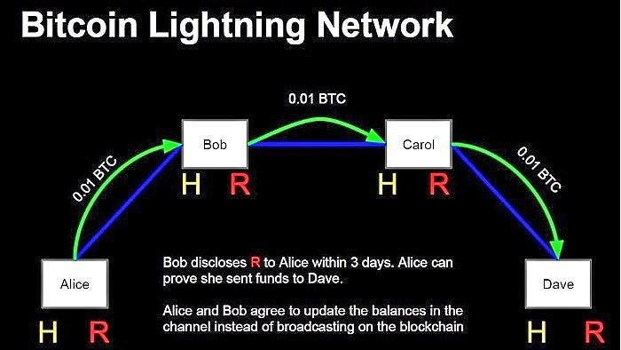

Cryptocurrency trading has transformed into a vast and complex ecosystem, with Bitcoin maintaining a dominant role within it. As the first and most widely recognized cryptocurrency, Bitcoin sets the pace for market trends and remains a crucial component of the crypto trading framework. This article examines critical elements of Bitcoin exchanges, primarily focusing on exchange fees and algorithmic trading. These components significantly impact trading strategies and profitability, providing traders with opportunities to improve their trading performance.

Understanding the intricacies of Bitcoin exchanges is essential for any trader aiming to succeed in this arena. Exchanges function as the cornerstone for cryptocurrency transactions, acting as intermediaries where assets are traded and financial services are rendered. Selecting a reliable exchange involves evaluating several criteria, such as security standards, user interface, and the variety of cryptocurrencies available for trading.



Exchange fees play a pivotal role in determining the profitability of trades. Different fee structures, including transaction, withdrawal, and network fees, can affect the bottom line. Within this framework, maker and taker fees present additional layers of complexity; makers, who add liquidity to the market, often benefit from reduced fees. By analyzing these fee structures, traders can make informed decisions that optimize their trading efficiency.

Algorithmic trading introduces a technological edge to the trading process by utilizing automated systems to execute trades based on pre-defined criteria. This approach can offer significant advantages, such as heightened speed and minimized human errors. Algorithms can detect market inefficiencies and quickly adapt to volatile conditions, making them a valuable tool for both novice and experienced traders.

In exploring what constitutes a trustworthy exchange, how fees are structured, and the role of algorithmic trading, this article aims to provide comprehensive insights into maximizing Bitcoin trading effectiveness. By mastering these elements, traders can not only refine their strategies but also enhance their potential for profit in a highly competitive and ever-evolving market.

## Table of Contents

## Understanding Bitcoin Exchanges

Bitcoin exchanges are integral to the cryptocurrency ecosystem, acting as digital marketplaces where cryptocurrencies can be bought, sold, or traded against other digital or traditional fiat currencies. These platforms play a crucial role by matching buy and sell orders between participants, thereby facilitating the liquidity and price discovery of cryptocurrencies such as Bitcoin.

There are two primary types of exchanges: centralized exchanges (CEXs) and decentralized exchanges (DEXs). Centralized exchanges operate like traditional financial institutions, with a central authority or company overseeing the operations. CEXs offer high [liquidity](/wiki/liquidity-risk-premium), a wide range of trading pairs, and user-friendly interfaces, making them appealing to beginner traders. Security protocols on these platforms are robust, with many implementing insurance funds to protect against potential losses from hacks. However, users must trust the exchange with their private keys, introducing a single point of failure and counterparty risk. Examples of CEXs include Binance, Coinbase, and Kraken.

Decentralized exchanges, on the other hand, function without a central authority, operating through smart contracts on a blockchain. This design allows users to trade directly from their wallets, enhancing security and privacy since users retain control over their private keys. DEXs often support a wide variety of tokens and promote transparency due to their open-source nature. However, they typically suffer from lower liquidity and a less intuitive interface. Uniswap and SushiSwap are examples of successful DEXs in the market.

Choosing the right exchange requires a careful evaluation of several factors:

1. **Security**: This is paramount. Prospective users should research the exchange’s history regarding hacks and security breaches. Exchanges that offer cold storage for assets and two-factor authentication (2FA) for accounts are generally preferred.

2. **Ease of Use**: User-friendly platforms reduce the likelihood of errors and enhance the overall trading experience, especially for novices. The availability of customer support also plays a critical role in user satisfaction.

3. **Supported Currencies**: Traders must ensure that the exchange supports the cryptocurrencies they intend to trade. While most platforms support major cryptocurrencies like Bitcoin and Ethereum, the availability of altcoins can vary significantly.

4. **Regulatory Compliance**: Compliance with local regulations can affect the safety and legality of trading on an exchange. Exchanges that adhere to regional regulations tend to provide more reliability and trustworthiness.

Each exchange type has its strengths and limitations, hence traders must align their choice with their trading priorities, risk tolerance, and technical expertise. As the [cryptocurrency](/wiki/cryptocurrency) marketplace evolves, the distinctions between CEXs and DEXs continue to blur, with hybrid models emerging that seek to combine the best features of both. As more technological advancements arise, the landscape of Bitcoin exchanges will continue to evolve, offering more innovative and secure options for cryptocurrency trading.

## Types of Exchange Fees

Exchange fees are a critical component in the landscape of cryptocurrency trading, affecting the overall profitability of each trade. Understanding the various types of fees associated with Bitcoin exchanges is essential for traders looking to optimize their financial outcomes.

Transaction fees are the most common type of fee encountered on exchanges. These fees are typically charged per trade and can vary depending on the exchange and the trading [volume](/wiki/volume-trading-strategy). For instance, some exchanges may charge a flat percentage of the trade amount as a transaction fee, while others may offer tiered fee structures where the percentage decreases as the trading volume increases.

Withdrawal fees are another important consideration. These fees are incurred when transferring funds from the exchange to an external wallet. Withdrawal fees can vary widely across different exchanges and even depend on the cryptocurrency being withdrawn. For example, withdrawing Bitcoin might incur a different fee than withdrawing Ethereum or other cryptocurrencies.

Network or gas fees are also pertinent, particularly for cryptocurrencies operating on networks like Ethereum. These fees represent the cost of processing the transaction on the blockchain and can fluctuate based on network congestion. Unlike transaction or withdrawal fees, which are set by the exchange, network fees are determined by the state of the blockchain network.

Additionally, exchanges often utilize a maker-taker fee model. Makers are traders who add liquidity to the [order book](/wiki/order-book-trading-strategies) by placing limit orders, while takers remove liquidity by executing against existing orders. Typically, makers pay lower fees compared to takers because they contribute to the market's liquidity. This fee structure incentivizes users to place orders that help maintain a liquid market.

Understanding and comparing these fees is crucial for traders looking to minimize costs and maximize profits. By analyzing fee structures across different platforms, traders can make informed decisions on where to conduct their trades. For example, selecting an exchange with lower withdrawal fees may be beneficial for traders who frequently transfer their assets to external wallets. Similarly, choosing platforms with favorable maker-taker fees can significantly impact trading costs. 

Overall, a strategic approach to understanding and exploiting exchange fee structures can lead to enhanced trading efficiency and improved profitability in the dynamic cryptocurrency market.

## Algorithmic Trading in Cryptocurrency

Algorithmic trading employs predefined algorithms to automate the process of executing trades, capitalizing on computational efficiency to offer substantial advantages like enhanced speed and minimized human errors. In the rapid-paced environment of the cryptocurrency market, characterized by frequent price fluctuations and inefficiencies, [algorithmic trading](/wiki/algorithmic-trading) can be particularly effective.

Algorithms deployed in crypto trading are designed to operate based on a set of rules or instructions that dictate the conditions for entering and exiting trades. These rules can be based on factors such as price, timing, volume, or any mathematical model. For instance, a common strategy is the implementation of a moving average crossover algorithm. In Python, a simple version of this strategy can be implemented using libraries like NumPy or pandas:

```python
import pandas as pd

def moving_average_strategy(data, short_window, long_window):
    data['Short_MA'] = data['Close'].rolling(window=short_window).mean()
    data['Long_MA'] = data['Close'].rolling(window=long_window).mean()
    data['Signal'] = 0.0  
    data['Signal'][short_window:] = \
        np.where(data['Short_MA'][short_window:] > data['Long_MA'][short_window:], 1.0, 0.0)
    data['Position'] = data['Signal'].diff()
    return data

# Example usage
# data is assumed to be a pandas DataFrame with a 'Close' column
# moving_average_strategy(data, short_window=40, long_window=100)
```

Algorithmic trading enables both novice and seasoned traders to implement sophisticated trading strategies without requiring manual intervention. Novices benefit from automation as it helps mitigate emotional biases that can lead to poor trading decisions. Experienced traders can take advantage of algorithmic systems to execute complex strategies across multiple cryptocurrency exchanges simultaneously.

Beyond simple rule-based systems, more advanced algorithms incorporate elements of [machine learning](/wiki/machine-learning) and [artificial intelligence](/wiki/ai-artificial-intelligence). These systems can analyze large datasets to identify patterns and predict market movements, adjusting strategies in real-time to align with current market conditions.

Algorithmic trading offers a powerful mechanism for improving trading performance. By leveraging the computational power and systematic execution that algorithms provide, traders can enhance their ability to react swiftly to market changes, capture [arbitrage](/wiki/arbitrage) opportunities, and ultimately optimize their cryptocurrency trading operations.

## Optimizing Trading Strategies

Optimizing trading strategies in the cryptocurrency market requires a deep understanding of market dynamics and exchange operations. One critical [factor](/wiki/factor-investing) to consider is the selection of low-fee exchanges, which can have substantial implications on a trader’s net returns. High transaction fees can eat into profits, especially for high-frequency traders. Thus, choosing exchanges with competitive fee structures is beneficial for maintaining an efficient cost basis, particularly for those utilizing algorithmic trading systems designed to execute numerous trades swiftly.

Algorithmic trading is invaluable in optimizing strategies. By leveraging algorithms, traders can exploit market inefficiencies and swiftly respond to cryptocurrency market volatilities without the delay of manual trading. Algorithms can be programmed to follow specific strategies based on technical indicators, market conditions, or trading volume thresholds, which can automatically execute trades that adhere to predefined criteria. For instance, a simple moving average crossover strategy can be implemented to identify potential buy and sell signals:

```python
# Example: Python code for a simple moving average crossover strategy
import pandas as pd

# Assume 'data' is a DataFrame with Bitcoin price data
short_window = 40
long_window = 100

data['short_mavg'] = data['Close'].rolling(window=short_window, min_periods=1, center=False).mean()
data['long_mavg'] = data['Close'].rolling(window=long_window, min_periods=1, center=False).mean()

data['signal'] = 0.0
data['signal'][short_window:] = np.where(data['short_mavg'][short_window:] > data['long_mavg'][short_window:], 1.0, 0.0)
data['positions'] = data['signal'].diff()

# You can then backtest or use this signal to make trading decisions
```

Understanding the impacts of different fee structures on executed trades is also crucial for strategy optimization. Maker and taker fees, for example, offer different incentives; makers, who add liquidity to the order book, generally pay lower fees than takers, who remove liquidity by filling existing orders. Traders can optimize their strategies by evaluating their roles in transactions and selecting an exchange that rewards their particular trading behavior.

Finally, the integration of cutting-edge trading technology can significantly amplify a trader's success in the crypto markets. Employing sophisticated tools for analyzing market trends, [backtesting](/wiki/backtesting) algorithms, and automating trades allows refined execution and increases the potential for profitable outcomes. By refining these strategies and continuously adapting to evolving market conditions, traders can better manage risks and improve their performance, contributing to sustained success in the volatile crypto landscape.

## Conclusion

Navigating the complexities of cryptocurrency trading requires both knowledge and strategy. The cryptocurrency market is characterized by high [volatility](/wiki/volatility-trading-strategies) and rapid technological advancements. For traders to thrive in this environment, a deep understanding of exchange fees and algorithmic trading strategies is crucial.

Comprehending exchange fees is fundamental, as they can have a significant impact on trading profitability. Exchange fees come in various forms, including transaction fees, maker-taker fees, and network fees, each affecting the cost-effectiveness of trades differently. For example, maker fees are usually lower than taker fees because makers add liquidity to the exchange's order book, whereas takers remove liquidity. By carefully analyzing and comparing these fees across platforms, traders can select exchanges that align best with their trading objectives, potentially saving substantial amounts over time.

Algorithmic trading represents a powerful tool for enhancing trading operations. By automating trades based on pre-set algorithms, traders can execute strategies at speeds unattainable by human intervention alone, reducing the likelihood of errors and capitalizing on market inefficiencies. The utilization of algorithmic trading allows participants to manage the unpredictabilities of the crypto market more efficiently, whether by executing high-frequency trades or automating portfolio rebalancing processes.

Continual learning and optimization remain pivotal for success in Bitcoin and cryptocurrency trading. The dynamic nature of these markets means that traders must constantly adapt to new technologies, regulatory changes, and market trends. Regularly updating knowledge and strategies not only helps in mitigating risks but also allows traders to leverage new opportunities as they arise. By doing so, traders can ensure sustained success and resilience in an ever-evolving financial landscape.

## References & Further Reading

[1]: Lo, A. W., & MacKinlay, A. C. (1999). ["A Non-Random Walk Down Wall Street."](https://www.jstor.org/stable/j.ctt7tccx) Princeton University Press.

[2]: Nakamoto, S. (2008). ["Bitcoin: A Peer-to-Peer Electronic Cash System."](https://nakamotoinstitute.org/library/bitcoin/) 

[3]: Roosenboom, P., & van der Weijde, T. G. (2020). ["The Future of Securities Exchanges."](https://www.rsm.nl/people/peter-roosenboom/) SSRN.

[4]: Treleaven, P., Brown, R., & Yang, D. (2013). ["Algorithmic Trading and Regulation."](https://www.sciencedirect.com/science/article/pii/S2589004224024192) Communications of the ACM, 56(11), 76-85.

[5]: Vigna, P., & Casey, M. J. (2016). ["The Age of Cryptocurrency: How Bitcoin and Digital Money are Challenging the Global Economic Order."](https://archive.org/details/ageofcryptocurre0000vign) St. Martin's Griffin.