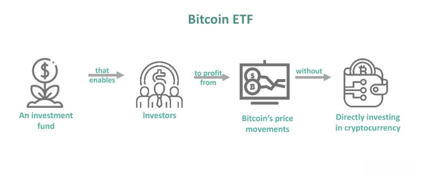

In recent years, the evolution of financial markets has been marked significantly by the advent of cryptocurrencies, a burgeoning asset class that continues to reshape the dynamics of investment strategies globally. Among the innovative developments within this space are Bitcoin Futures Exchange-Traded Funds (ETFs), investment vehicles that have created new opportunities and challenges for investors. These funds represent a novel method for gaining exposure to Bitcoin's price fluctuations without the necessity of owning the cryptocurrency directly.

Bitcoin Futures ETFs work by tracking the price of Bitcoin futures contracts, agreements to purchase or sell the cryptocurrency at a predetermined price on a specific future date. This form of indirect investment is increasingly attracting attention from both individual and institutional investors, offering a unique approach to cryptocurrency trading that differs significantly from direct ownership.

As the landscape of financial investments continues to evolve, the integration of algorithmic trading into cryptocurrency futures presents additional layers of complexity and opportunity. Algorithmic trading, which employs computer programs to execute trades swiftly based on defined criteria such as price, timing, and volume, plays a pivotal role in enhancing the efficiency and accuracy of executing trades in fast-paced markets.

This article will explore the fundamental workings of ETF investments, focusing on those tied to Bitcoin futures, and highlight the role of algorithmic trading in cryptocurrency futures. By examining the potential benefits and risks associated with these financial instruments, investors can gain a more comprehensive understanding of how these elements are reshaping the financial landscape. Whether you are an experienced investor or new to the cryptocurrency sector, comprehending these innovations is vital for navigating the modern financial ecosystem effectively.

## Table of Contents

## Understanding ETF Investments

Exchange-Traded Funds (ETFs) are financial instruments that combine the characteristics of mutual funds and common stocks, offering investors a convenient mechanism to access broad markets or specific asset classes. Like stocks, ETFs are traded on major stock exchanges and their prices fluctuate throughout the trading day based on supply and demand. This makes them an attractive option for investors seeking liquidity and real-time trading flexibility.

ETFs are designed to hold a collection of assets such as stocks, bonds, commodities, or futures contracts, providing investors with exposure to a diversified portfolio. This diversification can reduce risk compared to investing in individual securities, as the performance of the ETF is less likely to be impacted by the movement of a single investment. For example, a stock ETF might include shares from various companies within a sector, while a bond ETF may contain bonds of different maturities and issuers.

The operational mechanism of ETFs involves tracking a specific index or asset class. For instance, an S&P 500 [ETF](/wiki/etf-trading-strategies) aims to replicate the performance of the S&P 500 index. This is achieved by holding a portfolio of stocks that matches the index. The strategy of replicating an index provides passive management advantages, such as lower management fees compared to actively managed funds, contributing to their popularity among cost-conscious investors.

Bitcoin Futures ETFs are a specialized category of ETFs. They seek to track the price of Bitcoin by investing in futures contracts rather than holding the actual [cryptocurrency](/wiki/cryptocurrency). This approach permits investors to speculate on Bitcoin's price movements without the complications of securing and storing the digital asset itself. The choice of using futures contracts is due to regulatory frameworks in various jurisdictions, which may restrict direct cryptocurrency ETF offerings.

The advantages of ETFs over direct asset purchases are numerous:

1. **Diversification**: By holding a diverse group of assets, ETFs help mitigate specific investment risks, which investors might face if they were to purchase individual securities directly.
2. **Liquidity**: ETFs can be bought and sold easily throughout the trading day, providing the flexibility that mutual funds, which are usually only traded at the end of the day, do not offer.
3. **Cost Efficiency**: ETFs generally have lower expense ratios due to their passive management structure, making them a cost-efficient option for investors.
4. **Accessibility**: ETFs offer exposure to complex markets and instruments without requiring investors to possess in-depth market knowledge.
5. **Tax Efficiency**: ETFs often experience fewer capital gains distributions compared to mutual funds because of the in-kind creation and redemption process, potentially making them more tax-efficient.

These characteristics have led to the growing popularity of ETFs among retail and institutional investors alike, making them a cornerstone of modern investment strategies. The versatility and accessibility of ETFs present an inclusive option for a wide range of investment goals and risk appetites.

## What are Bitcoin Futures ETFs?

Bitcoin Futures ETFs are a financial instrument designed to offer indirect exposure to the price fluctuations of Bitcoin without the necessity of holding the cryptocurrency directly. These ETFs achieve this by investing in Bitcoin futures contracts, which are standardized agreements to buy or sell Bitcoin at a specified future date for a predetermined price. This mechanism allows investors to speculate on Bitcoin’s future price movements with the added structures and securities of traditional financial markets.

### Mechanics of Bitcoin Futures ETFs

The operation of Bitcoin Futures ETFs centers on tracking futures contracts rather than the cryptocurrency itself. Bitcoin futures contracts are traded on regulated commodity exchanges, such as the Chicago Mercantile Exchange (CME). These contracts set the terms for the future purchase or sale of Bitcoin, providing a way to hedge against or speculate on the asset's future price [volatility](/wiki/volatility-trading-strategies).

In constructing a Bitcoin Futures ETF, the fund manager invests in a series of these futures contracts rather than Bitcoin directly. This investment approach has several implications:

1. **Regulation**: Bitcoin Futures ETFs are subjected to regulation by financial authorities, offering an added layer of protection, which contrasts with the relatively less regulated crypto spot markets.

2. **Leverage and Margin**: Futures contracts often allow for leverage—trading with borrowed funds—thereby amplifying potential gains or losses. This feature may appeal to investors seeking higher returns.

3. **Contango and Backwardation**: The price of futures contracts can vary from the current spot price of Bitcoin. When futures prices are higher than the spot price, the market is in contango. Conversely, when they are lower, it is in backwardation. These conditions affect the returns of Bitcoin Futures ETFs, as managers may have to roll over contracts, potentially incurring losses or gains based on these differences.

### Comparison with Direct Bitcoin Trading

While direct Bitcoin trading involves buying and holding the cryptocurrency in a digital wallet, Bitcoin Futures ETFs eliminate the need for such custody arrangements. This aspect has practical benefits, particularly regarding security concerns associated with hacker threats and loss of private keys inherent in holding cryptocurrencies.

Furthermore, the ETF structure is typically more accessible to traditional investors and institutional entities familiar with conventional financial products. This structure broadens the potential investor base to include individuals and entities that may lack direct access to crypto exchanges or the technical expertise to manage digital assets.

### Appeal to Institutional Investors

Bitcoin Futures ETFs are particularly attractive to institutional investors for several reasons:

- **Regulatory Clarity**: Since these ETFs operate within the purview of established regulatory frameworks, they provide a more legally secure method to engage with the Bitcoin market.

- **Portfolio Diversification**: As diversified investment products, Bitcoin Futures ETFs allow institutions to include Bitcoin exposure within their portfolio allocations without the operational complexities of holding cryptocurrency.

- **Risk Management**: The future contracts offer mechanisms for risk management through control over exposure duration and leverage, enabling more sophisticated investment strategies.

In summary, Bitcoin Futures ETFs present a novel approach for investors aiming to capture Bitcoin's market dynamics, combining the speculative and hedging abilities of futures contracts with the regulatory and structural familiarity of ETFs. These characteristics have driven their popularity, particularly among institutional investors seeking regulated avenues to participate in the emerging cryptocurrency sector.

## Risks and Benefits of Investing in Bitcoin Futures ETFs

Bitcoin Futures ETFs present a unique investment opportunity with a distinct set of risks and benefits worthy of consideration for any investor interested in cryptocurrency markets. 

### Benefits of Investing in Bitcoin Futures ETFs

1. **Hedging Against Price Volatility**: One of the primary benefits of Bitcoin Futures ETFs is their ability to serve as a hedge against the inherent volatility of Bitcoin. By investing in futures contracts, investors can speculate on Bitcoin's future price movements without owning the actual cryptocurrency. This allows for strategic positioning to mitigate potential losses during market downturns.

2. **Accessing Leverage**: Bitcoin Futures ETFs can provide leveraged exposure to Bitcoin price movements. Leverage allows investors to control a large position with a relatively small amount of capital, potentially amplifying gains. It's important for investors to be aware that while leverage can increase profits, it also magnifies losses.

3. **Regulatory Oversight**: These ETFs are subject to regulation by financial authorities, such as the Securities and Exchange Commission (SEC) in the United States. This oversight can provide a layer of security and transparency typically not available in direct cryptocurrency markets, making them an appealing option for risk-averse investors.

4. **Easier Market Access**: For investors who are not comfortable with or knowledgeable about directly handling cryptocurrencies, Bitcoin Futures ETFs offer a more accessible path. These ETFs can be traded through traditional brokerage accounts just like any other stock or bond, eliminating the need for digital wallets or cryptocurrency exchanges.

### Risks of Investing in Bitcoin Futures ETFs

1. **Market Unpredictability**: Despite their advantages, Bitcoin Futures ETFs are not immune to the volatile nature of Bitcoin and cryptocurrency markets. The price of futures contracts can be highly unpredictable, sometimes diverging significantly from the spot price of Bitcoin. This dislocation can result in unexpected losses.

2. **Futures Trading Complexity**: Participation in futures markets typically implies a level of complexity that might be challenging for inexperienced investors. The futures market operates differently from traditional equity markets, with specific jargon and mechanisms that require a solid understanding to effectively manage investments.

3. **Contango and Backwardation**: The terms contango and backwardation refer to the conditions under which futures contracts trade relative to the expected future spot price of Bitcoin. In contango, futures prices are higher than the expected future spot price, which can result in negative roll yields for ETF investors. Conversely, backwardation describes a scenario where futures prices are lower than expected future spot prices, potentially benefiting investors. Understanding these dynamics is crucial for evaluating potential returns and risks.

4. **Regulatory Risks**: Although regulation offers increased security, unexpected regulatory changes pose related risks. Governments worldwide are continuously adjusting their regulatory stance on cryptocurrencies, which can lead to sudden shifts in the legal landscape affecting these investment vehicles.

Investors considering Bitcoin Futures ETFs need to carefully assess these advantages and challenges. Balancing potential gains against inherent risks is essential for making informed decisions. Additionally, continually monitoring market conditions and regulatory developments will be important in managing one's investment strategy effectively.

## The Role of Algorithmic Trading in Cryptocurrency Futures

Algorithmic trading in cryptocurrency futures involves the use of advanced computer algorithms to automate and optimize trading strategies, thereby boosting efficiency and precision in executing trades. These algorithms can analyze vast volumes of data at high speed, identifying trends and executing trades based on predetermined criteria such as timing, price, and [volume](/wiki/volume-trading-strategy).

In cryptocurrency futures markets, where prices can be highly volatile, [algorithmic trading](/wiki/algorithmic-trading) offers a significant advantage. It enables traders to make quick decisions, reducing the lag that human interventions might introduce. This speed is crucial in capturing optimal entry and [exit](/wiki/exit-strategy) points, thereby maximizing profit margins or minimizing potential losses.

Traders and institutional investors employ various algorithmic strategies to enhance their trading efforts in Bitcoin futures and other cryptocurrency derivatives. One common approach is [arbitrage](/wiki/arbitrage), which takes advantage of price discrepancies between different exchanges or market segments. Algorithms can swiftly execute trades to exploit these variances, thus ensuring consistent profit margins with minimal risk.

Another popular strategy is [momentum](/wiki/momentum) trading, which capitalizes on the continuation of existing market trends. Algorithms track market trends and automatically execute buy or sell orders in alignment with upward or downward movements. Additionally, market-making algorithms attempt to provide [liquidity](/wiki/liquidity-risk-premium) by continuously offering buy and sell quotes, profiting from the bid-ask spread.

Despite the benefits, algorithmic trading in cryptocurrency futures is fraught with challenges and regulatory considerations. The rapid pace of transactions can exacerbate market volatility, occasionally leading to flash crashes. Ensuring compliance with evolving regulatory frameworks is also crucial, as regulators worldwide strive to keep pace with technological advancements and mitigate systemic risks.

Moreover, the creation and management of trading algorithms necessitate substantial expertise. Traders must not only develop sophisticated models but also secure them against technological failures and cyber threats. Robust risk management protocols are essential to safeguard assets and prevent substantial financial losses.

Overall, algorithmic trading holds transformative potential in the cryptocurrency futures market, improving execution speed, reducing human error, and unveiling new market opportunities. However, traders and investors must carefully navigate its complexities and adhere to regulatory guidelines to effectively harness its capabilities.

## Conclusion

ETF investments, particularly those focusing on Bitcoin futures, signify a pivotal development in the contemporary financial landscape. These instruments grant investors access to the dynamic cryptocurrency market while potentially reducing the complexity and risks associated with direct ownership of digital assets. By investing in Bitcoin Futures ETFs, investors can achieve portfolio diversification, hedge against volatility, and leverage opportunities for enhanced returns.

Algorithmic trading enhances these investment strategies, offering investors efficiency and precision in executing trades. The automation of the trading process minimizes human error, enables rapid response to market changes, and optimizes trading strategies based on data-driven insights. For instance, algorithmic trading can use factors such as timing, price fluctuations, and trading volume to determine optimal entry and exit points, which can be particularly useful in the volatile cryptocurrency markets.

As the financial ecosystem incorporating cryptocurrency continues to evolve, it is imperative for both novice and seasoned investors to remain vigilant and informed about these developments. Regulatory changes, technological advancements, and market dynamics can significantly impact the performance and stability of Bitcoin Futures ETFs and algorithmic trading.

This article has provided a comprehensive overview of the critical aspects of Bitcoin Futures ETFs and the role of algorithmic trading in cryptocurrency futures. With the insights gained, investors are better equipped to navigate the complexities of this exciting and rapidly evolving sector, positioning themselves strategically to capitalize on its potential.

## References & Further Reading

[1]: ["Advances in Financial Machine Learning"](https://www.amazon.com/Advances-Financial-Machine-Learning-Marcos/dp/1119482089) by Marcos Lopez de Prado

[2]: ["Quantitative Trading: How to Build Your Own Algorithmic Trading Business"](https://books.google.com/books/about/Quantitative_Trading.html?id=j70yEAAAQBAJ) by Ernest P. Chan

[3]: ["Machine Learning for Algorithmic Trading"](https://github.com/PacktPublishing/Machine-Learning-for-Algorithmic-Trading-Second-Edition) by Stefan Jansen

[4]: ["Understanding Etfs and Their Role in Investment Portfolios"](https://www.morningstar.com/funds/what-is-an-etf-morningstars-etf-guide) by Deborah Kidd in Financial Analysts Journal 

[5]: ["Cryptocurrency and Blockchain Regulation"](https://stevenscenter.wharton.upenn.edu/publications-50-state-review/) - Global Legal Insights

[6]: ["Listed Money Markets and Cryptocurrency: Authority and Sources"](https://coinmarketcap.com/) - Westlaw UK Insight

[7]: ["Handbook of Exchange Rates"](https://www.wiley.com/en-us/Handbook+of+Exchange+Rates-p-9780470768839) by Jessica James, Ian W. Marsh, and Lucio Sarno