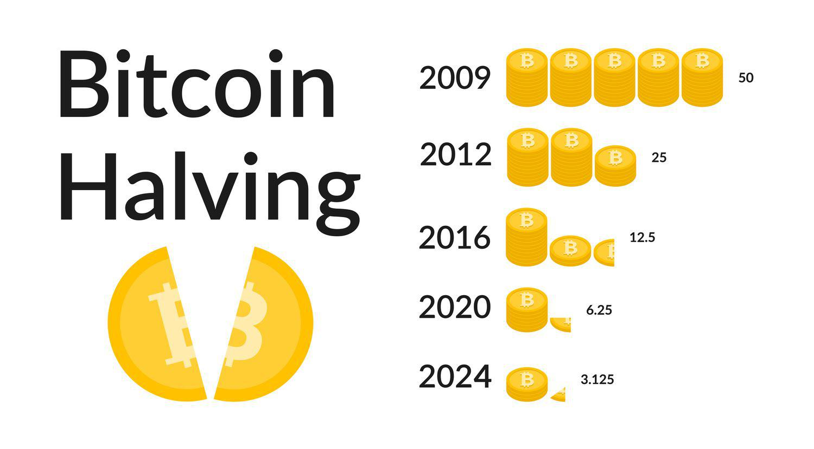

## Table of Contents

## What is Bitcoin halving?

Bitcoin halving is an event that happens about every four years, where the reward for mining new bitcoins is cut in half. This is part of Bitcoin's design to control how many new bitcoins are created and to make sure there will only ever be 21 million bitcoins in total. When Bitcoin started, miners got 50 bitcoins for adding a new block to the blockchain. After the first halving, this reward dropped to 25 bitcoins, then to 12.5 bitcoins, and now it's at 6.25 bitcoins per block.

The idea behind halving is to make bitcoins more valuable over time. When the reward for mining goes down, there are fewer new bitcoins coming into the market. This can make the existing bitcoins more scarce, which might increase their value if people still want to buy them. Halving events are watched closely by people interested in Bitcoin because they can affect its price and the whole cryptocurrency market. The next halving is expected to happen in 2024, when the reward will drop to 3.125 bitcoins per block.

## How often does Bitcoin halving occur?

Bitcoin halving happens about every four years. This is because it is set to occur after every 210,000 blocks are added to the Bitcoin blockchain. Since it takes about 10 minutes to mine one block, 210,000 blocks take roughly four years to be mined.

The first Bitcoin halving happened in 2012, the second in 2016, and the third in 2020. Each time, the reward for mining a new block was cut in half. The next halving is expected around 2024. This schedule helps control how many new bitcoins are made and keeps the total number of bitcoins at 21 million.

## Why was Bitcoin halving implemented?

Bitcoin halving was put in place to control how many new bitcoins are made. The person who created Bitcoin, Satoshi Nakamoto, wanted to make sure there would only ever be 21 million bitcoins. By cutting the reward for mining new bitcoins in half every four years, the number of new bitcoins entering the market slows down. This helps keep the total number of bitcoins under control and makes them more scarce over time.

The idea behind halving is also to help make bitcoins more valuable. When there are fewer new bitcoins being made, but people still want to buy them, the price can go up. This is because when something is scarce, and people want it, it tends to become more valuable. Halving helps create this scarcity, which is why many people watch these events closely to see how they might affect Bitcoin's price.

## What is the impact of Bitcoin halving on miners?

Bitcoin halving makes it harder for miners to make money. Before the halving, miners get a certain number of bitcoins for adding a new block to the blockchain. After the halving, they only get half as many bitcoins for doing the same work. This means that if the price of Bitcoin stays the same, miners will earn less money for their efforts. Some miners might find it too expensive to keep mining if their costs are higher than what they earn, so they might stop mining.

On the other hand, if the price of Bitcoin goes up after the halving, miners could still make good money. The halving makes bitcoins more scarce, and if people still want to buy them, the price might go up. This could make up for the smaller reward miners get. So, miners need to watch the market closely and see if the price increase will help them keep mining profitably. It's a big change for them, and they have to be ready to adjust how they work.

## How does Bitcoin halving affect the supply of new bitcoins?

Bitcoin halving makes the supply of new bitcoins grow slower. When Bitcoin started, miners got 50 bitcoins for adding a new block to the blockchain. But every four years, this reward gets cut in half. So, after the first halving, miners got 25 bitcoins, then 12.5, and now they get 6.25 bitcoins per block. This means fewer new bitcoins are made over time.

Because the reward for mining gets smaller, the total number of new bitcoins entering the market goes down. This makes bitcoins more scarce. The idea is that if people still want to buy bitcoins even though fewer are being made, the price might go up. This is why Bitcoin halving is important—it helps control how many new bitcoins are made and can affect their value.

## What has been the historical price reaction of Bitcoin to halving events?

Historically, Bitcoin's price has gone up a lot after halving events. After the first halving in 2012, Bitcoin's price started to go up a few months later. It went from around $12 to over $1,000 by the end of 2013. The second halving in 2016 also saw a big price increase. The price was about $650 before the halving, and by the end of 2017, it had reached almost $20,000. These big jumps show that many people think halving makes Bitcoin more valuable because there are fewer new bitcoins being made.

The third halving in 2020 followed a similar pattern. Before the halving, Bitcoin's price was around $8,000. By the end of 2021, it had climbed to over $60,000. Each time, the price didn't go up right away after the halving. It usually took a few months for the price to start going up a lot. This delay happens because it takes time for the market to feel the effects of fewer new bitcoins being made. But overall, the price has always gone up a lot after each halving.

## Can Bitcoin halving lead to increased volatility in the cryptocurrency market?

Yes, Bitcoin halving can lead to more ups and downs in the [cryptocurrency](/wiki/cryptocurrency) market. When the reward for mining new bitcoins gets cut in half, it means fewer new bitcoins are coming into the market. This can make people nervous because they don't know what will happen to the price. Some people might start buying a lot of bitcoins because they think the price will go up, while others might sell theirs because they're worried about what will happen. All this buying and selling can make the price go up and down a lot, which is what we call [volatility](/wiki/volatility-trading-strategies).

The time before and after a halving can be especially bumpy. People start guessing what will happen to the price, and this guessing can make the market even more unpredictable. Sometimes, the price might go up a lot because people think bitcoins will be more valuable now that they're harder to get. Other times, the price might drop if people get scared and start selling. This uncertainty and the way people react to it can make the whole cryptocurrency market more volatile around the time of a Bitcoin halving.

## How should investors prepare for a Bitcoin halving?

Investors should prepare for a Bitcoin halving by doing some research and thinking about what might happen to the price. They need to understand that after a halving, there will be fewer new bitcoins, and this might make the price go up if people still want to buy them. But it's not always easy to predict what will happen, so investors should be ready for the price to go up and down a lot. They might want to look at what happened after past halvings and think about how that could happen again. It's also a good idea to keep up with news and what other people are saying about Bitcoin to get a better idea of what might happen.

Another thing investors can do is make a plan for what they want to do with their bitcoins before, during, and after the halving. They might decide to buy more bitcoins if they think the price will go up, or they might want to sell some if they're worried about the price going down. It's important to have a plan and stick to it, even if the market gets really volatile. Investors should also think about how much risk they're okay with taking. If they're not comfortable with a lot of ups and downs, they might want to be careful about how much they invest in Bitcoin around the time of a halving.

## What are the long-term effects of Bitcoin halving on the cryptocurrency ecosystem?

Bitcoin halving has a big impact on the whole cryptocurrency ecosystem over time. It makes new bitcoins harder to get because miners get less of a reward for their work. This means that the total number of bitcoins grows slower and slower, which can make them more valuable if people still want to buy them. As fewer new bitcoins come into the market, the ones that are already out there become more scarce. This scarcity can make people think that bitcoins are worth more, which might drive up the price. This effect isn't just about Bitcoin; it can also affect other cryptocurrencies because Bitcoin is often seen as a leader in the market.

In the long run, Bitcoin halving can change how miners work and how they affect the ecosystem. When miners get less for mining, some might stop if it's not worth it anymore. This can make the network less secure if there are fewer miners working to keep it safe. But if the price of Bitcoin goes up a lot after the halving, miners might still make good money even with smaller rewards. This can keep the network strong and attract new miners. Overall, Bitcoin halving helps keep the total number of bitcoins under control and can make the whole cryptocurrency market more interesting and dynamic as people watch and react to what's happening.

## How do Bitcoin halving events influence other cryptocurrencies?

Bitcoin halving events can have a big effect on other cryptocurrencies. When Bitcoin's reward for mining gets cut in half, it makes new bitcoins harder to get. This often makes people think that Bitcoin will become more valuable because there are fewer new ones coming into the market. Since Bitcoin is seen as the leader in the cryptocurrency world, when its price goes up, it can pull up the prices of other cryptocurrencies too. People might start buying other cryptocurrencies because they think they will go up in value too, or they might want to spread out their money in case Bitcoin's price goes down.

But Bitcoin halving can also make the whole cryptocurrency market more unpredictable. When Bitcoin's price goes up and down a lot, it can make other cryptocurrencies do the same. Some people might get scared and sell their other cryptocurrencies, which can make their prices drop. On the other hand, if people are excited about Bitcoin and think its price will keep going up, they might buy more of other cryptocurrencies too. So, Bitcoin halving can make the whole cryptocurrency market more exciting and risky, as everyone tries to guess what will happen next.

## What are the potential economic theories explaining the impact of Bitcoin halving?

One economic theory that helps explain the impact of Bitcoin halving is the theory of supply and demand. When Bitcoin halving happens, the supply of new bitcoins coming into the market gets smaller because miners get fewer bitcoins for their work. If people still want to buy bitcoins, and there are fewer new ones to buy, the price might go up. This is because when something is scarce and people want it, it usually becomes more valuable. So, the idea behind Bitcoin halving is to make bitcoins more scarce over time, which could push the price up if demand stays the same or grows.

Another theory is about expectations and how people think the market will react. When people know a Bitcoin halving is coming, they start guessing what will happen to the price. If a lot of people think the price will go up after the halving, they might start buying bitcoins before it happens. This buying can push the price up even before the halving. But if people get scared and think the price might go down, they might start selling their bitcoins, which can make the price drop. These expectations and guesses can make the market very unpredictable around the time of a Bitcoin halving.

## How can advanced investors use Bitcoin halving predictions for strategic investment?

Advanced investors can use Bitcoin halving predictions to plan their investments by looking at how the price has reacted after past halvings. They might see that the price usually goes up a lot after a halving, so they could decide to buy more bitcoins before the next one happens. They might also think about how the market might get very unpredictable around the time of a halving, so they could plan to hold onto their bitcoins and wait for the price to go up, instead of trying to buy and sell quickly. By studying what has happened before and keeping up with news and what other people are saying, advanced investors can make smarter choices about when to buy or sell.

Another way advanced investors can use Bitcoin halving predictions is by thinking about how it might affect other cryptocurrencies. Since Bitcoin is a big part of the whole cryptocurrency market, when its price goes up or down, it can pull other cryptocurrencies with it. So, investors might decide to buy other cryptocurrencies too, thinking that if Bitcoin's price goes up after the halving, the prices of other cryptocurrencies might go up too. This can help them spread out their money and maybe make more money if they guess right. But they also need to be ready for the market to be very up and down, so they should have a plan for what to do if things don't go the way they expect.

## References & Further Reading

[1]: Antonopoulos, A. M. (2017). ["Mastering Bitcoin: Unlocking Digital Cryptocurrencies."](https://books.google.com/books/about/Mastering_Bitcoin.html?id=IXmrBQAAQBAJ) O'Reilly Media.

[2]: Nakamoto, S. (2008). ["Bitcoin: A Peer-to-Peer Electronic Cash System."](https://nakamotoinstitute.org/library/bitcoin/) Bitcoin.org.

[3]: Bergstra, J., Bardenet, R., Bengio, Y., & Kégl, B. (2011). ["Algorithms for Hyper-Parameter Optimization."](https://dl.acm.org/doi/10.5555/2986459.2986743) Advances in Neural Information Processing Systems.

[4]: Lopez de Prado, M. (2018). ["Advances in Financial Machine Learning."](https://www.amazon.com/Advances-Financial-Machine-Learning-Marcos/dp/1119482089) Wiley.

[5]: Chan, E. P. (2008). ["Quantitative Trading: How to Build Your Own Algorithmic Trading Business."](https://github.com/ftvision/quant_trading_echan_book) Wiley.