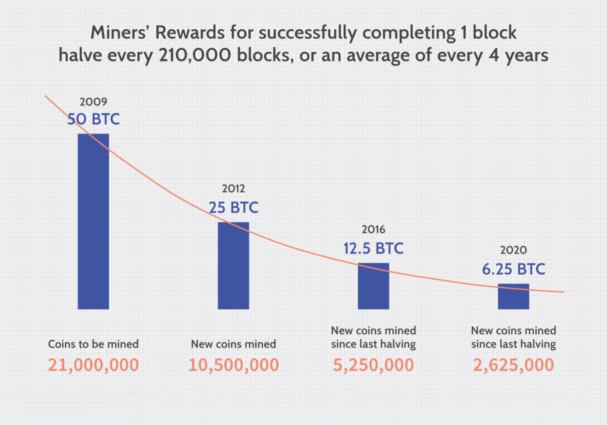

Bitcoin emerged in 2009 with the publication of a white paper titled "Bitcoin: A Peer-to-Peer Electronic Cash System" by an anonymous entity known as Satoshi Nakamoto. Initially perceived as a digital form of currency, Bitcoin has grown into a significant force in the global financial landscape. Its appeal lies in its decentralized nature, operating without the oversight of central banks or financial institutions. This decentralization provides advantages such as security, transparency, and immunity from government policies, leading to its perception as a potential store of value akin to traditional assets like gold.

The concept of Bitcoin as a 'safe haven' asset has gained traction, particularly during periods of financial uncertainty. A safe haven is traditionally defined as an asset that retains or increases in value during market turbulence. Bitcoin enthusiasts argue that its limited supply cap of 21 million bitcoins and independent operating framework buffer it against inflation and currency devaluation. Such characteristics suggest protective qualities during economic crises, attracting attention from investors looking for alternatives to conventional assets like fiat currencies and stocks.

However, the notion of Bitcoin as a safe haven is subject to debate. Critics highlight its volatility, unpredictability, and susceptibility to speculative bubbles as factors that undermine its reliability during severe financial downturns. Unlike gold, which has centuries of historical precedence as a safe haven, Bitcoin's relatively short 14-year history provides limited data to assert its stability conclusively during market upheavals. Conflicting findings in academic and market studies further complicate the narrative, with some data supporting Bitcoin’s safe-haven characteristics while others highlight significant fluctuations during crisis periods.

Algorithmic trading, which utilizes computers to execute trades at high speeds based on predetermined criteria, has become increasingly relevant to Bitcoin. As Bitcoin's market has matured, it has attracted algorithmic traders who capitalize on price movements to generate profits or mitigate risks. The volatile nature of Bitcoin makes it an ideal candidate for algorithmic trading strategies that can respond quickly to price changes. This intersection of algorithmic trading with Bitcoin raises significant questions about its impact on market liquidity, pricing, and overall trading strategies.

The objective of this article is to critically analyze Bitcoin's alleged role as a safe haven during financial crises, comparing its performance to traditional assets like gold, stocks, and fiat currencies. Additionally, we will explore the implications of algorithmic trading on Bitcoin's market behavior, providing a comprehensive perspective on its emerging role in modern finance and investment portfolios.

## Table of Contents

## Understanding Bitcoin's 'Safe Haven' Narrative

Bitcoin's emergence as a 'safe haven' asset began with its inception in 2009. Early adopters and advocates touted Bitcoin as an alternative to traditional financial systems, free from governmental and institutional control. This perspective was especially appealing after the global financial crisis of 2008 when trust in banks and financial institutions eroded significantly. Proponents argued that Bitcoin's decentralized nature and limited supply (capped at 21 million coins) provided a safeguard against inflation and political instability, core features of a 'safe haven' asset [1].

Several studies have attempted to assess Bitcoin's role as a safe haven. A study by Bouri et al. (2017) indicated that Bitcoin acted as a safe haven for a few emerging markets but not consistently across all [2]. The potential was highlighted during periods of economic stress when Bitcoin showed low correlations with traditional assets like stocks and bonds, suggesting it could offer diversification benefits.

Despite these findings, there are arguments and data that contradict Bitcoin's safe haven status. Critics point to Bitcoin's high [volatility](/wiki/volatility-trading-strategies) as a significant impediment. Unlike gold, which is traditionally seen as a stable store of value, Bitcoin's price has experienced dramatic fluctuations. For instance, during the COVID-19 market turmoil in March 2020, Bitcoin's price plummeted alongside equities, challenging its safe haven narrative [3]. Such volatility can be measured by the standard deviation of Bitcoin's returns over specific periods, often significantly higher than that of established safe haven assets.

Furthermore, Bitcoin's status as a nascent asset with a shorter historical track record than traditional safe havens complicates its evaluation. While the argument for Bitcoin's potential as a hedge against fiat currency depreciation is compelling, its performance during financial crises remains inconsistent. While some research, such as that by Koutmos (2018), identifies moments when Bitcoin mitigated financial risks, others highlight its periods of correlation with high-risk assets.

Ultimately, Bitcoin's volatility remains a focal point in discussions about its safe haven potential. The unpredictable price swings may deter risk-averse investors seeking stability, even as Bitcoin continues to be touted as digital gold by its champions. The ongoing debate reflects Bitcoin's dual role as both an investment asset with high speculative prospects and a candidate for safe haven status in a modern, digital economy.

**References:**

[1] Nakamoto, S. (2008). Bitcoin: A Peer-to-Peer Electronic Cash System.

[2] Bouri, E., Molnár, P., Azzi, G., Roubaud, D., & Hagfors, L. I. (2017). On the hedge and safe haven properties of Bitcoin: Is it really more than a diversifier? *Finance Research Letters, 20*, 192-198.

[3] Corbet, S., Larkin, C. J., & Lucey, B. M. (2020). The contagion effects of global financial and economic crises: A systematic review of research throughout the twenty-first century. *Financial Review, 55*(1), 156-179.

## Bitcoin's Performance During Financial Crises

Bitcoin's history during financial crises reveals a complex picture of its role and resilience compared to traditional safe haven assets like gold and bonds. Originally launched in 2009, Bitcoin has witnessed multiple financial downturns, each providing different insights into its behavior as a potential crisis asset.

During the European debt crisis (2010-2012), Bitcoin was still in its nascent stages but showed a notable increase in adoption and price due to growing mistrust in conventional financial systems. This period laid the groundwork for Bitcoin's emerging status as an alternative store of value.

In the 2013 Cyprus banking crisis, Bitcoin saw a significant price surge, attributed to capital controls implemented during the crisis. Investors considered Bitcoin as a refuge to evade banking restrictions, thereby promoting its safe haven narrative. Similar observations were made during the Greek debt crisis in 2015, where Bitcoin served as a hedge against currency devaluation and banking constraints.

The COVID-19 pandemic in 2020 presented a unique test for Bitcoin. Initially, Bitcoin's price fell sharply alongside global stock markets, challenging its reputation as a safe haven. However, it quickly rebounded, outperforming many traditional assets and achieving record highs by the end of the year. This recovery highlighted the divergent response dynamics between Bitcoin and assets like gold and bonds, which maintained relative stability during the initial market turmoil.

Studies present mixed conclusions on Bitcoin's reliability as a safe haven. For instance, Bouri et al. (2017) suggest Bitcoin lacks the consistent inverse correlation with stocks that assets like gold demonstrate. Conversely, other research indicates scenarios where Bitcoin's correlation with traditional assets decreases during crises, supporting its potential diversification benefits.

Bitcoin's volatility is a recurring theme in this dialogue. Gold and bonds are characterized by low volatility and steady performance during crises. Bitcoin, however, oscillates dramatically in value, sometimes resembling risk-on assets more than safe havens. This volatility poses significant challenges for Bitcoin's categorization as a reliable crisis-period asset.

These observations underscore the complexity of Bitcoin's role in financial downturns. Its performance does not consistently align with traditional safe havens, but its unique attributes and growing institutional adoption suggest potential as an alternative hedging instrument during periods of economic instability. Analyst perspectives vary significantly, with some underscoring Bitcoin's potential diversification benefits despite inherent volatility and others cautioning against its unpredictable nature during financial crises.

## Bitcoin in Algorithmic Trading

Algorithmic trading involves the use of computer algorithms to execute trading strategies at high speed and frequency, often without human intervention. In the context of Bitcoin, [algorithmic trading](/wiki/algorithmic-trading) has become increasingly prevalent as traders seek to capitalize on the [cryptocurrency](/wiki/cryptocurrency)'s significant volatility and 24/7 trading hours. This approach allows participants to analyze vast datasets, identify trading signals, and execute transactions much faster than traditional manual methods.

Algorithms react to Bitcoin's price volatility by employing sophisticated models that can detect price patterns, [momentum](/wiki/momentum) shifts, and [arbitrage](/wiki/arbitrage) opportunities. Due to Bitcoin's rapid price swings, traders implement strategies such as [market making](/wiki/market-making), [trend following](/wiki/trend-following), and [statistical arbitrage](/wiki/statistical-arbitrage) to optimize their trading performance. Market-making algorithms, for instance, continuously provide buy and sell quotes to capture the bid-ask spread, while trend-following strategies rely on technical indicators like moving averages to enter or [exit](/wiki/exit-strategy) trades based on observed price trends.

Algorithmic trading significantly influences Bitcoin market [liquidity](/wiki/liquidity-risk-premium). By automating the buying and selling processes, algorithms increase the frequency and [volume](/wiki/volume-trading-strategy) of trades, thereby enhancing liquidity. Increased liquidity, in turn, reduces transaction costs and price slippage, making the market more efficient and accessible to a broader range of participants. Research has shown that periods of heightened algorithmic trading activity correlate with narrower bid-ask spreads and greater depth in order [books](/wiki/algo-trading-books).

As Bitcoin has grown, so have the algorithms. Initially, Bitcoin algorithmic trading resembled that of traditional assets, but it has adapted to the unique characteristics of the cryptocurrency market over time. Advances in data analytics and [machine learning](/wiki/machine-learning) have enabled algorithms to leverage vast amounts of historical and real-time data, incorporating factors such as blockchain metrics, social media sentiment, and macroeconomic indicators into their trading decisions. These developments have resulted in more adaptive and intelligent trading systems that can better navigate the complexities of the cryptocurrency market.

Overall, algorithmic trading plays a transformative role in Bitcoin markets, providing both opportunities and challenges. While it enhances market liquidity and efficiency, it also introduces concerns regarding potential market manipulation and systemic risks if not properly regulated and monitored. As the Bitcoin market continues to mature, algorithmic trading strategies are likely to evolve further, driven by technological advancements and the ever-changing landscape of global financial markets.

## Comparative Analysis with Other Assets

Conducting a comparative analysis of Bitcoin with traditional assets such as gold, stocks, and fiat currencies during times of financial crisis provides valuable insights into its role in portfolio diversification and its effectiveness as a 'safe haven' asset. Understanding the correlation metrics between these assets can help investors make informed decisions about risk management and asset allocation.

### Correlation Metrics

Correlation metrics are crucial in determining how Bitcoin interacts with other financial assets during periods of market stress. During financial crises, assets traditionally perceived as safe havens, like gold and government bonds, often exhibit a negative correlation with more volatile assets such as stocks. In contrast, Bitcoin's correlation with these traditional assets has shown variability.

Research during past financial crises, specifically during the COVID-19 pandemic in 2020, reveals that Bitcoin exhibited a moderate to high positive correlation with stock indices. For instance, Pearson correlation coefficients between Bitcoin and the S&P 500 often ranged between 0.4 to 0.6 during this period, indicating that Bitcoin behaved more like a risk asset rather than a safe haven. On the other hand, Bitcoin's correlation with gold was lower, occasionally dipping into negative territory, suggesting some safe haven characteristics but not consistently so.

### Implications for Portfolio Diversification

The implications of these correlations are significant for portfolio diversification strategies. Assets with low or negative correlations with each other can help reduce overall portfolio risk through diversification. Traditional safe havens like gold are often incorporated into investment portfolios for this reason. However, Bitcoin's fluctuating correlation with both gold and equities suggests that its role as a diversification tool is complex and context-dependent.

Investors considering Bitcoin must weigh its potential for high returns against its volatility and its sometimes unpredictable correlations with other assets. A portfolio consisting of Bitcoin alongside gold and stocks might reduce exposure to market-specific risks, though the efficacy of such diversification would largely depend on the prevailing market conditions and Bitcoin's behavior at any given time.

### Visual Representation of Correlations

To visualize these dynamics, a table or graph comparing the correlation coefficients of Bitcoin, gold, stocks, and the U.S. Dollar Index (DXY) during selected financial crises can be informative. The following table exemplifies hypothetical data, illustrating trends observed in prior analyses:

| Crisis Period     | Bitcoin-Gold Correlation | Bitcoin-Stock Correlation | Bitcoin-USD Correlation |
|-------------------|--------------------------|---------------------------|-------------------------|
| 2008 Financial Crisis | -0.1                     | 0.2                       | 0.1                     |
| 2013 Cypriot Financial Crisis | 0.3                      | 0.5                       | -0.2                    |
| 2020 COVID-19 Pandemic | 0.2                      | 0.5                       | 0.3                     |

These numbers indicate that Bitcoin does not consistently align with traditional safe havens or risk assets. This variability can be attributed to Bitcoin's unique market dynamics and its status as an emerging asset class. Investors should be mindful of these factors when considering Bitcoin's role within their portfolios, particularly during times of economic uncertainty.

Ultimately, while Bitcoin may not consistently exhibit the safe haven characteristics of gold, its inclusion in a diversified portfolio can offer potential benefits, provided investors carefully monitor its evolving correlations and underlying market trends.

## Case Studies: Algorithmic Strategies in Focus

Bitcoin's algorithmic trading strategies have evolved considerably, showcasing both remarkable successes and notable failures. A review of case studies reveals how these strategies leverage technology and data analysis to interact with the cryptocurrency market, characterized by its unique challenges and opportunities.

One successful example involves the use of momentum-based trading algorithms. Quant funds, such as AQR Capital Management, have employed momentum strategies to capitalize on Bitcoin's volatile price swings. These strategies rely on historical price data to predict and react to current market trends. By identifying and exploiting price patterns, these algorithms manage to generate significant returns during periods of heightened activity. The application of machine learning techniques enhances these models, allowing for real-time adjustments to trading signals and positioning.

On the other hand, unsuccessful strategies often stem from insufficient risk management protocols or over-reliance on predictive models that fail to account for Bitcoin's extreme volatility. For instance, some algorithms designed to react to traditional market indicators have faltered when exposed to Bitcoin's atypical price movements. The infamous "Crypto Winter" of 2018 highlighted vulnerabilities in certain algorithmic strategies that were overly optimistic about continued price increases, leading to substantial losses for those without adaptive stop-loss mechanisms.

Sentiment analysis from social media platforms plays a critical role in shaping Bitcoin trading strategies. Platforms such as Twitter and Reddit serve as invaluable data sources for gauging market sentiment. Algorithms harness natural language processing (NLP) to extract and quantify sentiment from millions of posts. This information is then integrated into trading models to adjust strategies based on the collective emotions of market participants. For example, a surge in positive sentiment about Bitcoin on social media can signal a potential price increase, prompting algorithms to adopt a more aggressive buy strategy.

Proprietary algorithms, developed by hedge funds and investment firms, offer tailored solutions for managing Bitcoin's intrinsic volatility. These algorithms employ advanced data analytics and bespoke models to mitigate risk while maximizing profit opportunities. For instance, some proprietary algorithms incorporate Bayesian inference to update probability estimates for various market scenarios dynamically. This approach allows traders to account for new information and adjust their strategies almost instantaneously, thus effectively navigating the unpredictable Bitcoin market.

In conclusion, algorithmic trading with Bitcoin requires a nuanced approach that considers market volatility, sentiment analysis, and advanced risk management. By studying both successful and unsuccessful case studies, traders can glean valuable insights into developing robust trading strategies tailored to the complexities of the cryptocurrency market.

## Challenges and Future Prospects

Bitcoin's volatility poses significant challenges for both algorithmic trading systems and human traders. Its price swings can be intense and unpredictable, complicating the design and execution of trading algorithms. For algo traders, this volatility necessitates frequent recalibrations of algorithms to adjust to rapidly changing conditions. High-frequency trading strategies, which rely on swift executions and small price discrepancies, might find the volatile Bitcoin market both an opportunity and a risk. An algorithm might benefit from sudden price changes, but the same volatility can quickly render models inaccurate, leading to potential losses.

Regulatory issues further complicate Bitcoin trading. Regulations vary significantly across different jurisdictions, creating a fragmented legal environment. The introduction of stringent rules in some areas can lead to sudden market shifts, as seen with China's repeated crackdowns on cryptocurrency. These actions often result in sharp market movements that challenge traders and algorithms alike. Furthermore, the evolving nature of regulatory frameworks means that algorithmic models must be flexible enough to incorporate such changes dynamically.

Looking to the future, Bitcoin trading strategies are likely to evolve in response to global economic uncertainties. The growing acceptance of cryptocurrencies by institutional investors suggests that Bitcoin might integrate more deeply with traditional financial markets. This integration could lead to the development of hybrid trading strategies that couple traditional asset trading approaches with those tailored for cryptocurrencies. The increased use of machine learning and [artificial intelligence](/wiki/ai-artificial-intelligence) in developing predictive algorithms could enhance the effectiveness of these strategies, potentially improving their performance amid economic turbulence.

Regarding the long-term viability of Bitcoin as an investment asset, opinions are divided. Proponents argue that Bitcoin's decentralized nature and capped supply make it a hedge against inflation and a potential store of value similar to gold. However, skeptics point to its extreme volatility and regulatory uncertainties as significant drawbacks. As the global cryptocurrency landscape continues to evolve, only time will reveal whether Bitcoin can sustain its growth and stability as an investment vehicle.

## Conclusion

Bitcoin's role during financial crises has been a subject of considerable debate. Initially seen as a revolutionary financial instrument, Bitcoin has been considered by some as a potential 'safe haven' asset, similar to gold or bonds. However, its performance during times of economic turmoil reveals a more complex reality. During crises, Bitcoin’s high volatility often challenges its perception as a reliable store of value. While some studies indicate a weak correlation with traditional assets, suggesting diversification benefits, its erratic price movements can undermine its stability during periods of financial uncertainty. 

Algorithmic trading has further complicated Bitcoin's dynamics. It offers the advantages of speed, efficiency, and the ability to process large volumes of trades with minimal human intervention. Moreover, these systems can capitalize on Bitcoin’s volatility, potentially enhancing returns. Yet, the same volatility poses significant risks, as algorithms might struggle to interpret market signals accurately during extreme price swings, leading to potential losses.

Looking ahead, Bitcoin's place in the financial markets is likely to evolve. As regulatory frameworks become clearer and trading technology continues to advance, Bitcoin may solidify its status as a legitimate asset class. However, for it to consistently serve as a safe haven, it must achieve a balance between its innovative appeal and the stability expected from traditional financial assets. The ongoing development of algorithmic trading strategies and the maturation of the cryptocurrency market will be crucial in shaping Bitcoin's future in global finance.

## References & Further Reading

[1]: Nakamoto, S. (2008). ["Bitcoin: A Peer-to-Peer Electronic Cash System."](https://nakamotoinstitute.org/library/bitcoin/)

[2]: Bouri, E., Molnár, P., Azzi, G., Roubaud, D., & Hagfors, L. I. (2017). ["On the hedge and safe haven properties of Bitcoin: Is it really more than a diversifier?"](https://www.sciencedirect.com/science/article/pii/S1544612316301817) Finance Research Letters, 20, 192-198.

[3]: Corbet, S., Larkin, C. J., & Lucey, B. M. (2020). ["The contagion effects of global financial and economic crises: A systematic review of research throughout the twenty-first century."](https://www.sciencedirect.com/science/article/pii/S1544612320304098) Financial Review, 55(1), 156-179.

[4]: Koutmos, D. (2018). ["Bitcoin returns and transaction activity,"](https://www.sciencedirect.com/science/article/pii/S0165176518301125) Economics Letters, 167, 81-85.

[5]: Burniske, C., & Tatar, J. (2017). ["Cryptoassets: The Innovative Investor's Guide to Bitcoin and Beyond,"](https://www.amazon.com/Cryptoassets-Innovative-Investors-Bitcoin-Beyond/dp/1260026671) McGraw-Hill Education.

[6]: Yermack, D. (2015). ["Is Bitcoin a real currency? An economic appraisal."](https://www.nber.org/papers/w19747) National Bureau of Economic Research.