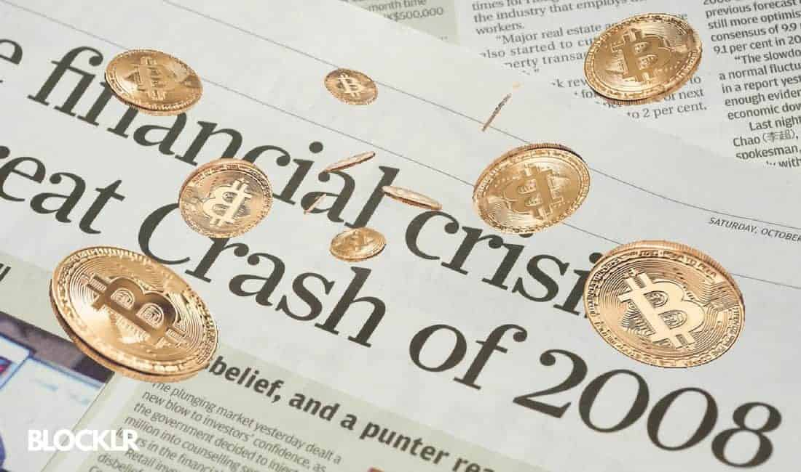

## Table of Contents

## What is Bitcoin and how does it work?

Bitcoin is a type of digital money that you can use to buy things online. It was created in 2009 by someone using the name Satoshi Nakamoto. Unlike regular money, Bitcoin is not controlled by banks or governments. Instead, it uses a technology called blockchain, which is like a big, public record book that keeps track of all Bitcoin transactions.

When you want to send Bitcoin to someone, you use a special program on your computer or phone. This program helps you create a message that says how much Bitcoin you want to send and to whom. This message gets sent to a network of computers all over the world. These computers check the message to make sure it's valid and then add it to the blockchain. Once it's on the blockchain, the transaction is complete, and the person you sent the Bitcoin to can use it.

## How has Bitcoin performed during past financial crises?

Bitcoin has had different reactions during past financial crises. During the financial crisis in 2008, Bitcoin was just starting out and wasn't well-known. But as it grew, people started watching how it reacted to big economic events. In the early 2010s, when there were problems in Europe with countries like Greece struggling financially, Bitcoin's value went up a lot. People thought of it as a safe place to keep their money, away from banks and governments.

In March 2020, when the whole world was hit by the COVID-19 crisis, Bitcoin's value dropped a lot at first, just like the stock market. But then, it started to recover faster than many other investments. This made some people think that Bitcoin could be a good choice during tough times. However, Bitcoin is still very new and can be very up and down, so it's not always clear how it will act during a financial crisis.

## What makes Bitcoin different from traditional financial systems?

Bitcoin is different from traditional financial systems because it's not controlled by any bank or government. With traditional money, like dollars or euros, banks keep track of how much money you have and help you move it around. They can also decide to stop you from using your money if they think something is wrong. But with Bitcoin, there's no central authority telling you what to do. Instead, a network of computers all over the world helps keep track of Bitcoin transactions, and once a transaction is recorded, it can't be changed or stopped.

Another big difference is how Bitcoin is created and how much of it there will ever be. Traditional money can be printed by governments whenever they want, which can lead to inflation, where the value of money goes down. Bitcoin, on the other hand, has a set limit of 21 million coins that will ever exist. New Bitcoins are created through a process called mining, where people use computers to solve hard math problems. This process is designed to get harder over time, slowing down how fast new Bitcoins are made, which helps keep Bitcoin's value more stable in the long run.

## How does Bitcoin's decentralized nature impact its role in financial crises?

Bitcoin's decentralized nature means it's not controlled by any one bank or government. This can make it a safe place for people to keep their money during financial crises, because it's not affected by the problems that banks or countries might have. For example, if a country's economy is doing badly and its money is losing value, people might move their money into Bitcoin to keep it safe. This is because Bitcoin's value doesn't depend on any one country's economy.

However, being decentralized also makes Bitcoin unpredictable during financial crises. Because it's not controlled by a central authority, its value can go up and down a lot based on what people think about it. During a crisis, if lots of people suddenly want to buy Bitcoin because they think it's safe, its value might go up. But if everyone decides to sell their Bitcoin at the same time, its value can drop a lot. So, while Bitcoin's decentralized nature can offer safety, it also brings a lot of uncertainty during tough economic times.

## What are the risks of investing in Bitcoin during a financial crisis?

Investing in Bitcoin during a financial crisis can be risky because its value can change a lot. Bitcoin is not controlled by any bank or government, so its price can go up and down quickly based on what people think about it. During a crisis, if lots of people decide to buy Bitcoin because they think it's safe, its value might go up. But if everyone suddenly wants to sell their Bitcoin, its value can drop a lot. This up-and-down movement can be scary for people who put their money into Bitcoin, especially during a time when the economy is already unstable.

Another risk is that Bitcoin is still new and not everyone trusts it. During a financial crisis, people might be more worried about their money and might not want to take a chance on something like Bitcoin. If there's a big problem with Bitcoin, like a hack or a mistake in the system, it could lose even more value. Also, because Bitcoin is not backed by a government or a bank, if you lose your Bitcoin or someone steals it, there's no one to help you get it back. So, while Bitcoin can be a way to keep your money safe during a crisis, it also comes with big risks that you need to think about carefully.

## How can Bitcoin be used as a hedge against inflation and currency devaluation?

Bitcoin can be used as a hedge against inflation and currency devaluation because it has a limited supply. Unlike traditional money, where governments can print more whenever they want, there will only ever be 21 million Bitcoins. This means that as more people want to use Bitcoin, its value can go up, which can help protect your money from losing value due to inflation. If the money in your country is losing value because too much is being printed, you can move your money into Bitcoin to keep its value safe.

Another way Bitcoin can help against inflation and currency devaluation is because it's not controlled by any one country or bank. If a country's money is losing value, people can use Bitcoin instead. This is because Bitcoin's value doesn't depend on what's happening in any one country's economy. So, if you think your country's money will lose value, you can buy Bitcoin to keep your money's value stable. But remember, Bitcoin can be risky because its value can go up and down a lot, so you need to be careful.

## What role do government regulations play in Bitcoin's effectiveness during financial crises?

Government regulations can affect how well Bitcoin works during financial crises. If a government makes strict rules about using Bitcoin, it can make people less likely to use it. For example, if a government says you can't use Bitcoin to buy things or if they make it hard to change your money into Bitcoin, fewer people will want to use it. During a financial crisis, if people are worried about their money and the government is making it hard to use Bitcoin, they might not see it as a good way to keep their money safe.

On the other hand, if a government has clear and fair rules about Bitcoin, it can make people feel more confident about using it. If people know they can use Bitcoin without breaking any laws, they might be more likely to see it as a safe place to keep their money during tough times. But even with good rules, Bitcoin can still be risky because its value can change a lot. So, while government regulations can help or hurt how well Bitcoin works during a financial crisis, they are just one part of the bigger picture.

## How do Bitcoin's volatility and liquidity affect its use in times of economic uncertainty?

Bitcoin's [volatility](/wiki/volatility-trading-strategies) means its price can go up and down a lot, which can be scary during times of economic uncertainty. When the economy is shaky, people might want to move their money into something safe. But because Bitcoin's price can change so quickly, it might not feel like a safe choice. If lots of people decide to buy Bitcoin because they think it's a good place to keep their money, its price might go up. But if everyone suddenly wants to sell their Bitcoin, its price can drop a lot. This up-and-down movement can make it hard for people to trust Bitcoin during tough economic times.

Bitcoin's [liquidity](/wiki/liquidity-risk-premium), or how easy it is to buy and sell, also affects how useful it is during economic uncertainty. If it's easy to turn your money into Bitcoin and back again, more people might use it as a way to keep their money safe. But if it's hard to buy or sell Bitcoin quickly, people might not want to use it during a crisis. During times of economic trouble, if lots of people are trying to buy or sell Bitcoin at the same time, it can be hard to do so quickly. This can make Bitcoin less useful as a safe place for money when things are uncertain.

## What are the potential long-term impacts of Bitcoin on global financial stability?

Bitcoin could change the way money works around the world. Because it's not controlled by any one country or bank, it might make the global financial system more stable. If people can use Bitcoin to keep their money safe during tough times, it could help stop big problems from spreading from one country to another. Also, because there will only ever be 21 million Bitcoins, it might help fight against inflation, where money loses value over time. This could make the world's money system stronger and more stable in the long run.

But Bitcoin can also bring new risks to global financial stability. Its price can go up and down a lot, which can make people nervous about using it. If lots of people start using Bitcoin and then suddenly want to sell it, it could cause big problems in the economy. Also, because Bitcoin is still new and not everyone trusts it, if something goes wrong with it, like a big hack or a mistake in the system, it could shake people's confidence in the whole financial system. So, while Bitcoin might help make things more stable in some ways, it also comes with new challenges that need to be watched carefully.

## How do institutional investors view Bitcoin during financial crises?

Institutional investors, like big banks and investment firms, have mixed feelings about Bitcoin during financial crises. Some see it as a new kind of safe place for their money. They think that because Bitcoin is not controlled by any one country or bank, it might be a good way to keep their money safe when the economy is shaky. These investors might buy more Bitcoin during a crisis, hoping its value will go up as more people look for safe places to put their money.

But other institutional investors are more careful about Bitcoin during financial crises. They worry about how much its price can change. If the economy is already unstable, they might not want to take a chance on something as risky as Bitcoin. These investors might choose to stick with more traditional investments, like gold or government bonds, which they think are safer during tough times. So, while some big investors see Bitcoin as a way to protect their money during crises, others are still not sure about it and prefer to play it safe.

## What are the technical aspects of Bitcoin that could influence its performance in a crisis?

The technical aspects of Bitcoin, like its blockchain and mining process, can affect how it does during a crisis. The blockchain is like a big, public record book that keeps track of all Bitcoin transactions. It's spread out over many computers around the world, which makes it hard for anyone to change or stop transactions. This can make Bitcoin a safe place for money during a crisis because it's not controlled by any one bank or government. But the blockchain also needs a lot of computer power to keep working, and if there's a big problem, like a hack or a mistake in the system, it could shake people's trust in Bitcoin.

Another important technical part of Bitcoin is the mining process, where new Bitcoins are created and transactions are added to the blockchain. Mining uses a lot of electricity and special computers to solve hard math problems. During a crisis, if the cost of electricity goes up or if there are problems with the internet, it can make mining harder and more expensive. This could slow down how fast new Bitcoins are made and how quickly transactions are processed. So, while Bitcoin's technical features can help keep it safe and independent, they also bring new challenges that can affect how well it works during tough economic times.

## How might future technological developments in blockchain affect Bitcoin's role in financial crises?

Future technological developments in blockchain could make Bitcoin even more useful during financial crises. If blockchain technology gets better and faster, it could help Bitcoin transactions happen more quickly and cheaply. This would make it easier for people to use Bitcoin as a safe place for their money when the economy is shaky. Also, if new technology makes the blockchain more secure, people might trust Bitcoin more during tough times. They would feel safer knowing that their money is protected by strong technology.

But there are also risks with new technology. If big changes happen to the blockchain, it could cause problems for Bitcoin. For example, if a new technology makes it easier for hackers to attack the blockchain, it could shake people's trust in Bitcoin during a crisis. Also, if new technology changes how Bitcoin works, it might make it harder for people to understand and use it. So, while better blockchain technology could help Bitcoin during financial crises, it's important to watch out for new risks that come with these changes.

## References & Further Reading

[1]: Nakamoto, S. (2008). ["Bitcoin: A Peer-to-Peer Electronic Cash System."](https://nakamotoinstitute.org/library/bitcoin/)

[2]: Bouri, E., Molnár, P., Azzi, G., Roubaud, D., & Hagfors, L. I. (2017). ["On the hedge and safe haven properties of Bitcoin: Is it really more than a diversifier?"](https://www.sciencedirect.com/science/article/pii/S1544612316301817) Finance Research Letters, 20, 192-198.

[3]: Corbet, S., Larkin, C. J., & Lucey, B. M. (2020). ["The contagion effects of global financial and economic crises: A systematic review of research throughout the twenty-first century."](https://www.sciencedirect.com/science/article/pii/S1544612320304098) Financial Review, 55(1), 156-179.

[4]: Koutmos, D. (2018). ["Bitcoin returns and transaction activity,"](https://www.sciencedirect.com/science/article/pii/S0165176518301125) Economics Letters, 167, 81-85.

[5]: Burniske, C., & Tatar, J. (2017). ["Cryptoassets: The Innovative Investor's Guide to Bitcoin and Beyond,"](https://www.amazon.com/Cryptoassets-Innovative-Investors-Bitcoin-Beyond/dp/1260026671) McGraw-Hill Education.

[6]: Yermack, D. (2015). ["Is Bitcoin a real currency? An economic appraisal."](https://www.nber.org/papers/w19747) National Bureau of Economic Research.