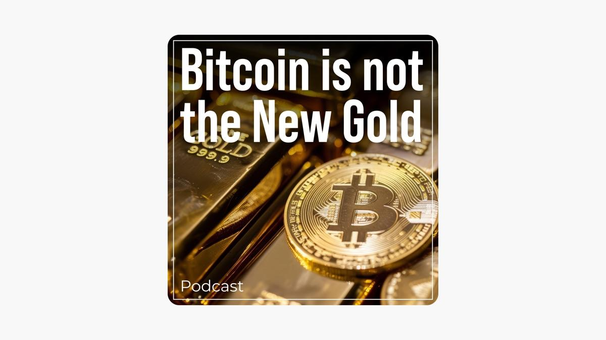

## Table of Contents

## What is Bitcoin and how does it work?

Bitcoin is a type of digital money that you can use to buy things online. It was created in 2009 by someone using the name Satoshi Nakamoto. Unlike regular money, Bitcoin is not controlled by a government or a bank. Instead, it uses a technology called blockchain, which is like a public record book that keeps track of all Bitcoin transactions.

When you want to send Bitcoin to someone, you use a special program called a digital wallet. You enter the amount of Bitcoin you want to send and the address of the person you want to send it to. The transaction is then added to the blockchain, where it is checked and confirmed by a network of computers called miners. These miners solve complex math problems to add the transaction to the blockchain, and in return, they get rewarded with new Bitcoins. This process helps keep the system secure and makes sure that the same Bitcoin can't be spent twice.

## What are the key characteristics of gold as an investment?

Gold is a popular choice for investors because it is seen as a safe place to put money. It has been used as a form of money for thousands of years and is known for keeping its value over time. When the economy is not doing well, many people turn to gold because it tends to go up in price when other investments like stocks go down. This makes gold a good way to protect your money during tough times.

Another key characteristic of gold is that it is a physical asset. You can hold it in your hand, which gives people a sense of security. Unlike stocks or bonds, gold cannot go bankrupt or disappear. It is also easy to buy and sell all over the world, making it a liquid investment. This means you can quickly turn your gold into cash if you need to. However, gold does not pay any interest or dividends, so it is not meant to grow your money quickly, but rather to keep it safe.

## How does Bitcoin's volatility compare to gold?

Bitcoin is much more volatile than gold. This means that the price of Bitcoin can go up and down a lot in a short amount of time. For example, one day Bitcoin might be worth a lot of money, and the next day it might be worth much less. This can be exciting for some people who like to take risks, but it can also be scary because you might lose money quickly. On the other hand, gold is known for being more stable. Its price does not change as much as Bitcoin's, so it is seen as a safer investment.

Gold's lower [volatility](/wiki/volatility-trading-strategies) makes it a good choice for people who want to keep their money safe over a long time. When the economy is doing badly, gold usually goes up a little bit, but it doesn't jump around like Bitcoin does. This is why many people think of gold as a safe place to put their money during uncertain times. Bitcoin, however, can be a good investment for people who are okay with taking bigger risks and are looking for the chance to make a lot of money quickly, even though they might also lose a lot.

## What are the primary uses of Bitcoin versus gold?

Bitcoin is mainly used as a digital currency for buying things online and as an investment. People can use Bitcoin to buy things on the internet from places that accept it. It's also popular as an investment because its price can go up a lot, which means people can make money if they buy it at a low price and sell it at a higher price later. Some people also use Bitcoin to send money to other countries quickly and without needing a bank. However, because Bitcoin's price can change a lot, it's seen as a riskier investment.

Gold has been used for a long time as a form of money and as a way to store value. People can buy and sell gold easily, and it's often used to make jewelry and other items. As an investment, gold is seen as a safe place to put money because it keeps its value over time and doesn't change in price as much as Bitcoin. Many people buy gold to protect their money during times when the economy is not doing well. Unlike Bitcoin, gold is a physical thing you can hold, which gives people a sense of security.

## Can Bitcoin serve as a hedge against inflation like gold?

Bitcoin can serve as a hedge against inflation, but it's not as reliable as gold. Some people think Bitcoin can protect their money from losing value because it's not controlled by governments or banks. If a country's money starts to lose value because of inflation, Bitcoin's price might go up, helping people keep their money's worth. But Bitcoin's price can change a lot, so it's not always a safe bet.

Gold, on the other hand, has been used for a long time as a way to protect money from inflation. When prices go up and money loses value, gold usually goes up in price too. This makes gold a more trusted way to keep your money safe during times when the economy is not doing well. Gold doesn't change in price as much as Bitcoin, so it's seen as a more stable choice for protecting your money.

## What are the environmental impacts of Bitcoin mining compared to gold mining?

Bitcoin mining uses a lot of electricity because it needs powerful computers to solve hard math problems. These computers use so much energy that they can cause a lot of pollution if the electricity comes from burning coal or other dirty fuels. Some people say that Bitcoin mining is bad for the environment because it makes more greenhouse gases, which can make the Earth warmer. But, some places use clean energy like wind or solar power for Bitcoin mining, which is better for the environment.

Gold mining also has big impacts on the environment. It can destroy forests and other natural places because miners dig big holes in the ground to find gold. The chemicals used in gold mining, like mercury and cyanide, can pollute water and harm animals and people. Gold mining can also release a lot of dust and dirt into the air, which is bad for the environment. Overall, both Bitcoin mining and gold mining can harm the environment, but they do it in different ways.

## How do the supply dynamics of Bitcoin and gold differ?

Bitcoin has a set limit on how many can ever be made. There will only ever be 21 million Bitcoins. This limit is written into the code that runs Bitcoin, so no one can change it. As time goes on, the number of new Bitcoins made each day gets smaller and smaller. This is done on purpose to make Bitcoin more like gold, where there's only so much of it in the world. Because of this limit, some people think Bitcoin will go up in value over time as more people want it but there's less new Bitcoin being made.

Gold, on the other hand, comes from the ground. People have to dig it up from mines. We don't know exactly how much gold is left in the Earth, but we do know that it's getting harder to find new gold. As the easy-to-find gold runs out, it takes more work and money to get the rest. This can make gold more valuable because it's harder to get. Unlike Bitcoin, there's no set limit on gold, but the amount we can mine each year is getting smaller, which is a bit like Bitcoin's supply getting smaller over time.

## What role do regulations play in the adoption of Bitcoin compared to gold?

Regulations play a big role in how people use Bitcoin and gold. For Bitcoin, rules can make it harder or easier for people to buy, sell, and use it. Some countries have strict rules that make it tough to use Bitcoin, like needing to report every transaction or not allowing banks to work with Bitcoin companies. This can slow down how many people use Bitcoin. On the other hand, if a country has friendly rules, more people might start using Bitcoin because it's easier and safer.

Gold has been around for a long time, so there are already many rules about how to buy, sell, and own it. These rules are usually clear and people know what to expect. Because gold is seen as a safe investment, governments often have rules to make sure people don't use it for bad things like money laundering. But these rules don't usually stop people from using gold as much as they might with Bitcoin. So, while regulations affect both Bitcoin and gold, they have a bigger impact on Bitcoin because it's newer and less understood.

## How do institutional investors view Bitcoin in relation to gold?

Institutional investors, like big banks and investment funds, are starting to see Bitcoin as a new kind of investment, but they still see gold as the safer choice. Gold has been trusted for a long time because it keeps its value and doesn't change in price as much as Bitcoin. Big investors like gold because it helps protect their money during tough economic times. They know how gold works and feel comfortable with it. Bitcoin, on the other hand, is newer and can be risky because its price goes up and down a lot. Some big investors are putting a little bit of their money into Bitcoin because they think it could go up a lot in value, but they are careful and don't put too much in.

Even though Bitcoin is seen as risky, more and more big investors are starting to pay attention to it. They see that more people are using Bitcoin and that it might become more important in the future. Some big investors are even starting to offer Bitcoin-related products, like funds that let people invest in Bitcoin without having to buy it directly. But they still see gold as the more reliable choice for keeping money safe over a long time. So, while Bitcoin is getting more interest from big investors, gold remains the go-to for those looking for a safe and steady investment.

## What historical data supports or refutes the idea of Bitcoin as 'digital gold'?

Some people call Bitcoin 'digital gold' because they think it can do the same things as gold, like keeping value over time and protecting money during bad economic times. Bitcoin has shown big price jumps, like in 2017 when its price went from less than $1,000 to almost $20,000 in just one year. This made some people think Bitcoin could be a good way to make money, just like how gold's price can go up when the economy is doing badly. Also, Bitcoin has a limit of 21 million coins, which is like how there's only so much gold in the world. This makes some people think Bitcoin will become more valuable over time as more people want it but there's less new Bitcoin being made.

But Bitcoin is also very different from gold in some ways. Its price can change a lot more than gold's, which makes it riskier. For example, after going up to almost $20,000 in 2017, Bitcoin's price fell back down to around $3,000 by the end of 2018. This kind of big change doesn't happen with gold, which is why many people see gold as a safer choice. Also, Bitcoin is new and not everyone trusts it yet. Gold has been used for thousands of years and is accepted everywhere, while Bitcoin is still trying to be seen as a reliable way to store value. So, while some data might support the idea of Bitcoin as 'digital gold,' there's also a lot that shows it's not the same as gold in many important ways.

## How do the security and storage methods for Bitcoin compare to those for gold?

Bitcoin is stored in digital wallets, which can be online or offline. Online wallets, called hot wallets, are easy to use but can be hacked if you're not careful. Offline wallets, called cold wallets, are safer because they're not connected to the internet, but they're a bit harder to use. To keep Bitcoin safe, you need to protect your wallet's private key, which is like a secret code that lets you use your Bitcoin. If someone else gets your private key, they can take your Bitcoin. So, it's important to use strong passwords and keep your private key safe.

Gold is a physical thing, so you store it differently. You can keep gold at home in a safe, or you can put it in a bank's safe deposit box. Keeping gold at home means you have to worry about theft or damage, but you can get to it easily. Putting gold in a bank's safe deposit box is safer, but you have to go to the bank to get it. Gold is heavy and hard to move around, so it's not as easy to take with you as Bitcoin. But, because gold is a physical thing, you don't have to worry about hackers like you do with Bitcoin.

## What are the long-term economic implications of treating Bitcoin as a store of value like gold?

If more and more people start treating Bitcoin like gold, it could change the economy in big ways. Bitcoin has a limit on how many can ever be made, just like gold. This means that if more people want Bitcoin and there's not much new Bitcoin being made, its price might go up a lot. This could make Bitcoin a good way to keep money safe over a long time, just like gold. But because Bitcoin's price can change a lot more than gold's, it could also make the economy more risky. If a lot of people use Bitcoin to store their money and its price goes down a lot, they might lose money and spend less, which could hurt the economy.

On the other hand, if Bitcoin becomes a trusted store of value, it could help spread money around the world more easily. Right now, sending money to other countries can be slow and expensive. With Bitcoin, you can send money quickly and cheaply. This could help people in different countries trade with each other more easily and help the world economy grow. But for this to happen, people need to trust Bitcoin and use it more. Governments and banks would also need to make rules that help Bitcoin grow safely. If they don't, Bitcoin might stay risky and not be used as a store of value like gold.

## What is the relationship between understanding volatility and correlation?

Volatility serves as a pivotal [factor](/wiki/factor-investing) in discerning the appropriateness of an asset for hedging purposes. Gold, with its rich history as a financial safe haven, is distinguished by its stable and predictable nature during periods of market distress. This relative constancy is a result of its intrinsic value, wide acceptance, and historical use as a hedge against economic downturns. Its volatility, when measured using models like the GARCH (Generalized Autoregressive Conditional Heteroskedasticity) family, consistently reflects lower fluctuations, thereby bolstering its reputation among risk-averse investors.

In stark contrast, Bitcoin's volatility is notably higher and unpredictably erratic. This digital asset, while enticing by its prospect of high returns, showcases substantial price swings that pose significant challenges for [algorithmic trading](/wiki/algorithmic-trading) systems. The ephemeral market sentiment surrounding cryptocurrencies, compounded by regulatory uncertainties and technological developments, contributes to this instability. Such volatility creates potential opportunities but also escalates risk, making Bitcoin less reliable as a hedging instrument.

To quantify and analyze dynamic correlations between these assets and the broader market, econometric models like BEKK-GARCH (Baba, Engle, Kraft, and Kroner) are employed. The BEKK-GARCH model is an extension of the GARCH model and is formulated as follows:

$$
H_t = C'C + A\epsilon_{t-1}\epsilon_{t-1}'A' + BH_{t-1}B'
$$

where $H_t$ is the conditional covariance matrix, $C$, $A$, and $B$ are parameter matrices, and $\epsilon_{t-1}$ represents the innovation vector. This model allows researchers and traders to capture time-varying volatility and correlation between gold, Bitcoin, and other assets within a multi-asset portfolio. 

Empirical studies using BEKK-GARCH have highlighted that while gold tends to maintain low and stable correlation with traditional equities during market volatilities, Bitcoin's correlation with these markets often increases, especially in downturns. This is contrary to the desired negative correlation that would classify an asset as a safe haven. The erratic behavior of Bitcoin's correlation underscores the complexities involved in integrating it into algorithmic trading systems designed with traditional asset classes like gold.

Understanding these volatility and correlation dynamics is crucial for investors aiming to diversify their portfolios effectively. As Bitcoin continues to mature, ongoing assessments of its volatility patterns and correlation structures will be essential in determining its role in future trading and investment strategies.

## What are Portfolio Diversification and Hedging Strategies?

Gold has consistently served as a cornerstone for diversification and hedging against equity market risks due to its intrinsic value and historical performance. Its low correlation with traditional financial markets enables it to act as a buffer during economic downturns, reducing portfolio volatility and preserving wealth.

In contrast, Bitcoin's role in portfolio diversification remains ambiguous. Its speculative nature and history of substantial price swings undermine its reliability as a protective asset during market stress. Academic studies have highlighted that Bitcoin's correlation with traditional asset classes, including equities, can increase during market turbulence, eroding its utility as a hedge. [1]

Strategies that traditionally harness gold for hedging can encounter limitations when Bitcoin is used as a substitute in algorithmic trading. Gold exhibits price stability and a consistent historical track record as a risk-off asset. These attributes support its effective integration into trading algorithms designed to mitigate risk and smooth portfolio returns across economic cycles.

Bitcoin, however, introduces complexity due to its price volatility and correlation patterns. To evaluate how Bitcoin might fit into a diversified portfolio, an analysis involves computing its Sharpe Ratio and examining correlation metrics relative to core portfolio assets such as equities, bonds, and gold. The Sharpe Ratio measures risk-adjusted returns and is given by:

$$
SR = \frac{\bar{R} - R_f}{\sigma}
$$

Where $\bar{R}$ is the average return, $R_f$ is the risk-free rate, and $\sigma$ is the standard deviation of excess returns. A lower Sharpe Ratio for Bitcoin suggests a high degree of risk per unit of return, complicating its role as a hedge.

Moreover, the inclusion of Bitcoin in algorithmic trading strategies requires careful [backtesting](/wiki/backtesting) to avoid misalignment with investment objectives. Portfolio simulations may expose scenarios where Bitcoin's price movements amplify rather than dampen volatility, particularly in bear markets. 

Ultimately, the integration of Bitcoin into diversified portfolios should be approached with caution. Strategies must account for its speculative behavior and potential for heightened correlation with traditional assets during economic distress. Investors may need to evolve existing models to accommodate these characteristics and routinely reassess Bitcoin's fit within their broader portfolio context.

[1] Bouri, E., Molnár, P., Azzi, G., Roubaud, D., & Hagfors, L. I. (2017). On the hedge and safe haven properties of Bitcoin: Is it really more than a diversifier? Finance Research Letters, 20, 192-198.

## References & Further Reading

[1]: Bouri, E., Molnár, P., Azzi, G., Roubaud, D., & Hagfors, L. I. (2017). ["On the hedge and safe haven properties of Bitcoin: Is it really more than a diversifier?"](https://www.sciencedirect.com/science/article/abs/pii/S1544612316301817) Finance Research Letters, 20, 192-198.

[2]: Klein, T., Pham Thu, H., & Walther, T. (2018). ["Bitcoin is not the New Gold – A comparison of volatility, correlation, and portfolio Performance"](https://papers.ssrn.com/sol3/papers.cfm?abstract_id=3146845). International Review of Financial Analysis, 59, 105-116.

[3]: Baur, D. G., Hong, K., & Lee, A. D. (2017). ["Bitcoin: Medium of exchange or speculative assets?"](https://www.sciencedirect.com/science/article/abs/pii/S1042443117300720) Journal of International Financial Markets, Institutions and Money, 54, 177-189.

[4]: GARCH Model application in finance - Engle, R. F. (1982). ["Autoregressive Conditional Heteroscedasticity with Estimates of the Variance of United Kingdom Inflation."](https://www.sciencedirect.com/science/article/pii/0304407686900631) Econometrica, 50(4), 987-1007.

[5]: Varian, H. R. (1975). ["A Bayesian Approach to Real Estate Assessment."](https://www.jstor.org/stable/2285160) Studies in Bayesian Econometrics and Statistics in Honor of Leonard J. Savage, North-Holland.

[6]: ["Quantitative Trading: How to Build Your Own Algorithmic Trading Business"](https://www.amazon.com/Quantitative-Trading-Build-Algorithmic-Business/dp/1119800064) by Ernest P. Chan

[7]: Jorion, P. (1997). ["Value at Risk: The New Benchmark for Controlling Market Risk."](https://books.google.com/books/about/Value_at_Risk.html?id=u8efQgAACAAJ) McGraw-Hill.