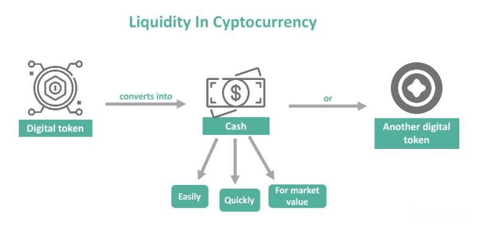

## Table of Contents

## What is Bitcoin liquidity?

Bitcoin liquidity refers to how easily you can buy or sell Bitcoin without affecting its price too much. When a market has high liquidity, it means there are lots of people wanting to buy and sell, so you can trade quickly and at a stable price. On the other hand, if liquidity is low, it might be harder to find someone to trade with, and the price could change a lot when you do make a trade.

Liquidity is important for Bitcoin because it makes the market more reliable and attractive to traders. High liquidity means less risk of big price swings, which can make people feel more confident about using Bitcoin. This can help more people start using it, which can make the market even more liquid over time.

## Why is liquidity important in the context of Bitcoin?

Liquidity is really important for Bitcoin because it makes it easier and safer for people to buy and sell it. When there are lots of people trading Bitcoin, it means you can quickly find someone to trade with without waiting too long. This is good because it means you can get in and out of your trades without worrying too much about the price changing suddenly. High liquidity helps keep the price stable, which makes people feel more confident about using Bitcoin.

If Bitcoin has low liquidity, it can be harder to find someone to trade with, and the price might jump around a lot when you do trade. This can scare people away because they might lose money if the price changes suddenly. So, having good liquidity helps make Bitcoin a more reliable and attractive choice for people who want to use it. It's like having a busy marketplace where it's easy to buy and sell things, compared to a quiet one where it's hard to find what you need.

## How is Bitcoin liquidity measured?

Bitcoin liquidity is measured by looking at how much Bitcoin is being traded and how quickly it can be bought or sold. One way to measure this is by looking at the trading volume, which is the total amount of Bitcoin that has been traded over a certain time, like a day or an hour. If the trading volume is high, it means there are a lot of people buying and selling Bitcoin, which usually means the market is liquid.

Another way to measure liquidity is by looking at the bid-ask spread. This is the difference between the highest price someone is willing to pay for Bitcoin (the bid) and the lowest price someone is willing to sell it for (the ask). A smaller bid-ask spread means it's easier to trade Bitcoin without the price changing much, which is a sign of good liquidity. If the spread is big, it might be harder to trade without affecting the price, which means the market might not be as liquid.

Lastly, market depth is also used to measure liquidity. Market depth shows how many buy and sell orders are waiting in the market at different price levels. If there are a lot of orders at many different prices, it means the market can handle big trades without the price moving too much, which is a good sign of liquidity. If there are only a few orders, the market might not be as liquid, and big trades could cause bigger price changes.

## What are the primary sources of Bitcoin liquidity?

The primary sources of Bitcoin liquidity come from big cryptocurrency exchanges where a lot of people buy and sell Bitcoin. These exchanges, like Coinbase, Binance, and Kraken, have lots of users trading all the time. This means there's always someone ready to buy or sell Bitcoin, which keeps the market liquid. When there are many trades happening, it's easier for you to trade your Bitcoin without worrying about the price changing a lot.

Another important source of Bitcoin liquidity is from trading bots and market makers. Trading bots are computer programs that automatically buy and sell Bitcoin based on certain rules. Market makers are people or companies that always have buy and sell orders in the market, helping to keep the market liquid. These bots and market makers help make sure there are always orders in the market, which makes it easier for everyone else to trade Bitcoin quickly and at stable prices.

## How does trading volume affect Bitcoin's liquidity?

Trading volume is like the heartbeat of Bitcoin's liquidity. It shows how much Bitcoin people are buying and selling over a certain time, like a day or an hour. When the trading volume is high, it means lots of people are trading Bitcoin. This makes it easier for you to find someone to trade with quickly, without waiting too long. High trading volume is a good sign because it means the market is active and lively, like a busy marketplace where it's easy to buy and sell things.

When trading volume is low, it's like the market is quiet and not many people are trading. This can make it harder for you to find someone to trade with, and you might have to wait longer. Low trading volume can also mean that if you do make a trade, it might affect the price more because there aren't as many people trading. So, high trading volume helps keep Bitcoin's market liquid and stable, making it easier and safer for everyone to trade.

## What role do Bitcoin exchanges play in liquidity?

Bitcoin exchanges are super important for keeping Bitcoin's market liquid. They are like big marketplaces where lots of people come to buy and sell Bitcoin. When you use an exchange like Coinbase or Binance, you can easily find someone to trade with because there are so many people using these platforms. This means you can trade your Bitcoin quickly and without waiting too long, which is what makes the market liquid. The more people using an exchange, the more liquid the market becomes.

Exchanges also help by showing how much Bitcoin is being traded, which is called trading volume. When trading volume is high, it means the market is active and there are lots of trades happening. This high activity helps keep the market stable because there are always people ready to buy or sell. So, exchanges play a big role in making sure there's enough trading going on to keep Bitcoin's market liquid and easy to use for everyone.

## How do market makers influence Bitcoin liquidity?

Market makers are really important for keeping Bitcoin's market liquid. They are people or companies that always have buy and sell orders in the market. This means that no matter when you want to trade Bitcoin, there's usually a market maker ready to trade with you. By always having orders in the market, market makers help make sure there's a lot of trading happening, which is good for liquidity. It's like they're always keeping the market busy and active, so you can trade your Bitcoin without waiting too long.

Having market makers in the Bitcoin market also helps keep the price stable. When you want to buy or sell Bitcoin, market makers are there to take the other side of your trade. This helps prevent big price swings because there's always someone ready to trade. When the price stays stable, more people feel confident about using Bitcoin, which can make the market even more liquid over time. So, market makers play a big role in making the Bitcoin market easier and safer for everyone to use.

## What impact do regulatory changes have on Bitcoin's liquidity?

Regulatory changes can have a big impact on Bitcoin's liquidity. When governments make new rules about cryptocurrencies, it can change how easy it is for people to buy and sell Bitcoin. If the rules make it harder for people to trade, like by making exchanges follow strict new laws, fewer people might want to trade Bitcoin. This can lower the trading volume and make it harder to find someone to trade with, which means the market becomes less liquid. On the other hand, if the rules are clear and easy to follow, more people might feel safe trading Bitcoin, which can increase liquidity.

Sometimes, regulatory changes can also affect how exchanges and market makers work. If new rules make it harder for them to do their job, they might trade less, which can hurt liquidity. For example, if a new law makes it too expensive for market makers to keep their orders in the market, they might pull back, and this can make the market less active. But if the rules help make trading safer and more transparent, it can attract more people to the market, including more market makers, which can boost liquidity. So, the way governments handle regulations can really shape how liquid the Bitcoin market is.

## How does the global economic environment affect Bitcoin liquidity?

The global economic environment can really change how liquid Bitcoin is. When the world's economy is doing well, people might feel more confident about trying new things like Bitcoin. They might see it as a good investment and start trading more, which can make the market more liquid. But if the economy is struggling, people might be more careful with their money and trade less Bitcoin. This can make it harder to find someone to trade with, and the market can become less liquid.

Also, things like interest rates and inflation can affect Bitcoin's liquidity. If interest rates are low, people might look for other places to put their money, and Bitcoin could be one of those places. This can increase trading and make the market more liquid. But if inflation is high, people might want to use Bitcoin as a way to protect their money's value, which can also boost trading and liquidity. On the other hand, if the economic environment makes people worried about cryptocurrencies, they might trade less, and the market could become less liquid.

## What are the differences in liquidity between Bitcoin and other cryptocurrencies?

Bitcoin usually has more liquidity than many other cryptocurrencies. This is because Bitcoin is the most well-known and widely used cryptocurrency. Lots of people trade Bitcoin on big exchanges like Coinbase and Binance, which means there are always many buyers and sellers ready to trade. This high trading volume helps keep the market liquid, making it easier for you to buy or sell Bitcoin without waiting too long or affecting the price too much. Other cryptocurrencies, like smaller ones, might not have as many people trading them, so it can be harder to find someone to trade with, and the market might not be as liquid.

The difference in liquidity can also depend on how new or popular a cryptocurrency is. Newer or less popular cryptocurrencies might not have as many people interested in them yet, so their markets can be less liquid. This means if you want to trade these other cryptocurrencies, you might have to wait longer to find someone to trade with, and the price might change more when you do trade. Bitcoin, being the first and most established cryptocurrency, has a bigger and more active market, which helps keep its liquidity high compared to others.

## How can advanced trading strategies improve liquidity in the Bitcoin market?

Advanced trading strategies can help make the Bitcoin market more liquid by bringing in more traders and making the market more active. For example, when traders use strategies like arbitrage, they look for small price differences between different exchanges and try to make a profit by buying low and selling high. This kind of trading can increase the number of trades happening, which helps keep the market busy and liquid. Another strategy is using algorithms to trade automatically. These algorithms can place lots of buy and sell orders quickly, making it easier for other people to find someone to trade with.

These strategies can also help by making the market more stable. When traders use hedging strategies, they try to protect themselves from big price swings by making trades that balance out their risk. This can help keep the price of Bitcoin from moving too much, which makes people feel more confident about trading. When the market is stable, more people might want to trade Bitcoin, which can increase liquidity even more. So, by using these advanced strategies, traders can help make the Bitcoin market easier and safer for everyone to use.

## What future trends might influence Bitcoin liquidity and how should investors prepare?

In the future, things like better technology and more people using Bitcoin might make it even easier to trade. As more countries and big companies start to accept Bitcoin, more people will want to buy and sell it. This can make the market busier and more liquid. Also, new rules from governments might change how easy it is to trade Bitcoin. If the rules are clear and easy to follow, it could make more people feel safe about trading, which can help liquidity. But if the rules are too strict, it might make trading harder and less liquid.

Investors should keep an eye on these trends and be ready to change their plans. If more people start using Bitcoin, it might be a good time to trade more because the market will be more liquid. But if new rules make trading harder, investors might need to be more careful and maybe wait for things to settle down. It's also a good idea to learn about new trading tools and strategies that can help make the market more liquid. By staying informed and being ready to adapt, investors can make the most of the changes happening in the Bitcoin market.

## What are the factors affecting Bitcoin liquidity?

Bitcoin liquidity is influenced by various factors that traders and investors must consider to understand market dynamics and execute effective strategies.

**Realized Volatility**

Realized volatility refers to the observed fluctuation in Bitcoin's price over a specified period. It indicates the degree of price variation and is often used to measure market risk. High realized volatility can lead to increased trading activity, as traders seek to capitalize on short-term price movements. Conversely, low volatility might result in reduced activity, as fewer opportunities for profit are perceived. Realized volatility can be calculated using historical price data through the formula:

$$
\text{Realized Volatility} = \sqrt{\frac{1}{N} \sum_{i=1}^{N} (r_i - \bar{r})^2}
$$

where $r_i$ is the return on day $i$, $\bar{r}$ is the average daily return over the period, and $N$ is the number of days.

**Transaction Fees**

Transaction fees play a pivotal role in affecting Bitcoin liquidity. During times of network congestion or high demand, fees tend to rise, which may deter traders from executing transactions. This can lead to decreased liquidity, as the higher cost of transactions restricts the number of trades conducted. Fee structures vary across different exchanges and can influence traders' decisions regarding where and when to execute their trades. Lower transaction fees can enhance liquidity by encouraging higher trading volumes.

**Global Financial Stress**

Global financial stress encompasses economic conditions that can either decrease or increase Bitcoin's liquidity. During periods of economic uncertainty, investors may flock to Bitcoin as a perceived safe-haven asset, thereby boosting liquidity through heightened buying activity. Conversely, widespread financial distress might cause liquidity to decline as investors withdraw capital to cover losses in other markets or seek more stable investment avenues. The response of Bitcoin’s liquidity to global financial stress depends significantly on the market sentiment and economic outlook during such periods.

By understanding these factors—realized volatility, transaction fees, and global financial stress—traders can better anticipate changes in Bitcoin liquidity and adjust their trading strategies accordingly.

## References & Further Reading

[1]: Katsiampa, P., Corbet, S., & Lucey, B. (2019). ["High Frequency Liquidity Effects in Bitcoin."](https://www.sciencedirect.com/science/article/pii/S104244311930023X) International Review of Financial Analysis, 62, 182-192.

[2]: Bianchi, D., Donato, M., & Fasan, M. (2020). ["Cryptocurrency Arbitrage: A Comprehensive Analysis."](https://papers.ssrn.com/sol3/papers.cfm?abstract_id=3559092) The Manchester School, 88(1), 69-108.

[3]: Hayes, A. (2016). ["Cryptocurrency Value Formation: An Empirical Analysis Leading to a Cost of Production Model for Valuing Bitcoin."](https://papers.ssrn.com/sol3/papers.cfm?abstract_id=2648366) Telematics and Informatics, 34(7), 1308-1321.

[4]: Gandal, N., & Halaburda, H. (2016). ["Can We Predict the Winner in a Market with Network Effects? Competition in Cryptocurrency Market."](https://papers.ssrn.com/sol3/papers.cfm?abstract_id=2832836) Games and Economic Behavior, 84, 119-139.

[5]: Narang, R. (2009). ["Inside the Black Box: A Simple Guide to Quantitative and High-Frequency Trading."](https://onlinelibrary.wiley.com/doi/book/10.1002/9781118267738) Wiley Trading.