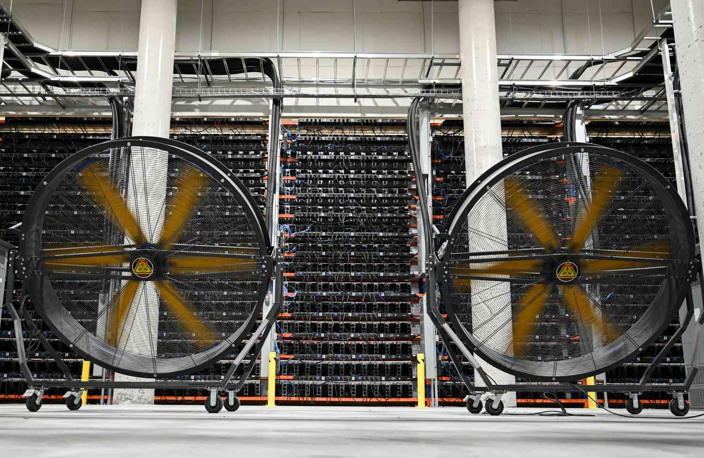

## Table of Contents

## What is Bitcoin mining?

Bitcoin mining is the process of adding new transactions to the Bitcoin digital ledger, called the blockchain. It involves solving complex mathematical puzzles using powerful computers. When a miner successfully solves a puzzle, they get to add a new block of transactions to the blockchain and are rewarded with newly created bitcoins. This process helps secure the Bitcoin network and verify transactions without needing a central authority like a bank.

Mining also helps control the supply of bitcoins. There will only ever be 21 million bitcoins in existence, and miners play a key role in releasing these bitcoins into circulation. The difficulty of the puzzles miners need to solve adjusts over time to keep the rate of new bitcoins entering the system steady, roughly every 10 minutes. This makes Bitcoin mining a competitive and energy-intensive process, but it's essential for the functioning and security of the Bitcoin network.

## How does Bitcoin mining work?

Bitcoin mining is like a puzzle game where computers try to solve hard math problems. When someone wants to send bitcoins, their transaction goes into a list called the "mempool." Miners take transactions from this list and put them into a "block." To add this block to the Bitcoin blockchain, miners need to find the right answer to a math puzzle. The first miner to solve the puzzle gets to add their block to the blockchain and earns new bitcoins as a reward.

The puzzle that miners solve is called a "hash function." It takes the data in the block and turns it into a long string of numbers and letters. Miners need to find a hash that starts with a certain number of zeros. The only way to do this is by guessing different numbers, which is why it takes a lot of computer power. Every time a miner solves a puzzle, the Bitcoin network gets a bit harder or easier to keep the time between new blocks about 10 minutes. This process keeps the Bitcoin network secure and helps control how many new bitcoins are made.

## What equipment do I need to start Bitcoin mining?

To start Bitcoin mining, you need a few pieces of equipment. The most important one is a powerful computer, specifically designed for mining. These are called ASIC miners (Application-Specific Integrated Circuit miners). They are much better at solving the math puzzles needed for mining than regular computers. You'll also need a good internet connection to stay connected to the Bitcoin network.

In addition to the hardware, you'll need some software to run your mining operation. This software helps your ASIC miner connect to the Bitcoin network and start solving puzzles. You'll also need a Bitcoin wallet to store any bitcoins you earn. Lastly, you might want to join a mining pool, which is a group of miners working together to solve puzzles. This can increase your chances of [earning](/wiki/earning-announcement) bitcoins, but you'll have to share the rewards with the pool.

## How much does it cost to start Bitcoin mining?

Starting Bitcoin mining can be pretty expensive. You'll need to buy an ASIC miner, which can cost anywhere from a few hundred to several thousand dollars. The price depends on how powerful the miner is. You'll also need to think about the cost of electricity. Mining uses a lot of power, and your electric bill can go up a lot. Some miners even move to places where electricity is cheaper to save money.

Besides the hardware and electricity, you'll need some other things. You'll need a good internet connection, which might cost extra if you don't already have one. You'll also need mining software, which is usually free, and a Bitcoin wallet to store your earnings. If you join a mining pool, there might be fees for that too. All these costs add up, so it's important to do your research and see if mining will be worth it for you.

## What is the difference between solo and pool mining?

Solo mining means you use your own computer to try and solve the math puzzles by yourself. If you solve a puzzle, you get all the new bitcoins as a reward. It's like trying to win a big prize all on your own. But it can take a long time to solve a puzzle because the puzzles are really hard, and you might not earn any bitcoins for a while.

Pool mining is when you join a group of other miners. Everyone in the group works together to solve the puzzles. When someone in the group solves a puzzle, the reward is shared among everyone. It's like being part of a team where you get smaller prizes more often. Pool mining can be a better choice if you want to earn bitcoins more regularly, but you'll have to share the rewards and pay a small fee to be part of the pool.

## How do I set up a Bitcoin mining rig?

To set up a Bitcoin mining rig, you first need to buy an ASIC miner. These are special computers made just for mining bitcoins. They can cost a lot of money, so you need to pick one that fits your budget and has good power. Once you have your ASIC miner, you'll need to set it up with the right cables and make sure it's plugged into a power source. You'll also need a good internet connection to keep your miner connected to the Bitcoin network.

Next, you'll need to download mining software. This software helps your ASIC miner talk to the Bitcoin network and start solving puzzles. You can find free mining software online. After installing the software, you need to set up a Bitcoin wallet to store any bitcoins you earn. If you want to join a mining pool, you'll need to sign up for one and connect your miner to the pool. This can help you earn bitcoins more regularly, but you'll have to share the rewards with others in the pool.

## What are the best practices for maintaining mining hardware?

Keeping your mining hardware in good shape is important to make sure it keeps working well and lasts a long time. You should clean your ASIC miner regularly to stop dust from building up inside. Dust can make your miner overheat, which can slow it down or even break it. You should also check the fans and make sure they are working properly. If a fan is not working, you should fix or replace it quickly to keep your miner cool.

It's also a good idea to keep an eye on the temperature of your mining rig. If it gets too hot, you might need to put it in a cooler place or use more fans to keep it cool. Make sure the power cables are connected tightly and not loose, because loose cables can cause your miner to stop working. Lastly, always update your mining software to the latest version. This can help your miner work better and fix any problems that might come up.

## How can I calculate the profitability of Bitcoin mining?

To figure out if Bitcoin mining will make you money, you need to look at a few things. First, you have to know how much your mining hardware costs and how much electricity it uses. Mining uses a lot of power, so your electric bill can go up a lot. You should also think about any other costs, like internet fees or joining a mining pool. Then, you can use online tools called mining calculators to see how much money you might make. These tools take into account how many bitcoins you might earn and what the price of Bitcoin is right now.

Once you have all this information, you can see if the money you make from mining will be more than what you spend on it. If it is, then mining might be a good idea for you. But remember, the price of Bitcoin can go up and down a lot, and the difficulty of mining can change too. So, it's important to keep checking to make sure mining is still worth it for you.

## What are the environmental impacts of Bitcoin mining?

Bitcoin mining uses a lot of electricity, which can be bad for the environment. The computers that mine bitcoins need to work all the time to solve hard math problems, and this uses up a lot of power. In some places, this electricity comes from burning coal or other dirty energy sources, which can make more pollution and add to climate change. People are worried about this because it means that using bitcoins could be hurting the planet.

Some miners are trying to use cleaner energy like wind or solar power to make their mining more eco-friendly. But it's still a big challenge because mining needs so much power no matter what. Governments and companies are looking for ways to make mining use less energy or find better ways to make the energy it needs. Until they figure it out, the environmental impact of Bitcoin mining is something that people will keep talking about.

## How does the Bitcoin mining difficulty adjustment work?

Bitcoin mining difficulty adjusts to keep the time it takes to find a new block about the same, around 10 minutes. This happens every 2,016 blocks, which is about every two weeks. The Bitcoin network looks at how long it took to find the last 2,016 blocks. If it took less than two weeks, the puzzles get harder. If it took more than two weeks, the puzzles get easier. This way, the network stays balanced and keeps working smoothly.

The difficulty adjustment is important because it makes sure that more miners joining the network doesn't make new blocks appear too fast. It also means that if some miners leave, the network doesn't slow down too much. By changing how hard the puzzles are, Bitcoin keeps a steady flow of new blocks and new bitcoins, which helps keep the whole system running well.

## What are the legal and tax implications of Bitcoin mining?

The legal and tax rules for Bitcoin mining can be different depending on where you live. In some places, mining is okay and seen as a way to earn money. But in other places, there might be rules or even bans on mining because of how much electricity it uses. It's important to check the laws in your area before you start mining to make sure you're not breaking any rules. Also, if you're mining as part of a business, you might need to follow special rules for businesses.

When it comes to taxes, the bitcoins you earn from mining are usually seen as income. This means you have to pay taxes on them, just like you would with money from a job. The value of the bitcoins you earn is based on what they're worth when you get them. If you sell or trade your bitcoins later, you might also have to pay capital gains tax if their value went up. It's a good idea to keep good records of your mining and any bitcoins you earn or sell, and maybe talk to a tax expert to make sure you're doing everything right.

## What advanced strategies can I use to optimize my Bitcoin mining operations?

To make your Bitcoin mining operations better, you can try a few smart ideas. One good way is to join a mining pool. This means working with other miners to solve puzzles together. When someone in the pool solves a puzzle, everyone gets a share of the reward. This can help you earn bitcoins more regularly, even if each share is smaller. Another idea is to use software that helps you switch between different mining pools based on which one is doing the best at the moment. This can help you get the most out of your mining.

Another way to optimize your mining is to pay attention to where you set up your mining rig. If you can, move it to a place where electricity is cheaper. This can save you a lot of money because mining uses a lot of power. Also, make sure your mining rig stays cool. You can do this by cleaning it often and using good fans. Keeping your equipment in good shape can help it work better and last longer. By using these strategies, you can make your Bitcoin mining more efficient and profitable.

## What are the economics of Bitcoin mining?

Bitcoin mining's profitability is a complex interplay of several key factors, with electricity costs, hardware efficiency, and Bitcoin's market price being the primary determinants. Each of these elements has a direct impact on a miner's potential earnings.

### Electricity Costs

Electricity costs are perhaps the most significant [factor](/wiki/factor-investing). Mining operations are energy-intensive, primarily due to the computational power required to solve complex algorithmic puzzles that secure the network and validate transactions. The energy cost is often measured in kilowatt-hours (kWh). As an example, if the cost of electricity is $0.10 per kWh, and a miner's setup consumes 1,500 watts (or 1.5 kW), the cost of running the miner continuously for 24 hours would be:

$$
\text{Daily Electricity Cost} = 1.5 \, \text{kW} \times 24 \, \text{hrs} \times \$0.10/\text{kWh} = \$3.60
$$

Typically, miners situated in regions with lower electricity prices have a competitive advantage. Many profitable mining operations are based in countries where electricity is subsidized or naturally cheaper.

### Hardware Efficiency

Hardware efficiency is another critical factor, referring to the amount of computational power (hash rate) a mining device can deliver for every watt of electricity consumed. Advanced ASIC miners, built specifically for Bitcoin mining, have largely replaced less efficient hardware such as GPUs and CPUs. Efficient hardware performs more computations per unit of energy, effectively lowering operating costs per Bitcoin mined. This relationship can be expressed as:

$$
\text{Efficiency} = \frac{\text{Hash Rate (TH/s)}}{\text{Power Consumption (Watts)}}
$$

Higher efficiency leads to lower energy costs per hash. Consequently, investing in modern and efficient hardware is essential, although it comes at a significant upfront cost. The constant innovation in ASIC technology means that hardware can become obsolete quickly, adding another layer of investment risk.

### Bitcoin’s Market Price

Bitcoin's market price is a major influencer of mining profitability. When the price of Bitcoin increases, the same amount of mined Bitcoin translates into higher revenue. Conversely, a decline in Bitcoin's price can render mining operations unprofitable if it falls below the operational costs. Due to Bitcoin's inherent [volatility](/wiki/volatility-trading-strategies), fluctuations in its market price can either drive miners out of business or lead to windfall profits.

### Challenges

High energy consumption and hardware costs are significant barriers to entry. For instance, mining farms, which operate vast numbers of mining rigs, often require significant capital investments for both the hardware and the infrastructural support needed to accommodate and cool the equipment.

### Difficulty Level and Block Reward Halving

The difficulty level in Bitcoin mining adjusts every two weeks to ensure that blocks are mined approximately every 10 minutes. As more miners enter the network, the difficulty increases, leading to fewer Bitcoin rewards unless additional computational power is deployed. The process of Bitcoin mining is further influenced by the halving events that occur roughly every four years, reducing the block reward by 50%. 

After the most recent halving in May 2020, the reward decreased from 12.5 to 6.25 Bitcoins per block. This reduction can impact profitability because miners must rely on transaction fees and improved efficiency to maintain earnings.

In conclusion, the economics of Bitcoin mining requires careful consideration of electricity costs, hardware efficiency, and market dynamics. Prospective miners must balance these factors to achieve a profitable operation, keeping in mind the inherent uncertainties and potential regulatory impacts in the [cryptocurrency](/wiki/cryptocurrency) landscape.

## References & Further Reading

[1]: Narayanan, A., Bonneau, J., Felten, E., Miller, A., & Goldfeder, S. (2016). ["Bitcoin and Cryptocurrency Technologies."](https://press.princeton.edu/books/hardcover/9780691171692/bitcoin-and-cryptocurrency-technologies) Princeton University Press.

[2]: Antonopoulos, A. M. (2017). ["Mastering Bitcoin: Unlocking Digital Cryptocurrencies."](https://books.google.com/books/about/Mastering_Bitcoin.html?id=IXmrBQAAQBAJ) O'Reilly Media.

[3]: Vigna, P., & Casey, M. J. (2015). ["The Age of Cryptocurrency: How Bitcoin and Digital Money Are Challenging the Global Economic Order."](https://archive.org/details/ageofcryptocurre0000vign) St. Martin's Press.

[4]: Rosenthal, E., & Gandal, N. (2018). ["Has the Growth of Bitcoin's Network Fueled Extortion Ransomware?"](https://www.sciencedirect.com/science/article/pii/S016740482100314X) Electronic Commerce Research and Applications.

[5]: Peters, G. W., & Panayi, E. (2016). ["Understanding Modern Banking Ledgers through Blockchain Technologies: Future of Transaction Processing and Smart Contracts on the Internet of Money."](https://link.springer.com/content/pdf/10.1007/978-3-319-42448-4_13.pdf) Banking Beyond Banks and Money: A Guide to Banking Services in the Twenty-First Century.