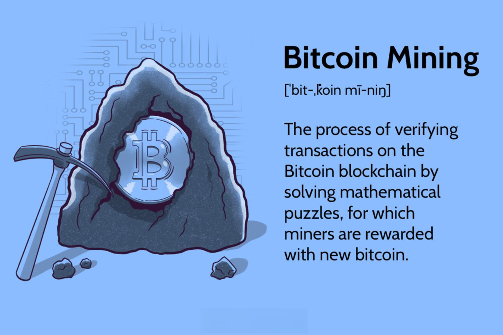

In recent years, Bitcoin mining and cryptocurrency algorithmic trading have gained immense traction in the financial and technological sectors. As digital currencies continue to shape the global economy, understanding these complex systems has become increasingly critical for investors and technology enthusiasts alike. This article serves as a comprehensive guide designed for beginners eager to explore the multifaceted world of cryptocurrencies.

Bitcoin mining, a foundational process within the cryptocurrency ecosystem, involves securing the Bitcoin network and validating transactions through the resolution of intricate mathematical problems. Miners are incentivized with both Bitcoin rewards and transaction fees, engendering an economically viable activity that necessitates a thorough understanding of its core components. From specialized hardware like ASIC (Application-Specific Integrated Circuit) miners to collaborative mining efforts via pools, the evolution of this field has dramatically shifted from its initial reliance on CPU (Central Processing Unit) mining.



Parallel to Bitcoin mining, algorithmic trading has revolutionized the manner in which trades are executed in the cryptocurrency market. This method utilizes computer programs to perform trades based on predetermined strategies, offering significant advantages such as speed, precision, and the potential to backtest various approaches before application.

This guide will share insights into how Bitcoin mining and algorithmic trading can be integrated to optimize profit margins. As a beginner, you'll gain a deeper understanding of how these two intertwined systems can be harnessed for financial gain, whether through direct investment or by mastering their technical aspects. With this foundational knowledge, you are poised to take the first step in your journey through the dynamic and evolving landscape of digital currencies.

## Table of Contents

## Understanding Bitcoin Mining

Bitcoin mining is a critical process that secures the Bitcoin network and validates transactions. This is achieved through solving complex mathematical problems using computational power. The process is fundamental to the integrity and consensus of the decentralized Bitcoin network.

Miners play a crucial role in this ecosystem by ensuring that new transactions are added to the blockchain, the distributed ledger that records all Bitcoin transactions. These transactions are grouped into blocks, and each block is linked to the previous one, forming a chain. To add a new block to the blockchain, miners must solve a cryptographic puzzle known as "proof of work." The solution to this puzzle is difficult to find but easy to verify, which ensures that adding a new block is computationally intensive yet straightforward to validate.

The reward system incentivizes miners by granting them newly minted Bitcoins and transaction fees from the transactions included in the block. This reward, initially set at 50 Bitcoins per block, undergoes a halving approximately every four years, reducing the reward by 50%. As of 2020, the reward stands at 6.25 Bitcoins per block. This halving mechanism is crucial in controlling the supply of Bitcoin, mimicking the scarcity of precious resources like gold.

### Essential Components of Bitcoin Mining

To effectively mine Bitcoin, specialized hardware is essential. Early in Bitcoin's history, mining could be conducted on personal computers using Central Processing Units (CPUs). However, as the network's difficulty level increased, Graphic Processing Units (GPUs) became necessary due to their ability to perform parallel calculations more efficiently than CPUs.

The evolution of mining hardware continued with the development of Field-Programmable Gate Arrays (FPGAs) and eventually Application-Specific Integrated Circuits (ASICs). ASIC miners are custom-built for the sole purpose of mining Bitcoin, offering significant advantages in terms of efficiency and electrical consumption compared to their predecessors. ASIC miners are currently the standard in Bitcoin mining due to their superior performance and energy efficiency.

Joining mining pools has become an essential strategy for individual miners aiming to achieve steady income. Mining pools are collaborations where multiple miners work together to solve a block's puzzle and share the rewards according to each participant's contributed computational power. This collective approach mitigates the inherent [volatility](/wiki/volatility-trading-strategies) in mining rewards, as the likelihood of successfully mining a block independently is exceedingly low given the competitive nature of the network.

### Historical Evolution of Bitcoin Mining

The history of Bitcoin mining reflects the network's growth and increased competition. Initially, Satoshi Nakamoto, Bitcoin's creator, mined the first block of Bitcoin, known as the "genesis block," using a CPU. During this period, mining was accessible to anyone with a modest computer setup. 

As Bitcoin's popularity soared, the network's mining difficulty—that is, the measure of how hard it is to find the hash below a target value—increased, necessitating more powerful hardware. This progression led to the use of GPUs and eventually the dominance of ASIC miners. Here is a simple example in Python, illustrating the hash computation, which lies at the core of mining:

```python
import hashlib

def sha256(data):
    return hashlib.sha256(data.encode('utf-8')).hexdigest()

def mine_block(block_number, transactions, previous_hash, difficulty):
    nonce = 0
    while True:
        data = f"{block_number}{transactions}{previous_hash}{nonce}"
        hash_result = sha256(data)
        if hash_result.startswith('0' * difficulty):
            return nonce, hash_result
        nonce += 1

# Example mining operation
block_number = 1
transactions = "Tx1->Tx2->Tx3"
previous_hash = "abc123"
difficulty = 4  # Represents the number of leading zeros

nonce, block_hash = mine_block(block_number, transactions, previous_hash, difficulty)
print(f"Mined block with nonce: {nonce}, hash: {block_hash}")
```

This Python script elucidates the concept behind proof of work and how miners iterate over nonces to discover a valid hash under specified difficulty. 

In conclusion, Bitcoin mining is fundamental to the Bitcoin network, evolving from simple CPUs to sophisticated ASIC machines, underscoring increased competition and securing trust through its decentralized consensus mechanism. Understanding mining's technical and historical dimensions is essential for those interested in partaking in or comprehending this cornerstone of the [cryptocurrency](/wiki/cryptocurrency) world.

## The Economics of Bitcoin Mining

Bitcoin mining's profitability is a complex interplay of several key factors, with electricity costs, hardware efficiency, and Bitcoin's market price being the primary determinants. Each of these elements has a direct impact on a miner's potential earnings.

### Electricity Costs

Electricity costs are perhaps the most significant [factor](/wiki/factor-investing). Mining operations are energy-intensive, primarily due to the computational power required to solve complex algorithmic puzzles that secure the network and validate transactions. The energy cost is often measured in kilowatt-hours (kWh). As an example, if the cost of electricity is $0.10 per kWh, and a miner's setup consumes 1,500 watts (or 1.5 kW), the cost of running the miner continuously for 24 hours would be:

$$
\text{Daily Electricity Cost} = 1.5 \, \text{kW} \times 24 \, \text{hrs} \times \$0.10/\text{kWh} = \$3.60
$$

Typically, miners situated in regions with lower electricity prices have a competitive advantage. Many profitable mining operations are based in countries where electricity is subsidized or naturally cheaper.

### Hardware Efficiency

Hardware efficiency is another critical factor, referring to the amount of computational power (hash rate) a mining device can deliver for every watt of electricity consumed. Advanced ASIC miners, built specifically for Bitcoin mining, have largely replaced less efficient hardware such as GPUs and CPUs. Efficient hardware performs more computations per unit of energy, effectively lowering operating costs per Bitcoin mined. This relationship can be expressed as:

$$
\text{Efficiency} = \frac{\text{Hash Rate (TH/s)}}{\text{Power Consumption (Watts)}}
$$

Higher efficiency leads to lower energy costs per hash. Consequently, investing in modern and efficient hardware is essential, although it comes at a significant upfront cost. The constant innovation in ASIC technology means that hardware can become obsolete quickly, adding another layer of investment risk.

### Bitcoin’s Market Price

Bitcoin's market price is a major influencer of mining profitability. When the price of Bitcoin increases, the same amount of mined Bitcoin translates into higher revenue. Conversely, a decline in Bitcoin's price can render mining operations unprofitable if it falls below the operational costs. Due to Bitcoin's inherent volatility, fluctuations in its market price can either drive miners out of business or lead to windfall profits.

### Challenges

High energy consumption and hardware costs are significant barriers to entry. For instance, mining farms, which operate vast numbers of mining rigs, often require significant capital investments for both the hardware and the infrastructural support needed to accommodate and cool the equipment.

### Difficulty Level and Block Reward Halving

The difficulty level in Bitcoin mining adjusts every two weeks to ensure that blocks are mined approximately every 10 minutes. As more miners enter the network, the difficulty increases, leading to fewer Bitcoin rewards unless additional computational power is deployed. The process of Bitcoin mining is further influenced by the halving events that occur roughly every four years, reducing the block reward by 50%. 

After the most recent halving in May 2020, the reward decreased from 12.5 to 6.25 Bitcoins per block. This reduction can impact profitability because miners must rely on transaction fees and improved efficiency to maintain earnings.

In conclusion, the economics of Bitcoin mining requires careful consideration of electricity costs, hardware efficiency, and market dynamics. Prospective miners must balance these factors to achieve a profitable operation, keeping in mind the inherent uncertainties and potential regulatory impacts in the cryptocurrency landscape.

## Algorithmic Trading in Cryptocurrency

Algorithmic trading in cryptocurrency involves the implementation of computer programs designed to execute buy or sell orders when certain market conditions are met. This type of trading leverages complex mathematical models and algorithms to make high-speed decisions about market transactions, often analyzing multiple markets and instruments at once. It allows traders to execute orders faster and more efficiently than manual trading, while also removing human emotions from trading decisions.

The advantages of [algorithmic trading](/wiki/algorithmic-trading) are numerous. Speed is a significant factor; algorithms can scan and react to market conditions in a fraction of a second, much faster than a human could. This speed is crucial in the cryptocurrency market, which operates 24/7 and is known for its volatility. Accuracy is another critical advantage, as algorithms can be programmed to follow precise trading instructions. This precision ensures that orders are executed at the desired price levels and times, reducing the chance of mistakes caused by human error.

One of the most valuable features of algorithmic trading is the capability to backtest trading strategies. Traders can apply historical market data to their trading algorithms to see how they would have performed in past market conditions. This testing helps refine strategies, optimize performance, and improve profitability before deploying the algorithm in real markets.

Different types of trading algorithms can be developed, depending on the strategy and goals of the trader. Some common types include:

1. ** Market-Making Algorithms**: These algorithms provide liquidity to the market by placing both buy and sell orders simultaneously. They aim to profit from the bid-ask spread when the orders are filled.

2. **Arbitrage Algorithms**: These algorithms exploit price discrepancies of identical or similar financial instruments on different markets or exchanges. By buying low in one market and selling high in another, traders can profit from the difference.

3. **Trend-Following Algorithms**: These algorithms attempt to capitalize on market trends by buying when prices are rising and selling when they are falling. They use indicators such as moving averages to determine market trends.

4. **Mean Reversion Algorithms**: Based on the idea that prices will revert to their mean over time, these algorithms seek to profit by buying low and selling high.

For those interested in developing their algorithmic trading strategies, Python is a popular programming language due to its extensive libraries and frameworks specifically built for data analysis and finance, such as Pandas, NumPy, and TA-Lib. Here's a simple example of a [momentum](/wiki/momentum)-based trading strategy in Python using a popular [pair trading](/wiki/pair-trading) method:

```python
import pandas as pd

# Load price data
data = pd.read_csv('historical_price_data.csv')
data['Returns'] = data['Close'].pct_change()

# Calculate 20-day rolling mean and standard deviation
data['Rolling_Mean'] = data['Returns'].rolling(window=20).mean()
data['Rolling_Std_Dev'] = data['Returns'].rolling(window=20).std()

# Momentum Strategy: Buy when Returns is above the mean, Sell when below
data['Position'] = 0
data.loc[data['Returns'] > data['Rolling_Mean'], 'Position'] = 1
data.loc[data['Returns'] < data['Rolling_Mean'], 'Position'] = -1

# Calculate strategy returns
data['Strategy_Returns'] = data['Position'].shift(1) * data['Returns']

# Plot cumulative returns of strategy vs actual
data[['Returns', 'Strategy_Returns']].cumsum().apply(np.exp).plot()
plt.title('Momentum Trading Strategy Returns')
plt.show()
```

In summary, algorithmic trading offers significant advantages for cryptocurrency markets, providing traders with speed, accuracy, and the ability to extensively test their strategies. As technology continues to evolve, so will the sophistication and accessibility of algorithmic trading tools, offering traders even more innovative ways to interact with and profit from the cryptocurrency market.

## Integrating Mining and Algo Trading

Combining Bitcoin mining and algorithmic trading can offer a strategic advantage for individuals aiming to maximize profitability in the cryptocurrency market. This synergy stems from the complementary nature of these activities, where mining generates Bitcoin and trading strategies can be employed to manage and potentially increase the value of these gains.

Bitcoin mining involves generating new Bitcoins by participating in the validation of transactions on the blockchain, thus [earning](/wiki/earning-announcement) rewards in the form of newly minted Bitcoin as well as transaction fees. This process provides a steady accumulation of Bitcoin, subject to the fluctuations of its market price. Algorithmic trading, on the other hand, employs predefined strategies using computer algorithms to execute trades on various cryptocurrency exchanges. By leveraging the speed and efficiency of machines, traders can capitalize on market opportunities, such as volatility and [arbitrage](/wiki/arbitrage), with reduced emotional bias and human error.

The integration of mining and trading can be structured in several ways. For example, miners can employ algorithmic trading to manage their Bitcoin holdings more effectively. Mining rewards can be automatically transferred and traded based on market signals, optimizing the timing and conditions for selling, holding, or even converting to other cryptocurrencies. Rapid adjustments to market conditions using high-frequency trading or arbitrage strategies can help ensure that the proceeds from mining are used strategically.

Furthermore, miners can utilize algorithmic strategies to hedge against market volatility. Given the dynamic nature of Bitcoin's market, where prices can fluctuate significantly, hedging can protect miners from downside risk. For instance, setting up an algorithmic strategy that short-sells Bitcoin futures contracts while mining can offset potential declines in Bitcoin's spot price, stabilizing income.

Incorporating trading algorithms into the mining process can also provide insights through [backtesting](/wiki/backtesting) strategies. By analyzing historical data, a miner-trader can evaluate the effectiveness of various strategies under different market conditions, thus refining their approach over time. This adaptability is crucial in a rapidly changing market, where strategies that were once successful may become obsolete.

Overall, the combination of Bitcoin mining with algorithmic trading presents a powerful approach to cryptocurrency investment, enabling users to not only produce digital assets but also to enhance their value actively. It is crucial, however, to consider the development and maintenance costs associated with algorithmic trading systems, as well as the potential risks of unforeseen market events, when designing such integrated strategies.

## Avoiding Scams and Best Practices

The cryptocurrency market is increasingly targeted by scams, making it essential for participants to exercise caution. For miners, the risk begins with selecting a reliable mining pool. A mining pool combines the resources of multiple miners to increase the probability of discovering new blocks and earning rewards. To identify a trustworthy mining pool, consider factors such as pool fees, payout schemes, transparency, and user reviews. Websites like [BTC.com](https://btc.com/stats/pool) and [CryptoCompare](https://www.cryptocompare.com/mining/pools/) provide valuable insights into various mining pools, assisting miners in making informed decisions.

Fake wallets are another significant threat in this space. To avoid scams, choose wallets that are well-reviewed and endorsed by the community. Ensure the wallet has essential security features like two-factor authentication and private key encryption. Opt for wallets listed on trusted repositories such as [Bitcoin.org](https://bitcoin.org/en/choose-your-wallet) that recommend secure wallet options based on user needs.

Traders need to be wary of fraudulent trading platforms and false investment schemes. Conduct thorough due diligence by researching the platform's history, user feedback, and regulatory compliance. Trustworthy platforms will typically be registered with financial authorities in their operating countries, enhancing their credibility. Tools like [CoinMarketCap](https://coinmarketcap.com/rankings/exchanges/) offer lists and rankings of exchanges based on [volume](/wiki/volume-trading-strategy) and reliability.

Securing digital assets is crucial for both miners and traders. Implement robust security measures, such as utilizing hardware wallets for storing cryptocurrency securely offline, thereby preventing unauthorized access via hacking. Regularly update software wallets and applications to protect against vulnerabilities and exploits.

Applying best practices involves maintaining a vigilant and informed approach. Always question offers that seem too good to be true, as they often are. Engage with legitimate educational resources and forums like [BitcoinTalk](https://bitcointalk.org/) to stay updated on recent scams and protective strategies. This proactive stance, alongside continuous learning, fortifies one's defenses against crypto scams.

## The Future of Bitcoin Mining and Algo Trading

The future of Bitcoin mining and algorithmic trading is poised for significant evolution, guided by both technological advancements and regulatory developments. One major trend is the increasing attention to environmental concerns. Traditional Bitcoin mining consumes a substantial amount of electricity, prompting criticism over its environmental impact. This has led to interest in alternative consensus mechanisms like proof-of-stake (PoS) that require less energy. PoS reduces the computational burden naturally inherent in mining by replacing the proof-of-work requirement with a staking of existing coins to validate transactions, thereby potentially decreasing the ecological footprint.

Blockchain technology is also seeing advancements through improved hardware and energy-efficient algorithms. The emergence of more energy-efficient ASIC (Application-Specific Integrated Circuit) miners is part of this shift. For instance, these newer ASICs are being designed to maximize the ratio of hashes per second to watts consumed, thus optimizing performance while lowering electricity costs. However, it should be noted that Bitcoin's protocol fundamentally relies on proof-of-work, which means these advancements can only alleviate rather than eliminate environmental concerns within the current framework.

Algorithmic trading in cryptocurrencies is expected to grow more sophisticated, leveraging [artificial intelligence](/wiki/ai-artificial-intelligence) and [machine learning](/wiki/machine-learning) to predict market movements with higher precision. The ability of these algorithms to quickly react to market changes and execute trades can lead to improved efficiency and profitability. Moreover, the development of decentralized finance (DeFi) platforms introduces opportunities for constructing automated trading strategies that integrate various financial instruments without needing traditional intermediaries.

The regulatory landscape for Bitcoin mining and algorithmic trading is continuously evolving. Governments worldwide are beginning to implement regulations to address the environmental impact, security concerns, and potential for financial malpractice in cryptocurrency markets. For example, the European Union’s proposed Markets in Crypto-Assets regulation aims to create a comprehensive regulatory framework for crypto-assets, impacting how trading and mining operations are conducted.

Moreover, regulations can influence the geographical distribution of mining operations. Jurisdictions offering favorable regulatory environments and access to renewable energy sources could see an increase in mining activity. Conversely, stringent regulations could lead to shifts in location or closures of less compliant operations.

Overall, the future of Bitcoin mining and algorithmic trading will be shaped by the necessity to balance profitability with sustainability and compliance, transforming how these activities are integrated into the broader financial ecosystem. The role of technology and regulation will be central, requiring ongoing adaptation and innovation.

## Conclusion

Bitcoin mining and cryptocurrency algorithmic trading present lucrative opportunities for individuals who are well-informed and proactive. Both activities require a comprehensive understanding of the underlying technologies and economic principles to maximize potential benefits. Incorporating robust security measures is paramount, given the vulnerabilities associated with digital currencies. This involves employing advanced encryption techniques, using secure wallets, and participating in reputable mining pools and exchanges.

Understanding the economic aspects—such as electricity costs, hardware investments, and market dynamics—is crucial for anyone involved in Bitcoin mining. These factors directly influence profitability and necessitate careful financial planning and analysis. Algorithmic trading also demands a grasp of market data analytics and trading strategies. Leveraging technology, including high-performance computing solutions and sophisticated trading algorithms, can significantly enhance outcomes.

Continuous learning is indispensable to navigate and succeed in the rapidly evolving cryptocurrency landscape. The field is characterized by swift technological and regulatory changes, requiring enthusiasts and investors to stay updated on the latest trends and advancements. Engaging with educational resources, forums, and professional networks can facilitate this ongoing learning process, enabling individuals to adapt and thrive in the changing environment of digital currencies.

## References & Further Reading

[1]: Narayanan, A., Bonneau, J., Felten, E., Miller, A., & Goldfeder, S. (2016). ["Bitcoin and Cryptocurrency Technologies."](https://press.princeton.edu/books/hardcover/9780691171692/bitcoin-and-cryptocurrency-technologies) Princeton University Press.

[2]: Antonopoulos, A. M. (2017). ["Mastering Bitcoin: Unlocking Digital Cryptocurrencies."](https://books.google.com/books/about/Mastering_Bitcoin.html?id=IXmrBQAAQBAJ) O'Reilly Media.

[3]: Vigna, P., & Casey, M. J. (2015). ["The Age of Cryptocurrency: How Bitcoin and Digital Money Are Challenging the Global Economic Order."](https://archive.org/details/ageofcryptocurre0000vign) St. Martin's Press.

[4]: Rosenthal, E., & Gandal, N. (2018). ["Has the Growth of Bitcoin's Network Fueled Extortion Ransomware?"](https://www.sciencedirect.com/science/article/pii/S016740482100314X) Electronic Commerce Research and Applications.

[5]: Peters, G. W., & Panayi, E. (2016). ["Understanding Modern Banking Ledgers through Blockchain Technologies: Future of Transaction Processing and Smart Contracts on the Internet of Money."](https://link.springer.com/content/pdf/10.1007/978-3-319-42448-4_13.pdf) Banking Beyond Banks and Money: A Guide to Banking Services in the Twenty-First Century.