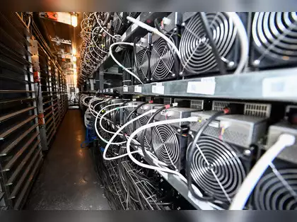

## Table of Contents

## What is Bitcoin mining?

Bitcoin mining is the process of adding new transactions to the Bitcoin blockchain and releasing new bitcoins into circulation. It's like being a digital accountant who verifies and records transactions in a big public ledger. Miners use powerful computers to solve complex math problems, and when they solve one, they get to add a new block of transactions to the blockchain. This not only helps keep the Bitcoin network secure but also introduces new bitcoins into the system.

The math problems that miners solve are part of what's called a proof-of-work system. This system makes it hard for anyone to cheat or change the blockchain because it would require solving the same problems all over again, which takes a lot of time and energy. Miners compete to solve these problems first because the winner gets to add the new block and earns a reward in bitcoins. This reward is how new bitcoins are created, and it's also an incentive for miners to keep the network running smoothly.

## Why is Bitcoin mining necessary?

Bitcoin mining is necessary because it helps keep the Bitcoin network secure and working properly. Imagine the blockchain as a big, public notebook where all Bitcoin transactions are written down. Miners are like the guardians of this notebook. They check each transaction to make sure it's real and then add it to the notebook. This process stops people from cheating or spending the same Bitcoin twice.

Also, mining is how new bitcoins are made. When miners solve hard math problems, they get to add a new page to the notebook and earn some bitcoins as a reward. This reward is important because it encourages miners to keep doing their job. Without mining, there would be no new bitcoins, and the network might not be as safe or reliable.

## How does the Bitcoin mining process work?

Bitcoin mining is like solving a puzzle to add new transactions to the Bitcoin blockchain. Miners use powerful computers to solve complex math problems. When a miner solves a problem, they get to add a new block of transactions to the blockchain. This new block is like a page in a big notebook where all Bitcoin transactions are recorded. Every time a miner adds a new block, they get a reward in bitcoins. This reward is how new bitcoins are created and it encourages miners to keep working.

The math problems miners solve are part of a system called proof-of-work. This system makes it hard for anyone to cheat or change the blockchain because it would require solving the same problems all over again. Miners compete to solve these problems first because the winner gets to add the new block and earn the bitcoin reward. This competition helps keep the Bitcoin network secure and running smoothly. Without miners solving these problems, the network wouldn't be able to add new transactions or create new bitcoins.

## What is the role of miners in the Bitcoin network?

Miners play a crucial role in the Bitcoin network. They are like the helpers who make sure all the transactions are correct and added to the big public notebook called the blockchain. Miners use special computers to solve hard math problems. When they solve a problem, they get to add a new page of transactions to the notebook. This helps keep the Bitcoin system running smoothly and safely.

Another important job of miners is to create new bitcoins. Every time a miner adds a new page to the notebook, they get a reward in bitcoins. This reward is how new bitcoins come into the world. It also encourages miners to keep working hard. Without miners, there would be no new bitcoins, and the network might not be as safe or reliable.

## What hardware is required for Bitcoin mining?

To mine Bitcoin, you need special computer hardware that can handle the tough math problems involved. In the beginning, people used regular computers, but now you need something more powerful. The most common hardware used today is called an ASIC, which stands for Application-Specific Integrated Circuit. These machines are made just for mining and are much faster and more efficient than regular computers.

Besides the ASIC, you also need other things to set up your mining operation. You'll need a good power supply to keep your ASIC running, and a cooling system to keep it from getting too hot. You'll also need a computer to connect to the Bitcoin network and a wallet to store your mining rewards. All these parts together help you mine Bitcoin effectively and earn those rewards.

## How does one set up a Bitcoin mining rig?

Setting up a Bitcoin mining rig starts with getting the right hardware. You'll need an ASIC miner, which is a special computer made just for mining Bitcoin. These machines are more powerful and efficient than regular computers. Along with the ASIC, you'll need a good power supply to keep it running, and a cooling system to make sure it doesn't get too hot. You'll also need a regular computer to connect to the Bitcoin network and a Bitcoin wallet to store the bitcoins you earn from mining.

Once you have all your hardware, you can start putting everything together. First, connect your ASIC miner to the power supply and make sure it's getting enough electricity. Then, set up your cooling system to keep the ASIC from overheating. Next, connect your ASIC to your computer using a network cable or Wi-Fi. You'll need to install mining software on your computer, which will let you join a mining pool or mine on your own. Finally, set up your Bitcoin wallet to receive the bitcoins you earn. Once everything is connected and running, your mining rig is ready to start solving those math problems and earning rewards.

## What is the difference between solo mining and pool mining?

Solo mining is when you mine Bitcoin all by yourself. You use your own mining rig to solve math problems and try to add new blocks to the Bitcoin blockchain. If you're lucky and solve a problem first, you get to keep the whole reward for yourself. But solo mining can be hard because the math problems are really tough, and it might take a long time to solve one. It's like trying to win a big prize all on your own, but the chances are small.

Pool mining is different because you work together with other miners. You join a group, called a mining pool, where everyone works together to solve the math problems. When the group solves a problem and adds a new block, the reward is shared among everyone in the pool. This way, you get smaller rewards more often, which can be easier than waiting a long time for a big reward in solo mining. Pool mining is like working on a team to win smaller prizes more often, making it a bit easier and more reliable.

## How is the mining difficulty adjusted in Bitcoin?

The mining difficulty in Bitcoin is adjusted to keep the time it takes to add a new block to the blockchain about the same, around 10 minutes. This happens automatically every 2,016 blocks, which is about every two weeks. The Bitcoin system looks at how long it took to add the last 2,016 blocks. If it was faster than 10 minutes on average, the difficulty goes up to make the math problems harder. If it was slower, the difficulty goes down to make the problems easier.

This adjustment helps keep the Bitcoin network running smoothly. It makes sure that even if more miners join or if they get better equipment, the time to add new blocks stays about the same. By changing the difficulty, Bitcoin keeps a steady pace of adding new blocks and creating new bitcoins, which is important for the whole system to work well.

## What are the energy consumption concerns associated with Bitcoin mining?

Bitcoin mining uses a lot of energy because miners need powerful computers that run all the time to solve hard math problems. These computers use a lot of electricity, and when many miners around the world are doing this, it adds up to a big amount of energy. Some people worry that this energy could be used for other important things, like powering homes or businesses. They also worry about the environmental impact because a lot of the energy used for mining comes from sources that create pollution, like coal or natural gas.

To address these concerns, some miners are trying to use cleaner energy sources, like solar or wind power, to run their mining operations. This can help reduce the environmental impact of mining. However, even with these efforts, the total energy used by Bitcoin mining is still very high. It's a big challenge to balance the need for mining to keep the Bitcoin network secure with the need to use energy in a way that's good for the planet.

## How profitable is Bitcoin mining and what factors affect profitability?

Bitcoin mining can be profitable, but it depends on many things. The main thing that affects how much money you can make is the price of Bitcoin. If the price is high, the rewards you get for mining can be worth a lot more. But if the price goes down, your rewards might not be worth as much. Another big factor is the cost of electricity. Mining uses a lot of power, so if electricity is cheap where you live, you can make more money. But if it's expensive, it might cost more to mine than you earn.

There are other things that can change how much profit you make, too. The difficulty of mining is one of them. If a lot of people are mining, the problems get harder, and it takes more work to earn the same reward. Also, the kind of mining hardware you use matters. Newer, more powerful machines can solve problems faster and earn more rewards, but they also cost more money to buy. Joining a mining pool can help you earn rewards more often, but you have to share them with others, which might mean less money for you. So, to figure out if mining is worth it, you need to think about all these things together.

## What are the environmental impacts of Bitcoin mining?

Bitcoin mining uses a lot of energy because miners need powerful computers that run all the time to solve hard math problems. These computers use a lot of electricity, and when many miners around the world are doing this, it adds up to a big amount of energy. Some people worry that this energy could be used for other important things, like powering homes or businesses. They also worry about the environmental impact because a lot of the energy used for mining comes from sources that create pollution, like coal or natural gas. This pollution can harm the air, water, and the planet.

To address these concerns, some miners are trying to use cleaner energy sources, like solar or wind power, to run their mining operations. This can help reduce the environmental impact of mining. However, even with these efforts, the total energy used by Bitcoin mining is still very high. It's a big challenge to balance the need for mining to keep the Bitcoin network secure with the need to use energy in a way that's good for the planet. Finding a solution that works for both the environment and the Bitcoin network is important for the future.

## What future developments could affect the Bitcoin mining process?

In the future, new technology might change how Bitcoin mining works. One big change could be better and more efficient mining machines. Right now, miners use ASICs, which are made just for mining. But if new machines come out that use less power and solve problems faster, mining could become easier and cheaper. Also, if more miners start using clean energy like solar or wind power, it could help the environment. This would make mining better for the planet and might make people feel better about using Bitcoin.

Another thing that could change is the way Bitcoin mining works. Right now, miners use a system called proof-of-work, where they solve hard math problems to add new blocks to the blockchain. But some people are talking about switching to a different system called proof-of-stake. In proof-of-stake, miners don't need to solve math problems. Instead, they get to add new blocks based on how many bitcoins they already have. This could use a lot less energy and be better for the environment. If Bitcoin switches to proof-of-stake, the whole mining process would be different, and it might change who can mine and how much money they can make.

## References & Further Reading

[1]: Narayanan, A., Bonneau, J., Felten, E., Miller, A., & Goldfeder, S. (2016). ["Bitcoin and Cryptocurrency Technologies: A Comprehensive Introduction."](https://press.princeton.edu/books/hardcover/9780691171692/bitcoin-and-cryptocurrency-technologies) Princeton University Press.

[2]: Antonopoulos, A. M. (2017). ["Mastering Bitcoin: Unlocking Digital Cryptocurrencies."](https://books.google.com/books/about/Mastering_Bitcoin.html?id=IXmrBQAAQBAJ) O'Reilly Media.

[3]: Zohar, A. (2015). ["Bitcoin: under the hood."](https://dl.acm.org/doi/10.1145/2701411) Communications of the ACM, 58(9), 104-113.

[4]: De Vries, A. (2018). ["Bitcoin’s growing energy problem."](https://www.sciencedirect.com/science/article/pii/S2542435118301776)30225-7) Joule, 2(5), 801-805.

[5]: Matta, M., Lunesu, M. I., & Marchesi, M. (2015). ["Bitcoin Mining Algorithm - An Overview."](https://ieeexplore.ieee.org/document/7397135) In 2015 10th International Conference on P2P, Parallel, Grid, Cloud and Internet Computing (3PGCIC) (pp. 633-638). IEEE.

[6]: Peters, G. W., & Panayi, E. (2016). ["Understanding Modern Banking Ledgers through Blockchain Technologies: Future of Transaction Processing and Smart Contracts on the Internet of Money."](https://papers.ssrn.com/sol3/papers.cfm?abstract_id=2692487) In Banking beyond banks and money (pp. 239-278). Springer, Cham.

[7]: Chen, L., Xu, L., Shah, N., Gao, Z., Lu, Y., & Shi, W. (2017). ["On security analysis of proof-of-elapsed-time (PoET)."](https://link.springer.com/chapter/10.1007/978-3-319-69084-1_19) In International Symposium on Stabilization, Safety, and Security of Distributed Systems (pp. 282-297). Springer, Cham.

[8]: ["Machine Learning for Algorithmic Trading"](https://github.com/PacktPublishing/Machine-Learning-for-Algorithmic-Trading-Second-Edition) by Stefan Jansen.

[9]: ["Advances in Financial Machine Learning"](https://www.amazon.com/Advances-Financial-Machine-Learning-Marcos/dp/1119482089) by Marcos Lopez de Prado.

[10]: ["Quantitative Trading: How to Build Your Own Algorithmic Trading Business"](https://books.google.com/books/about/Quantitative_Trading.html?id=j70yEAAAQBAJ) by Ernest P. Chan.