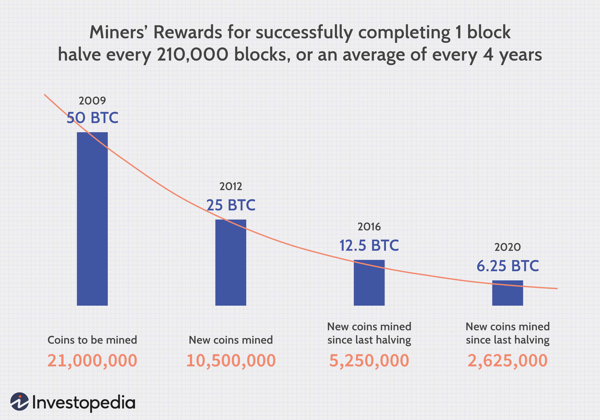

Bitcoin and other cryptocurrencies have significantly reshaped the financial landscape since Bitcoin's inception in 2009. These digital currencies offer an alternative to traditional fiat currencies by enabling decentralized, peer-to-peer transactions across borders. The core of this transformation lies in two fundamental activities within the cryptocurrency ecosystem: mining and algorithmic trading. Cryptocurrency mining, particularly Bitcoin mining, involves the validation and recording of transactions on the blockchain, which are crucial for the network's function and security. Miners solve complex cryptographic puzzles using specialized hardware, earning cryptocurrency rewards for their efforts. This task, however, is not without challenges such as competitive intensity and significant energy demands, making cost-efficiency an essential consideration for miners.

Simultaneously, algorithmic trading has emerged as a pivotal element of the cryptocurrency market, providing automated strategies to trade assets. Market participants leverage advanced algorithms and machine learning techniques to exploit market inefficiencies and trends, aiming for optimized trading outcomes. The intersection of mining and algorithmic trading offers participants a complex landscape of both opportunities and challenges. Profitability in mining and trading hinges on technology, energy consumption, market volatility, legal frameworks, and evolving sustainability considerations.



This article aims to explore these intricacies, presenting insights into the operational mechanisms of Bitcoin mining and the application of algorithmic trading within cryptocurrencies. By dissecting these elements, readers will gain a comprehensive understanding of the current practices, profitability, and sustainability potential within the cryptocurrency domain.

## Table of Contents

## Understanding Bitcoin Mining

Bitcoin mining is a fundamental process that underpins the Bitcoin network by verifying and adding transaction records to the blockchain. This process involves participants known as miners who compete to solve complex cryptographic puzzles, known as proof-of-work, to validate transactions. The successful miner is rewarded with newly minted Bitcoin and transaction fees, incentivizing them to continue supporting the network.

### Mining Hardware: ASICs and GPUs

Miners employ specialized hardware to handle the computational demands of these puzzles. Initially, mining was performed using central processing units (CPUs) on personal computers. However, as the network grew and competition increased, more powerful hardware became necessary. This led to the adoption of graphics processing units (GPUs), which are capable of executing multiple operations simultaneously, vastly improving mining efficiency.

The evolution of mining hardware continued with the development of application-specific integrated circuits (ASICs). These devices are custom-built solely for the purpose of mining, offering superior performance and energy efficiency compared to GPUs and CPUs. The decision between using an ASIC or a GPU largely depends on the coin being mined, the initial capital investment, and operational considerations.

### Energy Consumption and Environmental Impact

The intense computational power required for Bitcoin mining results in significant electricity consumption. According to the Cambridge Centre for Alternative Finance, Bitcoin's energy consumption rivals that of some small countries. This has led to increased scrutiny around the environmental impact of mining operations, particularly concerning carbon emissions and the sustainability of electricity sources.

Miners often seek regions with low-cost electricity and favorable climates to reduce cooling costs and maximize profitability. Consequently, regions with abundant renewable energy resources, such as hydropower in Iceland and Sichuan, China, are popular for mining operations. However, as environmental concerns grow, there is a push for greater reliance on renewable energy sources to power mining activities.

### Legal Considerations

The legal landscape surrounding Bitcoin mining varies across jurisdictions. Some countries embrace [cryptocurrency](/wiki/cryptocurrency) mining, recognizing it as a legitimate industry, while others have imposed restrictions or outright bans due to concerns over energy consumption, illegal activities, and financial stability.

Regulations also dictate the legal standing of mining-related activities, such as the classification of mined bitcoins for tax purposes and the permitting process for setting up mining operations. Miners must navigate these regulatory frameworks to ensure compliance and the long-term viability of their activities.

### Conclusion

Bitcoin mining is a critical aspect of the cryptocurrency ecosystem, facilitating the decentralized verification and integrity of transactions. Technological advancements in mining hardware, along with the increasing competitiveness, necessitate continuous innovation and adaptation from miners. However, the significant energy consumption and varying regulatory environments pose substantial challenges that miners must address to ensure sustainable and legal operations.

## The Role and Mechanics of Cryptocurrency Mining

Cryptocurrency mining, particularly in the context of Bitcoin, plays a critical role in maintaining the network's integrity and efficiency. This process safeguards the network by verifying transactions and ensuring the prevention of double spending, a potential flaw where the same digital token could be spent more than once. Miners are responsible for adding new transaction records, called blocks, to Bitcoin's public ledger or blockchain, a task that involves computational problem-solving.

This computational process is grounded in the consensus mechanism known as proof-of-work (PoW). PoW requires miners to solve complex mathematical puzzles, which inherently require significant computational effort. The first miner to solve the puzzle gets the right to add a new block of transactions to the blockchain and is rewarded with newly minted Bitcoin, commonly known as the block reward. This reward system incentivizes miners to continually support the network's operation.

A notable concept within this reward system is the "halving" phenomenon. Bitcoin's protocol is designed to reduce block rewards by half approximately every four years, an event known as Bitcoin Halving. This mechanism ensures scarcity by capping the total supply of Bitcoin at 21 million coins. For instance, the block reward started at 50 BTC in 2009, reducing to 25 BTC by 2012, 12.5 BTC in 2016, and further to 6.25 BTC in 2020. Halving events occur approximately every 210,000 blocks and are crucial for maintaining Bitcoin's deflationary nature.

Given the increasing complexity and resource-intensive nature of mining, many individual miners have shifted towards participating in mining pools. A mining pool is a collaborative group of miners who combine their computational resources to increase their chances of solving PoW puzzles and [earning](/wiki/earning-announcement) block rewards. When a pooled effort leads to a block being mined, the reward is distributed among participants based on the computational power they contributed. This system allows for more consistent earnings than solo mining, albeit typically smaller per miner.

However, individual mining is not entirely obsolete. It offers the potential for greater rewards per block mined, but the likelihood of successfully mining a block single-handedly is significantly lower compared to a pool. The trade-off between these two approaches—individual mining versus pooling—depends on the miner’s available resources, the scale of operation, and the [volatility](/wiki/volatility-trading-strategies) of Bitcoin's mining difficulty, which adjusts approximately every two weeks to maintain a stable block production rate.

The importance of these mechanics cannot be overstated, as they collectively ensure the decentralization and security of the Bitcoin network, facilitating a robust environment that discourages malicious activities such as double spending and provides an economically viable model for miners.

## Challenges and Downsides of Mining

Bitcoin mining presents several challenges and downsides that impact its profitability and sustainability. One of the primary challenges is the substantial initial investment required for specialized hardware and the associated electricity costs. The competitiveness of Bitcoin mining necessitates the use of high-performance equipment, such as Application-Specific Integrated Circuits (ASICs), which are costly and consume significant amounts of power.

Mining difficulty, a measure of how hard it is to find a new block, also plays a crucial role in determining profitability. As more miners join the network, the difficulty increases to ensure that blocks are found approximately every 10 minutes. This escalation can negatively affect profits, as higher difficulty levels require more computational power and energy consumption without a corresponding increase in Bitcoin rewards.

The environmental impacts of Bitcoin mining are another area of concern. The high energy consumption associated with mining has been criticized for its carbon footprint, especially when powered by non-renewable energy sources. Additionally, the rapid advancement of mining hardware technology leads to the frequent obsolescence of equipment, contributing to electronic waste. Proper disposal and recycling of outdated hardware are needed to mitigate this issue.

Several factors affect the profitability of Bitcoin mining, including the price of Bitcoin, block rewards, and the cost of electricity. Fluctuations in Bitcoin's market value can lead to volatile profits, while changes in electricity prices can significantly impact operational costs. Furthermore, the periodic halving of block rewards—where the amount of Bitcoin awarded for mining a block is reduced by half—directly influences miners' revenues and necessitates a reevaluation of their business strategies.

## Algorithmic Trading in Bitcoin and Cryptocurrency

Algorithmic trading, often referred to as algo trading, has gained significant traction in the cryptocurrency markets due to its efficiency and speed in executing trades. By employing pre-programmed instructions or algorithms to automate trading, participants can capitalize on market opportunities with minimal manual intervention. The adoption of [algorithmic trading](/wiki/algorithmic-trading) in cryptocurrencies, such as Bitcoin, is driven by the market's 24/7 operation, high volatility, and the potential for substantial profits.

### The Use of AI and Machine Learning

Artificial Intelligence (AI) and [machine learning](/wiki/machine-learning) play a crucial role in refining algorithmic trading strategies. These technologies analyze large datasets to discern market patterns and trends, enhancing predictive accuracy. For example, neural networks can forecast price movements by identifying hidden signals within data, thereby enabling traders to make informed decisions. Machine learning algorithms can adapt to changing market conditions by continuously learning from historical data, optimizing trading strategies in real-time.

A typical machine learning approach might involve features like historical prices, trading [volume](/wiki/volume-trading-strategy), and market sentiment extracted from social media, which can be processed as follows using Python:

```python
from sklearn.model_selection import train_test_split
from sklearn.linear_model import LinearRegression
import pandas as pd

data = pd.read_csv('crypto_market_data.csv')
features = data[['historical_prices', 'volume', 'sentiment']]
target = data['future_prices']

X_train, X_test, y_train, y_test = train_test_split(features, target, test_size=0.2, random_state=42)

model = LinearRegression()
model.fit(X_train, y_train)

predictions = model.predict(X_test)
```

### Types of Trading Bots and Strategies

Trading bots are programmed to execute trades based on predefined criteria. These bots range from simple tools that react to market movements to sophisticated systems employing AI for complex decision-making. Commonly used strategies include:

1. **Market Making**: Bots place simultaneous buy and sell orders to profit from the bid-ask spread. This strategy requires meticulous timing and fast execution.

2. **Arbitrage**: Bots exploit price differences of the same asset across different exchanges. By simultaneously buying and selling the asset, traders secure profit from the discrepancy.

3. **Trend Following**: Bots capitalize on established market trends. By identifying and riding these trends, they aim to achieve gains before the market reverses.

4. **Mean Reversion**: Bots assume that prices will revert to a mean or average and execute trades when an asset deviates from its established price range.

### The Role of Consensus Algorithms

In the context of cryptocurrency trading, consensus algorithms, such as Proof of Work (PoW) and Proof of Stake (PoS), primarily ensure network security rather than directly influencing trading. However, understanding these mechanisms is crucial for traders, as they affect the blockchain's transaction speed and fee structure, thereby impacting market dynamics.

In conclusion, algorithmic trading offers robust opportunities for participants in the cryptocurrency market. By leveraging AI and machine learning, traders can enhance their strategies and execution speeds. The diverse range of trading bots and strategies enables traders to select approaches tailored to their risk tolerance and market outlook, while a thorough understanding of consensus algorithms informs a comprehensive trading strategy.

## Combining Mining and Algo Trading for Maximum Benefit

Mining and algorithmic trading can be strategically combined to maximize returns in the cryptocurrency market. By leveraging the distinct nature of both activities, participants can enhance their profitability while managing inherent risks.

Incorporating algorithmic trading into cryptocurrency mining exploits the fact that both activities are deeply rooted in computational processes. While mining focuses on solving cryptographic puzzles, algorithmic trading relies on complex data analyses to identify trends and execute trades. By aligning the financial returns of mining with market strategies of algorithmic trading, individuals and firms can create a synergetic investment approach.

### Strategies for Enhanced Profitability

1. **Dynamic Mining Allocation**: One potential strategy is employing algorithmic models to dynamically allocate computational resources for mining based on prevailing market conditions. This involves using predictive analytics to forecast Bitcoin prices and adjusting mining operations accordingly. For instance, when indicators suggest a bullish market, miners could increase their hash rate to maximize Bitcoin generation ahead of potential price surges.

2. **Arbitrage Opportunities**: Combining mining with algorithmic trading offers arbitrage possibilities, particularly cross-exchange arbitrage. Algorithms can identify price differentials of mined cryptocurrencies across different exchanges. Miners can then sell their Bitcoins where the price is highest, thereby optimizing their earnings.

3. **Utilization of Hedging Techniques**: Algorithmic tools can assist miners in hedging against Bitcoin price volatility. This can be achieved through the implementation of options and futures contracts or via diversification strategies suggested by trading algorithms that mitigate risks and protect against adverse price movements.

4. **Energy Cost Management**: Algorithmic trading can be used to optimize electricity consumption, which is a major cost in mining operations. Algorithms can schedule mining activities when electricity prices are low or when renewable energy sources are abundant, thus reducing overall operational costs.

### Managing Volatility and Market Risks

The cryptocurrency market is known for its extreme volatility. Algorithmic trading offers sophisticated tools for managing this volatility by implementing risk-adjusted return strategies. Through machine learning and [artificial intelligence](/wiki/ai-artificial-intelligence), algorithms can adapt to rapidly changing market conditions in real-time. This includes order execution algorithms, such as mean reversion and trend-following systems, which can autonomously decide the optimal entry and [exit](/wiki/exit-strategy) points in the market based on preset parameters.

Python code snippets demonstrate these concepts. For instance, a simple moving average (SMA) crossover strategy can be implemented as follows:

```python
import numpy as np
import pandas as pd

# Sample price data
prices = pd.Series([100, 102, 104, 103, 107, 110, 115, 112, 108, 110])

# Calculate short and long-term moving averages
short_window = 3
long_window = 5
signals = pd.DataFrame(index=prices.index)
signals['price'] = prices
signals['short_mavg'] = prices.rolling(window=short_window, min_periods=1).mean()
signals['long_mavg'] = prices.rolling(window=long_window, min_periods=1).mean()

# Generate trading signals
signals['signal'] = 0.0
signals['signal'][short_window:] = np.where(signals['short_mavg'][short_window:] > signals['long_mavg'][short_window:], 1.0, 0.0)
signals['positions'] = signals['signal'].diff()

print(signals)
```

This code calculates moving averages for a set of cryptocurrency prices and generates trading signals based on those averages. Traders could pair such strategies with mining outputs to effectively time the release or retention of mined coins.

In conclusion, by aligning cryptocurrency mining with algorithmic trading practices, individuals can significantly enhance their profitability. Such integration not only exploits the synergies between these two computationally intensive activities but also equips participants with tools to manage volatility and market risks more effectively.

## Conclusion

Both Bitcoin mining and algorithmic trading present substantial opportunities for profit within the cryptocurrency market. Each discipline offers unique pathways to financial gain and, when combined, they provide synergies that can maximize profitability. 

Bitcoin mining operates on the principle of solving cryptographic puzzles to secure transactions and create new coins. However, participants must carefully consider the high initial investments, including specialized hardware and substantial energy costs. Evaluating these costs is essential for ensuring that mining remains profitable. Moreover, legal implications vary across jurisdictions, and staying updated on regulatory developments is crucial. 

In parallel, algorithmic trading leverages advanced computer algorithms to execute trades with speed and precision based on market data analysis. This practice requires a sound understanding of AI and machine learning technologies to detect market patterns and apply various trading strategies effectively. While offering potential for automated profit, algorithmic trading also demands an appreciation for the inherent volatility of cryptocurrency markets and the associated risks.

As technology continues to advance, the methodologies and tools within both mining and algorithmic trading are poised to evolve. Such advancements could introduce more energy-efficient mining techniques or more sophisticated trading algorithms, altering the landscape of profitability. Participants must remain agile, continuously evaluating both the technical and legal dimensions of their involvement in the cryptocurrency ecosystem.

## References & Further Reading

[1]: Narayanan, A., Bonneau, J., Felten, E., Miller, A., & Goldfeder, S. (2016). ["Bitcoin and Cryptocurrency Technologies: A Comprehensive Introduction."](https://press.princeton.edu/books/hardcover/9780691171692/bitcoin-and-cryptocurrency-technologies) Princeton University Press.

[2]: Antonopoulos, A. M. (2017). ["Mastering Bitcoin: Unlocking Digital Cryptocurrencies."](https://books.google.com/books/about/Mastering_Bitcoin.html?id=IXmrBQAAQBAJ) O'Reilly Media.

[3]: Zohar, A. (2015). ["Bitcoin: under the hood."](https://dl.acm.org/doi/10.1145/2701411) Communications of the ACM, 58(9), 104-113.

[4]: De Vries, A. (2018). ["Bitcoin’s growing energy problem."](https://www.sciencedirect.com/science/article/pii/S2542435118301776)30225-7) Joule, 2(5), 801-805.

[5]: Matta, M., Lunesu, M. I., & Marchesi, M. (2015). ["Bitcoin Mining Algorithm - An Overview."](https://ieeexplore.ieee.org/document/7397135) In 2015 10th International Conference on P2P, Parallel, Grid, Cloud and Internet Computing (3PGCIC) (pp. 633-638). IEEE.

[6]: Peters, G. W., & Panayi, E. (2016). ["Understanding Modern Banking Ledgers through Blockchain Technologies: Future of Transaction Processing and Smart Contracts on the Internet of Money."](https://papers.ssrn.com/sol3/papers.cfm?abstract_id=2692487) In Banking beyond banks and money (pp. 239-278). Springer, Cham.

[7]: Chen, L., Xu, L., Shah, N., Gao, Z., Lu, Y., & Shi, W. (2017). ["On security analysis of proof-of-elapsed-time (PoET)."](https://link.springer.com/chapter/10.1007/978-3-319-69084-1_19) In International Symposium on Stabilization, Safety, and Security of Distributed Systems (pp. 282-297). Springer, Cham.

[8]: ["Machine Learning for Algorithmic Trading"](https://github.com/PacktPublishing/Machine-Learning-for-Algorithmic-Trading-Second-Edition) by Stefan Jansen.

[9]: ["Advances in Financial Machine Learning"](https://www.amazon.com/Advances-Financial-Machine-Learning-Marcos/dp/1119482089) by Marcos Lopez de Prado.

[10]: ["Quantitative Trading: How to Build Your Own Algorithmic Trading Business"](https://books.google.com/books/about/Quantitative_Trading.html?id=j70yEAAAQBAJ) by Ernest P. Chan.