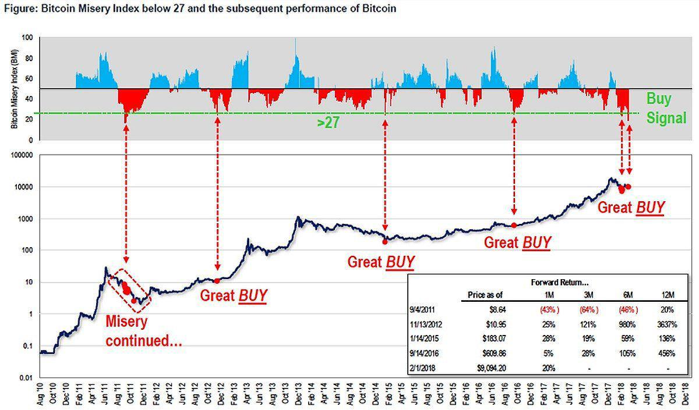

The cryptocurrency landscape has undergone remarkable transformations since the inception of Bitcoin in 2009. This digital currency pioneered the concept of decentralized financial transactions, challenging traditional banking systems and catalyzing the creation of thousands of alternative cryptocurrencies. The growing adoption of cryptocurrencies by mainstream financial institutions and individual investors underscores its potential to reshape the financial industry.

In this evolving landscape, understanding market sentiment has become increasingly vital for investors seeking to make informed decisions. One tool that has emerged to assist in this endeavor is the Bitcoin Misery Index (BMI). Designed to quantify investor sentiment, the BMI serves as a crucial metric in evaluating the emotional climate of the Bitcoin market. It operates on the premise that extreme investor emotions—either optimism or pessimism—can provide insightful signals about potential market movements.



Algorithmic trading, a cornerstone of modern cryptocurrency investment, plays a significant role in leveraging the insights offered by tools like the BMI. By utilizing complex mathematical models and high-speed data processing, algorithmic trading strategies can incorporate sentiment indices to optimize trade execution and timing. The integration of BMI into algorithmic frameworks allows investors to create strategies that respond swiftly to changes in market sentiment, enhancing the potential for profitable trades.

The primary focus of this article is to explore the utility of the Bitcoin Misery Index in Bitcoin trading and investment strategies. By analyzing the BMI, investors can gain a nuanced understanding of market sentiment, which can be pivotal in identifying optimal entry and exit points for trades. This understanding is essential for navigating the volatile cryptocurrency market, where sentiment can significantly influence price dynamics.

By unpacking the components and implications of the Bitcoin Misery Index, this article aims to illuminate its role as an integral part of a comprehensive trading strategy. As the cryptocurrency market continues to evolve, integrating sentiment analysis with technical and fundamental approaches will provide investors with a more rounded perspective, facilitating more informed and strategic investment decisions in the dynamic cryptocurrency environment.

## Table of Contents

## Understanding the Bitcoin Misery Index (BMI)

The Bitcoin Misery Index (BMI) is a metric designed to assess the sentiment of the Bitcoin market, thereby providing investors with insights into potential trading opportunities. First developed by Wall Street strategist Tom Lee, the BMI serves as a sentiment indicator focusing on the mood and emotional climate of the market. It helps to identify periods of excessive investor optimism or pessimism, aiding in making more informed trading decisions.

The BMI calculation involves three primary components: winning trades, total trades, and market [volatility](/wiki/volatility-trading-strategies). The index is calculated using the formula:

$$
\text{BMI} = \left(\frac{\text{Winning Trades}}{\text{Total Trades}}\right) \times (100 - \text{Volatility Score})
$$

In this formula:
- **Winning Trades:** Represents the number of trades resulting in a profit over a specified period.
- **Total Trades:** Denotes the total number of trades executed in the same timeframe.
- **Volatility Score:** This is a percentage representing market volatility, which is subtracted from 100 to account for risk evaluation.

The BMI is expressed as a percentage ranging from 0 to 100. A score above 50 generally indicates a favorable market with positive sentiment, while a score below 50 suggests negativity and potential buying opportunities. More specifically, low BMI scores may imply that the market is in a state of heightened pessimism, which contrarians might view as a signal for entry. Conversely, high scores could indicate excessive optimism, suggesting it might be an opportune time to be cautious or consider selling.

Understanding these levels is crucial as they mirror the collective emotions of market participants, including fear, greed, and neutrality. By quantifying these emotions, the BMI adds an emotional intelligence layer to technical and fundamental trading strategies. This is significant because emotions can drive market prices, often leading to irrational behaviors that create discrepancies between an asset's intrinsic value and its market price.

The BMI's role is particularly relevant in analyzing shifts in investor sentiment, as it allows traders and investors to gauge the crowd's mood rather than rely solely on price trends. This aids in foreseeing potential market reversals or continuations, offering a psychological perspective that complements traditional technical indicators.

In summary, the Bitcoin Misery Index serves as a valuable tool for understanding and interpreting investor sentiment in the Bitcoin market. By analyzing winning trades, total trades, and volatility, the BMI helps investors align their strategies with the prevailing market mood, potentially leading to more profitable trading outcomes.

## The Role of the Bitcoin Misery Index in Algorithmic Trading

The Bitcoin Misery Index (BMI) serves as a valuable tool in [algorithmic trading](/wiki/algorithmic-trading) by providing insights into market sentiment, which can guide trading strategies. One of the primary ways BMI is integrated into algorithmic trading strategies is through contrarian trading approaches. Contrarian trading involves taking positions that are against prevailing market trends, based on the notion that market movements often reflect excessive investor sentiment. When the BMI indicates extreme levels of misery, it may be a signal for contrarian traders to consider buying, anticipating a reversal or recovery. Conversely, a very low BMI, indicating investor euphoria, might suggest an opportunity to sell.

Algorithmic trading strategies can enhance the utility of BMI by combining it with other technical analysis tools. Moving averages, Relative Strength Index (RSI), and Bollinger Bands are examples of tools that, when used in conjunction with BMI, can provide a more comprehensive market analysis. For instance, a trading algorithm might be designed to initiate a buy order if the BMI is low and the market price is touching the lower Bollinger Band, suggesting an oversold condition.

The use of algorithms to automate trading decisions based on BMI inputs can streamline the decision-making process and minimize human error. By defining specific criteria and thresholds for BMI and other indicators, traders can construct algorithms that execute trades automatically. In Python, such an algorithm might look like the following:

```python
def trade_decision(bmi, rsi, lower_band):
    if bmi < 25 and rsi < 30 and current_price <= lower_band:
        return "buy"
    elif bmi > 75 and rsi > 70 and current_price >= upper_band:
        return "sell"
    else:
        return "hold"

# Example usage
current_price = 30000  # hypothetical current market price
upper_band = 32000    # hypothetical upper Bollinger Band
lower_band = 28000    # hypothetical lower Bollinger Band
rsi = 25              # hypothetical current RSI value

decision = trade_decision(bmi=20, rsi=rsi, lower_band=lower_band)
print(decision)  # Output: "buy"
```

There are case studies that illustrate the application of BMI in algorithmic trading systems. For example, some trading firms have developed algorithms explicitly designed to generate trading signals based on BMI fluctuations. These algorithms are tested against historical data to validate their effectiveness. The successes of such algorithms often lie in their ability to consistently interpret BMI signals in conjunction with other market variables, leading to profitable trading decisions.

However, it is crucial to recognize that while BMI can be a valuable component of an algorithmic trading strategy, no single indicator is infallible. Algorithms incorporating BMI must be robust, taking into account a wide range of market conditions to mitigate risk and ensure adaptability.

## Analyzing Bitcoin Price Movements with BMI

The Bitcoin Misery Index (BMI) serves as a valuable tool for analyzing Bitcoin price movements by providing insights into market sentiment. It reflects the level of investor happiness or misery at a given time, offering traders a mechanism to gauge potential trend shifts.

### Historical perspective: Price trends and BMI correlation

Historically, the BMI has shown a correlation with Bitcoin price trends. High BMI values, typically above 67, indicate investor "euphoria," which often precedes price peaks or pullbacks. Conversely, low values, below 27, suggest investor "misery," often correlating with market bottoms or impending price rebounds. An analysis of data from past Bitcoin cycles reveals that extreme BMI values frequently aligned with significant market reversals, making it a useful metric for anticipating potential changes in price direction.

### Interpreting BMI scores during different market conditions

BMI scores range from 0 to 100, with higher scores indicating better investor sentiment. During bullish conditions, a rising BMI can signal that the market might be overheating, triggering caution among investors. In contrast, during bearish conditions, a low BMI may suggest that despondency is high and a price recovery could be imminent. Thus, understanding the sentiment reflected by different BMI scores can help investors anticipate shifts in market dynamics.

### Use of BMI in identifying potential buying and selling opportunities

The BMI can guide investors in pinpointing potential buying and selling opportunities. For example, a very low BMI might be perceived as a buying signal, indicating that pessimism is rampant and prices may soon rise. Conversely, a very high BMI could suggest a selling point, as excessive optimism could precede a market correction. Investors can use these signals to make informed decisions about entering or exiting positions.

### Pitfalls of relying solely on BMI for price predictions

While the BMI provides valuable sentiment analysis, relying on it exclusively for price predictions can be risky. It is inherently a lagging indicator, often reflecting sentiment after price changes have occurred. Moreover, sentiment alone may not capture all the intrinsic factors affecting Bitcoin's price, such as regulatory news or macroeconomic shifts. Thus, BMI should be part of a multifaceted analytical approach.

### Significance of integrating media sentiment and news analysis

To enhance the predictive power of the BMI, integrating media sentiment and news analysis can offer a more comprehensive perspective. For instance, sudden changes in media sentiment or significant news events can impact investor perceptions rapidly, affecting BMI scores. By combining sentiment analysis derived from BMI with contemporaneous news and media sentiment, investors can develop a more nuanced understanding of market conditions and anticipate how these might influence future price movements. 

Overall, while the BMI is an important tool for analyzing Bitcoin market sentiment, its utility is heightened when used in conjunction with broader market analysis, including news and media sentiment. This integrative approach helps mitigate the limitations of relying on sentiment indicators alone, enabling better-informed decision-making in the dynamic [cryptocurrency](/wiki/cryptocurrency) market.

## Investment Strategies Using Bitcoin Misery Index

Incorporating the Bitcoin Misery Index (BMI) into investment strategies presents an innovative approach to navigating the highly volatile cryptocurrency market. The BMI, by analyzing market sentiment, provides valuable insights for both short-term trading and long-term investment planning.

### Short-term Trading Opportunities Based on BMI Fluctuations

Short-term traders can exploit BMI fluctuations to identify optimal entry and [exit](/wiki/exit-strategy) points. A low BMI score, often regarded as an indication of negative market sentiment, can signal a potential buying opportunity for contrarian traders who anticipate a market reversal. Conversely, a high BMI score suggests excessive bullishness, alerting traders to possible overvaluation and the potential for price corrections. This sentiment-driven strategy can be augmented by using algorithmic trading systems to swiftly execute trades based on real-time BMI data, providing a competitive edge in the fast-paced cryptocurrency markets.

### Long-term Investment Planning and Portfolio Diversification

For long-term investors, the BMI serves as a tool for assessing market cycles and informs diversification strategies. By understanding prolonged periods of high or low BMI scores, investors can make informed decisions about when to reallocate assets within their cryptocurrency portfolios. During periods of low BMI, investors might consider increasing their holdings in Bitcoin or related cryptocurrencies, anticipating future upward trends. Conversely, during high BMI periods, they might rebalance their portfolios to include a wider range of assets to mitigate risk.

### Risk Management Techniques Informed by BMI Levels

Risk management is crucial in volatile markets, and the BMI provides an additional metric for assessing market risk. Investors can establish thresholds for BMI scores to guide their risk tolerance levels, allowing them to adjust their exposure to Bitcoin accordingly. For instance, setting a threshold where Bitcoin holdings are reduced as the BMI exceeds a certain level helps in capital preservation by limiting exposure during potentially overheated market conditions.

### Maximizing Returns in Bullish and Bearish Markets Using BMI Insights

Using BMI insights, investors can tailor their strategies to maximize returns across different market conditions. In bullish markets, a gradual increase in BMI signals sustained positive sentiment, prompting investors to capitalize on rising prices while remaining vigilant for signs of reversal. In bearish markets, a declining BMI represents increasing pessimism, yet it also indicates potential buying opportunities before market recovery. By leveraging these insights, investors can enhance their strategies to capture gains effectively across varying market landscapes.

### Examples of Successful Investment Strategies Utilizing BMI

A notable example of a successful strategy using the BMI involves contrarian investing during extreme bearish conditions characterized by low BMI scores. Historical data analysis has shown that purchasing Bitcoin during times of heightened fear and pessimism, as indicated by very low BMI scores, often precedes significant price rebounds. Another strategy employs BMI as part of a broader algorithmic trading system, where the index guides automated execution of trades, adjusting positions based on sentiment shifts detected in real-time data.

By incorporating the Bitcoin Misery Index into investment strategies, investors gain a valuable perspective on market sentiment, aiding in the identification of profitable opportunities and effective risk management. While the BMI is a potent tool, it is most effective when used alongside other technical and [fundamental analysis](/wiki/fundamental-analysis) methods.

## Limitations and Criticisms of the Bitcoin Misery Index

The Bitcoin Misery Index (BMI) is a tool designed to gauge the sentiment of investors in the Bitcoin market. However, its effectiveness and reliability are subject to several criticisms and limitations.

One of the primary criticisms is that the BMI functions as a lagging indicator. A lagging indicator is one that provides data or signals after an event or trend has been established, making it less useful for predicting future market movements. This characteristic can potentially hinder traders who rely on it for making timely decisions, as the information may not reflect the current market conditions accurately.

Over-reliance on sentiment analysis is another notable pitfall when utilizing the BMI. Sentiment analysis attempts to quantify market sentiment, which is inherently subjective and can be influenced by a wide range of factors, such as market rumors or news events. Relying solely on sentiment analysis may lead to biased interpretations, as it might not account for fundamental market shifts, such as changes in technological developments or economic policies.

Additionally, the BMI does not encapsulate the broader market context that can affect Bitcoin's price. Factors like regulatory announcements, macroeconomic trends, and technological changes in the cryptocurrency ecosystem can significantly influence price movements beyond what is captured by sentiment analysis alone. Ignoring these can lead to incomplete assessments of the market environment.

To mitigate these limitations, it is advisable to combine the BMI with other indicators for a more comprehensive trading approach. Technical indicators, like moving averages and the Relative Strength Index (RSI), can offer insights into price trends and [momentum](/wiki/momentum). Fundamental analysis, which examines the intrinsic value of an asset, can provide additional context. By integrating a range of tools, traders can develop more robust strategies that account for a diverse array of market signals.

In summary, while the BMI can offer valuable insights into market sentiment, it should not be used in isolation. Recognizing its limitations as a lagging indicator and the challenges associated with sentiment analysis is crucial. By considering a broader set of market factors and complementing sentiment data with other analytical tools, investors can enhance their decision-making processes and develop more effective trading strategies.

## Conclusion

Understanding the Bitcoin Misery Index (BMI) is vital for cryptocurrency trading as it offers insights into market sentiment, acting as a valuable tool for both novice and seasoned investors. The BMI, by providing numerical representation of investor emotions, helps in assessing whether the market sentiment is leaning towards optimism or pessimism. This understanding can aid investors in making calculated trading decisions.

Investors can integrate BMI into their trading strategies by using it alongside other technical and fundamental indicators. By recognizing when the index indicates 'misery', they might identify potential buying opportunities and conversely, spot potential selling points during times of high satisfaction. This dual approach ensures that decisions are not made solely on emotion but are complemented by a broader view of market dynamics. The future evolution of BMI will likely involve more sophisticated algorithms and possibly [artificial intelligence](/wiki/ai-artificial-intelligence) to refine its sentiment analysis capabilities. As the cryptocurrency market matures, there is potential for the BMI to expand its applications beyond Bitcoin to other digital assets, providing investors with a more comprehensive tool for sentiment analysis.

Balancing sentiment analysis through tools like the BMI with traditional technical and fundamental approaches will be crucial. While sentiment is an important indicator, market movements are also driven by supply-demand mechanics, macroeconomic factors, and regulatory developments. Investors should aim to create a balanced strategy that incorporates multiple data sources, maintaining the flexibility to adjust as market conditions change.

Therefore, it is essential for investors to stay informed and continuously update their strategies, leveraging both technological advancements and comprehensive data analysis for decision-making. As the cryptocurrency landscape evolves, the ability to adapt using tools like the Bitcoin Misery Index will offer significant advantages, helping investors navigate the complexities of the market efficiently.

## References & Further Reading

[1]: Lee, T. (2018). ["Bitcoin Misery Index"](https://moneymorning.com/2018/04/20/this-bitcoin-misery-index-says-now-is-a-great-time-to-buy/), CNBC article discussing the development and application of BMI by Tom Lee.

[2]: Lopez de Prado, M. (2018). ["Advances in Financial Machine Learning"](https://www.amazon.com/Advances-Financial-Machine-Learning-Marcos/dp/1119482089), Wiley, providing insights into algorithmic trading and machine learning techniques.

[3]: Aronson, D. R. (2006). ["Evidence-Based Technical Analysis: Applying the Scientific Method and Statistical Inference to Trading Signals"](https://www.amazon.com/Evidence-Based-Technical-Analysis-Scientific-Statistical/dp/0470008741), John Wiley & Sons, explaining scientific methods in technical analysis.

[4]: Jansen, S. (2020). ["Machine Learning for Algorithmic Trading"](https://github.com/stefan-jansen/machine-learning-for-trading), Packt Publishing Ltd, covering machine learning applications in trading.

[5]: Chan, E. P. (2008). ["Quantitative Trading: How to Build Your Own Algorithmic Trading Business"](https://github.com/ftvision/quant_trading_echan_book), John Wiley & Sons, a guide to developing algorithmic trading businesses.