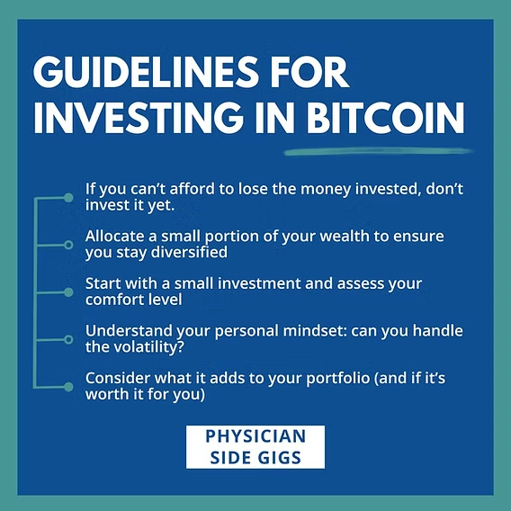

## Table of Contents

## What is Bitcoin and how does it work?

Bitcoin is a type of digital money that you can use to buy things online. It's different from regular money because it's not controlled by a government or a bank. Instead, it uses a technology called blockchain, which is like a big, public record book that keeps track of all Bitcoin transactions. People can send and receive Bitcoins using special computer programs called wallets.

When someone wants to send Bitcoin to another person, they create a transaction and send it to the blockchain. The transaction is then checked by a network of computers called miners. These miners solve complex math problems to confirm that the transaction is valid. Once it's confirmed, the transaction is added to the blockchain, and the Bitcoin is transferred to the recipient's wallet. This process helps keep Bitcoin secure and prevents people from spending the same Bitcoin twice.

## How can someone buy their first Bitcoin?

To buy your first Bitcoin, you'll need to choose a place to buy it from. These places are called cryptocurrency exchanges. Some popular ones are Coinbase, Binance, and Kraken. You'll need to sign up for an account on one of these exchanges. When you sign up, you'll need to give them some personal information and maybe even a photo ID to follow the rules.

Once your account is set up, you can add money to it. You can usually do this by linking your bank account or using a credit card. After you have money in your exchange account, you can use it to buy Bitcoin. Just choose how much Bitcoin you want to buy, and the exchange will give you the current price. When you're happy with the price, you can complete the purchase. The Bitcoin will then show up in your exchange wallet, and you can keep it there or move it to your own personal wallet for extra safety.

## What are the risks associated with investing in Bitcoin?

Investing in Bitcoin can be risky because its price can go up and down a lot. One day it might be worth a lot of money, and the next day it could be worth much less. This is called [volatility](/wiki/volatility-trading-strategies). Because of this, you could lose money if you need to sell your Bitcoin when the price is low. Also, since Bitcoin is not controlled by a government or a bank, there's no one to help you if something goes wrong. This means you have to be careful and do your own research before you invest.

Another risk is that Bitcoin can be hacked or stolen. If you keep your Bitcoin in an online wallet or on an exchange, it could be at risk. Hackers might try to break into these places and steal your Bitcoin. It's important to use strong passwords and maybe even keep your Bitcoin in a special offline wallet called a hardware wallet, which is safer. Also, since Bitcoin is still new and not used everywhere, it might not be easy to spend or exchange it for regular money in some places.

## What are the different ways to store Bitcoin securely?

One way to store Bitcoin securely is by using a software wallet. This is a program you can download on your computer or smartphone. It's easy to use and lets you send and receive Bitcoin quickly. But, it's important to be careful because if your computer or phone gets a virus, someone could steal your Bitcoin. To stay safe, make sure you use strong passwords and keep your software up to date.

Another way is to use a hardware wallet. This is a special device that looks like a USB stick. You can plug it into your computer to send or receive Bitcoin, but it keeps your Bitcoin offline most of the time. This makes it very hard for hackers to steal your Bitcoin because they can't get to it over the internet. Hardware wallets are considered one of the safest ways to store Bitcoin, but they can be a bit more expensive than software wallets.

You can also store Bitcoin on an exchange, but this can be riskier. Exchanges are online platforms where you can buy and sell Bitcoin. While they are convenient, they have been hacked in the past, and people have lost their Bitcoin. If you choose to keep your Bitcoin on an exchange, make sure it's a reputable one with good security measures. It's also a good idea to move your Bitcoin to a personal wallet if you're not planning to trade it often.

## How does Bitcoin mining work and is it profitable?

Bitcoin mining is the process of adding new transactions to the Bitcoin blockchain and releasing new Bitcoins into circulation. Miners use powerful computers to solve complex math problems. When a miner solves a problem, they get to add a new block of transactions to the blockchain. This helps keep the Bitcoin network secure and prevents people from spending the same Bitcoin twice. As a reward for their work, miners receive new Bitcoins and sometimes transaction fees from the people sending Bitcoins.

Whether Bitcoin mining is profitable depends on a few things. First, the cost of the electricity needed to run the mining computers can be very high. Miners need to make sure the value of the Bitcoins they earn is more than what they spend on electricity and equipment. Second, the price of Bitcoin can change a lot, so what's profitable today might not be tomorrow. Lastly, as more people start mining, it gets harder to solve the math problems, which can make mining less profitable over time. So, it's important for miners to keep an eye on these costs and the Bitcoin price to see if mining is worth it for them.

## What are the tax implications of buying, selling, and holding Bitcoin?

When you buy, sell, or hold Bitcoin, you need to think about taxes. In many countries, Bitcoin is treated like property, not money. This means if you sell your Bitcoin for more than you paid for it, you might have to pay capital gains tax on the profit. For example, if you bought Bitcoin for $1,000 and later sold it for $2,000, you would have to pay tax on the $1,000 profit. The tax rate depends on how long you held the Bitcoin and the tax laws in your country. If you held it for a short time, you might pay a higher tax rate than if you held it for a long time.

If you use Bitcoin to buy things, like a computer or a pizza, that can also be a taxable event. The value of the Bitcoin at the time you use it to buy something is what matters. For example, if you use Bitcoin worth $500 to buy a computer, you need to report that as if you sold the Bitcoin for $500 and then used that money to buy the computer. If the value of the Bitcoin has gone up since you bought it, you might owe capital gains tax on the increase. It's important to keep good records of all your Bitcoin transactions so you can report them correctly on your taxes.

## How can one analyze the Bitcoin market for investment decisions?

To analyze the Bitcoin market for investment decisions, you should look at different things like the price, trading [volume](/wiki/volume-trading-strategy), and news. The price of Bitcoin can tell you a lot. If the price is going up, it might mean more people want to buy it, which could be a good sign. Trading volume is also important. If a lot of Bitcoin is being traded, it shows that the market is active and people are interested. You should also keep an eye on the news because big events, like new laws about cryptocurrencies or big companies starting to use Bitcoin, can affect the price.

Another way to analyze the market is by using technical analysis. This means looking at charts and patterns to try to predict where the price might go next. You can use tools like moving averages, which smooth out the price over time, to see trends. If the price is above the moving average, it might be a good time to buy. If it's below, it might be a time to sell. But remember, technical analysis is not always right, and it's just one tool to help you make decisions.

Lastly, it's a good idea to look at what other people think about Bitcoin. You can read reports from experts or join online groups where people talk about cryptocurrencies. Listening to different opinions can help you understand the market better. But always do your own research too, because the market can be unpredictable, and what works for someone else might not work for you.

## What are Bitcoin futures and options, and how can they be used for investment?

Bitcoin futures and options are financial products that let you bet on where you think the price of Bitcoin will go in the future without actually owning any Bitcoin. Futures are contracts where you agree to buy or sell Bitcoin at a certain price on a specific date. If you think the price will go up, you can buy a future, and if it does go up, you make money. If it goes down, you lose money. Options are a bit different. They give you the right, but not the obligation, to buy or sell Bitcoin at a certain price before a certain date. If the price moves in your favor, you can use the option to make money. If it doesn't, you can just let the option expire and not lose as much money as you would with a future.

These products can be useful for investors who want to manage risk or make money from price changes without buying Bitcoin directly. For example, if you own Bitcoin and are worried the price might drop, you can use a future or an option to protect your investment. This is called hedging. If the price does drop, the money you make from the future or option can help cover your losses. On the other hand, if you think the price will go up but don't want to buy Bitcoin directly, you can use futures or options to bet on the price increase. Just remember, these products can be complicated and risky, so it's important to understand them well before you start using them.

## What are the common strategies for trading Bitcoin?

One common strategy for trading Bitcoin is called "buy and hold." This means you buy Bitcoin and keep it for a long time, hoping the price will go up. People who use this strategy believe that Bitcoin will become more valuable over time. They might not worry too much about small price changes and are okay with waiting for years to see a big profit. This strategy is good for people who don't want to check the price every day and are okay with some risk.

Another strategy is called "[day trading](/wiki/day-trading-spy)." Day traders buy and sell Bitcoin within the same day, trying to make money from small price changes. They might use charts and other tools to guess where the price is going next. This can be exciting but also risky because the price can change a lot in a short time. Day traders need to watch the market closely and be ready to make quick decisions. This strategy is better for people who have time to trade every day and can handle more risk.

A third strategy is called "swing trading." Swing traders hold onto Bitcoin for a few days or weeks, trying to make money from bigger price swings. They look for patterns in the price that suggest it might go up or down soon. Swing trading is less intense than day trading but still needs some attention to the market. It's a good middle ground for people who want to trade more often than buy-and-hold investors but don't want to watch the market all day like day traders.

## How does the regulatory environment affect Bitcoin investments globally?

The rules that governments make about Bitcoin can change how people invest in it around the world. Some countries have strict rules that make it hard to buy, sell, or use Bitcoin. For example, if a country bans Bitcoin, people there might be scared to invest because they could get in trouble. On the other hand, some countries have clear rules that make it easier and safer to use Bitcoin. When rules are clear, more people might feel okay about investing because they know what to expect. The way different countries handle Bitcoin can make the price go up and down as investors move their money around.

Another thing to think about is how these rules can affect the whole Bitcoin market. If a big country like the United States or China makes new rules, it can change what people all over the world think about Bitcoin. For example, if the U.S. says Bitcoin is okay to use, more people might start investing, and the price could go up. But if a country like China makes it harder to use Bitcoin, people might sell their Bitcoin, and the price could go down. So, the rules in different places can make the Bitcoin market move a lot, and investors need to keep an eye on what's happening with these rules to make smart choices.

## What role does Bitcoin play in a diversified investment portfolio?

Bitcoin can add something different to your investment mix because it doesn't always move the same way as stocks or bonds. When you have different kinds of investments, it's like spreading your money around so that if one thing goes down, another might go up. This can help protect your money. Bitcoin is often seen as a riskier investment, but it can also grow a lot in value. If you only have a small part of your money in Bitcoin, it can make your overall investment more exciting and possibly more profitable, but you need to be ready for some ups and downs.

Adding Bitcoin to your portfolio can also be a way to get into the world of digital money and technology. As more people and businesses start using cryptocurrencies, having some Bitcoin might help you keep up with these changes. But remember, Bitcoin can be tricky because its price can change a lot, and the rules about it are still being figured out in many places. So, it's smart to think about how much risk you're okay with and maybe talk to a financial advisor before you decide to put Bitcoin in your investment mix.

## What are the advanced technical analysis tools used for predicting Bitcoin price movements?

Advanced technical analysis tools for predicting Bitcoin price movements include things like the Relative Strength Index (RSI) and the Moving Average Convergence Divergence (MACD). The RSI helps you see if Bitcoin is being bought too much or sold too much. If the RSI number is over 70, it might mean Bitcoin is being bought too much and could go down soon. If it's under 30, it might mean Bitcoin is being sold too much and could go up. The MACD helps you see trends by looking at the difference between two moving averages. If the MACD line crosses above the signal line, it might be a good time to buy because the price could go up. If it crosses below, it might be a good time to sell because the price could go down.

Another tool is the Bollinger Bands, which show how much the Bitcoin price is moving around. The bands are lines drawn above and below the price. If the price goes outside the top band, it might mean Bitcoin is too expensive and could go down. If it goes outside the bottom band, it might mean Bitcoin is too cheap and could go up. Fibonacci retracement levels are also used to find where the price might stop going down before it starts going up again. These levels are based on a special math pattern and can help you guess where the price might change direction. Using these tools together can help you make better guesses about where the Bitcoin price might go next, but remember, they're not always right, and you should use them with other information too.

## References & Further Reading

[1]: Nakamoto, S. (2008). ["Bitcoin: A Peer-to-Peer Electronic Cash System."](https://nakamotoinstitute.org/library/bitcoin/)

[2]: Narayanan, A., Bonneau, J., Felten, E., Miller, A., & Goldfeder, S. (2016). ["Bitcoin and Cryptocurrency Technologies."](https://press.princeton.edu/books/hardcover/9780691171692/bitcoin-and-cryptocurrency-technologies) Princeton University Press.

[3]: Lopez de Prado, M. (2018). ["Advances in Financial Machine Learning."](https://books.google.com/books/about/Advances_in_Financial_Machine_Learning.html?id=oU9KDwAAQBAJ) Wiley.

[4]: Jansen, S. (2020). ["Machine Learning for Algorithmic Trading."](https://github.com/stefan-jansen/machine-learning-for-trading) Packt Publishing.

[5]: Chan, E. P. (2009). ["Quantitative Trading: How to Build Your Own Algorithmic Trading Business."](https://github.com/ftvision/quant_trading_echan_book) Wiley.

[6]: Haykin, S. (2005). ["Neural Networks and Learning Machines."](https://dai.fmph.uniba.sk/courses/NN/haykin.neural-networks.3ed.2009.pdf) Prentice Hall.

[7]: Treleaven, P., Galas, M., & Lalchand, V. (2013). ["Algorithmic Trading Review."](https://dl.acm.org/doi/pdf/10.1145/2500117) Communications of the ACM, 56(11).