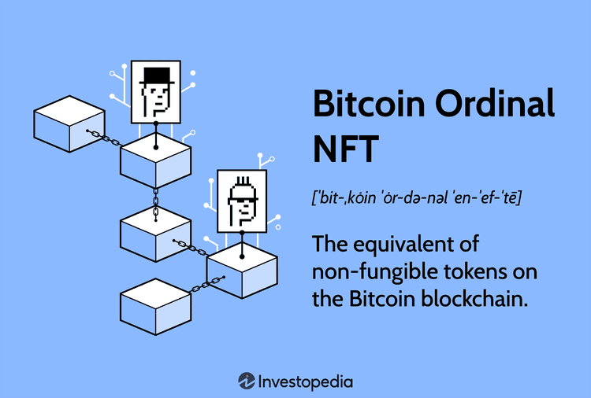

In the rapidly evolving digital landscape, non-fungible tokens (NFTs), the Bitcoin blockchain, and algorithmic trading have established themselves as fundamental components of the technology-driven financial ecosystem. These elements are not merely transient trends; they represent cutting-edge advancements that are reshaping the way assets are created, traded, and perceived in the modern economy. Each component plays a distinct role, yet they collectively contribute to a transformative shift in investment and trading paradigms.

NFTs have captured widespread attention by enabling the representation of unique digital assets on blockchain networks, primarily Ethereum. By using blockchain technology, NFTs ensure the provenance and scarcity of digital items, ranging from art and collectibles to virtual real estate and beyond. This innovation has opened new avenues for digital ownership and value exchange, which were previously unimaginable.



Simultaneously, the Bitcoin blockchain continues to be a cornerstone of the cryptocurrency world, renowned for its unparalleled security and decentralization. Unlike other blockchain networks, Bitcoin's foundation is structured around robustness and resistance to manipulation, making it a trusted ledger for value transactions across the globe. It is within this framework that Bitcoin Ordinals have emerged, representing a novel integration of NFTs within the Bitcoin ecosystem.

Bitcoin Ordinals are an intriguing development akin to NFTs, representing unique digital assets inscribed directly onto satoshis—the smallest unit of Bitcoin. This integration leverages the inherent security and widespread adoption of the Bitcoin network to embed entire digital assets within the blockchain, enhancing both their security and permanence. Bitcoin Ordinals mark a significant innovation, bridging the gap between the conceptual uniqueness of NFTs and the intrinsic security of Bitcoin, fostering a new level of asset integrity and market potential.

Moreover, algorithmic trading has seen exponential growth as computational power is increasingly harnessed to execute trades based on pre-defined parameters and sophisticated algorithms. In this context, algorithmic trading offers the ability to optimize trade executions and improve market efficiencies, providing traders with tools to navigate complex financial landscapes.

The convergence of NFTs, the Bitcoin blockchain, and algorithmic trading heralds a new frontier in financial technology, as innovative investment and trading opportunities abound. The interplay of these technologies not only redefines traditional market structures but also challenges existing paradigms of ownership, security, and value transfer. This intersection represents a dynamic and rapidly shifting landscape, one that this article seeks to explore in depth, offering insights into the transformative potential of Bitcoin Ordinals and their role in the future of digital finance.

## Table of Contents

## Understanding Bitcoin Ordinals

Bitcoin Ordinals represent an evolution in digital asset technology by embedding entire digital assets within a satoshi, which is the smallest divisible unit of Bitcoin, equivalent to one hundred millionth of a Bitcoin (0.00000001 BTC). This innovation is significant as it allows for the creation and storage of non-fungible tokens (NFTs) directly on the Bitcoin blockchain, which has traditionally prioritized security and decentralization.

The process of creating an Ordinal involves inscribing data onto satoshis. This data can include anything from simple text to complex digital media content, similar to traditional NFT metadata. By integrating NFTs onto the Bitcoin blockchain, Ordinals benefit from the inherent security features of Bitcoin, as Bitcoin's decentralized nature and robust consensus mechanism protect it from many types of attacks that might threaten newer or less decentralized blockchains.

In practical terms, an Ordinal allows for the tokenization of digital assets while leveraging the Bitcoin network's widespread adoption and high level of trust. This is accomplished without altering Bitcoin's protocol, as the data inscription operates within existing transaction and block size limits. As such, Ordinals can be seen as a layer operating on top of Bitcoin, akin to additional protocol layers like the Lightning Network.

While Ordinals provide a new avenue for NFT creation, they also introduce complexities and debates regarding block space usage, transaction fees, and overall network scalability. Some community members express concerns about increased data storage requirements, as embedding substantial amounts of data onto the blockchain can lead to larger block sizes and potentially higher transaction costs.

Nevertheless, Bitcoin Ordinals have catalyzed innovation, inviting developers and entrepreneurs to explore new use cases for NFTs using Bitcoin's robust infrastructure. This has opened discussions on how best to balance Ordinals' novel potential with the holistic operation of the Bitcoin network, as practitioners consider both the technical implications and the future potential for digital ownership and asset tokenization on the blockchain.

## Bitcoin Ordinals vs Traditional NFTs

Bitcoin Ordinals and traditional NFTs represent two distinct approaches to creating and managing non-fungible tokens using different blockchain technologies. Both methods enable the representation of unique digital assets but differ in how they utilize the underlying blockchain infrastructure.

Traditional NFTs primarily operate on blockchains that support smart contracts, such as Ethereum. These platforms allow developers to create, issue, and manage NFTs using smart contracts, which are self-executing contracts with the terms of the agreement written into code. Ethereum's ERC-721 and ERC-1155 standards are commonly employed for NFT creation. These standards define a set of rules to ensure the uniqueness and interoperability of tokens across the Ethereum ecosystem. Smart contracts facilitate complex operations, including ownership transfer and asset provenance, while leveraging Ethereum’s features like its established network effect and developer tools.

In contrast, Bitcoin Ordinals represent a novel method for encoding NFTs directly onto the Bitcoin blockchain. Bitcoin, originally designed as a digital currency platform, does not natively support smart contracts in the same way Ethereum does. However, Bitcoin Ordinals circumvent this limitation by inscribing data onto satoshis, the smallest unit of Bitcoin. This direct inscribing process means that Ordinals are embedded within the Bitcoin blockchain itself, offering a unique form of security. The mechanism is grounded in the immutability and extensive computational security provided by the Bitcoin network, which boasts one of the highest levels of decentralized trust and resistance to censorship.

The divergence in underlying technology between Ordinals and traditional NFTs leads to differentiated market impacts. Traditional NFTs benefit from a vibrant ecosystem, supported by extensive marketplaces and tools tailored specifically for NFT trading and creation. Ethereum's smart contract functionality enables extensive customization, which can include royalties, governance features, and detailed provenance tracking. However, this functionality comes at a cost, as network congestion and high transaction fees can pose significant challenges, particularly during peak usage periods.

Bitcoin Ordinals, on the other hand, provide a more streamlined and secure option through direct integration with Bitcoin’s blockchain. The intrinsic linkage with Bitcoin offers Ordinals enhanced security features, as they inherit the blockchain's robust defense against malicious activities. However, Ordinals currently face challenges related to infrastructure development, such as the availability of specialized marketplaces and the [liquidity](/wiki/liquidity-risk-premium) necessary for vibrant trade. Furthermore, since Bitcoin was not originally designed with NFTs in mind, Ordinals do not currently support the complex functionalities offered by Ethereum's smart contracts.

As the blockchain landscape evolves, the technological attributes and market dynamics of both Bitcoin Ordinals and traditional NFTs are likely to influence their adoption and development paths. While traditional NFTs continue to thrive on platforms with advanced capabilities, Bitcoin Ordinals offer an alternative that emphasizes security and simplicity, highlighting a growing diversification in the digital asset space.

## Trading Bitcoin Ordinals

Bitcoin Ordinals, which are essentially NFTs embedded within satoshis on the Bitcoin blockchain, have created a new domain for asset trading that incorporates the stability and security of the Bitcoin network. Trading Bitcoin Ordinals resembles the trading of traditional NFTs, in that both require marketplaces that facilitate their transactions. However, there are notable differences due to the unique characteristics of the Bitcoin blockchain and Ordinals themselves.

One key aspect of trading Bitcoin Ordinals is the involvement of marketplaces such as Ordinals Wallet and OKX, which have tailored their platforms to support these specific assets. These platforms allow users to buy, sell, and trade Ordinals seamlessly, albeit with a few technical considerations. Unlike traditional NFT platforms primarily operating on Ethereum, Bitcoin Ordinals platforms need to handle transactions in Bitcoin and manage inscriptions directly on the Bitcoin blockchain.

However, the liquidity in these emerging Ordinals marketplaces is currently lower compared to their more established Ethereum-based counterparts. This reduced liquidity can affect the speed and efficiency of trades, making it essential for investors to conduct diligent research and understand market conditions before engaging in transactions. The Ordinals marketplace is still in an experimental phase, and as with many nascent technologies, comes with both opportunities and risks.

Security and compatibility are two critical considerations when trading Bitcoin Ordinals. Buyers and sellers must ensure that their digital wallets and the marketplaces they use are compatible with Ordinals to avoid transaction errors or losses. Moreover, since the trading infrastructure for Ordinals is still developing, participants should be vigilant about potential security threats, including phishing attacks and fraudulent listings.

In conclusion, while trading Bitcoin Ordinals shares similarities with NFT trading, the distinctive nature of the Ordinals protocol and its integration with the Bitcoin network demands particular attention to liquidity, security, and compatibility. As the market for Ordinals continues to evolve, these initial challenges may transform into robust systems, opening up new possibilities for participants in the digital asset space.

## Algorithmic Trading and Bitcoin NFTs

Algorithmic trading utilizes sophisticated computer algorithms to execute trades at speeds and frequencies that are impossible for human traders. These algorithms can be designed to analyze vast amounts of data, recognize trading signals, and execute orders across multiple marketplaces simultaneously. When applied to Bitcoin Ordinals—unique digital assets inscribed onto the Bitcoin blockchain—[algorithmic trading](/wiki/algorithmic-trading) can provide distinct advantages in optimizing trade execution and maximizing potential returns.

Traders in the Ordinals market leverage algorithms to capitalize on market inefficiencies and price discrepancies. Using a combination of quantitative analysis and high-frequency trading strategies, these algorithms can identify optimal entry and [exit](/wiki/exit-strategy) points for trades. The goal is to enhance the profitability of trades by executing them with precision and speed. This often involves [backtesting](/wiki/backtesting) a strategy using historical data to ensure its effectiveness before deploying it in the live market.

The integration of [artificial intelligence](/wiki/ai-artificial-intelligence) (AI) and [machine learning](/wiki/machine-learning) into algorithmic trading strategies further enhances the execution of trades involving Bitcoin Ordinals. AI and machine learning can process complex datasets more effectively to identify patterns and predict market movements. Machine learning models, trained on various market indicators and datasets, can improve predictive accuracy over time, adjusting strategies dynamically to changing market conditions.

Consider a Python-based example illustrating a simple algorithmic trading strategy:

```python
import pandas as pd
import numpy as np
from sklearn.ensemble import RandomForestClassifier
from sklearn.model_selection import train_test_split

# Load market dataset
data = pd.read_csv('bitcoin_ordinal_data.csv')

# Feature engineering
data['price_movement'] = data['price'].pct_change()
data['future_movement'] = data['price_movement'].shift(-1)
data.dropna(inplace=True)

# Define features and target
features = data[['price_movement']]
target = data['future_movement'] > 0

# Split into train and test sets
X_train, X_test, y_train, y_test = train_test_split(features, target, test_size=0.2, random_state=42)

# Initialize and fit model
model = RandomForestClassifier()
model.fit(X_train, y_train)

# Evaluate model
accuracy = model.score(X_test, y_test)

print(f"Model Accuracy: {accuracy:.2f}")

# Use the model to make trading decisions
signal = model.predict(features[-1:])
trade_decision = 'Buy' if signal else 'Sell'
```

In this example, a RandomForestClassifier is used to predict future price movements of Bitcoin Ordinals based on historical price data. This model could guide buy or sell decisions, offering a data-driven approach to trading in an unpredictable market.

The maturation of AI-driven trading models offers a promising horizon for Bitcoin Ordinals trading. These advancements enable traders to make informed decisions with greater speed and accuracy, potentially leading to enhanced revenue streams. However, it is crucial for traders to continuously monitor algorithm performance, account for potential overfitting, and remain vigilant of systemic risks inherent in the [cryptocurrency](/wiki/cryptocurrency) market.

## Future Prospects of Bitcoin Ordinals in Algo Trading

Bitcoin Ordinals are poised to redefine digital ownership, presenting innovative opportunities for asset tokenization beyond what traditional NFTs have offered. By embedding entire digital assets within satoshis, Bitcoin Ordinals leverage the robust security and established credibility of the Bitcoin blockchain, potentially becoming pivotal in the diversification of digital asset portfolios.

As algorithmic trading grows increasingly prevalent, integrating Ordinals can enhance trading strategies by offering unique, Bitcoin-backed digital assets. Algorithmic trading thrives on efficiency and the ability to quickly adapt to market trends through automated systems. The intrinsic characteristics of Ordinals—such as their decentralized and secure nature—can be advantageous within algorithmic frameworks. This alignment allows traders to develop sophisticated trading algorithms that incorporate Bitcoin Ordinals, optimizing execution by considering various market conditions including liquidity and [volatility](/wiki/volatility-trading-strategies) specific to the Bitcoin network.

The broad adoption and integration of Bitcoin Ordinals into algorithmic trading strategies, however, hinge on several factors. First, ongoing network support is crucial. This involves maintaining the security and efficiency of the Bitcoin blockchain, ensuring that it remains a viable platform for such innovations. As new consensus mechanisms or technological upgrades occur within the Bitcoin ecosystem, it is essential for Ordinals to remain compatible and effective.

The evolution of trading tools also plays a significant role in the future success of Ordinals. Platforms that facilitate the trading of Bitcoin Ordinals must continuously develop features that cater to both retail and institutional investors. Enhanced analytics, seamless user interfaces, and integration capabilities with existing trading systems will be vital. Furthermore, the development of smart contract functionality specific to Bitcoin could further enrich the utility and appeal of Ordinals in algorithmic trading.

Market adoption will be another determining [factor](/wiki/factor-investing) in the sustainability and growth of Bitcoin Ordinals. Widespread acceptance by traders, investors, and institutions will necessitate a comprehensive understanding of their unique benefits and potential drawbacks. Educational initiatives and the development of standardized trading protocols could enhance confidence and participation within this emerging market segment.

In summary, the future prospects of Bitcoin Ordinals in algorithmic trading are promising yet depend heavily on infrastructural support, tool evolution, and widespread market acceptance. As these elements converge, Ordinals may become integral to the fabric of blockchain-based trading strategies, offering a new frontier for digital asset investment and innovation.

## Conclusion

Bitcoin Ordinals represent a significant milestone in the integration of cryptocurrency, NFTs, and advanced trading technologies. By allowing entire digital assets to be embedded directly onto the Bitcoin blockchain, Ordinals open up innovative avenues for digital asset ownership and exchange. This unique blend of security inherent in the Bitcoin network with the versatility of NFTs provides a fertile ground for developing new investment vehicles and trading strategies.

As this novel approach gains traction, it brings forth a variety of investment opportunities that leverage the robust nature of the Bitcoin blockchain. Investors and traders can access a new class of securely inscribed digital assets, potentially leading to diversified portfolios and alternative revenue streams. However, the emergence of Bitcoin Ordinals also invites various considerations that could influence their future trajectory.

Regulatory developments are likely to play a crucial role in determining how Bitcoin Ordinals fit into the broader financial ecosystem. As governments and regulatory bodies worldwide continue to assess the implications of cryptocurrencies and NFTs, their decisions will impact the adoption and regulation of Ordinal-based assets. A clear and supportive regulatory framework would enhance market confidence, fostering wider acceptance and use.

Technological advancements are another pivotal factor influencing the future of Bitcoin Ordinals. As blockchain technology evolves, improvements in scalability, transaction speed, and interoperability could enhance the functionality and appeal of Ordinals. Additionally, the integration of machine learning and AI in trading strategies holds promise for optimizing Ordinal trading operations, providing more sophisticated analytical tools and precise entry points for market participants.

Finally, market forces will dictate the sustainability and growth of Bitcoin Ordinals. Adoption rates, investor sentiment, and competitive landscape within digital assets will influence their trajectory. As more platforms enable Ordinals trading and liquidity improves, their appeal as a viable digital asset class is likely to grow, further stimulating interest and participation in this innovative market segment.

In conclusion, Bitcoin Ordinals represent the confluence of established blockchain technology with the emerging frontiers of digital assets and algorithmic trading. Navigating their regulatory, technological, and market landscapes will be critical in realizing their potential to redefine digital ownership and trading in the future.

## References & Further Reading

[1]: Nakamoto, S. (2008). ["Bitcoin: A Peer-to-Peer Electronic Cash System."](https://nakamotoinstitute.org/library/bitcoin/) Bitcoin.org.

[2]: Crosby, M., Pattanayak, P., Verma, S., & Kalyanaraman, V. (2016). ["Blockchain Technology: Beyond Bitcoin."](https://scet.berkeley.edu/reports/blockchain/) Applied Innovation Review, 2, 6-19.

[3]: Antonopoulos, A. M. (2017). ["Mastering Bitcoin: Unlocking Digital Cryptocurrencies."](https://books.google.com/books/about/Mastering_Bitcoin.html?id=IXmrBQAAQBAJ) O'Reilly Media.

[4]: Wood, G. (2014). ["Ethereum: A Secure Decentralized Transaction Ledger."](https://ethereum.github.io/yellowpaper/paper.pdf) Ethereum Project Yellow Paper.

[5]: Lopez de Prado, M. (2018). ["Advances in Financial Machine Learning."](https://www.amazon.com/Advances-Financial-Machine-Learning-Marcos/dp/1119482089) Wiley.

[6]: Werbach, K. (2018). ["The Blockchain and the New Architecture of Trust."](https://direct.mit.edu/books/book/4168/The-Blockchain-and-the-New-Architecture-of-Trust) MIT Press.

[7]: Narayanan, A., Bonneau, J., Felten, E., Miller, A., & Goldfeder, S. (2016). ["Bitcoin and Cryptocurrency Technologies: A Comprehensive Introduction."](https://press.princeton.edu/books/hardcover/9780691171692/bitcoin-and-cryptocurrency-technologies) Princeton University Press.