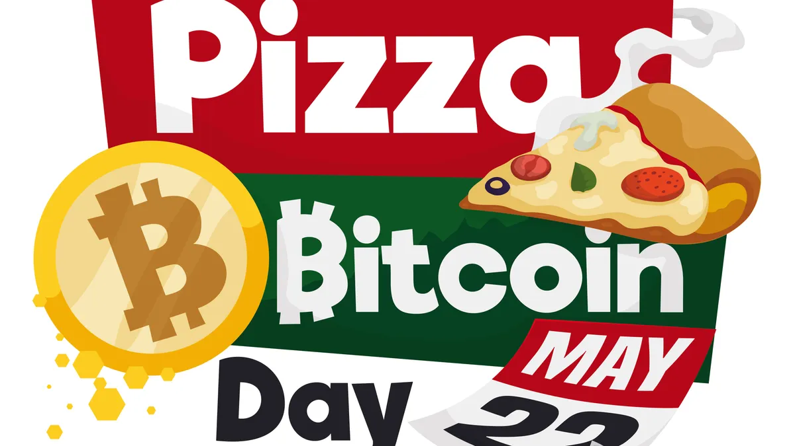

## Table of Contents

## What is Bitcoin Pizza Day?

Bitcoin Pizza Day is a special day that celebrates the first time someone used Bitcoin to buy something in real life. It happened on May 22, 2010, when a man named Laszlo Hanyecz bought two pizzas for 10,000 Bitcoins. This event is important because it showed that Bitcoin could be used like regular money to buy things.

People around the world celebrate Bitcoin Pizza Day every year on May 22. It reminds everyone of how Bitcoin started being used in everyday life. Many people share stories and pictures of pizzas on social media to join in the fun and remember this historic moment.

## Who made the first Bitcoin pizza purchase?

Laszlo Hanyecz made the first Bitcoin pizza purchase. On May 22, 2010, he bought two pizzas for 10,000 Bitcoins. This was a big moment because it was the first time someone used Bitcoin to buy something in real life.

This event is now known as Bitcoin Pizza Day. It showed that Bitcoin could be used like regular money. Every year on May 22, people celebrate this day and remember how Bitcoin started being used in everyday life.

## When did the Bitcoin pizza purchase happen?

The Bitcoin pizza purchase happened on May 22, 2010. A man named Laszlo Hanyecz bought two pizzas for 10,000 Bitcoins. This was the first time someone used Bitcoin to buy something in real life.

This event is now called Bitcoin Pizza Day. It showed that Bitcoin could be used like regular money. Every year on May 22, people celebrate this day and remember how Bitcoin started being used in everyday life.

## How many Bitcoins were used to buy the pizza?

Laszlo Hanyecz used 10,000 Bitcoins to buy two pizzas on May 22, 2010. This was the first time someone used Bitcoin to buy something in real life.

This event is now known as Bitcoin Pizza Day. It showed that Bitcoin could be used like regular money. Every year on May 22, people celebrate this day and remember how Bitcoin started being used in everyday life.

## What was the value of Bitcoin at the time of the pizza purchase?

At the time Laszlo Hanyecz bought the pizzas on May 22, 2010, the value of Bitcoin was very low. He paid 10,000 Bitcoins for two pizzas, which was worth about $41 at that time. This shows how new and not very valuable Bitcoin was back then.

Today, those 10,000 Bitcoins would be worth a lot more money. Because the value of Bitcoin has gone up a lot since 2010, the same amount of Bitcoins is now worth millions of dollars. This makes the pizza purchase a famous story in the world of Bitcoin.

## Why is Bitcoin Pizza Day significant in the history of cryptocurrencies?

Bitcoin Pizza Day is significant because it was the first time someone used Bitcoin to buy something in real life. On May 22, 2010, Laszlo Hanyecz bought two pizzas for 10,000 Bitcoins. This showed that Bitcoin could be used like regular money, not just as a digital thing. It was a big step because it proved that Bitcoin could work in the real world, which helped people start to trust it more.

This event also helped to spread the idea of cryptocurrencies to more people. Before the pizza purchase, Bitcoin was mostly used by a small group of tech people. But after Laszlo bought the pizzas, more people started to hear about Bitcoin and understand what it could do. Now, every year on May 22, people celebrate Bitcoin Pizza Day to remember this important moment in the history of cryptocurrencies.

## How has the value of the pizza purchase changed over time?

When Laszlo Hanyecz bought two pizzas with 10,000 Bitcoins on May 22, 2010, those Bitcoins were worth about $41. At that time, Bitcoin was new and not many people knew about it or thought it was worth much. The pizza purchase showed that Bitcoin could be used to buy real things, but it was still very early in Bitcoin's history.

Over time, the value of Bitcoin has gone up a lot. Today, those same 10,000 Bitcoins would be worth millions of dollars. This big change in value shows how much Bitcoin has grown and become more popular since 2010. The pizza purchase is now famous because it reminds us of how far Bitcoin has come.

## What impact did the Bitcoin pizza purchase have on the adoption of Bitcoin?

The Bitcoin pizza purchase had a big impact on the adoption of Bitcoin. Before Laszlo Hanyecz bought those two pizzas with 10,000 Bitcoins on May 22, 2010, not many people knew about Bitcoin or thought it could be used to buy things. His purchase showed everyone that Bitcoin could work like regular money. This made more people start to pay attention to Bitcoin and think about using it themselves.

After the pizza purchase, more people started to trust Bitcoin. They saw that it could be used in the real world, not just in computers. This helped Bitcoin grow and become more popular. Now, many people around the world use Bitcoin to buy things, and the pizza purchase is remembered as an important moment that helped Bitcoin become what it is today.

## How do people celebrate Bitcoin Pizza Day?

People celebrate Bitcoin Pizza Day on May 22 every year. They do this to remember the first time someone used Bitcoin to buy something in real life. Laszlo Hanyecz bought two pizzas for 10,000 Bitcoins in 2010. This event is important because it showed that Bitcoin could be used like regular money.

On Bitcoin Pizza Day, people share stories and pictures of pizzas on social media. They might also have pizza parties with friends and family. Some people even use Bitcoin to buy pizza on this day to keep the tradition alive. It's a fun way to celebrate how far Bitcoin has come since that first pizza purchase.

## What are some notable events or promotions that occur on Bitcoin Pizza Day?

On Bitcoin Pizza Day, many people and businesses do special things to celebrate. Some pizza places offer discounts or deals if you pay with Bitcoin. For example, a pizza restaurant might give you a free slice of pizza if you use Bitcoin to pay for your meal. This helps more people learn about and use Bitcoin.

Also, there are often online events and contests. People share photos of their pizzas on social media and use the hashtag #BitcoinPizzaDay. Some websites and apps might have games or giveaways where you can win prizes by using Bitcoin. These events make the day fun and help spread the word about Bitcoin.

## How has the perception of Bitcoin changed since the pizza purchase?

Since Laszlo Hanyecz bought two pizzas with 10,000 Bitcoins in 2010, the way people think about Bitcoin has changed a lot. Back then, Bitcoin was new and not many people knew about it. It was seen as something that tech people used, and most people thought it wasn't worth much. The pizza purchase showed that Bitcoin could be used to buy real things, which helped some people start to see it as a kind of money.

Now, Bitcoin is much more popular and many more people know about it. Its value has gone up a lot, and people use it to buy all sorts of things, not just pizzas. Some people even see Bitcoin as a way to save money or invest. The pizza purchase is now famous because it reminds everyone of how Bitcoin started being used in the real world. It's a big part of why Bitcoin is seen as important today.

## What lessons can be learned from the Bitcoin pizza purchase regarding cryptocurrency investments?

The Bitcoin pizza purchase teaches us that investing in cryptocurrencies can be risky because their value can change a lot. When Laszlo Hanyecz bought two pizzas for 10,000 Bitcoins in 2010, those Bitcoins were worth about $41. Now, those same Bitcoins would be worth millions of dollars. This shows how much the value of Bitcoin can go up over time. It's important for people to think about how much risk they want to take when they invest in cryptocurrencies.

Another lesson from the pizza purchase is that timing can be very important in cryptocurrency investments. If someone had bought Bitcoins right after Laszlo's purchase and held onto them, they could have made a lot of money. But it's hard to know when the best time to buy or sell is. So, people need to do a lot of research and be ready for the value to go up and down before they decide to invest in cryptocurrencies.

## References & Further Reading

[1]: Bitcoin Talk Forum. (2010). ["Laszlo's Pizza Transaction Thread."](https://finance.yahoo.com/news/bitcoin-pizza-day-story-behind-150023085.html) The original forum post where Laszlo Hanyecz offered 10,000 BTC for pizza.

[2]: Antonopoulos, A. M. (2014). ["Mastering Bitcoin: Unlocking Digital Cryptocurrencies."](https://books.google.com/books/about/Mastering_Bitcoin.html?id=IXmrBQAAQBAJ) O'Reilly Media.

[3]: Nakamoto, S. (2008). ["Bitcoin: A Peer-to-Peer Electronic Cash System."](https://nakamotoinstitute.org/library/bitcoin/) The original Bitcoin whitepaper.

[4]: Narayanan, A., Bonneau, J., Felten, E., Miller, A., & Goldfeder, S. (2016). ["Bitcoin and Cryptocurrency Technologies."](https://press.princeton.edu/books/hardcover/9780691171692/bitcoin-and-cryptocurrency-technologies) Princeton University Press.

[5]: Rosenfeld, M. (2012). ["Analysis of Bitcoin Pooled Mining Reward Systems."](https://arxiv.org/abs/1112.4980) arXiv preprint arXiv:1112.4980.

[6]: DeVries, P. D. (2016). ["An Analysis of Cryptocurrency, Bitcoin, and the Future."](https://www.researchgate.net/publication/316656878_An_Analysis_of_Cryptocurrency_Bitcoin_and_the_Future) International Journal of Business Management & Commerce.

[7]: Yermack, D. (2015). ["Is Bitcoin a Real Currency? An Economic Appraisal."](https://www.sciencedirect.com/science/article/pii/B9780128021170000023) National Bureau of Economic Research Working Paper No. 19747.