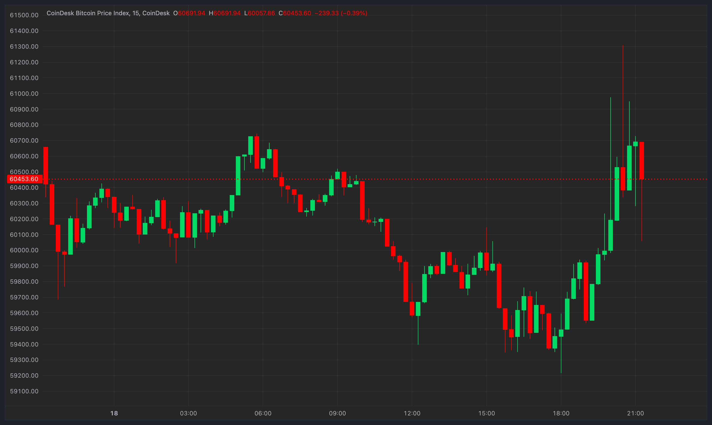

## Table of Contents

## What is Bitcoin?

Bitcoin is a type of digital money that you can use to buy things online. It's different from regular money because it's not controlled by any government or bank. Instead, it uses a special technology called blockchain to keep track of all the transactions. People store their bitcoins in digital wallets and can send them to others over the internet.

You can get bitcoins by buying them with regular money or by earning them through a process called mining. Mining involves using powerful computers to solve complex math problems, and miners are rewarded with new bitcoins for their efforts. Bitcoin is popular because it allows people to make transactions without needing a middleman like a bank, which can be faster and cheaper. However, its value can go up and down a lot, so it can be risky to use or invest in.

## What does it mean when the Federal Reserve cuts interest rates?

When the Federal Reserve cuts interest rates, it means they are lowering the cost of borrowing money. This makes it cheaper for people and businesses to take out loans. The Federal Reserve does this to encourage more spending and investment. When loans are cheaper, people might buy more things like houses or cars, and businesses might invest in new projects or expand their operations.

Lowering interest rates can also make the economy grow faster. When people and businesses spend more money, it can lead to more jobs and higher incomes. However, if interest rates stay low for a long time, it might cause prices to rise too quickly, which is called inflation. The Federal Reserve has to balance encouraging growth with keeping inflation under control.

## How does an interest rate cut by the Federal Reserve affect Bitcoin's price?

When the Federal Reserve cuts interest rates, it can make Bitcoin's price go up. This is because lower interest rates make it cheaper to borrow money, so people might want to invest in things like Bitcoin that could give them a higher return. When more people want to buy Bitcoin, its price can go up because there's more demand for it.

However, it's not always that simple. Sometimes, when interest rates are cut, it can make people worry about the economy. If people think the economy might be in trouble, they might not want to take risks with their money, and they might sell their Bitcoin. This could make Bitcoin's price go down. So, while lower interest rates can sometimes push Bitcoin's price up, it depends on what people think about the economy and how they decide to invest their money.

## What was the Bitcoin price before the Federal Reserve's interest rate cut?

Before the Federal Reserve cut interest rates, Bitcoin's price was around $9,000. This was in July 2019, right before the Federal Reserve announced its decision to lower rates. At that time, many people were watching Bitcoin closely because they thought the [interest rate](/wiki/interest-rate-trading-strategies) cut might affect its price.

The price of Bitcoin can change a lot, even in a short time. Before the interest rate cut, some people were buying Bitcoin because they thought it might go up in value. Others were waiting to see what would happen after the Federal Reserve's announcement. So, the price of Bitcoin before the interest rate cut was important because it showed what people were thinking and doing with their money at that time.

## What is the significance of Bitcoin reaching $61,000?

Bitcoin reaching $61,000 is a big deal because it shows that more and more people believe in it. When Bitcoin's price goes up so high, it means that many people want to buy it and think it's worth a lot. This can happen when people feel good about the economy or when they think Bitcoin is a good way to keep their money safe. It's also exciting because it's a new record for Bitcoin, showing that it can keep getting more valuable over time.

Reaching $61,000 also makes people talk about Bitcoin more. When the price is this high, you might see it on the news or hear people talking about it. This can make even more people interested in buying Bitcoin, which could push the price up even higher. But it's important to remember that Bitcoin's price can go up and down a lot, so it's always a bit risky to invest in it.

## How have previous Federal Reserve actions influenced Bitcoin's price?

When the Federal Reserve changes interest rates, it can make a big difference for Bitcoin's price. For example, when the Federal Reserve cut interest rates in 2019, Bitcoin's price started to go up. People thought that lower interest rates meant it was cheaper to borrow money, so they wanted to invest in things like Bitcoin that could give them a higher return. This made more people want to buy Bitcoin, which pushed its price higher.

But it's not always the same. Sometimes, when the Federal Reserve cuts interest rates, it can make people worry about the economy. If people think the economy might be in trouble, they might not want to take risks with their money. They might sell their Bitcoin instead of buying more, which can make the price go down. So, while the Federal Reserve's actions can affect Bitcoin's price, it depends a lot on what people think about the economy and how they choose to invest their money.

## What are the current market sentiments regarding Bitcoin's price increase?

People are feeling excited and hopeful about Bitcoin's price going up. Many think that Bitcoin is becoming more popular and that more people are starting to trust it. They see the price increase as a sign that Bitcoin is here to stay and could keep getting more valuable. Some people are buying Bitcoin because they think it's a good way to make money, especially when other investments like stocks or savings accounts aren't doing as well.

However, not everyone is so sure. Some people are worried that Bitcoin's price might be too high and could go down quickly. They think that the price increase might be because of too much excitement and not because Bitcoin is actually worth that much. These people are being careful and watching to see what happens next. They might wait to see if the price stays high before they decide to buy Bitcoin themselves.

## What technical indicators are showing about Bitcoin's potential future movements?

Technical indicators can help people guess where Bitcoin's price might go next. Right now, the moving averages for Bitcoin are showing that the price is trending upwards. This means that over time, Bitcoin's price has been going up more than it has been going down. The Relative Strength Index (RSI) is also important. It's not too high right now, which means Bitcoin might not be overbought and could still go up more. But if the RSI gets too high, it might mean Bitcoin is overbought and could go down soon.

Another thing to look at is the [volume](/wiki/volume-trading-strategy) of Bitcoin being traded. When a lot of Bitcoin is being bought and sold, it can mean that people are really interested in it and the price might keep going up. Right now, the volume is pretty high, which is a good sign for Bitcoin's price. But, if the volume starts to go down, it could mean that people are losing interest and the price might go down too. So, by looking at these technical indicators, people can get a better idea of what might happen with Bitcoin's price in the future.

## How do macroeconomic factors other than interest rates impact Bitcoin?

Macroeconomic factors like inflation can have a big effect on Bitcoin. When inflation goes up, it means the money you have doesn't buy as much as it used to. Some people think Bitcoin can help protect their money from inflation because it's not controlled by any government or bank. If people think inflation is going to be a problem, they might buy more Bitcoin, which can make its price go up.

Another important [factor](/wiki/factor-investing) is how strong the economy is. When the economy is doing well, people might feel more confident about taking risks with their money. They might invest in things like Bitcoin because they think it could give them a good return. But if the economy is not doing well, people might be more worried about losing their money. They might sell their Bitcoin or not buy more, which can make the price go down. So, the overall health of the economy can really influence what happens with Bitcoin's price.

## What are the potential risks associated with investing in Bitcoin at this price point?

Investing in Bitcoin when its price is high can be risky. One big risk is that the price might go down a lot. Bitcoin's price can change very quickly, and it's hard to predict what will happen next. If you buy Bitcoin at a high price and it goes down, you could lose a lot of money. Another risk is that Bitcoin is not backed by anything like a government or a bank. This means that if something goes wrong with Bitcoin, there's no one to help you get your money back.

Another thing to think about is that Bitcoin can be hard to use. It's not like regular money where you can easily buy things with it. You need to know how to keep it safe in a digital wallet, and if you lose your wallet or someone steals it, you could lose all your Bitcoin. Also, some countries don't like Bitcoin and might make it harder to use or even ban it. So, before you invest in Bitcoin, it's important to understand these risks and think about whether it's right for you.

## How might regulatory changes affect Bitcoin's price in the near future?

Regulatory changes can have a big impact on Bitcoin's price. If a country decides to make new rules about Bitcoin, it could make people feel more sure about using it. For example, if a big country says Bitcoin is okay to use and gives clear rules on how to use it, more people might want to buy it. This could make the price go up because more people would want to own Bitcoin. But if a country says it doesn't like Bitcoin and wants to stop people from using it, that could make the price go down. People might be scared to buy Bitcoin if they think they could get in trouble for using it.

Another thing to think about is how different countries might work together on Bitcoin rules. If many countries agree on how to treat Bitcoin, it could make it easier for people to use it all over the world. This could make more people want to buy Bitcoin, pushing the price up. But if countries can't agree and make different rules, it could be confusing for people. They might not want to buy Bitcoin if they're not sure about the rules in different places. So, what happens with regulations can really affect whether Bitcoin's price goes up or down.

## What advanced trading strategies could be employed given the current Bitcoin market conditions?

One advanced trading strategy that could work well in the current Bitcoin market is called dollar-cost averaging. This means you buy a little bit of Bitcoin at regular times, no matter what the price is. This can help you avoid buying all your Bitcoin at a high price. If the price goes down, you can buy more Bitcoin for the same amount of money. Over time, this can help you get a better average price for your Bitcoin. It's a good way to invest in Bitcoin without trying to guess when the price will go up or down.

Another strategy is called swing trading. This is when you try to buy Bitcoin when the price is low and sell it when the price goes up a bit. You can use technical indicators like moving averages and the Relative Strength Index to help you decide when to buy and sell. For example, if the price goes below the moving average, it might be a good time to buy. And if the RSI gets too high, it might be a good time to sell. Swing trading can be riskier than dollar-cost averaging, but it can also make you more money if you do it right.

A third strategy to consider is using stop-loss orders. This means you set a price at which you will automatically sell your Bitcoin if it goes down to that price. This can help you limit how much money you could lose if the price drops a lot. For example, if you buy Bitcoin at $61,000, you might set a stop-loss order at $55,000. If the price goes down to $55,000, your Bitcoin will be sold automatically, so you don't lose too much money. Using stop-loss orders can help you manage the risks of trading Bitcoin in a high-price market.

## What are some tips for successful Bitcoin algorithmic trading?

Developing a robust trading strategy for Bitcoin [algorithmic trading](/wiki/algorithmic-trading) requires a deep understanding of the [cryptocurrency](/wiki/cryptocurrency)'s [volatility](/wiki/volatility-trading-strategies) and an effective risk management approach. Below are key tips to enhance the success of algorithmic trading in this dynamic market.

### Strategy Development and Risk Management

1. **Volatility Exploitation**: Bitcoin's price can fluctuate significantly within short timeframes. A successful trading strategy should be designed to capture these movements while protecting against adverse price shifts. One possible approach is trend-following or momentum strategies which capitalize on sustained price movements. Conversely, mean-reversion strategies could be employed when expecting the price to revert to a long-term average after a deviation.

2. **Risk Management**: Implementing effective risk management techniques is essential. This includes setting stop-loss orders to limit potential losses, using position sizing methodologies to control exposure, and maintaining a diversified portfolio to mitigate risk. For example, the Kelly Criterion can be used to determine the optimal size of a series of bets to maximize wealth growth:
$$
   f^* = \frac{bp - q}{b}

$$

   where $f^*$ is the fraction of the capital to wager, $b$ is the odds received on the wager (net decimal odds), $p$ is the probability of winning, and $q$ is the probability of losing.

### Back-Testing Strategies

3. **Historical Data Analysis**: Before deploying a strategy in the live market, back-testing using historical data is crucial. This process involves applying the trading strategy to past market data to evaluate its effectiveness and potential profitability under various conditions. It is vital to optimize strategies using out-of-sample data to avoid overfitting—a scenario where the strategy performs well on the test data but poorly in practice. Python libraries like Pandas and NumPy can facilitate data manipulation and analysis.

   ```python
   import pandas as pd
   import numpy as np

   # Example of loading historical Bitcoin data for back-testing
   data = pd.read_csv('bitcoin_price_data.csv')
   # Calculate moving averages as part of a potential strategy
   data['MA50'] = data['Close'].rolling(window=50).mean()
   data['MA200'] = data['Close'].rolling(window=200).mean()

   # Evaluate potential triggers, e.g., when shorter MA crosses above the longer MA
   data['Position'] = np.where(data['MA50'] > data['MA200'], 1, -1)
   ```

### Monitoring Economic Indicators

4. **Staying Informed**: Regularly monitoring economic indicators and central bank announcements can provide insights into potential market-moving events. Keeping abreast of Federal Reserve interest rate decisions, inflation reports, and employment data helps traders anticipate market reactions and adjust their algorithms accordingly. Integrating newsfeeds and economic calendars into the algorithmic setup can automate the extraction and analysis of relevant data, ensuring timely strategy adjustments.

By focusing on these core areas, traders can harness the potential of Bitcoin's market environment while managing risks effectively. These practices help traders remain adaptive and enhance their ability to exploit the profit opportunities that algorithmic trading offers.

## References & Further Reading

[1]: ["The Impact of Federal Reserve Interest Rate Announcements on Financial Markets."](https://www.cnbc.com/2024/09/18/fed-cuts-rates-september-2024-.html) Journal of Financial Markets.

[2]: Rosenthal, L. (2020). ["Bitcoin and the Reaction to Federal Reserve Announcements."](https://www.nytimes.com/section/opinion) Economics Letters.

[3]: ["Cryptocurrency Trading & Investing for Beginners"](https://academy.binance.com/en/articles/a-complete-guide-to-cryptocurrency-trading-for-beginners) by Aimee Vo

[4]: ["Algorithmic Trading in Cryptocurrency"](https://www.coinbase.com/learn/advanced-trading/what-is-cryptocurrency-algo-trading-and-how-does-it-work) by I. Kapitonov et al. in the Journal of Risk and Financial Management.

[5]: ["Quantitative Bitcoin Trading"](https://medium.com/@padilha.victor/developing-a-quantitative-bitcoin-trading-model-part-1-technical-indicators-27522d1e964d) by Yves Hilpisch

[6]: ["Algorithmic Trading and Artificial Intelligence"](https://wjaets.com/content/algorithmic-trading-and-ai-review-strategies-and-market-impact) by Prashant Shah