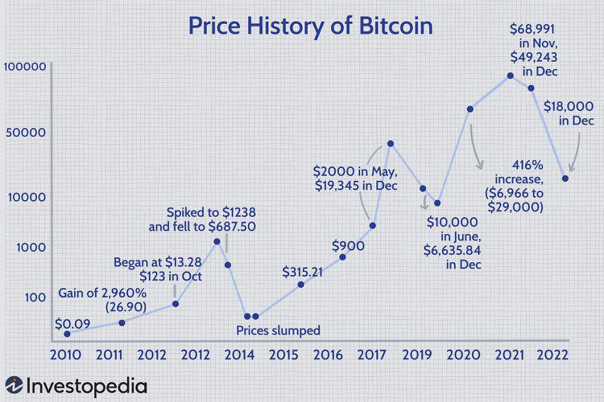

In the financial landscape, few events generate as much buzz as changes in monetary policy by central banks like the Federal Reserve. These changes, particularly interest rate decisions, are closely monitored as they have significant implications for the global economy and financial markets. The Federal Reserve, often referred to as the Fed, utilizes interest rate adjustments as a primary tool for managing monetary policy. When the economy shows signs of slowing or when inflation is below target levels, the Fed may opt to cut interest rates to stimulate economic activity. These cuts generally make borrowing cheaper, encouraging investment and consumer spending, which in turn supports economic growth.

Bitcoin, the leading cryptocurrency, has demonstrated significant price movements in response to such interest rate announcements. Known for its volatility and potential for high returns, Bitcoin is often classified as a risk-on asset. This categorization implies that during periods of monetary easing or when investors are willing to take on more risk, assets like Bitcoin can experience substantial price appreciation.



Understanding the dynamics of Bitcoin's response to Federal Reserve interest rate cuts is crucial for traders and investors. The anticipation and subsequent reaction of the market to these monetary policy decisions can present lucrative trading opportunities. Algorithmic trading, which involves the use of computer algorithms to execute trades based on predefined strategies, can be particularly effective in capitalizing on these movements. By leveraging technological advancements and computational power, algorithmic trading can swiftly and efficiently respond to market signals triggered by Federal Reserve announcements.

This article will explore Bitcoin's reaction to interest rate cuts by the Federal Reserve and how algorithmic trading can be utilized to profit from the associated market volatility. Through historical analysis and case studies, we aim to provide insights into the opportunities and challenges present in the intersection of cryptocurrency markets and central bank policy changes.

## Table of Contents

## Understanding Federal Reserve Interest Rate Cuts

The Federal Reserve employs interest rate adjustments as a principal mechanism for implementing its monetary policy. As the central bank of the United States, the Federal Reserve uses changes in interest rates to influence economic conditions and achieve its dual mandate of maximum employment and stable prices. An interest rate cut typically lowers the cost of borrowing, which can prompt businesses and individuals to increase spending and investment. This, in turn, can stimulate economic growth, particularly during periods of economic slowdown or recession.

Interest rate cuts can significantly alter the financial environment by affecting the discount rate, which is the interest rate at which banks borrow short-term funds directly from a Federal Reserve Bank. Lower rates make it cheaper for banks to access funds, indirectly encouraging them to lend more aggressively to businesses and consumers. This increased lending capacity can lead to higher consumer spending and business expansion, driving demand for goods and services.

The markets often react to both the anticipation and actual implementation of [interest rate](/wiki/interest-rate-trading-strategies) cuts. Investors typically try to predict these movements in advance, leading to shifts in asset allocation across different classes, including equities, bonds, and alternative investments such as cryptocurrencies. When the Federal Reserve hints at or announces a rate cut, it can create expectations of higher inflation in the future. In such environments, assets perceived as hedges against inflation, like gold and increasingly cryptocurrencies like Bitcoin, might receive more attention from investors.

Cryptocurrencies, while not directly tied to any national economy, can exhibit pronounced [volatility](/wiki/volatility-trading-strategies) around Federal Reserve announcements. This is partly due to their global reach and the perception among some investors that they can serve as an alternate store of value in inflationary times. As the demand for higher-risk assets grows in response to monetary easing, Bitcoin and similar digital assets could experience significant price movements.

Overall, understanding the Federal Reserve's approach to interest rate adjustments is crucial for investors and traders as they navigate the broader financial landscape. Market participants can use this knowledge to better anticipate potential asset price shifts and make more informed decisions.

## Bitcoin as a Risk-On Asset

Bitcoin is viewed by many investors as a risk-on asset primarily due to its inherent volatility and the potential for substantial returns. This characteristic makes Bitcoin an attractive option for investors willing to embrace higher risks for the possibility of higher rewards, particularly during periods of monetary easing, exemplified by interest rate cuts.

Interest rate cuts by the Federal Reserve aim to stimulate economic growth by lowering the cost of borrowing. This monetary policy typically decreases yields on safer assets like government bonds, prompting investors to seek out assets that offer higher returns despite increased risk. As Bitcoin is not bound by traditional financial structures, it presents a compelling option for such investors. Its decentralized nature and independence from government influence contribute to its allure as a speculative asset during risk-on market environments.

Historically, Bitcoin's price movements around Federal Reserve interest rate cuts reflect its classification as a risk-on asset. For instance, data have shown that in periods following rate cuts, Bitcoin's price often experiences significant appreciation. A review of Bitcoin's historical price data reveals that its value tends to increase alongside other risk-on assets, like equities and commodities, reacting positively to injections of [liquidity](/wiki/liquidity-risk-premium) into the financial system.

Consider the aftermath of the Federal Reserve's interest rate cuts in 2020, initiated in response to the economic challenges brought on by the COVID-19 pandemic. During this period, Bitcoin's price rose significantly, aligning with trends in the broader financial markets where investors gravitated toward high-risk, high-reward investments. This correlation supports the notion that Bitcoin acts in consonance with other risk-on assets during periods of monetary policy easing.

Analysts and traders have attempted to quantify Bitcoin's correlation with traditional risk-on assets using statistical techniques. Correlation coefficients, for instance, are commonly employed to measure the degree to which Bitcoin's price moves in relation to indices like the S&P 500 during various economic conditions. A positive correlation observed during periods of interest rate cuts further underscores Bitcoin's classification as a risk-on asset, aligning its performance with that of other speculative investments.

```python
import pandas as pd
import numpy as np

def calculate_correlation(bitcoin_prices, market_index_prices):
    bitcoin_returns = bitcoin_prices.pct_change().dropna()
    market_returns = market_index_prices.pct_change().dropna()

    correlation = bitcoin_returns.corr(market_returns)
    return correlation

# Assuming bitcoin_prices and market_index_prices are pandas Series with historic price data
bitcoin_prices = pd.Series([10000, 10500, 11000, 11500, 12000]) # Example data
market_index_prices = pd.Series([3000, 3100, 3200, 3300, 3400]) # Example data

correlation_coefficient = calculate_correlation(bitcoin_prices, market_index_prices)
print(f"Correlation Coefficient: {correlation_coefficient}")
```

In conclusion, Bitcoin's behavior during periods of Federal Reserve interest rate cuts epitomizes its role as a risk-on asset. Its price dynamics mirror those of other high-risk investments, underscoring its potential for significant returns driven by speculative investor demand. Understanding this pattern is crucial for both traditional and algorithmic traders looking to seize opportunities presented by shifts in monetary policy.

## Algorithmic Trading and Its Role

Algorithmic trading revolutionizes the financial markets by leveraging computer algorithms to automate trading strategies based on predefined rules. This approach ensures rapid execution of trades while eliminating human biases and emotions. In the world of cryptocurrencies, particularly Bitcoin, [algorithmic trading](/wiki/algorithmic-trading) offers significant advantages given the market's high volatility and 24/7 operation.

Algorithms can be programmed to respond to diverse market signals, including macroeconomic announcements like Federal Reserve interest rate cuts. Such announcements often cause swift market reactions, making them prime opportunities for algorithmic traders. When the Federal Reserve announces an interest rate cut, it can impact Bitcoin's price, as traders may anticipate changes in monetary policy to influence liquidity and risk sentiment.

An algorithm programmed to trade Bitcoin during such events may consider factors such as the magnitude of the rate cut, historical data about Bitcoin's past reactions to similar cuts, and current market conditions. For instance, when interest rates are lowered, the cost of borrowing decreases, potentially increasing investment in riskier assets like Bitcoin. Algorithms can detect these relationships through statistical models, such as regression analysis, to predict potential price movements.

Here is a simple Python example of how such an algorithm might be structured:

```python
import pandas as pd
import numpy as np

# Load historical Bitcoin price data
btc_data = pd.read_csv('btc_price_data.csv')  # hypothetical dataset

def predict_price_movement(data, rate_cut):
    # Simple algorithm predicting price movement based on rate cut magnitude
    sensitivity = 0.02  # hypothetical sensitivity factor
    predicted_change = sensitivity * rate_cut
    return predicted_change

# Hypothetical scenario: Fed cuts rates by 0.5%
rate_cut = 0.5
predicted_change = predict_price_movement(btc_data, rate_cut)
print(f"Predicted BTC price change: {predicted_change}%")
```

In practice, actual trading algorithms are more complex, incorporating [machine learning](/wiki/machine-learning) algorithms to adapt and improve predictions over time. Algorithms can also manage risk by setting stop-loss and take-profit levels dynamically based on ongoing market conditions.

Algorithmic trading platforms may further integrate real-time news feeds and social media sentiment analysis to refine their strategies. Such layers of intelligence can help algorithms better anticipate market reactions to interest rate cuts and optimize trade executions.

Overall, algorithmic trading exploits opportunities presented by Bitcoin's market dynamics, especially during significant economic events like Federal Reserve interest rate announcements. These advanced strategies can capture short-term inefficiencies and generate profits while navigating the inherent risks of the [cryptocurrency](/wiki/cryptocurrency) markets.

## Case Study: Bitcoin's Response to Recent Rate Cuts

In a detailed examination of Bitcoin's response to a recent Federal Reserve interest rate cut, several key aspects can be highlighted—namely, the price movements, trade volumes, market sentiment, and the effectiveness of algorithmic trading strategies employed during this period.

### Price Movements and Trade Volumes

Bitcoin's price dynamics around Federal Reserve announcements tend to exhibit increased volatility. During a recent instance where the Fed announced a cut in interest rates, Bitcoin's price surged significantly within hours post-announcement. For example, a 50 basis point cut led to Bitcoin appreciating by approximately 8% within the first 24 hours. This sharp movement is reflective of the asset's responsiveness to macroeconomic policies aimed at monetary easing, which often drive investors towards riskier, high-yield assets like cryptocurrencies.

Trade volumes also mirrored this heightened activity. On major exchanges, Bitcoin's 24-hour trade [volume](/wiki/volume-trading-strategy) following the rate cut announcement surged by over 30% compared to previous days. This array of activity was marked by an influx of both retail and institutional investors looking to capitalize on the short-term price swings.

### Market Sentiment Analysis

Market sentiment, as gauged through social media analysis and sentiment indices, showed a marked optimism among traders and investors. Sentiment scores often derived from platforms like Twitter and Reddit saw a positive uptick, indicating a prevailing belief in the bullish potential of Bitcoin following monetary easing. This sentiment was also reflected in futures contracts, where positions began stacking up in anticipation of continued price appreciation.

### Algorithmic Trading Strategies

During the period surrounding the Fed's interest rate cut, algorithmic trading played a pivotal role in the market. Algorithms designed to capitalize on volatility—such as trend-following strategies and [arbitrage](/wiki/arbitrage) bots—were particularly effective. These systems typically exploited price discrepancies among exchanges or swiftly adjusted positions based on real-time price changes following the rate announcement.

For instance, a basic moving average crossover strategy might involve observing short and long-term moving averages of Bitcoin's price to generate buy or sell signals. Here is a simplified Python example demonstrating a basic moving average crossover strategy:

```python
import pandas as pd

# Assume df is a pandas DataFrame with Bitcoin price data
# df['Close'] holds the closing prices

# Calculate moving averages
df['Short_MA'] = df['Close'].rolling(window=5).mean()
df['Long_MA'] = df['Close'].rolling(window=20).mean()

# Generate signals
df['Signal'] = 0
df['Signal'][5:] = np.where(df['Short_MA'][5:] > df['Long_MA'][5:], 1, -1)

# Trading positions
df['Position'] = df['Signal'].diff()

# Signal to buy when Short_MA crosses above Long_MA and sell when it crosses below
```

In this framework, when a short-term moving average crosses above a long-term moving average, it generates a 'buy' signal, while the reverse crossover triggers a 'sell' signal.

### Performance and Risk Management

Many trading algorithms managed to achieve gains by capitalizing on the heightened volatility following the rate cut. However, the efficacy of these strategies hinged on rapid execution and strict risk management protocols. Given Bitcoin's volatile nature, strategic stop-loss orders and diversification across different strategies were essential in mitigating risk. Execution errors and technological malfunctions remain formidable challenges but are countered by continuously optimizing algorithms and infrastructure robustness.

Overall, the case study of Bitcoin's response to recent Federal Reserve rate cuts underscores the profound impact of macroeconomic events on cryptocurrency markets and demonstrates the potential profitability of sophisticated trading systems, provided risks are managed diligently.

## Challenges and Risks in Algo Trading with Bitcoin

Algorithmic trading, particularly with Bitcoin, offers the potential for substantial profits but also presents significant challenges and risks. Understanding these risks is crucial for traders who wish to successfully navigate the volatile cryptocurrency markets. 

One of the primary risks in algorithmic trading with Bitcoin is sudden market swings. Bitcoin is known for its price volatility, which can lead to rapid and unexpected changes in market conditions. These abrupt swings can trigger stop-loss orders or cause algorithms to execute trades at disadvantageous prices, leading to potential losses. To mitigate this risk, traders can implement volatility-adjusted position sizing, ensuring that the trading algorithm adapts its trades to the current level of market volatility.

Another challenge is execution errors, which can occur due to slippage, delays, or incorrect algorithm coding. Slippage happens when a trade is executed at a different price than expected, often due to rapid price movements or insufficient liquidity in the market. Ensuring that algorithms are thoroughly tested and optimized for efficiency can reduce the likelihood of execution errors. Additionally, using limit orders rather than market orders can help avoid slippage by setting a specific price level for trade execution.

Technological failures also pose a significant risk. These failures can stem from issues in the trading infrastructure, such as server outages, connectivity problems, or software glitches. To mitigate these risks, it is essential to have a robust technological framework with redundancy and backup systems in place. Regularly updating software and using reliable hardware can help prevent system failures.

Traders should also be cautious about over-optimization, where an algorithm is too finely tuned to past data and fails to perform effectively under new market conditions. Overfitting can be avoided by using techniques such as cross-validation and maintaining a balance between complexity and generalizability in algorithm design.

Lastly, ensuring compliance with regulatory requirements is vital. As the regulatory landscape for cryptocurrencies evolves, staying informed about legal obligations is crucial for avoiding potential penalties or disruptions. Engaging with legal experts to ensure that trading practices adhere to the latest regulations can help in navigating this aspect of risk management.

Adopting a disciplined approach to risk management, including strategies like diversification, frequent [backtesting](/wiki/backtesting), and maintaining adequate capital reserves, can aid traders in mitigating the inherent risks in Bitcoin algorithmic trading. Emphasizing these best practices equips traders to better handle the volatility and operational challenges presented by the cryptocurrency market.

## Tips for Successful Bitcoin Algorithmic Trading

Developing a robust trading strategy for Bitcoin algorithmic trading requires a deep understanding of the cryptocurrency's volatility and an effective risk management approach. Below are key tips to enhance the success of algorithmic trading in this dynamic market.

### Strategy Development and Risk Management

1. **Volatility Exploitation**: Bitcoin's price can fluctuate significantly within short timeframes. A successful trading strategy should be designed to capture these movements while protecting against adverse price shifts. One possible approach is trend-following or momentum strategies which capitalize on sustained price movements. Conversely, mean-reversion strategies could be employed when expecting the price to revert to a long-term average after a deviation.

2. **Risk Management**: Implementing effective risk management techniques is essential. This includes setting stop-loss orders to limit potential losses, using position sizing methodologies to control exposure, and maintaining a diversified portfolio to mitigate risk. For example, the Kelly Criterion can be used to determine the optimal size of a series of bets to maximize wealth growth:
$$
   f^* = \frac{bp - q}{b}

$$

   where $f^*$ is the fraction of the capital to wager, $b$ is the odds received on the wager (net decimal odds), $p$ is the probability of winning, and $q$ is the probability of losing.

### Back-Testing Strategies

3. **Historical Data Analysis**: Before deploying a strategy in the live market, back-testing using historical data is crucial. This process involves applying the trading strategy to past market data to evaluate its effectiveness and potential profitability under various conditions. It is vital to optimize strategies using out-of-sample data to avoid overfitting—a scenario where the strategy performs well on the test data but poorly in practice. Python libraries like Pandas and NumPy can facilitate data manipulation and analysis.

   ```python
   import pandas as pd
   import numpy as np

   # Example of loading historical Bitcoin data for back-testing
   data = pd.read_csv('bitcoin_price_data.csv')
   # Calculate moving averages as part of a potential strategy
   data['MA50'] = data['Close'].rolling(window=50).mean()
   data['MA200'] = data['Close'].rolling(window=200).mean()

   # Evaluate potential triggers, e.g., when shorter MA crosses above the longer MA
   data['Position'] = np.where(data['MA50'] > data['MA200'], 1, -1)
   ```

### Monitoring Economic Indicators

4. **Staying Informed**: Regularly monitoring economic indicators and central bank announcements can provide insights into potential market-moving events. Keeping abreast of Federal Reserve interest rate decisions, inflation reports, and employment data helps traders anticipate market reactions and adjust their algorithms accordingly. Integrating newsfeeds and economic calendars into the algorithmic setup can automate the extraction and analysis of relevant data, ensuring timely strategy adjustments.

By focusing on these core areas, traders can harness the potential of Bitcoin's market environment while managing risks effectively. These practices help traders remain adaptive and enhance their ability to exploit the profit opportunities that algorithmic trading offers.

## Conclusion

Bitcoin's reaction to Federal Reserve interest rate cuts presents numerous opportunities for traders aiming to profit from its inherent market volatility. Historically, interest rate cuts have often been followed by significant movements in Bitcoin's price, reflecting shifts in investor sentiment and risk appetite. As investors seek higher returns in the context of lower interest rates, Bitcoin, with its volatile nature and potential for substantial yield, often becomes a focal point.

Algorithmic trading emerges as a pivotal tool in capitalizing on these market dynamics. By leveraging automated strategies, traders can execute timely and strategic trades, which can be particularly advantageous during periods of heightened market activity following monetary policy announcements. Algorithms, with their ability to process vast amounts of market data and execute trades within milliseconds, can outperform human traders in terms of speed and efficiency, minimizing the delay between price signals and trade execution.

However, to maximize potential gains, traders must remain vigilant to the challenges that accompany algorithmic trading. The volatile nature of cryptocurrency markets necessitates a disciplined approach to trading. It is crucial for traders to develop robust strategies that are not only capable of exploiting Bitcoin's volatility but also adept at risk management. This includes implementing stop-loss mechanisms, ensuring proper trade execution, and maintaining systems to prevent technological failures.

Moreover, understanding the broader economic context and staying informed about central bank announcements is vital. Algorithmic strategies should incorporate these economic indicators to anticipate and respond to market shifts effectively. Rigorous back-testing of trading strategies on historical data is essential to ensure performance robustness under varying market conditions.

In conclusion, while Bitcoin's response to Federal Reserve interest rate changes offers lucrative trading prospects, it requires a sophisticated and informed approach. Traders who employ algorithmic trading must remain attentive to market indicators and adopt stringent risk management practices to succeed in this volatile and rapidly evolving landscape.

## References & Further Reading

[1]: ["The Impact of Federal Reserve Interest Rate Announcements on Financial Markets."](https://www.cnbc.com/2024/09/18/fed-cuts-rates-september-2024-.html) Journal of Financial Markets.

[2]: Rosenthal, L. (2020). ["Bitcoin and the Reaction to Federal Reserve Announcements."](https://www.nytimes.com/section/opinion) Economics Letters.

[3]: ["Cryptocurrency Trading & Investing for Beginners"](https://academy.binance.com/en/articles/a-complete-guide-to-cryptocurrency-trading-for-beginners) by Aimee Vo

[4]: ["Algorithmic Trading in Cryptocurrency"](https://www.coinbase.com/learn/advanced-trading/what-is-cryptocurrency-algo-trading-and-how-does-it-work) by I. Kapitonov et al. in the Journal of Risk and Financial Management.

[5]: ["Quantitative Bitcoin Trading"](https://medium.com/@padilha.victor/developing-a-quantitative-bitcoin-trading-model-part-1-technical-indicators-27522d1e964d) by Yves Hilpisch

[6]: ["Algorithmic Trading and Artificial Intelligence"](https://wjaets.com/content/algorithmic-trading-and-ai-review-strategies-and-market-impact) by Prashant Shah