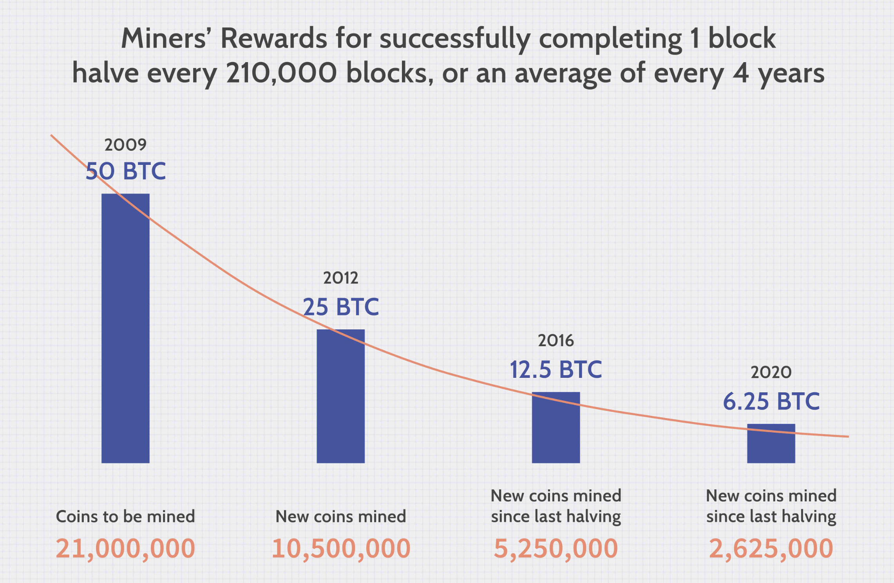

## Table of Contents

## What is Bitcoin and how does it work?

Bitcoin is a type of digital money that you can use to buy things online. It was created in 2009 by someone using the name Satoshi Nakamoto. Unlike regular money, Bitcoin is not controlled by any government or bank. Instead, it uses something called blockchain, which is like a big online notebook that keeps track of all Bitcoin transactions. This makes it very secure and hard to cheat.

When you want to use Bitcoin, you send it from your digital wallet to someone else's wallet. Each wallet has a special address, kind of like an email address, that you use to send and receive Bitcoin. To make sure the transaction is safe, it gets checked by lots of computers around the world. These computers solve hard math problems to add the transaction to the blockchain. Once it's added, the Bitcoin is moved, and you can't take it back. This whole process is called mining, and the people who do it get rewarded with new Bitcoins.

## How can someone purchase Bitcoin for the first time?

To buy Bitcoin for the first time, you need to choose a place where you can buy it. These places are called cryptocurrency exchanges, like Coinbase or Binance. First, you sign up for an account on one of these exchanges. You'll need to give them some information about yourself, like your name and email address. Some exchanges might also ask you to prove who you are by showing them a photo of your ID, like a driver's license or passport.

Once your account is set up, you can add money to it. You can usually do this by linking your bank account or using a credit card. After you have money in your exchange account, you can use it to buy Bitcoin. On the exchange, you'll see a price for Bitcoin. You decide how much you want to buy, click to make the purchase, and the Bitcoin will be added to your account on the exchange. From there, you can keep it in the exchange or move it to a personal digital wallet, which is like a safe place to store your Bitcoin.

Remember, buying Bitcoin can be a bit tricky at first, but once you get the hang of it, it's not too hard. Always make sure to use a secure exchange and keep your personal information safe. If you're not sure about something, it's a good idea to do some more research or ask for help from someone who knows about cryptocurrencies.

## What are the different methods to store Bitcoin securely?

There are several ways to store Bitcoin securely, and the best choice depends on what you need and how much you want to spend. One common way is to use a digital wallet on your computer or phone. These wallets can be easy to use and set up, but they can also be risky if your device gets hacked or stolen. Some people choose to use wallets provided by cryptocurrency exchanges, which can be convenient but also come with risks because you're trusting the exchange to keep your Bitcoin safe.

Another safer option is to use a hardware wallet, which is a special device that looks like a USB stick. It keeps your Bitcoin offline, making it much harder for hackers to steal it. You can plug the hardware wallet into your computer when you want to move your Bitcoin, but the actual Bitcoin stays safe on the device. This method is more expensive than using a digital wallet, but it's one of the most secure ways to store your Bitcoin.

Lastly, you can use a paper wallet, which is just a piece of paper with your Bitcoin information printed on it. You can make a paper wallet by generating a special code online and then printing it out. This keeps your Bitcoin completely offline, but you have to be careful to keep the paper safe from fire, water, and anyone who might steal it. Each method has its own pros and cons, so it's important to think about what works best for you.

## What is Bitcoin mining and why is it important?

Bitcoin mining is the process of adding new transactions to the Bitcoin blockchain and creating new Bitcoins. When someone wants to send Bitcoin, miners use powerful computers to solve complex math problems. The first miner to solve the problem gets to add the new transaction to the blockchain and is rewarded with new Bitcoins. This process is important because it helps keep the Bitcoin network secure and running smoothly. Without miners, there would be no way to confirm transactions or create new Bitcoins.

Mining is also important because it helps prevent fraud. Since miners are spread all over the world, it's very hard for any one person to control the Bitcoin network. If someone tried to cheat by adding a fake transaction, the other miners would notice and reject it. This makes the Bitcoin system very secure. Plus, mining helps control how many new Bitcoins are made, keeping the total number of Bitcoins from growing too fast.

## How does the Bitcoin mining process work?

Bitcoin mining is like a puzzle-solving competition where miners use their computers to solve hard math problems. When someone wants to send Bitcoin, the transaction is sent to a group of miners. These miners put the transaction into a block, along with other transactions. Then, they start working to solve a math problem that's really hard to figure out. The first miner to solve the problem gets to add the block to the blockchain, which is like a big notebook that keeps track of all Bitcoin transactions.

Once a miner solves the problem and adds the block to the blockchain, they get rewarded with new Bitcoins. This reward is important because it gives miners a reason to keep working and helps keep the Bitcoin network secure. Other miners check the new block to make sure it's correct. If it is, they agree to add it to the blockchain. This process keeps going all the time, with new blocks being added about every 10 minutes. It's how Bitcoin keeps track of who owns what and makes sure no one can cheat the system.

## What hardware and software are required for Bitcoin mining?

To start Bitcoin mining, you need special hardware called an ASIC (Application-Specific Integrated Circuit) miner. These machines are made just for mining Bitcoin and are much better at solving the math problems needed than regular computers. They can be expensive, but they are the best way to mine Bitcoin. You'll also need a good power supply to keep the ASIC running, and a way to keep it cool because it can get very hot. Some people also use a mining rig, which is a frame that holds multiple ASIC miners together.

For software, you need a mining program that lets your ASIC connect to the Bitcoin network. Popular mining software includes CGMiner, EasyMiner, and MultiMiner. These programs help your ASIC solve the math problems and send the results to the Bitcoin network. You also need a Bitcoin wallet to store any Bitcoins you earn from mining. Lastly, you might want to join a mining pool, which is a group of miners who work together. Joining a pool can help you earn Bitcoins more regularly, even if you don't have the most powerful mining hardware.

## What are the risks and costs associated with Bitcoin mining?

Bitcoin mining can be expensive and risky. The biggest cost is the hardware, like ASIC miners, which can cost thousands of dollars. You also need to pay for electricity to run the miners, and this can add up quickly because miners use a lot of power. Keeping the miners cool with fans or air conditioning adds to the cost too. Another cost is the time and effort you spend setting up and maintaining the mining equipment. If you join a mining pool, you might have to pay a fee to be part of it.

There are also risks involved in Bitcoin mining. One big risk is that the price of Bitcoin can go up and down a lot. If the price drops, you might not make enough money from mining to cover your costs. Another risk is that mining gets harder over time as more people start doing it. This means you need more powerful and expensive equipment to keep up. There's also the risk of your equipment breaking down or getting hacked, which can cost you money and time to fix. So, it's important to think carefully about these risks and costs before you start mining Bitcoin.

## How can Bitcoin be used for everyday transactions?

Bitcoin can be used for everyday transactions, like buying things online or paying for services. You can use it at some stores or websites that accept Bitcoin as payment. To do this, you need a digital wallet where you keep your Bitcoin. When you want to buy something, you send Bitcoin from your wallet to the store's wallet. It's like sending money through an app, but instead of dollars, you're using Bitcoin. Some people even use Bitcoin to pay friends back for things like splitting a meal or a ride.

However, using Bitcoin for everyday things can be tricky. Not all stores accept it, so you need to check first. Also, the price of Bitcoin can change a lot, so the amount you pay in Bitcoin might be worth more or less the next day. This can make it hard to know how much you're really spending. Plus, sending Bitcoin can take some time, and you might have to pay a small fee to make the transaction happen faster. So, while you can use Bitcoin for everyday stuff, it's not always as easy as using regular money.

## What are the advantages of using Bitcoin over traditional currency?

One big advantage of using Bitcoin is that it's not controlled by any government or bank. This means no one can freeze your account or stop you from sending money to someone else. It gives you more freedom over your money. Also, Bitcoin transactions can be private. When you send Bitcoin, you don't have to give your name or other personal information, which can be good if you want to keep your spending private.

Another advantage is that Bitcoin can be used anywhere in the world. You can send it to someone in another country without worrying about exchange rates or bank fees. This makes it easier and cheaper to send money to friends or family far away. Plus, because Bitcoin uses blockchain technology, it's very secure. Once a transaction is added to the blockchain, it's very hard to change or steal, which makes it safer than some other ways of sending money online.

## What are the potential legal and tax implications of using Bitcoin?

Using Bitcoin can come with some legal and tax issues that you need to know about. In many countries, Bitcoin is treated like property, not money. This means if you use Bitcoin to buy something, it's like trading one thing for another. You might have to pay taxes on any profit you make from selling or trading Bitcoin. The rules can be different in each country, so it's important to check what the laws are where you live. Some places have strict rules about using cryptocurrencies, and you could get in trouble if you don't follow them.

Taxes can be tricky with Bitcoin. If you earn Bitcoin, like from mining or getting paid in it, you might have to report it as income and pay taxes on it. If the value of your Bitcoin goes up and you sell it or use it to buy something, you might have to pay capital gains tax on the profit. Keeping good records of all your Bitcoin transactions is really important so you can report everything correctly when you do your taxes. If you're not sure about the tax rules, it's a good idea to talk to a tax expert who knows about cryptocurrencies.

## How does the volatility of Bitcoin affect its use as a currency or investment?

The price of Bitcoin can go up and down a lot, which is called volatility. This can make it hard to use Bitcoin as money for everyday things. If you buy something with Bitcoin, the price might be different by the time you get it. This can make it hard to know how much you're really spending. It's like trying to buy something with a dollar that keeps changing its value. Because of this, not many stores accept Bitcoin, and it can be tricky to use it for regular shopping.

But, the volatility of Bitcoin can also make it a good investment. Some people buy Bitcoin hoping its price will go up so they can sell it later for more money. It's kind of like buying a stock that can go up or down a lot. This can be exciting but also risky. If the price goes down, you could lose money. So, people who want to invest in Bitcoin need to be ready for big changes and think carefully about how much risk they're willing to take.

## What are the future prospects and potential developments for Bitcoin?

Bitcoin has a lot of potential for the future. More and more people are starting to use it, and some big companies are even accepting it as payment. As more people use Bitcoin, it could become easier to buy things with it and more stores might start accepting it. There are also new technologies being developed to make Bitcoin faster and cheaper to use, like the Lightning Network, which could help it be used for everyday purchases. Governments and banks are starting to pay attention to Bitcoin too, which could lead to new rules and ways to use it.

However, there are still some big challenges. The price of Bitcoin can change a lot, which makes it hard to use as money. There are also worries about how safe it is, and some people are concerned about how much energy it takes to mine Bitcoin. But, if these problems can be solved, Bitcoin could become a big part of how we use money in the future. It might even change how we think about money and make it easier to send money around the world.

## References & Further Reading

[1]: Nakamoto, S. (2008). ["Bitcoin: A Peer-to-Peer Electronic Cash System."](https://nakamotoinstitute.org/library/bitcoin/)

[2]: Antonopoulos, A. M. (2017). ["Mastering Bitcoin: Unlocking Digital Cryptocurrencies."](https://books.google.com/books/about/Mastering_Bitcoin.html?id=IXmrBQAAQBAJ) O'Reilly Media.

[3]: Narayanan, A., Bonneau, J., Felten, E., Miller, A., & Goldfeder, S. (2016). ["Bitcoin and Cryptocurrency Technologies."](https://press.princeton.edu/books/hardcover/9780691171692/bitcoin-and-cryptocurrency-technologies) Princeton University Press.

[4]: Peters, G. W., & Panayi, E. (2016). ["Understanding Modern Banking Ledgers through Blockchain Technologies: Future of Transaction Processing and Smart Contracts on the Internet of Money."](https://link.springer.com/content/pdf/10.1007/978-3-319-42448-4_13.pdf) Banking Beyond Banks and Money.

[5]: Chandra, R. (2016). ["Machine Learning Algorithms for Problem Solving in Computational Applications."](https://www.researchgate.net/publication/297300191_Machine_Learning_Algorithms_for_Problem_Solving_in_Computational_Applications_Intelligent_Techniques) Springer.