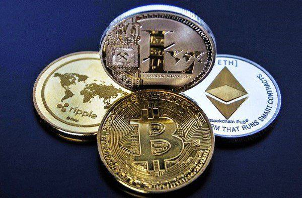

## Table of Contents

## What is Bitcoin and how does it work?

Bitcoin is a type of digital money that you can use to buy things online. It was created in 2009 by someone using the name Satoshi Nakamoto. Unlike regular money, Bitcoin is not controlled by a government or a bank. Instead, it uses a technology called blockchain, which is like a public record book that keeps track of all Bitcoin transactions. This makes it very secure and hard to cheat.

When you want to use Bitcoin, you send it from your digital wallet to someone else's wallet. Each wallet has a unique address, kind of like an email address. To send Bitcoin, you need to use a special code called a private key, which is like a secret password. Once you send the Bitcoin, the transaction gets added to the blockchain, and everyone can see it. Miners, who are special computers, help keep the blockchain updated and secure by solving complex math problems. In return, they get rewarded with new Bitcoins.

## Why is Bitcoin subject to regulation?

Bitcoin is subject to regulation because governments want to make sure it is used safely and fairly. Like any other money, Bitcoin can be used for good things, like buying stuff online, but it can also be used for bad things, like illegal activities. Governments want to stop these bad uses and protect people from scams or fraud. So, they make rules to keep an eye on how Bitcoin is used and traded.

Another reason for regulation is to make sure that the financial system stays stable. Bitcoin can be very unpredictable, with its value going up and down a lot. This can affect other parts of the economy. By setting rules, governments can help prevent big problems that might come from these ups and downs. They also want to make sure that people who use Bitcoin know what they are doing and understand the risks involved.

## What are the main regulatory challenges faced by Bitcoin?

One big challenge with regulating Bitcoin is that it is used all over the world. Different countries have different rules about Bitcoin, which can make things confusing. For example, one country might say Bitcoin is okay to use, while another might say it's not. This can make it hard for people and businesses to know what they can and can't do with Bitcoin when they are dealing with people in other countries.

Another challenge is figuring out how to stop Bitcoin from being used for illegal stuff, like money laundering or buying things that are against the law. Because Bitcoin is digital and doesn't go through banks, it can be harder to track. Governments want to make sure they can still catch people doing bad things, but they also don't want to make it too hard for regular people to use Bitcoin safely.

Lastly, keeping Bitcoin's value from going up and down too much is tricky. Bitcoin can be very unpredictable, and this can scare people away from using it. Regulators need to find a way to make Bitcoin more stable without taking away what makes it special, like its freedom from banks and governments. It's a delicate balance to maintain.

## How do different countries approach Bitcoin regulation?

Different countries have different ways of handling Bitcoin. Some countries, like Japan and Germany, have made rules that say Bitcoin is okay to use as money. They have set up ways to make sure that people using Bitcoin are safe and that it's not used for bad things. In Japan, for example, businesses that deal with Bitcoin need to follow strict rules to protect customers. On the other hand, some countries, like China, have very strict rules against Bitcoin. They don't let banks work with Bitcoin and have even banned some kinds of Bitcoin trading. They worry that Bitcoin could cause problems for their money system.

Other countries are still figuring out what to do with Bitcoin. In the United States, different parts of the government have different rules. The IRS says Bitcoin is like property, so you have to pay taxes on it. But the SEC, which looks after investments, is worried about Bitcoin scams and has strict rules for Bitcoin investments. Some places in the U.S., like New York, have their own special rules for Bitcoin businesses. In Europe, countries like Switzerland are trying to be friendly to Bitcoin and make rules that help it grow safely. Each country is trying to find the right balance between letting people use Bitcoin and making sure it doesn't cause problems.

## What is the role of financial institutions in Bitcoin regulation?

Financial institutions, like banks and investment companies, play an important part in how Bitcoin is regulated. They help make sure that Bitcoin is used in a safe and fair way. Banks might have to follow special rules about working with Bitcoin, like checking who their customers are and making sure they aren't doing anything illegal. This helps stop Bitcoin from being used for bad things, like money laundering. Investment companies also have to follow rules about how they can offer Bitcoin to people, to make sure they aren't tricking anyone or making risky promises.

Some financial institutions also work with governments to help make new rules about Bitcoin. They share what they know about how Bitcoin is being used and what problems they see. This helps governments make better rules that keep people safe but still let them use Bitcoin if they want to. By working together, financial institutions and governments can find a good balance that protects everyone and keeps the financial system stable.

## How does Bitcoin's decentralized nature complicate regulation?

Bitcoin's decentralized nature means it doesn't have a central authority like a bank or government controlling it. This makes it hard for regulators to control because there's no single place to set rules or watch over things. Bitcoin works on a network of computers all over the world, and anyone can join in. This means that if one country makes strict rules, people can just use Bitcoin from another country where the rules are different or not as strict. It's like trying to catch a fish in a big ocean with lots of places to hide.

This also makes it tough to stop bad things from happening with Bitcoin. Since there's no central point to check every transaction, it's harder to stop people from using Bitcoin for illegal stuff like money laundering or buying things that are against the law. Regulators have to find new ways to keep an eye on Bitcoin without taking away what makes it special, like its freedom and privacy. It's a tricky balance to keep Bitcoin safe and fair while still letting people use it the way they want.

## What are the potential risks of Bitcoin that regulators are concerned about?

One big worry for regulators is that Bitcoin can be used for bad things. Because Bitcoin is digital and doesn't go through banks, it can be hard to track. This makes it easier for people to use Bitcoin for illegal stuff, like money laundering or buying things that are against the law. Regulators want to stop these bad uses, but it's tricky because Bitcoin's setup makes it hard to keep an eye on every transaction.

Another concern is that Bitcoin can be very unpredictable. Its value can go up and down a lot, which can scare people away from using it. This can also affect other parts of the economy. If a lot of people start using Bitcoin and its value crashes, it could cause bigger problems. Regulators want to make sure that people who use Bitcoin understand these risks and that the financial system stays stable.

Lastly, there's the issue of scams and fraud. Because Bitcoin is new and not everyone understands it well, some people might try to trick others into giving them their Bitcoin. Regulators need to protect people from these scams, but they also don't want to make it too hard for regular people to use Bitcoin safely. It's a delicate balance to keep Bitcoin safe and fair for everyone.

## How do anti-money laundering (AML) and know your customer (KYC) laws affect Bitcoin?

Anti-money laundering (AML) and know your customer (KYC) laws make it harder for people to use Bitcoin for bad things like hiding dirty money. These laws say that businesses that deal with Bitcoin, like exchanges where you can buy and sell it, have to check who their customers are. They need to make sure that people using their services are not doing anything illegal. This means that when you want to use a Bitcoin exchange, you might have to show your ID or other personal information. This helps stop criminals from using Bitcoin to move money around without getting caught.

These rules also make it safer for regular people to use Bitcoin. By making sure that everyone using Bitcoin is who they say they are, it's less likely that someone will get tricked or lose their money to a scam. But, some people who like Bitcoin because it's private and doesn't need banks might not like these rules. They feel that AML and KYC laws take away some of the freedom that makes Bitcoin special. So, it's a balance between keeping Bitcoin safe and fair, and letting people use it the way they want.

## What impact do regulations have on Bitcoin's adoption and use?

Regulations can make it harder for people to use Bitcoin. When countries make strict rules, it can scare people away because they might not want to deal with all the checks and paperwork. For example, if you have to show your ID every time you want to buy or sell Bitcoin, it might feel too much like using a regular bank. Some people like Bitcoin because it's different and more private, so these rules can make them less interested in using it. Also, if different countries have different rules, it can be confusing for businesses that want to use Bitcoin. They might decide it's easier to stick with regular money instead.

On the other hand, regulations can also help more people feel safe using Bitcoin. When there are rules in place to stop bad things like scams and money laundering, people might trust Bitcoin more. They know that if something goes wrong, there are laws to protect them. This can make more businesses and regular people want to give Bitcoin a try. So, while regulations might make things a bit more complicated, they can also help Bitcoin become more popular and widely used in the long run.

## How are regulatory bodies adapting to the challenges posed by cryptocurrencies like Bitcoin?

Regulatory bodies are working hard to keep up with the challenges that cryptocurrencies like Bitcoin bring. They know that Bitcoin is different from regular money because it's not controlled by any one bank or government. This makes it hard to make rules that work everywhere. So, they are trying to work together across different countries to make rules that are fair and help stop bad things like money laundering and scams. They are also talking to the people who work with Bitcoin, like exchanges and businesses, to understand how it's being used and what problems they see. This helps them make better rules that protect people but still let them use Bitcoin if they want to.

One big thing they are doing is making sure that businesses dealing with Bitcoin follow anti-money laundering (AML) and know your customer (KYC) laws. This means that when you want to use a Bitcoin exchange, you might have to show your ID. It helps stop criminals from hiding dirty money with Bitcoin. But it also means that using Bitcoin can feel a bit more like using a regular bank, which some people don't like. So, regulators are trying to find a balance. They want to keep Bitcoin safe and fair, but they also don't want to take away what makes it special, like its freedom and privacy. It's a tricky job, but they are working on it to make sure Bitcoin can be used safely and widely.

## What future regulatory trends can we expect for Bitcoin and other cryptocurrencies?

In the future, we might see more countries working together to make rules about Bitcoin and other cryptocurrencies. Right now, different countries have different rules, which can be confusing. But as more people start using Bitcoin, governments might decide to work together to make rules that are the same everywhere. This would help stop bad things like money laundering and scams, and make it easier for businesses to use Bitcoin without worrying about different rules in different places. It could also help more people feel safe using Bitcoin, because they would know that there are rules in place to protect them no matter where they are.

Another trend we might see is more focus on making sure that people understand the risks of using Bitcoin. Bitcoin can be very unpredictable, with its value going up and down a lot. This can scare people away or cause problems if they don't know what they're getting into. So, regulators might make rules that say businesses have to tell people about these risks before they can use Bitcoin. This would help people make better choices and feel more confident about using Bitcoin. At the same time, regulators will keep trying to find a balance between keeping Bitcoin safe and fair, and letting people use it the way they want.

## How can Bitcoin users and businesses navigate the complex regulatory landscape?

Bitcoin users and businesses can navigate the complex regulatory landscape by staying informed about the rules in their country and any countries they do business with. Since different places have different laws about Bitcoin, it's important to know what you can and can't do. For example, some countries might need you to show your ID when you buy or sell Bitcoin, while others might not. By keeping up with these rules, you can make sure you're using Bitcoin the right way and not breaking any laws. It's also a good idea to talk to a lawyer who knows about Bitcoin, because they can help you understand the rules and stay out of trouble.

Another way to navigate the regulatory landscape is by using trusted Bitcoin services that follow the rules. Many Bitcoin exchanges and wallets have to follow strict laws to stop bad things like money laundering and scams. If you use these services, you can feel safer because they are doing their part to follow the rules. It's also important to be careful and protect yourself from scams. Even with rules in place, there can still be people trying to trick you. By being smart about how you use Bitcoin and staying informed, you can enjoy its benefits while staying safe and following the law.

## References & Further Reading

[1]: Nakamoto, S. (2008). ["Bitcoin: A Peer-to-Peer Electronic Cash System."](https://nakamotoinstitute.org/library/bitcoin/)

[2]: Zohar, A. (2015). ["Bitcoin: under the hood."](https://dl.acm.org/doi/10.1145/2701411) Communications of the ACM, 58(9), 104-113.

[3]: Yermack, D. (2015). ["Is Bitcoin a real currency? An economic appraisal."](https://www.sciencedirect.com/science/article/pii/B9780128021170000023) National Bureau of Economic Research.

[4]: Gandal, N., & Halaburda, H. (2016). ["Can We Predict the Winner in a Market with Network Effects? Competition in Cryptocurrency Market."](https://papers.ssrn.com/sol3/papers.cfm?abstract_id=2832836) Games, 7(3), 16.

[5]: Chuen, D. L. K., Guo, L., & Wang, Y. (2017). ["Cryptocurrency: A New Investment Opportunity?"](https://papers.ssrn.com/sol3/papers.cfm?abstract_id=2994097) The Journal of Alternative Investments, 20(3), 16-40.

[6]: Easley, D., O'Hara, M., & Basu, S. (2019). ["From mining to markets: The evolution of bitcoin transaction fees."](https://www.sciencedirect.com/science/article/pii/S0304405X19300583) The Review of Financial Studies, 32(2), 417-459.

[7]: Lo, A. W., & MacKinlay, A. C. (1997). ["Stock Market Prices do not Follow Random Walks: Evidence from a Simple Specification Test."](https://www.semanticscholar.org/paper/Stock-Market-Prices-Do-Not-Follow-Random-Walks%3A-a-Lo-Mackinlay/ee5daed721de8400592d88c00b6e333c7cacdb9a) The Review of Financial Studies, 1(1), 41-66. 

[8]: Narayanan, A., Bonneau, J., Felten, E., Miller, A., & Goldfeder, S. (2016). ["Bitcoin and Cryptocurrency Technologies."](https://press.princeton.edu/books/hardcover/9780691171692/bitcoin-and-cryptocurrency-technologies) Princeton University Press.

[9]: De Filippi, P., & Wright, A. (2018). ["Blockchain and the Law: The Rule of Code."](https://www.jstor.org/stable/j.ctv2867sp) Harvard University Press.

[10]: Lyons, R. K., & Viswanath-Natraj, G. (2020). ["What Keeps Stablecoins Stable?"](https://www.nber.org/system/files/working_papers/w27136/w27136.pdf) Staff Working Paper No. 865, Bank of England.