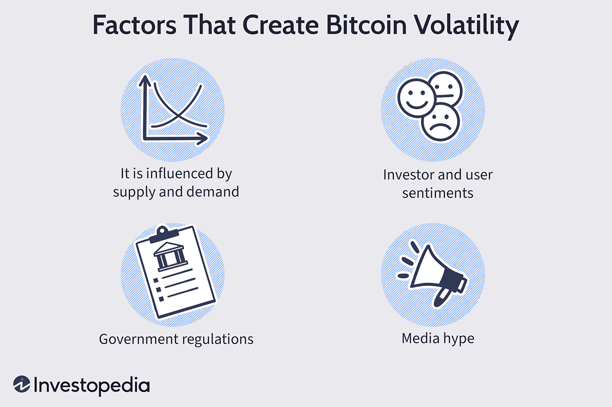

## Table of Contents

## What is Bitcoin and why is it important in the financial market?

Bitcoin is a type of digital money that was created in 2009. It's different from regular money because it's not controlled by any government or bank. Instead, it uses a technology called blockchain, which is like a public record book that everyone can see and check. People can send and receive bitcoins through the internet, and it's secure because of special codes and math problems that need to be solved.

Bitcoin is important in the financial market for a few reasons. First, it's the first and most well-known cryptocurrency, which has led to the creation of many other digital currencies. This has changed the way people think about money and how it can be used. Second, Bitcoin has shown that it's possible to have a financial system that works without banks or governments. This idea has made people interested in new ways of handling money and investments. Even though Bitcoin can be risky because its value goes up and down a lot, it has opened up new possibilities in the world of finance.

## What are Bitcoin exchange reserves and how are they calculated?

Bitcoin exchange reserves are the total amount of Bitcoin that is stored on cryptocurrency exchanges. These reserves are important because they show how much Bitcoin is available for trading on these platforms. When people want to buy or sell Bitcoin, they usually do it through an exchange. So, the amount of Bitcoin on these exchanges can affect the price and how easy it is to trade.

To calculate Bitcoin exchange reserves, people look at the public records on the blockchain. Each exchange has special addresses where they keep their Bitcoin. By adding up all the Bitcoin in these addresses, you can find out the total reserves. This information is often shared by the exchanges themselves or tracked by companies that watch the [cryptocurrency](/wiki/cryptocurrency) market. It's a way to keep an eye on how much Bitcoin is available for trading and how the market is doing.

## How do Bitcoin exchange reserves influence the price of Bitcoin?

Bitcoin exchange reserves can influence the price of Bitcoin because they show how much Bitcoin is available for people to buy and sell. When there is a lot of Bitcoin on exchanges, it means there is more supply. If more people want to sell than buy, the price might go down. On the other hand, if there is less Bitcoin on exchanges, it means the supply is low. If more people want to buy than sell, the price might go up because there is less Bitcoin to go around.

Changes in exchange reserves can also tell us about what people think will happen to Bitcoin's price in the future. If people are moving their Bitcoin off exchanges and into their own wallets, it might mean they think the price will go up and they want to hold onto it. This can make the price go up because there is less Bitcoin available on exchanges for trading. If people are moving their Bitcoin onto exchanges, it might mean they want to sell, which can make the price go down because there is more Bitcoin available for trading.

## What is meant by 'returns' in the context of Bitcoin?

Returns in the context of Bitcoin mean how much money you can make or lose by buying and holding Bitcoin. When people talk about returns, they are usually looking at the change in Bitcoin's price over time. If you buy Bitcoin at a low price and the price goes up later, you can sell it for more than you paid, making a profit. This profit is your return. On the other hand, if the price goes down, you might sell it for less than you paid, and your return would be a loss.

Returns can also be affected by other things, like trading fees and the time you hold onto Bitcoin. If you keep Bitcoin for a long time, you might see big changes in its price, which can lead to big returns, either positive or negative. Short-term trading can also give you returns, but it often involves more risk because Bitcoin's price can change a lot in a short time. Understanding returns helps people decide if they want to invest in Bitcoin and how long they should hold onto it.

## How can Bitcoin returns be measured and analyzed?

To measure Bitcoin returns, you start by looking at the price of Bitcoin when you buy it and then compare it to the price when you sell it. If you bought Bitcoin at $10,000 and sold it later at $15,000, your return would be the difference, which is $5,000. You can also figure out the percentage return by dividing the profit by the original price and multiplying by 100. In this case, the percentage return would be ($5,000 / $10,000) * 100 = 50%. This simple calculation helps you see how much money you made or lost from your investment in Bitcoin.

To analyze Bitcoin returns, you can look at different time periods to see how the price has changed. For example, you might look at daily, weekly, monthly, or yearly returns to understand how Bitcoin's price moves over time. You can also compare Bitcoin's returns to other investments like stocks or gold to see if it's doing better or worse. Another way to analyze returns is by using charts and graphs to spot patterns or trends. This can help you make better decisions about when to buy or sell Bitcoin. By studying these returns, you can learn more about Bitcoin's risks and potential rewards.

## What is volatility in the context of Bitcoin, and why is it significant?

Volatility in the context of Bitcoin means how much the price of Bitcoin goes up and down over time. It's like a roller coaster ride for the price. If Bitcoin's price changes a lot in a short time, we say it has high [volatility](/wiki/volatility-trading-strategies). If the price stays pretty much the same, it has low volatility. Bitcoin is known for being very volatile, which means its price can jump around a lot.

This volatility is significant because it affects how people think about Bitcoin as an investment. When the price moves a lot, it can be both good and bad. If you buy Bitcoin and the price goes up quickly, you can make a lot of money. But if the price drops suddenly, you can lose a lot of money too. This makes Bitcoin a risky choice for some people. Understanding volatility helps people decide if they want to invest in Bitcoin and how much risk they are willing to take.

## How do Bitcoin exchange reserves predict Bitcoin returns?

Bitcoin exchange reserves can give us clues about what might happen to Bitcoin returns. When a lot of Bitcoin is kept on exchanges, it means there's more Bitcoin available for people to buy and sell. If people are moving their Bitcoin onto exchanges, it might mean they want to sell it soon. This could make the price go down, which would lead to lower returns for people who own Bitcoin. On the other hand, if there's less Bitcoin on exchanges, it might mean people are holding onto their Bitcoin, thinking the price will go up. This could make the price go up, leading to higher returns.

By watching the changes in Bitcoin exchange reserves, people can try to guess what might happen to the price of Bitcoin. If the reserves are going down, it might be a sign that people are feeling good about Bitcoin and expect the price to rise, which could mean better returns. If the reserves are going up, it might be a sign that people are feeling worried and expect the price to fall, which could mean worse returns. While this isn't a perfect way to predict the future, it can help people make smarter choices about when to buy or sell Bitcoin.

## Can Bitcoin exchange reserves accurately predict Bitcoin volatility? If so, how?

Bitcoin exchange reserves can give us some ideas about Bitcoin's volatility, but they don't always predict it perfectly. When people move a lot of Bitcoin onto exchanges, it might mean they want to sell it soon. This can make the price go up and down a lot, which means higher volatility. On the other hand, if people are moving their Bitcoin off exchanges and into their own wallets, it might mean they want to hold onto it, which can make the price more stable and lower the volatility.

However, there are a lot of other things that can affect Bitcoin's volatility, like news about Bitcoin, changes in laws, and what people think will happen in the future. So, just looking at exchange reserves isn't enough to know for sure what will happen to Bitcoin's price swings. But, if you see big changes in the reserves, it can be a helpful clue to watch out for more volatility coming.

## What statistical methods are commonly used to analyze the relationship between Bitcoin exchange reserves, returns, and volatility?

To understand how Bitcoin exchange reserves, returns, and volatility are related, people often use simple statistical methods like correlation and regression analysis. Correlation helps us see if changes in exchange reserves go along with changes in returns or volatility. For example, if reserves go up and the price goes down, there might be a negative correlation between reserves and returns. Regression analysis goes a step further by trying to predict how much returns or volatility might change based on the amount of Bitcoin on exchanges. These methods help us see patterns and make guesses about what might happen next, but they don't tell us for sure what will happen.

Another common method is time series analysis, which looks at how Bitcoin exchange reserves, returns, and volatility change over time. By studying past data, we can see if there are any repeating patterns or trends. For example, if we notice that every time reserves drop, the volatility goes up a few weeks later, we can use this information to make better guesses about future volatility. However, because Bitcoin is affected by so many things, like news and what people think, these statistical methods can only give us hints, not exact predictions. They are useful tools, but we always need to remember that the crypto world can be unpredictable.

## How do external factors like regulatory news or macroeconomic trends affect the predictive power of Bitcoin exchange reserves?

External factors like regulatory news or macroeconomic trends can make it harder to use Bitcoin exchange reserves to predict what will happen to Bitcoin's price or how much it will go up and down. When there's big news about new rules for Bitcoin or changes in the economy, it can make a lot of people want to buy or sell Bitcoin all at once. This can change the amount of Bitcoin on exchanges very quickly, but it doesn't always mean the same thing for the price. For example, if a country says it will allow Bitcoin to be used more freely, people might move their Bitcoin onto exchanges to sell it and make a quick profit, making the reserves go up. But the price might still go up because more people want to buy it.

Because of these external factors, looking at exchange reserves alone can be tricky. They can give us some clues about what might happen, but they don't tell the whole story. If there's a big economic event, like a change in interest rates or a big stock market drop, it can shake up the whole market, including Bitcoin. So, even if the reserves are going down, which might usually mean the price will go up, a sudden bad economic news can make the price go down instead. This means that while exchange reserves are useful, we always need to think about other things happening in the world to get a better idea of what might happen to Bitcoin's price and how much it might swing around.

## What are the limitations of using Bitcoin exchange reserves to predict returns and volatility?

Using Bitcoin exchange reserves to predict returns and volatility has some big limitations. One main problem is that there are many other things that can change Bitcoin's price and how much it goes up and down. News about new laws or big changes in the economy can make people want to buy or sell Bitcoin very quickly, which can mess up what the reserves are telling us. For example, if there's a new rule that makes it easier to use Bitcoin, people might move their Bitcoin onto exchanges to sell it and make a quick profit, but the price might still go up because more people want to buy it. So, just looking at the reserves might not give us the whole picture.

Another limitation is that the crypto world can be very unpredictable. Even if we see a pattern in the past, like how the price moves when reserves go up or down, it doesn't mean the same thing will happen every time. People's feelings about Bitcoin can change a lot, and this can make the price do unexpected things. Also, the data about exchange reserves might not always be perfect or up-to-date, which can make it hard to use them to make good guesses about what will happen next. So, while exchange reserves can give us some clues, they are just one piece of the puzzle and can't tell us everything about what might happen to Bitcoin's price or how much it might swing around.

## How can investors and traders use the insights from Bitcoin exchange reserves to make informed decisions?

Investors and traders can use the insights from Bitcoin exchange reserves to get a better idea of what might happen to Bitcoin's price. When they see that a lot of Bitcoin is moving onto exchanges, it might mean that people want to sell it soon. This could make the price go down, so they might decide to sell their Bitcoin before it drops too much. On the other hand, if they see that Bitcoin is being moved off exchanges and into people's own wallets, it might mean that people think the price will go up. This could be a good time for investors to buy more Bitcoin, hoping to make a profit later.

However, it's important for investors and traders to remember that Bitcoin exchange reserves are just one piece of information. They should also pay attention to other things like news about new laws, big changes in the economy, and what people are saying about Bitcoin. By looking at all these things together, they can make smarter choices about when to buy or sell Bitcoin. Even though the reserves can give some helpful clues, the crypto world can be very unpredictable, so it's always good to be careful and not rely on just one thing to make decisions.

## References & Further Reading

[1]: Hoang, L. T., & Baur, D. G. (2019). ["Thematic Study on Bitcoin Exchange Reserves."](https://papers.ssrn.com/sol3/papers.cfm?abstract_id=3519225) Journal of Risk and Financial Management, 12(1), 24.

[2]: CryptoQuant. ["Exchange Reserve Data Analysis."](https://cryptoquant.com/asset/btc/chart/exchange-flows/exchange-reserve) CryptoQuant Blog.

[3]: Lopez de Prado, M. (2018). ["Advances in Financial Machine Learning."](https://books.google.com/books/about/Advances_in_Financial_Machine_Learning.html?id=oU9KDwAAQBAJ) John Wiley & Sons.

[4]: Baur, D. G., Hong, K., & Lee, A. D. (2018). ["Bitcoin: Medium of Exchange or Speculative Assets?"](https://papers.ssrn.com/sol3/papers.cfm?abstract_id=2561183) Journal of Financial Stability, 34, 106-118.

[5]: Antonopoulos, A. M. (2017). ["Mastering Bitcoin: Unlocking Digital Cryptocurrencies."](https://books.google.com/books/about/Mastering_Bitcoin.html?id=IXmrBQAAQBAJ) O'Reilly Media.