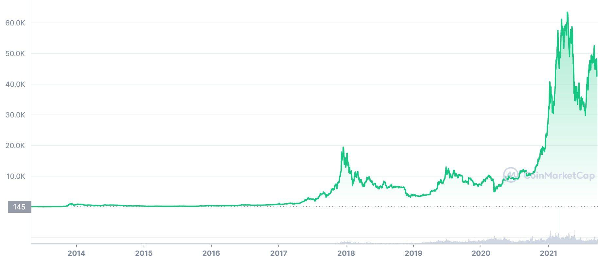

The evolving landscape of financial trading is characterized by rapid technological advancements and the rise of diverse asset classes. Among these, cryptocurrency trading has emerged as a significant player, marking a departure from traditional financial instruments. Cryptocurrency trading involves the buying and selling of digital assets through exchanges, leveraging blockchain technology, which is decentralized and cryptographically secured. This method of trading not only diversifies investment portfolios but also offers opportunities for significant returns. The market's 24/7 operation and global reach enrich its significance, making it a focal point for modern traders.

Bitcoin, as the pioneering cryptocurrency, remains at the forefront of this digital revolution. Launched in 2009 by an anonymous entity under the pseudonym Satoshi Nakamoto, Bitcoin introduced the concept of a decentralized digital currency. As the flagship cryptocurrency, its influence extends beyond its market capitalization. Bitcoin's adoption by institutions and individuals worldwide underpins its stability and perceived value, shaping broader cryptocurrency market trends.



Spread betting, traditionally associated with financial markets, has found a niche within cryptocurrency trading. This involves speculating on price movements without owning the asset. Traders benefit from leverage and can profit from both rising and falling markets, increasing the appeal of this trading method. Additionally, the tax-free advantage in certain jurisdictions makes spread betting an attractive option for traders seeking efficiency and flexibility in their strategies.

The rise of algorithmic trading represents a transformative force in financial markets. By utilizing algorithms to execute trades at high speed and volume, this technology optimizes trading strategies and minimizes human error. Algorithmic trading enhances market liquidity and price discovery, allowing traders to capitalize on small price changes with precision. Its integration with cryptocurrency and spread betting further illustrates the shifting paradigms in financial trading, where technology-driven models redefine the landscape.

These developments—cryptocurrency trading, Bitcoin's prominence, the strategic use of spread betting, and the innovations in algorithmic trading—underscore a dynamic interplay between technology and finance, shaping the future of trading and investment.

## Table of Contents

## Understanding Cryptocurrency Trading

Cryptocurrency trading represents the buying and selling of digital currencies, typically facilitated via online platforms known as cryptocurrency exchanges. The concept has evolved significantly since its inception, primarily due to advancements in technology and the increasing acceptance of cryptocurrencies worldwide.

Cryptocurrency exchanges are the cornerstone of the trading infrastructure, functioning as digital marketplaces where traders can exchange various cryptocurrencies for traditional fiat money or other digital assets. These exchanges operate similarly to traditional stock exchanges, but with extended trading hours and often a higher degree of price [volatility](/wiki/volatility-trading-strategies). The mechanics involve order [books](/wiki/algo-trading-books) where buy and sell orders are listed, and matching engines that match these orders based on price and time priorities. Popular exchanges include Binance, Coinbase, and Kraken, each differing in terms of trading pairs, fees, and geographical accessibility.

The [cryptocurrency](/wiki/cryptocurrency) market is influenced by a range of players, including retail traders, institutional investors, miners, and developers. Retail traders form the bulk of participants and are often driven by speculation. Institutional investors, such as hedge funds, bring significant capital and [liquidity](/wiki/liquidity-risk-premium), impacting price stability and market dynamics. Miners play a critical role in transaction processing and network security, while developers drive technological advancements through protocol enhancements.

Cryptocurrency trading offers several benefits, including high market liquidity, 24/7 trading opportunities, and potential for high returns. However, these benefits are countered by risks such as extreme volatility, security vulnerabilities, and regulatory uncertainties. Price fluctuations can be dramatic, leading to substantial gains or losses. Security risks arise from hacking incidents and fraud, necessitating robust risk management strategies. Regulatory actions can also influence market conditions, sometimes leading to sudden shifts in market sentiment.

To trade cryptocurrencies effectively, traders must utilize a range of tools and resources for analysis. Technical analysis tools, such as charting software and indicators like Moving Averages or Relative Strength Index (RSI), help in identifying trading patterns and trends. Fundamental analysis involves evaluating the underlying factors affecting cryptocurrency values, including technology updates, adoption rates, and macroeconomic factors. Additionally, news aggregators, sentiment analysis tools, and portfolio trackers provide comprehensive data and insights for making informed trading decisions.

The evolving landscape of cryptocurrency trading continues to be shaped by technological advances and market dynamics, necessitating a deep understanding and strategic approach to navigate its complexities effectively.

## Bitcoin: The Flagship Cryptocurrency

Bitcoin, introduced in 2009 by the pseudonymous developer Satoshi Nakamoto, marks a significant milestone in the evolution of digital currency. Its creation was detailed in the white paper "Bitcoin: A Peer-to-Peer Electronic Cash System," which laid the groundwork for a decentralized currency based on blockchain technology. This technological foundation is pivotal, as the blockchain consists of a distributed ledger maintained by a network of nodes, ensuring transparency and security without the need for a central authority.

Bitcoin's market has undergone substantial evolution since its inception, and currently, it remains the most prominent cryptocurrency. Its market capitalization often represents a substantial portion of the total cryptocurrency market, indicative of its wide acceptance and influence. Historical trends show Bitcoin's price has been subject to high volatility, largely due to market speculation, regulatory news, and macroeconomic factors. As of 2023, Bitcoin's adoption continues to grow, with increased interest from institutional investors and integration into various financial services.

The dominance of Bitcoin significantly affects overall cryptocurrency trading. It serves as a gateway for new investors entering the cryptocurrency space and often sets the market sentiment. Changes in Bitcoin's price trajectory can cause corresponding shifts in the broader market—a phenomenon referred to as the "Bitcoin Effect." This effect is largely attributed to Bitcoin's role as a benchmark for cryptocurrency performance and as a liquidity source within the market.

Bitcoin's volatility is influenced by several factors. Speculative trading is a primary driver, with traders often reacting to news, such as regulatory developments or technological advancements. Additionally, scarcity mechanisms intrinsic to Bitcoin, such as the halving event, which reduces the reward for mining new blocks by half approximately every four years, contribute to its price fluctuations. Moreover, Bitcoin's market structure, characterized by fragmented exchanges and relatively low liquidity compared to traditional currencies, accentuates its price volatility.

When considering investment strategies specific to Bitcoin trading, investors employ diverse approaches. Long-term holding, often known as "HODLing," capitalizes on Bitcoin's potential long-term appreciation. Conversely, some traders engage in short-term strategies, such as [day trading](/wiki/day-trading-spy) or swing trading, to take advantage of Bitcoin's intraday price movements. Diversification across different cryptocurrencies or traditional assets is another strategy investors use to mitigate risk and enhance portfolio stability. Utilizing financial derivatives, such as futures and options, is also becoming increasingly popular for hedging purposes within Bitcoin trading. 

The dynamic and evolving nature of Bitcoin necessitates a comprehensive understanding of market trends, technological advances, and regulatory developments for strategic investment decision-making.

## Exploring Spread Betting in Cryptocurrency

Spread betting, within the context of financial trading, refers to a speculative strategy where participants bet on the price movement of an asset without owning it. Instead of purchasing the asset, a trader speculates whether its price will rise or fall. With cryptocurrency trading, spread betting has emerged as an attractive option due to its flexibility and potential for high leverage.

### Benefits of Spread Betting for Cryptocurrency Traders

Spread betting offers various advantages for those engaged in cryptocurrency trading. One major benefit is leverage, allowing traders to initiate larger positions with a relatively smaller amount of capital. This leverage can amplify profits if predictions are accurate. Additionally, profits from spread betting in some jurisdictions are exempt from capital gains tax, a legal advantage particularly appealing to retail traders. Moreover, spread betting allows for short selling, which is crucial in markets as volatile as cryptocurrencies, enabling traders to profit from price declines.

### Key Differences Between Traditional Trading and Spread Betting

Traditional trading involves the actual exchange of financial assets, which can include buying or selling a physical asset or a derivative contract. In contrast, spread betting is a form of derivative trading where traders do not own the underlying asset. Instead, they bet on the price movement using a spread determined by the broker. Traditional trading typically incurs transaction fees and tax liabilities, while spread betting might offer tax-free profits, depending on the region.

### Risk Management Strategies for Spread Betting

Risk management is vital in spread betting due to the inherent leverage and volatility in cryptocurrency markets. Key strategies include setting stop-loss and take-profit levels, which automatically close positions at predetermined points to manage potential losses or secure gains. Diversification, another essential strategy, involves spreading bets across various cryptocurrencies or other asset classes to reduce exposure to any single market event. Position sizing is equally critical—traders should not risk more than a small percentage of their trading capital on a single bet.

### Popular Platforms and Tools for Cryptocurrency Spread Betting

Several platforms offer robust tools for engaging in cryptocurrency spread betting. These platforms typically provide comprehensive software with charting tools, technical indicators, and news feeds to help traders make informed decisions. Notable platforms include IG, eToro, and Plus500, each offering various features suitable for different trading strategies. Advanced features like [algorithmic trading](/wiki/algorithmic-trading) support and customizable trading dashboards cater to both novice and experienced traders. Some platforms also offer demo accounts, allowing traders to practice and refine their strategies without financial risk.

In summary, spread betting in cryptocurrency trading is an appealing alternative to traditional trading methods, offering unique advantages and necessitating specific risk management approaches. As cryptocurrency markets continue to evolve, spread betting remains an innovative and accessible avenue for traders seeking to capitalize on market volatility.

## Basics of Algorithmic Trading

Algorithmic trading refers to the use of computer algorithms to automate trading activities, making decisions and executing trades with minimal human intervention. This approach leverages mathematical models, statistical analyses, and market data to identify and capitalize on trading opportunities across various asset classes, including equities, commodities, and cryptocurrencies. The primary objective of algorithmic trading is to enhance the speed, efficiency, and accuracy of trading operations, thus maximizing potential profits while minimizing costs and risks.

### Transforming Financial Markets

Algorithmic trading has fundamentally transformed financial markets by significantly increasing trading volumes and liquidity. It allows for rapid execution of trades, often within milliseconds, which can lead to more efficient price discovery and tighter bid-ask spreads. This transformation has made markets more accessible to a broader range of participants, including institutional investors, hedge funds, and retail traders. Furthermore, algorithmic trading has facilitated the development of new trading strategies and financial instruments, contributing to the evolution of global markets.

### Types of Algorithms in Trading Strategies

Several types of algorithms are employed in trading strategies, each tailored to specific market conditions and objectives:

1. **Trend-Following Algorithms**: These algorithms identify and exploit price trends in the market. They typically use moving averages, channels, and pattern recognition to buy or sell based on the direction of the trend.

2. **Arbitrage Algorithms**: Designed to profit from price discrepancies in different markets or instruments, these algorithms execute trades to capitalize on inefficiencies. For instance, statistical arbitrage takes advantage of mean-reverting price series.

3. **Market-Making Algorithms**: These provide liquidity to markets by continuously posting buy and sell orders. Market-makers earn a profit from the bid-ask spread and rely on high-frequency trading to manage risk.

4. **Mean Reversion**: This strategy assumes that asset prices will revert to their mean over time, allowing traders to buy low and sell high. Algorithms identify deviation from the mean and execute orders when a reversion is likely.

5. **Machine Learning Algorithms**: Leveraging AI and machine learning, these algorithms can adapt to market changes by learning from data. They are capable of identifying complex patterns and predicting market movements with higher accuracy.

### Advantages of Algorithmic Trading

Algorithmic trading offers several advantages:

- **Efficiency and Speed**: Algorithms can process large volumes of data and execute trades at speeds unattainable by human traders, thus capturing opportunities as they arise.

- **Precision**: Automated systems can execute orders with precision, reducing the likelihood of human error and improving execution quality.

- **Cost Reduction**: By minimizing human intervention and the associated costs, algorithmic trading can reduce transaction costs and improve overall profitability.

- **Consistency**: Algorithms operate based on predefined rules, ensuring consistent application of trading strategies without the influence of emotions.

### Challenges and Risks of Algorithmic Trading

Despite its benefits, algorithmic trading also presents several challenges and risks:

- **Market Impact and Slippage**: Large algorithmic orders can have significant market impact, leading to slippage and affecting execution prices.

- **Reliance on Technology**: The dependence on stable and secure technological infrastructure makes algorithmic systems vulnerable to technical failures and cyber threats.

- **Overfitting and Model Risk**: There is a risk of algorithms being overfitted to historical data, reducing their effectiveness in changing market conditions.

- **Regulatory and Compliance Issues**: As automated trading practices evolve, regulatory bodies have implemented strict compliance requirements, adding complexity to algorithmic trading operations.

Overall, algorithmic trading is a key component of modern financial markets, driving both opportunities and challenges for participants seeking to achieve consistent and high-performance trading outcomes.

## Integrating Algo Trading with Bitcoin Spread Betting

Algorithmic trading, the use of computer algorithms to automate trading decisions, has become a cornerstone of modern financial markets, enhancing the speed and precision of trading processes. When combined with spread betting in the context of Bitcoin trading, algorithmic techniques can offer significant advantages. 

**Algorithmic Trading Enhancements to Spread Betting**

Algorithmic trading enhances spread betting strategies by automating the decision-making process. Algorithms can quickly analyze large datasets, identify trading opportunities, and execute trades with minimal latency. For spread betting, which involves speculating on the price movement without owning the underlying asset, this automation can improve the efficiency and speed of speculation, reducing the manual effort involved and minimizing human error.

**Creating and Testing Algorithms for Bitcoin Spread Betting**

Developing effective algorithms for Bitcoin spread betting involves several steps. First, traders must define their strategy, including entry and [exit](/wiki/exit-strategy) points, risk tolerance, and market conditions. Python is a popular language for developing trading algorithms due to its rich library ecosystem. For instance, traders can use libraries like Pandas for data manipulation and analysis, NumPy for numerical calculations, and TA-Lib for technical analysis. Here is an example of creating a simple moving average (SMA) crossover strategy:

```python
import pandas as pd
import numpy as np

# Load historical Bitcoin data
data = pd.read_csv('bitcoin_data.csv')
data['SMA_short'] = data['Close'].rolling(window=10).mean()
data['SMA_long'] = data['Close'].rolling(window=50).mean()

# Generate buy/sell signals
data['Signal'] = 0
data['Signal'][10:] = np.where(data['SMA_short'][10:] > data['SMA_long'][10:], 1, 0)
data['Position'] = data['Signal'].diff()

# Display signals
buy_signals = data[data['Position'] == 1]
sell_signals = data[data['Position'] == -1]
```

Testing the algorithms typically involves [backtesting](/wiki/backtesting), where historical price data is used to simulate how the strategy would have performed in the past. Tools like Backtrader or QuantConnect can be utilized for this purpose, allowing traders to refine their algorithms by assessing their profitability, drawdowns, and risk exposure.

**Case Studies of Successful Integration in Trading Strategies**

There have been numerous instances where algorithmic strategies have been successfully integrated into trading systems. For example, market-making algorithms in Bitcoin spread betting capitalize on the bid-ask spread, continuously placing buy and sell orders to profit from price volatility. Such strategies require precise execution enabled by algorithms capable of operating at lightning speed in response to market changes. 

**Practical Tips for Developing a Robust Algo Trading System**

1. **Focus on Robustness**: Ensure your algorithms can handle unexpected market conditions and data anomalies. This includes incorporating stop-loss and take-profit levels to manage risk effectively.

2. **Scalability**: Design systems that can handle increasing amounts of data and transactions as your strategy scales.

3. **Continuous Monitoring and Updates**: Markets change, and so should your strategy. Regularly update your model with fresh data and perform recurring validations.

4. **Risk Management**: Incorporate quantitative risk assessment measures. Value-at-risk (VaR) and conditional value-at-risk (CVaR) can be used to quantify potential losses.

**Challenges and Considerations for Algo Trading in Volatile Markets**

Algorithmic trading in volatile markets, such as the cryptocurrency space, poses certain challenges. One notable risk is slippage, where the executed price differs from the expected price due to rapid price movements. This can be mitigated by employing sophisticated order types, such as limit orders, to control execution prices more effectively. High-frequency trading might exacerbate market risks, so algorithms that exploit fleeting [arbitrage](/wiki/arbitrage) opportunities need rigorous testing and risk constraints to avoid substantial losses during volatile conditions.

In summary, integrating algorithmic trading with Bitcoin spread betting demands a careful approach to system design, strategic alignment, and risk management. With the right tools and methodologies, traders can leverage algorithms to enhance the efficiency and effectiveness of their spread betting strategies in the dynamic world of cryptocurrency trading.

## Conclusion

Cryptocurrency trading, as a rapidly evolving field, continues to attract significant interest due to its potential for high returns and transformative impact on financial markets. This article highlighted the foundational aspects of cryptocurrency trading, with Bitcoin being the pioneer and most influential digital currency. Understanding Bitcoin's market dynamics and its inherent volatility is crucial for anyone involved in cryptocurrency trading.

Looking forward, the future of cryptocurrency trading is aligned with emerging trends such as increased institutional adoption, advancements in blockchain technology, and regulatory developments. These factors are likely to improve market stability and accessibility, further integrating digital currencies into the global financial system.

Spread betting and algorithmic (algo) trading, which were also examined in the discussion, hold significant potential for enhancing trading strategies. Spread betting offers a flexible approach due to its leverage opportunities and tax advantages in some jurisdictions. When combined with algorithmic trading—which allows for automated, efficient, and data-driven decision-making—the synergy can lead to optimized trading outcomes.

To navigate this evolving landscape effectively, traders must adopt informed and strategic approaches. This includes staying updated on market trends, continuously learning new strategies, and employing robust risk management techniques. Understanding both the opportunities and risks in cryptocurrency trading is essential to develop a sustainable trading strategy.

Finally, navigating this dynamic financial environment requires adaptability and a willingness to leverage emerging technologies. By staying informed and strategically employing tools like spread betting and algorithmic trading, individuals and institutions can better position themselves in the cryptocurrency market, taking advantage of its growth while mitigating inherent risks. As the landscape evolves, staying engaged with educational resources and communities helps traders refine their strategies and remain competitive.

## Additional Resources

### Suggested Reading Materials and Educational Platforms

For those looking to deepen their understanding of cryptocurrency trading, books such as "Mastering Bitcoin" by Andreas M. Antonopoulos and "The Age of Cryptocurrency" by Paul Vigna and Michael J. Casey offer insightful perspectives. For a focus on algorithmic trading, "Algorithmic Trading: Winning Strategies and Their Rationale" by Ernest P. Chan is highly recommended. Educational platforms like Coursera, Khan Academy, and Udacity offer courses on financial markets, blockchain technology, and trading strategies, providing a structured learning path.

### Online Courses and Certifications for Further Learning

To gain a more technical expertise in cryptocurrency and trading, courses such as Princeton University’s "Bitcoin and Cryptocurrency Technologies" on Coursera, and "Algorithmic Trading and Finance Models with Python, R, and Stata Essential Training" from LinkedIn Learning are valuable. For certifications, the Chartered Financial Analyst (CFA) program offers modules on fintech and crypto-assets, while the CryptoCurrency Certification Consortium (C4) provides certifications focusing on cryptocurrency knowledge.

### List of Influential Industry Experts to Follow

A few key figures in the cryptocurrency and trading spaces include Andreas M. Antonopoulos, known for his work on Bitcoin; Vitalik Buterin, co-founder of Ethereum; and CZ (Changpeng Zhao), the CEO of Binance. In algorithmic trading, following experts like Dr. Ernest P. Chan and Kevin Davey, a professional trader with a focus on algorithmic strategies, can provide useful insights into current trends and future possibilities.

### Recommended Financial Tools and Software for Traders

For effective cryptocurrency and algorithmic trading, software such as MetaTrader 5, TradingView, and Binance offer robust tools for analysis and trade execution. Python libraries like Pandas and NumPy can be used for developing custom algorithms, while platforms like QuantConnect and Alpaca provide resources for backtesting and deploying trading algorithms.

### Links to Active Online Communities and Forums

Engaging with online communities can provide real-time insights and support. Reddit's /r/cryptocurrency and /r/algotrading are popular forums for discussion and resource sharing. Stack Exchange's Bitcoin and Quantitative Finance communities offer platforms for technical questions and in-depth discussions. Twitter also serves as a rapid news source and a place to engage with industry leaders.

## References & Further Reading

[1]: Nakamoto, S. (2008). ["Bitcoin: A Peer-to-Peer Electronic Cash System."](https://nakamotoinstitute.org/library/bitcoin/) Bitcoin.org.

[2]: Antonopoulos, A. M. (2017). ["Mastering Bitcoin: Unlocking Digital Cryptocurrencies."](https://www.amazon.com/Mastering-Bitcoin-Unlocking-Digital-Cryptocurrencies/dp/1449374042) O'Reilly Media.

[3]: Vigna, P. & Casey, M. J. (2016). ["The Age of Cryptocurrency: How Bitcoin and Digital Money Are Challenging the Global Economic Order."](https://dl.acm.org/doi/10.5555/2717097) Picador.

[4]: Chan, E. P. (2013). ["Algorithmic Trading: Winning Strategies and Their Rationale."](https://github.com/ftvision/quant_trading_echan_book) Wiley.

[5]: Vasant, P. (2016). ["Handbook of Research on Holistic Optimization Techniques in the Hospitality, Tourism, and Travel Industry."](https://www.igi-global.com/book/handbook-research-holistic-optimization-techniques/157535) IGI Global.

[6]: Jansen, S. (2020). ["Machine Learning for Algorithmic Trading - Second Edition."](https://github.com/PacktPublishing/Machine-Learning-for-Algorithmic-Trading-Second-Edition) Packt Publishing.

[7]: ["Bitcoin and Cryptocurrency Technologies"](https://bitcoinbook.cs.princeton.edu/) by Princeton University on Coursera.

[8]: Lopez de Prado, M. (2018). ["Advances in Financial Machine Learning."](https://www.amazon.com/Advances-Financial-Machine-Learning-Marcos/dp/1119482089) Wiley.

[9]: "Trading and Exchanges: Market Microstructure for Practitioners" by Larry Harris (2003). Available on Amazon.