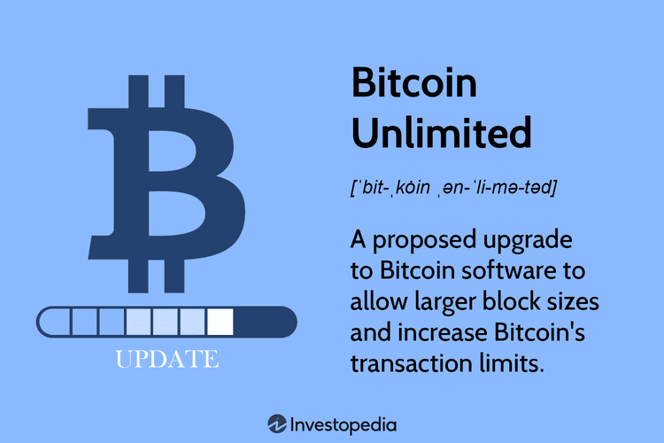

## Table of Contents

## What is Bitcoin Unlimited?

Bitcoin Unlimited is a type of software that some people use to help run the Bitcoin network. It's different from the main Bitcoin software because it lets users decide how big each group of transactions, called a block, can be. With Bitcoin Unlimited, people can choose to make blocks bigger if they think it will help the network work better and handle more transactions.

This idea came about because some people thought the original Bitcoin software, which limits blocks to 1MB, was too restrictive. They believed that bigger blocks could make transactions faster and cheaper. But not everyone agrees with this idea. Some worry that bigger blocks might make the network harder to run and less secure. So, Bitcoin Unlimited is one way that some people are trying to change how Bitcoin works, but it's still a topic that people debate a lot.

## How does Bitcoin Unlimited differ from Bitcoin Core?

Bitcoin Unlimited and Bitcoin Core are two different software versions used to run the Bitcoin network. The main difference between them is how they handle the size of blocks, which are groups of transactions. Bitcoin Core sticks to a strict rule that says each block can only be 1MB big. This rule helps keep the network running smoothly and securely, but it also means that the network can only handle a certain number of transactions at a time. On the other hand, Bitcoin Unlimited lets users decide how big blocks can be. If most users agree, blocks can get bigger, which some people think could help the network handle more transactions faster and cheaper.

This difference in how they manage block size comes from different ideas about what's best for Bitcoin. Bitcoin Core supporters believe that keeping blocks small is important for making sure anyone can run the software and that the network stays secure. They worry that bigger blocks might make it harder for regular people to run the network and could lead to problems. Meanwhile, Bitcoin Unlimited supporters think that bigger blocks are needed to make Bitcoin more useful for everyday transactions. They believe that letting the community decide on block size is a more flexible way to improve the network. These different views have led to a lot of debate and discussion in the Bitcoin community.

## What are the main features of Bitcoin Unlimited?

Bitcoin Unlimited is a type of software that helps run the Bitcoin network. It's different from the main Bitcoin software because it lets users choose how big each group of transactions, called a block, can be. With Bitcoin Unlimited, people can decide to make blocks bigger if they think it will help the network work better and handle more transactions. This is important because some people believe that bigger blocks can make transactions faster and cheaper, which is good for using Bitcoin in everyday life.

However, not everyone agrees on making blocks bigger. Some worry that bigger blocks might make the network harder to run and less secure. Bitcoin Unlimited tries to solve this by letting users vote on the block size. If most users agree, the block size can change. This way, the community can decide what's best for the network. Bitcoin Unlimited also includes other features to help the network run smoothly, like better ways to share data and keep the network connected.

## How does Bitcoin Unlimited propose to solve the scalability issue?

Bitcoin Unlimited tries to solve the scalability issue by letting users decide how big blocks of transactions can be. In the main Bitcoin software, called Bitcoin Core, each block is limited to 1MB. This limit can slow down the network and make transactions more expensive when there are a lot of them. Bitcoin Unlimited lets the community vote on the block size. If most users agree, blocks can get bigger, which means the network can handle more transactions at once. This could make transactions faster and cheaper, which is good for using Bitcoin in everyday life.

However, not everyone agrees with this idea. Some people worry that bigger blocks might make the network harder to run and less secure. They think that keeping blocks small is important for making sure anyone can use the software and that the network stays safe. Bitcoin Unlimited tries to address these concerns by letting users vote on changes. This way, the community can decide what's best for the network. By giving users more control over block size, Bitcoin Unlimited aims to make the network more flexible and able to grow as more people use it.

## What is the concept of Emergent Consensus in Bitcoin Unlimited?

Emergent Consensus is a special idea in Bitcoin Unlimited that helps decide how big blocks of transactions can be. In regular Bitcoin software, called Bitcoin Core, each block is limited to 1MB. But with Emergent Consensus, users can vote on the block size. If most users agree, blocks can get bigger. This means the network can handle more transactions at once, which could make transactions faster and cheaper.

This idea is different because it lets the community decide on the block size instead of having a fixed rule. Some people like this because it makes the network more flexible. They think it can help Bitcoin grow and be used more in everyday life. But not everyone agrees. Some worry that bigger blocks might make the network harder to run and less secure. Emergent Consensus tries to solve this by letting users vote on changes, so the community can decide what's best for the network.

## How can someone start using Bitcoin Unlimited?

To start using Bitcoin Unlimited, you first need to download the software from their official website. Once you've downloaded it, you'll need to install it on your computer. After installation, you can start the Bitcoin Unlimited software, which will begin to sync with the Bitcoin network. This might take some time because it needs to download and check all the past transactions. Once it's done syncing, you can start using Bitcoin Unlimited to send and receive bitcoins, just like you would with the regular Bitcoin software.

Using Bitcoin Unlimited also means you can vote on how big blocks of transactions can be. This is different from the regular Bitcoin software, which has a fixed block size. With Bitcoin Unlimited, if most users agree, blocks can get bigger. This might help the network handle more transactions faster and cheaper. To vote, you'll need to set your preferred block size in the software settings. Remember, using Bitcoin Unlimited is a choice, and it's part of a bigger discussion about how to make Bitcoin work better for everyone.

## What are the potential risks and benefits of using Bitcoin Unlimited?

Using Bitcoin Unlimited can have some good points. It lets users decide how big blocks of transactions can be, which might make the network handle more transactions faster and cheaper. This could be really helpful if you want to use Bitcoin for everyday things like buying coffee or paying bills. Also, Bitcoin Unlimited lets the community vote on changes, so everyone has a say in how the network grows. This way, the network can change and improve based on what most people think is best.

But there are also some risks to think about. Some people worry that bigger blocks might make the network harder to run and less secure. If blocks get too big, it might be tough for regular people to keep up with the network, and that could lead to problems. Also, not everyone agrees with Bitcoin Unlimited's ideas, so using it might cause disagreements and splits in the Bitcoin community. It's important to understand these risks and think about what they mean for the future of Bitcoin before deciding to use Bitcoin Unlimited.

## How does Bitcoin Unlimited handle block size limits?

Bitcoin Unlimited lets users decide how big blocks of transactions can be. In the regular Bitcoin software, called Bitcoin Core, each block is limited to 1MB. But with Bitcoin Unlimited, if most users agree, blocks can get bigger. This means the network can handle more transactions at once, which could make transactions faster and cheaper. It's like voting on the size of a suitcase; if everyone agrees, you can use a bigger one to [carry](/wiki/carry-trading) more stuff.

This way of deciding on block size is called Emergent Consensus. It's different because it doesn't have a fixed rule like Bitcoin Core. Some people like this because it makes the network more flexible and can help Bitcoin grow. But not everyone agrees. Some worry that bigger blocks might make the network harder to run and less secure. They think keeping blocks small is important for making sure anyone can use the software and the network stays safe. So, Bitcoin Unlimited tries to balance these ideas by letting the community vote on changes.

## What has been the historical performance of Bitcoin Unlimited?

Bitcoin Unlimited started as a way to let users decide how big blocks of transactions can be. It was created because some people thought the regular Bitcoin software, which limits blocks to 1MB, was too restrictive. They believed that bigger blocks could help the network handle more transactions faster and cheaper. When Bitcoin Unlimited was first introduced, it got a lot of attention and support from people who wanted to see Bitcoin grow and be used more in everyday life. However, it also faced a lot of criticism and debate, especially from those who worried about the security and stability of the network with bigger blocks.

Over time, Bitcoin Unlimited didn't become the main way people use Bitcoin. In 2017, there was a big debate about whether to use Bitcoin Unlimited or stick with the regular software. This led to a split in the Bitcoin community, and some people even created a new type of Bitcoin called Bitcoin Cash, which used some ideas from Bitcoin Unlimited. Since then, Bitcoin Unlimited has continued to be used by a smaller group of people who believe in its ideas. It hasn't become as popular as the regular Bitcoin software, but it's still an important part of the discussion about how to make Bitcoin work better for everyone.

## How does Bitcoin Unlimited interact with other cryptocurrencies?

Bitcoin Unlimited is mainly about changing how Bitcoin works, but it doesn't directly connect with other cryptocurrencies. It's a different way to run the Bitcoin network, where users can vote on how big blocks of transactions can be. This idea is part of a bigger discussion about making Bitcoin better, but it doesn't change how Bitcoin interacts with other cryptocurrencies like Ethereum or Litecoin. Those other cryptocurrencies have their own rules and networks, so Bitcoin Unlimited's changes only affect Bitcoin.

Even though Bitcoin Unlimited doesn't directly interact with other cryptocurrencies, its ideas have influenced some of them. For example, when people disagreed about Bitcoin Unlimited, some created Bitcoin Cash, which used similar ideas about bigger blocks. This shows how ideas from Bitcoin Unlimited can spread to other parts of the [cryptocurrency](/wiki/cryptocurrency) world. But overall, Bitcoin Unlimited is focused on Bitcoin and doesn't change how Bitcoin talks to or works with other cryptocurrencies.

## What are the current developments and future plans for Bitcoin Unlimited?

Bitcoin Unlimited keeps working on making Bitcoin better by letting users decide on the size of blocks. They are always updating their software to make it easier to use and more secure. They also listen to what the community wants and try to make changes that help Bitcoin grow. Right now, they are focusing on improving how fast transactions can happen and making sure the network stays strong and reliable.

In the future, Bitcoin Unlimited wants to keep making the network more flexible. They plan to keep letting users vote on important changes, like block size, so the community can decide what's best for Bitcoin. They also want to work on new ways to make transactions even faster and cheaper, so more people can use Bitcoin for everyday things. By doing this, they hope to help Bitcoin become a bigger part of how people use money around the world.

## What are the expert opinions and criticisms regarding Bitcoin Unlimited?

Experts have different opinions about Bitcoin Unlimited. Some experts like it because it lets users decide how big blocks can be. They think this can help the Bitcoin network handle more transactions faster and cheaper. This could make Bitcoin better for everyday use, like buying things at stores. These experts believe that letting the community vote on changes is a good way to make the network grow and improve.

However, not all experts agree with Bitcoin Unlimited. Some worry that bigger blocks might make the network harder to run and less secure. They think that keeping blocks small is important for making sure anyone can use the software and that the network stays safe. These experts are concerned that if blocks get too big, it might cause problems and make it difficult for regular people to keep up with the network. This disagreement has led to a lot of debate in the Bitcoin community about the best way to make Bitcoin work better for everyone.

## References & Further Reading

[1]: Narayanan, A., Bonneau, J., Felten, E., Miller, A., & Goldfeder, S. (2016). ["Bitcoin and Cryptocurrency Technologies: A Comprehensive Introduction."](https://press.princeton.edu/books/hardcover/9780691171692/bitcoin-and-cryptocurrency-technologies) Princeton University Press.

[2]: Nakamoto, S. (2008). ["Bitcoin: A Peer-to-Peer Electronic Cash System."](https://nakamotoinstitute.org/library/bitcoin/)

[3]: Antonopoulos, A. M. (2017). ["Mastering Bitcoin: Unlocking Digital Cryptocurrencies."](https://books.google.com/books/about/Mastering_Bitcoin.html?id=IXmrBQAAQBAJ) O'Reilly Media.

[4]: Bonneau, J., Miller, A., Clark, J., Narayanan, A., Kroll, J. A., & Felten, E. W. (2015). ["Sok: Research perspectives and challenges for Bitcoin and cryptocurrencies."](https://ieeexplore.ieee.org/document/7163021) IEEE Security and Privacy.

[5]: Poon, J., & Dryja, T. (2016). ["The Bitcoin Lightning Network: Scalable Off-Chain Instant Payments."](https://lightning.network/lightning-network-paper.pdf) 

[6]: Wu, V. (2022). ["Demystifying Algorithmic Trading: A Comprehensive Guide for Beginners and Professionals."](https://www.tradingview.com/chart/META/YE7wzDuK-Demystifying-Algo-Trading-A-Comprehensive-Guide-for-Beginners/)

[7]: Buterin, V. (2014). ["A Next-Generation Smart Contract & Decentralized Application Platform."](https://ethereum.org/content/whitepaper/whitepaper-pdf/Ethereum_Whitepaper_-_Buterin_2014.pdf)