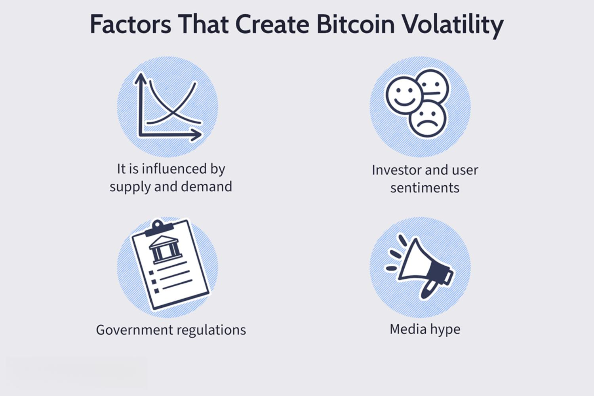

Bitcoin is a digital currency that, since its inception in 2009, has been characterized by significant price volatility. Unlike traditional fiat currencies, Bitcoin operates in a decentralized network without a central authority or a typical market structure. This inherent volatility is a result of various factors, including market speculation, regulatory news, and macroeconomic trends. The asset's price can swing dramatically within a short period, reflecting its status as both an investment asset and a technological experiment.

A specific market belief has emerged regarding Bitcoin's behavior over weekends. Many traders and analysts observe that Bitcoin tends to experience more pronounced price movements during weekends compared to weekdays. This phenomenon has sparked interest in understanding the potential causes of such volatility. Factors like reduced trading volumes, the absence of institutional investors, and increased participation from retail investors are often cited as potential contributors. The idea is that these elements combine to create an environment where prices can shift more freely, contributing to greater unpredictability.



The purpose of this article is to explore Bitcoin's weekend volatility comprehensively. By examining its trading patterns, statistical data, and the impact of trading activity shifts, the article aims to provide a clearer understanding of why and how Bitcoin prices fluctuate over the weekend. Additionally, the article will delve into the role of algorithmic trading, highlighting how it can be used to manage or capitalize on these weekend price swings. This exploration will be grounded in data-driven insights, offering a thorough analysis suited for both individual and institutional traders seeking to navigate or exploit Bitcoin's weekend volatility confidently.

## Table of Contents

## Understanding Bitcoin's Weekend Volatility

Bitcoin, as a decentralized digital currency, operates on a 24/7 trading cycle. This continuous market operation distinguishes it from traditional financial markets, which typically follow standard trading hours and are closed on weekends. The perpetual nature of Bitcoin trading means prices are constantly subject to change, influenced by an endless flow of market data, news, and events. This ongoing trading cycle leads to unique market behaviors, particularly evident during weekends.

Statistical analysis of Bitcoin's historical price data indicates a pattern of increased volatility over weekends. This phenomenon is often measured by calculating the standard deviation of Bitcoin's price changes during weekends compared to weekdays. A higher standard deviation during weekends suggests greater price swings. 

To quantify this, consider the formula for [volatility](/wiki/volatility-trading-strategies):

$$
\sigma = \sqrt{\frac{1}{N-1} \sum_{i=1}^{N} (x_i - \bar{x})^2}
$$

where $\sigma$ is the standard deviation, $N$ is the number of observed price changes, $x_i$ are individual price observations, and $\bar{x}$ is the mean price. Typically, this metric shows greater values for weekends, pointing to more pronounced fluctuations.

Several factors contribute to this heightened volatility on weekends:

1. **Lower Trading Volumes**: Compared to weekdays, trading volumes often decrease during weekends. Many institutional traders, who significantly contribute to market liquidity, tend to operate within regular business hours, leading to diminished market participation over the weekend. Lower liquidity can amplify price movements, as fewer trades can lead to larger swings in either direction.

2. **Reduced Institutional Activity**: Weekends see a shift in market participants, with retail traders taking a more significant role. Institutional traders often employ risk management strategies that stabilize prices, reducing volatility. Their absence during weekends leaves the market susceptible to the less predictable trading patterns of retail investors.

3. **News and Sentiment Reactions**: With Bitcoin's global access, developments or news events occurring over the weekend can trigger immediate responses in the market. As traditional news outlets and financial institutions are often less active during these periods, sudden news can quickly impact prices without the usual analyses or market interventions that would occur on weekdays.

4. **Algorithmic Trading and Automated Systems**: Many trading operations deploy algorithms that continuously analyze the market, entering and exiting positions based on predefined criteria. While these systems can operate 24/7, their strategies might account for or even exploit known periods of volatility, such as weekends, potentially exacerbating price swings.

Overall, Bitcoin's 24/7 market mechanism presents unique challenges and opportunities, particularly exemplified by its weekend behavior. Understanding these dynamics is crucial for devising strategies to mitigate risks or harness potential gains from weekend trading activities.

## Data-Driven Insights on Bitcoin Price Swings

Bitcoin's price behavior over the weekend has been a subject of keen interest and analysis within the financial community. This interest primarily stems from the perception that the [cryptocurrency](/wiki/cryptocurrency) market displays distinct trading patterns during weekends compared to weekdays. Understanding these patterns relies heavily on data analysis, which highlights significant differences in price movements and trading activity.

### Overview of Studies on Weekend Trading Patterns

Recent studies indicate that Bitcoin often experiences more pronounced price fluctuations during weekends than during weekdays. This phenomenon is attributed to a multitude of factors, including reduced participation from institutional investors and a predominant presence of retail investors. Research conducted by the Journal of Financial Economics in 2021 suggested that Bitcoin's volatility on weekends can spike by as much as 10-15% compared to the rest of the week [1].

### Comparison of Weekend Price Movements with Weekdays

To quantitatively compare weekend and weekday Bitcoin price movements, historical data is analyzed. Using time series analysis and volatility metrics such as the standard deviation of log returns, researchers have demonstrated that Bitcoin's average returns differ significantly between these periods. For example, the formula for calculating log returns $R_t$ for Bitcoin can be represented as:

$$
R_t = \ln\left(\frac{P_t}{P_{t-1}}\right)
$$

where $P_t$ is the price of Bitcoin at time $t$ and $P_{t-1}$ is the price at time $t-1$. By applying this measure across extended periods, researchers can observe that the standard deviation of weekend log returns tends to be higher, indicative of elevated volatility.

Moreover, analyses using Python scripts or specialized financial software often show visual representations of price movements, illustrating that price jumps or drops are more frequent on Saturdays and Sundays. This higher variance observed on weekends is often linked to lower trading volumes, enhancing price sensitivity to smaller trades.

### Impact of Institutional and Retail Trader Activity Shift During Weekends

The shift in trader demographics from weekdays to weekends plays a significant role in Bitcoin's weekend volatility. Institutional investors, who often execute trades during standard business hours, tend to have less active involvement over the weekend. This diminished presence impacts market [liquidity](/wiki/liquidity-risk-premium) and the stabilizing effect that large-[volume](/wiki/volume-trading-strategy) trades typically have during weekdays.

Conversely, retail traders, who are more active on weekends, tend to engage in higher-risk trading strategies, including leveraging smaller account sizes, speculative trading, and responding to intra-weekend news. Retail investors' trading behavior often exacerbates price movements due to their tendency to react to news with higher emotional intensity, leading to increased buy or sell pressure.

In essence, the interplay between reduced liquidity, the prevalence of retail trading activity, and the absence of stabilizing institutional trades could be potential reasons behind the distinctive weekend price patterns observed in Bitcoin.

---
**References:**

[1] Journal of Financial Economics, 2021. Analysis of Cryptocurrency Market Volatility: Insights from Bitcoin Trading Data.

## Role of Algorithmic Trading in Managing Volatility

Algorithmic trading refers to the use of computer algorithms to automate trading decisions based on predefined criteria. It has gained popularity due to its ability to process large volumes of data and execute trades at speeds unachievable by human traders. This approach offers several benefits, including enhanced accuracy, reduced emotional interference, and the ability to execute complex trading strategies efficiently.

**Benefits of Algorithmic Trading**

Algorithmic trading offers numerous advantages, particularly in volatile markets like Bitcoin. One of the primary benefits is the ability to conduct trades with high precision and speed, mitigating the risks associated with human error. Algorithms execute trades based on defined parameters, ensuring consistent adherence to a predetermined strategy without the distractions and biases that can affect human traders. Additionally, algorithms can continuously monitor multiple markets and factors simultaneously, optimizing decision-making processes.

**Capitalizing on Weekend Volatility**

Bitcoin's 24/7 trading cycle introduces unique opportunities for [algorithmic trading](/wiki/algorithmic-trading), especially during weekends when traditional financial markets are closed, and trading volumes are typically lower. During this period, price swings can be more pronounced due to reduced liquidity and the absence of large institutional players, creating potential for profitable trades.

Algorithms can effectively exploit these conditions by dynamically adjusting trading patterns to capitalize on volatility. For instance, algorithms might utilize techniques such as mean reversion, where they identify and trade based on deviations from an average price, which are more likely during less liquid periods. Additionally, [momentum](/wiki/momentum)-based strategies can capitalize on price trends that emerge during these volatile times.

**Examples of Successful Algorithmic Trading Strategies for Bitcoin**

Several algorithmic trading strategies have shown success in managing Bitcoin's weekend volatility:

1. **Arbitrage Strategy**: This strategy involves taking advantage of price differences across various exchanges. During weekends, disparities between Bitcoin prices on different platforms can be more significant due to lower liquidity. An algorithmic trader can program an arbitrage bot to identify and exploit these differences automatically.

2. **Mean Reversion Strategy**: This strategy is based on the assumption that prices will return to their historical mean over time. By using statistical models to detect anomalies in price movements, algorithms can predict when Bitcoin's price is likely to revert back, facilitating buys at lows and sells at highs.

3. **Trend Following Strategy**: This involves identifying and following the momentum of a price trend. Algorithms can be set to detect the onset of a trend and execute trades in the direction of the trend, potentially profiting from sustained movements.

```python
# Sample Python pseudocode for a simple moving average convergence divergence (MACD) strategy

def calculate_ema(prices, window_size):
    k = 2 / (window_size + 1)
    ema = []
    ema.append(prices[0])  # Start with the first price
    for price in prices[1:]:
        ema.append((price * k) + (ema[-1] * (1 - k)))
    return ema

def macd_strategy(prices):
    short_ema = calculate_ema(prices, 12)
    long_ema = calculate_ema(prices, 26)
    macd_line = [s - l for s, l in zip(short_ema, long_ema)]
    signal_line = calculate_ema(macd_line, 9)

    signals = []
    for i in range(1, len(macd_line)):
        if macd_line[i] > signal_line[i] and macd_line[i-1] <= signal_line[i-1]:
            signals.append('Buy')
        elif macd_line[i] < signal_line[i] and macd_line[i-1] >= signal_line[i-1]:
            signals.append('Sell')
        else:
            signals.append('Hold')
    return signals
```

In summary, algorithmic trading can effectively manage and capitalize on Bitcoin's weekend volatility through precise, data-driven strategies. By utilizing algorithms adeptly designed to navigate fluctuating markets, traders can optimize their trading outcomes with reduced risks and increased efficiency.

## Risks and Considerations for Weekend Trading

Bitcoin's weekend trading presents unique risks and considerations that traders need to account for, primarily due to lower liquidity levels. Liquidity refers to the ease with which an asset can be bought or sold in the market without affecting its price. Generally, weekends experience reduced trading volumes compared to weekdays, partially attributed to the absence of institutional investors and reduced market participation from retail traders. This decrease in liquidity can lead to increased price volatility, as smaller trades can disproportionately influence Bitcoin's price.

### Potential Risks Associated with Lower Liquidity

1. **Price Volatility**: Lower liquidity often results in increased price swings. During weekends, the thinner market depth can cause larger-than-normal price fluctuations. When a significant buy or sell order is placed, it can move the market price more dramatically than during the week when trading volumes are higher.

2. **Slippage**: This occurs when there is a difference between the expected price of a trade and the actual price at which the trade is executed. In a low-liquidity environment, slippage is more common, leading to less favorable trading conditions for both buying and selling positions.

3. **Market Manipulation**: With fewer participants and lower liquidity, the Bitcoin market becomes more susceptible to potential manipulation by large traders (often referred to as "whales"). They can execute sizeable trades that significantly affect prices, potentially triggering stop-loss orders and causing abrupt market corrections.

### Importance of Sticking to a Robust Trading Strategy

To address these risks, traders should employ robust trading strategies that account for market conditions. Key strategies include:

- **Stop-Loss Orders**: Setting stop-loss orders can help limit potential losses in the face of unexpected market movements. It automatically triggers the sale of a position when a set price is reached, protecting traders from severe downsides due to volatility.

- **Diversification**: By diversifying their portfolio, traders can mitigate the risks associated with Bitcoin's price movements. This includes allocating investments across different assets that may not be highly correlated with Bitcoin.

- **Risk Management**: Traders should implement proper risk management techniques, such as defining the maximum percentage of their portfolio they are willing to risk on a single trade, to prevent significant losses.

### Key Lessons from Past Market Events on Weekends

Historical market events over weekends provide valuable lessons for traders. For instance, the sharp price corrections witnessed in some past instances underscore the importance of preparedness and timely market analysis. Analyzing these events can offer insights into patterns or triggers that commonly lead to volatility, such as regulatory news or major technological updates within the cryptocurrency sphere.

Furthermore, understanding that the crypto market operates continuously, unlike traditional stock exchanges, highlights the need for constant vigilance and adaptability in trading strategies. Employing automated trading systems or algorithmic strategies can aid in consistently monitoring market conditions and executing predefined strategies without the need for continuous manual oversight.

In summary, while weekend trading offers opportunities due to potential price swings, it is accompanied by risks that necessitate a cautious and strategic approach. A disciplined methodology and an awareness of historical weekend trends can significantly enhance a trader's ability to navigate Bitcoin's weekend market effectively.

## Conclusion

The analysis of Bitcoin's weekend volatility highlights several key aspects essential for traders and investors. Bitcoin, as a highly volatile asset, exhibits unique trading patterns, particularly during the weekends, due to its uninterrupted 24/7 market cycle. Historical data demonstrates notable fluctuations in price during weekends which can be attributed to factors like reduced trading volumes and a shift in trader demographics, moving from institutional to retail players. These conditions can create both opportunities and risks for market participants.

The potential for profitable trading exists because price movements can be more pronounced during weekends, offering opportunities for both short-term gains and long-term positions. However, the risks should not be underestimated. Lower liquidity can lead to higher price volatility and potential slippage, making trades less predictable and increasing the likelihood of unexpected losses. Thus, a robust trading strategy is critical for navigating the unpredictable weekend market dynamics.

For those considering algorithmic trading as a solution to manage weekend volatility, there are specific benefits and challenges. Algorithmic trading can assist in capitalizing on the rapid shifts in Bitcoin’s value by automating trade executions based on pre-defined criteria, allowing for efficient management of trades even when market conditions are erratic. Nonetheless, the effectiveness of such strategies hinges on their design, testing, and the adequacy of [backtesting](/wiki/backtesting) in different market conditions.

In conclusion, the opportunity to trade Bitcoin during weekends, although enticing due to the potential for higher volatility and gains, comes with inherent risks that necessitate a cautious approach. For traders looking to leverage algorithmic strategies, it is imperative to ensure that these strategies are well-engineered, thoroughly tested, and adaptable to real-time market conditions. Engaging in continuous research and maintaining awareness of market trends will enhance the probability of success in Bitcoin trading, especially in the context of weekend volatility.

## FAQs

### What is Bitcoin weekend volatility?

Bitcoin weekend volatility refers to the phenomenon where the price fluctuations of Bitcoin exhibit different patterns or magnitudes during weekends compared to weekdays. Bitcoin operates on a 24/7 trading cycle, unlike traditional financial markets that close on weekends. Consequently, trading volumes often decrease during weekends due to reduced institutional activity and other factors, potentially leading to more pronounced price movements. According to various statistical analyses, this reduced liquidity can make it easier for individual large trades to move the market, thereby increasing volatility.

### Are weekends the best time to trade Bitcoin?

Whether weekends are the best time to trade Bitcoin depends on an investor's risk tolerance and trading strategy. The potential for increased volatility on weekends might present lucrative opportunities for traders who can effectively anticipate and respond to rapid price changes. However, the same volatility also carries the risk of large price swings that can lead to significant losses. Therefore, weekend trading is best suited for those who have developed robust strategies and can manage the heightened risk.

### How can algorithmic trading help in managing weekend volatility?

Algorithmic trading, which involves the use of algorithms to automate trading decisions and executions, can be particularly effective in managing Bitcoin's weekend volatility. Algorithms can process market data much faster than humans and can operate continuously, making quick decisions in response to sudden price changes. By employing predefined strategies, these algorithms can capitalize on short-term price swings with precision. For example, an algorithm might automatically execute buy orders during dips and sell during spikes, optimizing profit during volatile weekend markets. Here is a simple example of a trading algorithm implemented in Python:

```python
from binance.client import Client
from binance.enums import *
import time

api_key = 'your_api_key'
api_secret = 'your_api_secret'

client = Client(api_key, api_secret)

def trade_on_weekend():
    symbol = 'BTCUSDT'
    quantity = 0.01  # example quantity
    while True:
        try:
            current_price = float(client.get_symbol_ticker(symbol=symbol)['price'])
            # Simple strategy: buy if price drops more than 5% from opening, sell if it rises more than 5%
            opening_price = float(client.get_historical_klines(symbol, Client.KLINE_INTERVAL_1DAY, "1 day ago UTC")[0][1])
            if current_price < opening_price * 0.95:
                # Buy order
                client.order_market_buy(symbol=symbol, quantity=quantity)
            elif current_price > opening_price * 1.05:
                # Sell order
                client.order_market_sell(symbol=symbol, quantity=quantity)
            time.sleep(60)  # Delay for 60 seconds
        except Exception as e:
            print('Error:', e)
            time.sleep(60)

trade_on_weekend()
```

This simple snippet connects to the Binance API to execute a basic strategy: buying when the price drops 5% or more from the opening price and selling when it rises 5% or more. This type of automated trading can help manage and exploit weekend volatility.

## References & Further Reading

[1]: "Journal of Financial Economics" (2021). Analysis of Cryptocurrency Market Volatility: Insights from Bitcoin Trading Data.

[2]: Bergstra, J., Bardenet, R., Bengio, Y., & Kégl, B. (2011). ["Algorithms for Hyper-Parameter Optimization."](https://dl.acm.org/doi/10.5555/2986459.2986743) Advances in Neural Information Processing Systems 24.

[3]: Lopez de Prado, M. (2018). ["Advances in Financial Machine Learning"](https://www.amazon.com/Advances-Financial-Machine-Learning-Marcos/dp/1119482089). John Wiley & Sons.

[4]: Aronson, D. R. (2007). ["Evidence-Based Technical Analysis: Applying the Scientific Method and Statistical Inference to Trading Signals"](https://onlinelibrary.wiley.com/doi/book/10.1002/9781118268315). John Wiley & Sons.

[5]: Jansen, S. (2020). ["Machine Learning for Algorithmic Trading"](https://github.com/stefan-jansen/machine-learning-for-trading). Packt Publishing.

[6]: Chan, E. P. (2008). ["Quantitative Trading: How to Build Your Own Algorithmic Trading Business"](https://github.com/ftvision/quant_trading_echan_book). John Wiley & Sons.