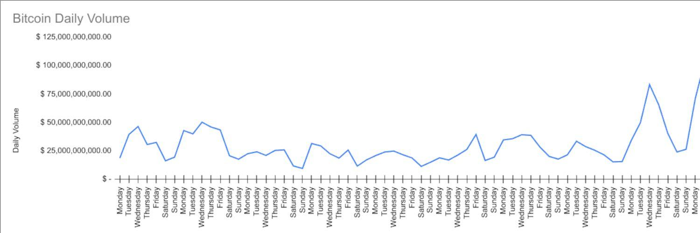

## Table of Contents

## What is Bitcoin and why is it important?

Bitcoin is a type of digital money that you can use to buy things online. It's different from regular money because it's not controlled by any government or bank. Instead, it uses a special technology called blockchain, which is like a big, public record book that keeps track of all Bitcoin transactions. People can send and receive Bitcoins using the internet, and it's designed to be safe and private.

Bitcoin is important for a few reasons. First, it gives people a new way to pay for things without needing a bank account. This can be really helpful for people who don't have easy access to banks. Second, because Bitcoin isn't controlled by any one group, it can be seen as a way to keep money safe from things like inflation or government control. This makes it attractive to people who want more control over their own money. Overall, Bitcoin is changing the way we think about and use money.

## What does 'price volatility' mean in the context of cryptocurrencies?

Price volatility in the context of cryptocurrencies means that the value of these digital currencies can change a lot and very quickly. For example, the price of Bitcoin might go up a lot one day and then drop a lot the next day. This can happen because cryptocurrencies are not controlled by governments or banks, so their prices can be influenced by what people think and say about them on the internet or news.

This big change in price can be both good and bad. If you buy a cryptocurrency and its price goes up, you can make a lot of money. But if the price goes down, you could lose money too. Because of this, people who want to invest in cryptocurrencies need to be ready for the prices to move a lot and be okay with the risk that comes with it.

## How does Bitcoin's price typically behave over weekends?

Bitcoin's price can be a bit wild over weekends. This is because fewer people are trading, so the price can swing more easily. If something big happens in the news, like a country saying they will use Bitcoin, the price might jump up or down a lot because there are not as many people buying and selling to keep it steady.

Sometimes, the price might not change much over the weekend if nothing big is happening. But if there is a lot of news or if people are talking a lot about Bitcoin on social media, you might see the price move more than usual. It's hard to predict exactly what will happen, but weekends can be a time when Bitcoin's price might be more up and down.

## What are the main factors that contribute to Bitcoin's weekend price volatility?

One big reason Bitcoin's price can jump around a lot over weekends is because fewer people are trading. During the week, lots of people buy and sell Bitcoin, which helps keep the price more steady. But on weekends, many people are not at work and might not be watching the market as closely. This means that if someone wants to buy or sell a lot of Bitcoin, it can make the price move more than usual because there are not as many other people trading to balance it out.

Another factor is news and social media. If something important happens over the weekend, like a country saying they will start using Bitcoin or a big company announcing they will accept it, this news can spread quickly on social media. Because fewer people are trading, this news can have a bigger effect on the price. People might get excited or worried and start buying or selling more, which can make the price go up and down a lot.

## Can you explain the concept of 'weekend effect' in Bitcoin trading?

The 'weekend effect' in Bitcoin trading means that Bitcoin's price can change more during weekends than during the week. This happens because fewer people are trading on weekends. When there are fewer traders, it's easier for the price to move a lot if someone buys or sells a big amount of Bitcoin. It's like if you're playing a game with fewer players, one player's move can have a bigger impact.

News and social media also play a big role in the weekend effect. If something important about Bitcoin happens over the weekend, like a new law or a big company saying they will use Bitcoin, this news can spread fast on social media. Because there are fewer traders, this news can make the price go up or down more than it would during the week. So, weekends can be a time when Bitcoin's price might be more unpredictable.

## How do trading volumes on weekends compare to weekdays for Bitcoin?

Trading volumes for Bitcoin are usually lower on weekends compared to weekdays. During the week, more people are trading because they are at work and can keep an eye on the market. This means there are more buyers and sellers, which helps keep the price steady. But on weekends, many people are not working and might not be watching the market as closely, so there are fewer trades happening.

Because there are fewer trades on weekends, the price of Bitcoin can move more easily. If someone wants to buy or sell a lot of Bitcoin during the weekend, it can have a bigger effect on the price because there are not as many other people trading to balance it out. So, weekends can be a time when Bitcoin's price might be more up and down.

## What are some strategies traders use to mitigate risks associated with Bitcoin's weekend volatility?

Traders use different strategies to handle the risks that come with Bitcoin's price moving a lot over weekends. One common way is to use stop-loss orders. This means setting a price at which their Bitcoin will be sold automatically if the price drops to that level. This can help them avoid losing too much money if the price falls a lot over the weekend. Another strategy is to not trade at all over the weekend. Some traders choose to wait until the market is busier during the week when the price might be more stable.

Another approach is to use a strategy called dollar-cost averaging. This means buying a little bit of Bitcoin at regular times, no matter what the price is. By doing this over time, traders can spread out their risk and not have to worry so much about the price going up and down over weekends. Some traders also keep an eye on news and social media over the weekend. If they see something big happening, they might decide to trade or hold off until they see how things play out.

## How has Bitcoin's weekend volatility changed over the years?

Over the years, Bitcoin's weekend volatility has changed a lot. In the early days, when Bitcoin was new and not many people knew about it, the price could jump around wildly over weekends. There were fewer people trading, so if someone bought or sold a big amount, it could make the price go up or down a lot. As more people started using Bitcoin and trading it, the weekend volatility started to calm down a bit because there were more people trading even on weekends.

But even now, Bitcoin's price can still move more over weekends than during the week. This is because there are still fewer people trading on weekends compared to weekdays. Big news or things people say on social media can still make the price go up and down a lot. So, while Bitcoin's weekend volatility has changed and is not as wild as it used to be, it can still be something traders need to watch out for.

## What role do global events play in influencing Bitcoin's weekend price movements?

Global events can have a big impact on Bitcoin's price over weekends. When something important happens in the world, like a new law about cryptocurrencies or a big company saying they will use Bitcoin, it can make a lot of people want to buy or sell Bitcoin. Because fewer people are trading on weekends, these events can make the price move more than usual. If the news is good, like a country saying they will use Bitcoin, the price might go up a lot. If the news is bad, like a big hack or a country banning Bitcoin, the price might drop a lot.

These global events can spread quickly on social media over the weekend. When people see the news, they might get excited or worried and start trading more. Because there are fewer traders on weekends, this can make the price go up and down a lot. So, even though Bitcoin's price can be more stable now than in the past, big global events can still make weekends a time when the price might be more unpredictable.

## How do different time zones affect Bitcoin trading and volatility during weekends?

Different time zones can make Bitcoin trading and its price changes a bit tricky during weekends. When it's the weekend in one part of the world, it might be a weekday in another part. This means that while some people are not trading because it's the weekend for them, others might still be trading because it's a weekday for them. This can keep the market a bit more active even on weekends, but the number of people trading is still usually less than during the week.

Because of the time differences, news or events that happen in one part of the world can affect Bitcoin's price when it's the weekend for another part. If something big happens in Asia on their Saturday, it might make the price go up or down a lot when it's still Friday in America. This can lead to more price changes over the weekend as the news spreads around the world. So, even though different time zones can help keep some trading going, the overall lower number of traders still makes Bitcoin's price more likely to move a lot during weekends.

## What advanced technical indicators should an expert use to predict and analyze Bitcoin's weekend volatility?

To predict and analyze Bitcoin's weekend volatility, experts often use a few key technical indicators. One popular indicator is the Bollinger Bands, which show how much the price is moving around its average. When the bands get wider, it means the price is moving more, which can happen a lot over weekends. Another useful tool is the Average True Range (ATR), which measures how much the price changes from day to day. If the ATR is higher over the weekend, it shows that the price is more volatile. Experts also look at the Relative Strength Index (RSI) to see if Bitcoin is overbought or oversold, which can help predict if the price might go up or down a lot.

Another important indicator is the Volume Weighted Average Price (VWAP), which helps experts understand the average price Bitcoin is trading at, taking into account how much is being traded. This can be really helpful over weekends when trading volumes are lower. By comparing the current price to the VWAP, experts can see if Bitcoin is trading at a good value or if it might be due for a big price change. Using these indicators together, experts can get a better picture of what might happen with Bitcoin's price over the weekend and make smarter trading choices.

## How can institutional investors leverage Bitcoin's weekend volatility for portfolio diversification?

Institutional investors can use Bitcoin's weekend volatility to help spread out their investments and reduce risk. By putting some of their money into Bitcoin, they can take advantage of the times when the price goes up a lot over the weekend. This can help balance out their other investments that might not change as much. Because Bitcoin's price can move a lot more on weekends, it can add a different kind of risk and reward to their portfolio, making it more diverse.

To do this well, institutional investors need to be smart about how they handle the ups and downs of Bitcoin's price. They might use stop-loss orders to protect their money if the price drops a lot, or they might choose to buy a little bit of Bitcoin at regular times to spread out their risk. By carefully watching the market and using these strategies, they can use Bitcoin's weekend volatility to their advantage and make their overall investment portfolio stronger and more balanced.

## What contributes to Bitcoin's weekend volatility?

Bitcoin, as a decentralized digital currency, operates on a 24/7 trading cycle. This continuous market operation distinguishes it from traditional financial markets, which typically follow standard trading hours and are closed on weekends. The perpetual nature of Bitcoin trading means prices are constantly subject to change, influenced by an endless flow of market data, news, and events. This ongoing trading cycle leads to unique market behaviors, particularly evident during weekends.

Statistical analysis of Bitcoin's historical price data indicates a pattern of increased volatility over weekends. This phenomenon is often measured by calculating the standard deviation of Bitcoin's price changes during weekends compared to weekdays. A higher standard deviation during weekends suggests greater price swings. 

To quantify this, consider the formula for [volatility](/wiki/volatility-trading-strategies):

$$
\sigma = \sqrt{\frac{1}{N-1} \sum_{i=1}^{N} (x_i - \bar{x})^2}
$$

where $\sigma$ is the standard deviation, $N$ is the number of observed price changes, $x_i$ are individual price observations, and $\bar{x}$ is the mean price. Typically, this metric shows greater values for weekends, pointing to more pronounced fluctuations.

Several factors contribute to this heightened volatility on weekends:

1. **Lower Trading Volumes**: Compared to weekdays, trading volumes often decrease during weekends. Many institutional traders, who significantly contribute to market liquidity, tend to operate within regular business hours, leading to diminished market participation over the weekend. Lower liquidity can amplify price movements, as fewer trades can lead to larger swings in either direction.

2. **Reduced Institutional Activity**: Weekends see a shift in market participants, with retail traders taking a more significant role. Institutional traders often employ risk management strategies that stabilize prices, reducing volatility. Their absence during weekends leaves the market susceptible to the less predictable trading patterns of retail investors.

3. **News and Sentiment Reactions**: With Bitcoin's global access, developments or news events occurring over the weekend can trigger immediate responses in the market. As traditional news outlets and financial institutions are often less active during these periods, sudden news can quickly impact prices without the usual analyses or market interventions that would occur on weekdays.

4. **Algorithmic Trading and Automated Systems**: Many trading operations deploy algorithms that continuously analyze the market, entering and exiting positions based on predefined criteria. While these systems can operate 24/7, their strategies might account for or even exploit known periods of volatility, such as weekends, potentially exacerbating price swings.

Overall, Bitcoin's 24/7 market mechanism presents unique challenges and opportunities, particularly exemplified by its weekend behavior. Understanding these dynamics is crucial for devising strategies to mitigate risks or harness potential gains from weekend trading activities.

## What are the data-driven insights on Bitcoin price swings?

Bitcoin's price behavior over the weekend has been a subject of keen interest and analysis within the financial community. This interest primarily stems from the perception that the [cryptocurrency](/wiki/cryptocurrency) market displays distinct trading patterns during weekends compared to weekdays. Understanding these patterns relies heavily on data analysis, which highlights significant differences in price movements and trading activity.

### Overview of Studies on Weekend Trading Patterns

Recent studies indicate that Bitcoin often experiences more pronounced price fluctuations during weekends than during weekdays. This phenomenon is attributed to a multitude of factors, including reduced participation from institutional investors and a predominant presence of retail investors. Research conducted by the Journal of Financial Economics in 2021 suggested that Bitcoin's volatility on weekends can spike by as much as 10-15% compared to the rest of the week [1].

### Comparison of Weekend Price Movements with Weekdays

To quantitatively compare weekend and weekday Bitcoin price movements, historical data is analyzed. Using time series analysis and volatility metrics such as the standard deviation of log returns, researchers have demonstrated that Bitcoin's average returns differ significantly between these periods. For example, the formula for calculating log returns $R_t$ for Bitcoin can be represented as:

$$
R_t = \ln\left(\frac{P_t}{P_{t-1}}\right)
$$

where $P_t$ is the price of Bitcoin at time $t$ and $P_{t-1}$ is the price at time $t-1$. By applying this measure across extended periods, researchers can observe that the standard deviation of weekend log returns tends to be higher, indicative of elevated volatility.

Moreover, analyses using Python scripts or specialized financial software often show visual representations of price movements, illustrating that price jumps or drops are more frequent on Saturdays and Sundays. This higher variance observed on weekends is often linked to lower trading volumes, enhancing price sensitivity to smaller trades.

### Impact of Institutional and Retail Trader Activity Shift During Weekends

The shift in trader demographics from weekdays to weekends plays a significant role in Bitcoin's weekend volatility. Institutional investors, who often execute trades during standard business hours, tend to have less active involvement over the weekend. This diminished presence impacts market [liquidity](/wiki/liquidity-risk-premium) and the stabilizing effect that large-[volume](/wiki/volume-trading-strategy) trades typically have during weekdays.

Conversely, retail traders, who are more active on weekends, tend to engage in higher-risk trading strategies, including leveraging smaller account sizes, speculative trading, and responding to intra-weekend news. Retail investors' trading behavior often exacerbates price movements due to their tendency to react to news with higher emotional intensity, leading to increased buy or sell pressure.

In essence, the interplay between reduced liquidity, the prevalence of retail trading activity, and the absence of stabilizing institutional trades could be potential reasons behind the distinctive weekend price patterns observed in Bitcoin.

---
**References:**

[1] Journal of Financial Economics, 2021. Analysis of Cryptocurrency Market Volatility: Insights from Bitcoin Trading Data.

## References & Further Reading

[1]: "Journal of Financial Economics" (2021). Analysis of Cryptocurrency Market Volatility: Insights from Bitcoin Trading Data.

[2]: Bergstra, J., Bardenet, R., Bengio, Y., & Kégl, B. (2011). ["Algorithms for Hyper-Parameter Optimization."](https://dl.acm.org/doi/10.5555/2986459.2986743) Advances in Neural Information Processing Systems 24.

[3]: Lopez de Prado, M. (2018). ["Advances in Financial Machine Learning"](https://www.amazon.com/Advances-Financial-Machine-Learning-Marcos/dp/1119482089). John Wiley & Sons.

[4]: Aronson, D. R. (2007). ["Evidence-Based Technical Analysis: Applying the Scientific Method and Statistical Inference to Trading Signals"](https://onlinelibrary.wiley.com/doi/book/10.1002/9781118268315). John Wiley & Sons.

[5]: Jansen, S. (2020). ["Machine Learning for Algorithmic Trading"](https://github.com/stefan-jansen/machine-learning-for-trading). Packt Publishing.

[6]: Chan, E. P. (2008). ["Quantitative Trading: How to Build Your Own Algorithmic Trading Business"](https://github.com/ftvision/quant_trading_echan_book). John Wiley & Sons.