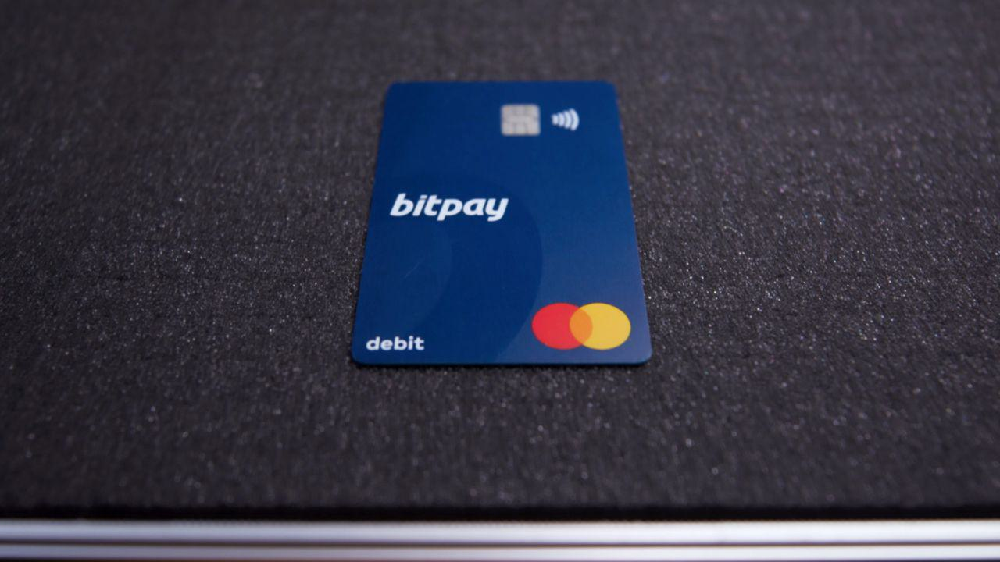

## Table of Contents

## What is the Bitpay Card?

The Bitpay Card is a special type of debit card that lets you spend your Bitcoin and other cryptocurrencies easily. You can load your card with Bitcoin, and then use it to buy things online or in stores, just like you would with a regular debit card. It works with many different cryptocurrencies, not just Bitcoin, which makes it very useful for people who own different types of digital money.

Using the Bitpay Card is simple. After you get the card, you can add money to it from your cryptocurrency wallet. Once the money is on the card, you can use it anywhere that accepts Visa. This means you can shop at millions of places around the world. Plus, you can manage your card and check your balance using a mobile app, which makes it easy to keep track of your spending.

## How does the Bitpay Card work?

The Bitpay Card lets you use your cryptocurrencies like Bitcoin to buy things. You put your Bitcoin or other digital money onto the card. Then, you can use the card to shop online or in stores, just like a regular debit card. The card works with Visa, so you can use it at millions of places around the world. This makes it easy to spend your cryptocurrencies without having to change them into regular money first.

To get started with the Bitpay Card, you first need to get the card and set it up. You can do this by downloading the Bitpay app on your phone. Once you have the app, you can add money to your card from your [cryptocurrency](/wiki/cryptocurrency) wallet. After your card has money on it, you can use it to make purchases. You can also check your balance and manage your card through the app, which helps you keep track of your spending easily.

## What cryptocurrencies can be used with the Bitpay Card?

The Bitpay Card lets you use many different cryptocurrencies to buy things. You can use Bitcoin, which is the most popular one. But you can also use other cryptocurrencies like Bitcoin Cash, Ethereum, and many more. This means you can choose the type of digital money you want to spend.

Using the Bitpay Card is easy because it works with so many types of cryptocurrencies. You just need to add your chosen cryptocurrency to the card, and then you can shop anywhere that takes Visa. This makes it simple to use your digital money without having to change it into regular money first.

## Where can the Bitpay Card be used?

The Bitpay Card can be used at many places around the world. It works wherever Visa is accepted, which means you can use it at millions of stores and online shops. This makes it easy to spend your Bitcoin and other cryptocurrencies at places you already shop.

You can use the Bitpay Card to buy things online or in stores. For example, you can use it to buy clothes, food, or anything else you need. It's like using a regular debit card, but you're spending your digital money instead of regular money.

## What are the fees associated with the Bitpay Card?

Using the Bitpay Card comes with some fees that you need to know about. There is a fee every time you add money to your card. This fee is usually around 1% to 3% of the amount you're adding, depending on the cryptocurrency you use. Also, if you use an ATM to get cash, there is a fee for that too. The ATM fee can be about $2.50 each time you use it.

There are also some other fees to think about. If you want to get your money back from a purchase, there might be a fee for that. And if you don't use your card for a while, there could be a fee just for keeping the card active. It's a good idea to check all the fees on the Bitpay website or app so you know what to expect.

## How can one apply for a Bitpay Card?

To apply for a Bitpay Card, you first need to download the Bitpay app on your phone. You can find it in the app store for your device. Once you have the app, you'll need to create an account with Bitpay. This means giving them some personal information, like your name and address. After your account is set up, you can apply for the card right in the app. It's a simple process where you'll need to provide some more details and agree to their terms.

After you apply, Bitpay will review your application. If everything is okay, they will send you the card. This might take a few days or a couple of weeks, depending on where you live. Once you get the card, you'll need to activate it using the app. Then, you can start adding your Bitcoin or other cryptocurrencies to the card and use it to shop wherever Visa is accepted. It's that easy to start spending your digital money with the Bitpay Card.

## What is the history behind the creation of the Bitpay Card?

The Bitpay Card was created to help people use their Bitcoin and other cryptocurrencies more easily. Bitpay, the company behind the card, started in 2011. They wanted to make it simpler for businesses to accept Bitcoin as payment. Over time, they saw that people also needed an easy way to spend their Bitcoin. So, in 2016, Bitpay teamed up with Visa to create the Bitpay Card. This card lets people load their Bitcoin onto a card and use it at places that accept Visa, making it much easier to spend digital money.

Since its launch, the Bitpay Card has grown to support more cryptocurrencies, not just Bitcoin. This made it even more useful for people who own different types of digital money. The card has helped more people use their cryptocurrencies in everyday life, making it a popular choice for those who want to spend their digital assets without having to convert them into regular money first.

## How has the Bitpay Card evolved over time?

The Bitpay Card started in 2016 when Bitpay worked with Visa to make it easier for people to spend their Bitcoin. At first, it was just for Bitcoin, but people liked it because they could use it at stores that take Visa. As more people started using cryptocurrencies, Bitpay saw that they needed to add more types of digital money to the card. So, they added support for other cryptocurrencies like Bitcoin Cash and Ethereum.

Over time, the Bitpay Card got better and better. Bitpay kept adding new features to make it easier to use. They made an app where people could check their balance and manage their card right from their phone. They also worked on making the fees clearer and sometimes lower. This helped more people feel comfortable using the card. Now, the Bitpay Card is a popular choice for people who want to spend their cryptocurrencies without changing them into regular money first.

## What security features does the Bitpay Card offer?

The Bitpay Card has several security features to keep your money safe. One important feature is that you can lock your card right from the app if you lose it or think someone might be using it without your permission. This means no one can use your card until you unlock it again. Also, the card uses a special technology called EMV chip, which makes it harder for people to steal your card information when you use it at a store.

Another way the Bitpay Card keeps you safe is by sending you alerts when there are big purchases or strange activities on your card. This way, you can quickly see if something is wrong and take action. Plus, all the information you enter into the Bitpay app is protected with strong encryption, which means it's very hard for anyone to see your private details. These security features work together to help you feel confident that your money and information are safe when using the Bitpay Card.

## How does the Bitpay Card handle transaction disputes and chargebacks?

If you have a problem with a purchase you made using the Bitpay Card, you can ask for a chargeback. This means you can try to get your money back if something goes wrong, like if you don't get what you paid for or if there's a mistake on your bill. To do this, you need to contact Bitpay's customer support. They will look into what happened and help you get your money back if they can.

The process of handling transaction disputes and chargebacks with the Bitpay Card can take some time. Bitpay will work with the store or website where you made the purchase to figure out what happened. If it turns out you were right and the purchase was wrong, Bitpay will try to return the money to your card. It's important to keep records of your purchases and any communication with the store, as this can help Bitpay solve the problem faster.

## What are the advantages of using the Bitpay Card over traditional credit cards?

Using the Bitpay Card has some big advantages over using regular credit cards. One big plus is that you can spend your Bitcoin and other cryptocurrencies easily. With a regular credit card, you can't do this. You have to change your digital money into regular money first, which can take time and might cost you extra money. But with the Bitpay Card, you can use your cryptocurrencies right away at millions of places that take Visa.

Another advantage is that the Bitpay Card helps you manage your money better. When you use a credit card, you can spend more money than you have, and then you have to pay it back later with interest. This can lead to debt. But with the Bitpay Card, you can only spend the money you already have in your cryptocurrency wallet. This means you're less likely to spend more than you can afford, helping you keep your finances in check.

## What future developments or enhancements are planned for the Bitpay Card?

Bitpay is always looking for ways to make the Bitpay Card even better. They want to add more cryptocurrencies to the card so people can use even more types of digital money. They are also thinking about ways to make the fees lower, so it costs less to use the card. Another thing they might do is add more ways to use the card, like letting people pay with it on more websites and apps.

Bitpay also wants to make the app easier to use. They might add new features that help people keep track of their spending and save money. They could also make it easier to get help if something goes wrong with a purchase. All these changes would make the Bitpay Card a better choice for people who want to spend their cryptocurrencies.

## References & Further Reading

[1]: Vigna, P., & Casey, M. J. (2016). ["The Age of Cryptocurrency: How Bitcoin and Digital Money Are Challenging the Global Economic Order."](https://archive.org/details/ageofcryptocurre0000vign) Picador.

[2]: Narang, R. K. (2013). ["Inside the Black Box: A Simple Guide to Quantitative and High-Frequency Trading."](https://onlinelibrary.wiley.com/doi/book/10.1002/9781118662717) Wiley.

[3]: Maymin, P., Maymin, Z., & Maymin, P. (2011). ["Transacting Bit by Bit: How the Blockchain Can Unblock Global Commerce."](https://philipmaymin.com/papers/Philip%20Maymin%20and%20Zakhar%20Maymin%20-%20Any%20Regulation%20of%20Risk%20Increases%20Risk%20-%20FMPM%202012.pdf) SSRN Electronic Journal.

[4]: Dixon, M. F., Halperin, I., & Bilokon, P. (2020). ["Machine Learning in Finance: From Theory to Practice."](https://link.springer.com/book/10.1007/978-3-030-41068-1) Springer.

[5]: Nakamoto, S. (2008). ["Bitcoin: A Peer-to-Peer Electronic Cash System."](https://nakamotoinstitute.org/library/bitcoin/) Bitcoin.org.