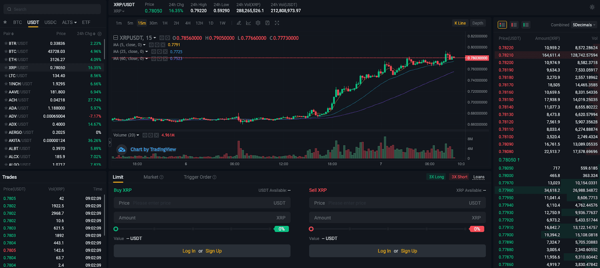

In this article, we will review the Bitrue cryptocurrency exchange, focusing on its platform features, including algo trading. Bitrue has established itself as a versatile exchange platform since its inception, catering to a broad spectrum of cryptocurrency traders. We will examine various aspects of Bitrue, highlighting both its strengths and areas that may require improvement when compared to other exchanges. Key features such as algorithmic trading, competitively structured fees, and robust security measures will be explored, providing a comprehensive understanding of the platform.

For traders, both new and experienced, choosing a suitable cryptocurrency exchange is crucial for a seamless trading experience. This review will aim to serve as a guide, presenting the multifaceted elements of Bitrue's platform. It will help you understand how Bitrue can support your trading strategies with its myriad of advanced tools and options. Whether you are looking for reduced trading fees, a wide range of supported cryptocurrencies, or innovative trading solutions, Bitrue offers a variety of opportunities to enhance your trading experience.

By the end of this review, you will be equipped with the knowledge to assess whether Bitrue is the right platform for your trading needs, with insights into how it compares to alternative exchanges.

## Table of Contents

## Overview of Bitrue Platform

Bitrue is a Seychelles-based cryptocurrency exchange that was established in 2018. In just a few years, the platform has grown to support over 700 cryptocurrencies, providing a broad array of digital assets for users. This extensive range offers traders and investors diverse options to build and manage their cryptocurrency portfolios. 

The platform facilitates both spot and futures trading, catering to a variety of trading strategies. Spot trading allows users to buy and sell cryptocurrencies at the current market price, offering a straightforward way to engage in the crypto market. Futures trading, on the other hand, is aimed at more experienced traders who wish to speculate on the future price movements of various cryptocurrencies, potentially benefiting from market volatility.

Despite not ranking among the top 50 exchanges globally by trading volume, Bitrue manages to deliver a competitive trading environment. It distinguishes itself through user-friendly design, an extensive list of supported cryptocurrencies, and innovative features tailored to both novice and seasoned traders.

An integral part of Bitrue's ecosystem is its native token, Bitrue Coin (BTR). Holding BTR provides users with several benefits, including reduced trading fees, which can significantly enhance trading cost efficiency. This token is a strategic component of Bitrue's offerings, as it encourages user engagement and loyalty while simultaneously serving as a tool for incentivizing trading activity on the platform.

## Trading Experience

Bitrue provides a comprehensive web-based trading platform designed to cater to both beginner and advanced traders. The platform is equipped with advanced charting tools that empower users to conduct detailed technical analysis, facilitating informed decision-making. These charting tools are complemented by market insights that provide real-time data on market trends and fluctuations, assisting traders in optimizing their trading strategies.

Traders on Bitrue have the flexibility to execute trades using both market orders and limit orders. A market order is executed immediately at the current market price, ensuring quick transaction completion. In contrast, a limit order allows traders to buy or sell a [cryptocurrency](/wiki/cryptocurrency) at a specific price or better, giving them control over the execution price. This flexibility supports a variety of trading styles, including [day trading](/wiki/day-trading-spy) and swing trading, and allows traders to tailor their strategies according to market conditions.

For those interested in high-risk, high-reward trading opportunities, Bitrue offers a futures trading platform. Futures trading allows investors to speculate on the price movement of cryptocurrencies without necessarily owning the underlying asset. This form of trading can significantly amplify potential returns but also introduces additional risks, making it suitable for experienced traders who are well-versed in market [volatility](/wiki/volatility-trading-strategies) and risk management.

Algo trading enthusiasts can take advantage of Bitrue's infrastructure, which is designed to accommodate [algorithmic trading](/wiki/algorithmic-trading) strategies. Algorithmic trading, or algo trading, involves using automated software to execute trades according to pre-set criteria. This approach is especially beneficial for executing trades at high speeds and across various conditions, making use of quantitative analysis and statistical models. Bitrue's platform supports this by providing reliable and streamlined trading forms and APIs for developers to interface their algorithms seamlessly.

New users, meanwhile, will find Bitrue's platform user-friendly, with a registration process that is both straightforward and quick. The platform's intuitive design ensures that users can navigate their trading accounts with ease, from setting up their profiles to executing their first trades. The step-by-step setup guide and resourceful support materials are beneficial in getting users familiar with the platform's features and functionalities, ensuring a smooth onboarding experience.

## Fees and Costs

Bitrue offers a competitive fee structure that appeals to a wide range of cryptocurrency traders. The platform's spot trading fees start at 0.28%, which can be significantly reduced for holders of Bitrue's native token, Bitrue Coin (BTR). This reduction in fees provides a cost-effective advantage, encouraging traders to engage with the platform actively.

Withdrawals of fiat currencies from Bitrue are free of charge, making it an attractive option for users needing to convert digital assets to traditional currency. However, cryptocurrency withdrawals incur a variable fee determined by the prevailing network conditions, which is a standard practice across most cryptocurrency exchanges.

The trading fees on Bitrue are generally lower than many large cryptocurrency exchanges, such as Binance or Coinbase, where fees can go up to 0.5% or higher without any discounts. This lower cost structure enhances Bitrue's appeal, especially among traders who engage in high-frequency trading strategies where costs can accumulate quickly.

Moreover, Bitrue's VIP Program offers further fee reductions and benefits. This program is tiered, offering increasing discounts based on the user's trading [volume](/wiki/volume-trading-strategy) and asset holdings on the platform. Such a tiered structure incentivizes sustained trading activity and asset retention on the platform, rewarding loyal customers with lower costs and improved trading conditions.

In summary, Bitrue's fee and cost structure provides a financially viable trading environment. With incentives for token holders and high-volume traders, it positions itself as a competitive choice in the cryptocurrency exchange market.

## Security Measures

Bitrue employs several security measures to ensure the safety of its users' assets and personal information. One of the foundational security features is two-[factor](/wiki/factor-investing) authentication (2FA), which requires users to provide two separate forms of identification before accessing their accounts. This additional layer of security significantly reduces the risk of unauthorized access. Furthermore, Bitrue uses cold wallet storage for the majority of its digital assets. Cold wallets are stored offline, making them less susceptible to hacking attempts compared to hot wallets, which are connected to the internet.

To further safeguard user assets, Bitrue has established a dedicated insurance fund. This fund is intended to compensate users in the event of a security breach. The existence of such a fund provides an added layer of financial security and demonstrates Bitrue's commitment to protecting its users.

Despite experiencing security breaches in the past, Bitrue has taken significant steps to improve its security infrastructure. The platform's quick response to these incidents and subsequent enhancements to its security protocols have helped rebuild user trust. Bitrue's proactive approach to addressing vulnerabilities demonstrates its dedication to maintaining a secure trading environment.

Bitrue also encourages all users to complete Know Your Customer (KYC) verification. KYC processes involve verifying the identity of users, which not only enhances security by ensuring that transactions are conducted by legitimate account holders but also provides access to the full range of platform features. Completing KYC verification is a critical step for users who wish to ensure their accounts are fully protected and benefit from all the functionalities Bitrue offers.

## Customer Service and Support

Bitrue provides 24/7 customer support through multiple channels, including live chat, comprehensive help pages, and an email ticketing system. These resources are designed to assist users with various concerns, from technical issues to account inquiries. 

User testimonials about Bitrue's customer service are mixed. Many users commend the platform for its ease of use and overall reliability, appreciating the straightforward navigation and diverse range of features available to both novice and experienced traders. However, several reviews point out specific challenges related to customer service responsiveness and timeliness. This feedback suggests that while the platform's support infrastructure is comprehensive, actual service delivery can vary, potentially leading to frustration for some users.

Despite these challenges, Bitrue remains a popular choice due to its robust trading platform and continual enhancements in customer engagement. The platform's dedication to maintaining a reliable trading environment and its ongoing efforts to improve support mechanisms demonstrate a commitment to user satisfaction and trust. Continued improvements in customer service could further solidify Bitrue's position as a competitive cryptocurrency exchange option.

## Final Verdict

Bitrue stands out as a versatile cryptocurrency exchange, accommodating a broad spectrum of traders with varying degrees of experience. The platform is particularly noted for its advanced trading features, making it an attractive option for more seasoned traders who wish to exploit sophisticated trading strategies, such as algorithmic trading and futures contracts. The integration of these features ensures that Bitrue provides a dynamic trading environment that can enhance the strategic capabilities of its users.

One of the primary appeals of Bitrue is its competitive fee structure. Starting at 0.28% for spot trading, the fees are lower than those found on many larger exchanges, which makes Bitrue an appealing option for traders who execute a high volume of transactions. Additionally, holders of the platform's native Bitrue Coin (BTR) benefit from reduced trading fees, offering an incentive for engaging more deeply with the platform.

In terms of security, Bitrue has developed a robust infrastructure to safeguard trader assets. Despite experiencing security breaches in the past, the platform has implemented sophisticated measures such as two-factor authentication and cold wallet storage to enhance user protection. The establishment of an insurance fund further demonstrates Bitrue's commitment to maintaining a secure trading environment.

Considering these aspects, Bitrue is well-suited for intermediate to advanced traders. It offers not only diverse trading options and low-cost transactions but also a secure and reliable platform for executing trades. These factors, combined with the extensive array of supported cryptocurrencies, make Bitrue a popular choice for those seeking both trading and [earning](/wiki/earning-announcement) opportunities in the cryptocurrency market.

## References & Further Reading

[1]: Bergstra, J., Bardenet, R., Bengio, Y., & Kégl, B. (2011). ["Algorithms for Hyper-Parameter Optimization."](https://papers.nips.cc/paper/4443-algorithms-for-hyper-parameter-optimization) Advances in Neural Information Processing Systems 24.

[2]: ["Advances in Financial Machine Learning"](https://www.amazon.com/Advances-Financial-Machine-Learning-Marcos/dp/1119482089) by Marcos Lopez de Prado

[3]: ["Evidence-Based Technical Analysis: Applying the Scientific Method and Statistical Inference to Trading Signals"](https://www.amazon.com/Evidence-Based-Technical-Analysis-Scientific-Statistical/dp/0470008741) by David Aronson

[4]: ["Machine Learning for Algorithmic Trading"](https://github.com/stefan-jansen/machine-learning-for-trading) by Stefan Jansen

[5]: ["Quantitative Trading: How to Build Your Own Algorithmic Trading Business"](https://books.google.com/books/about/Quantitative_Trading.html?id=j70yEAAAQBAJ) by Ernest P. Chan