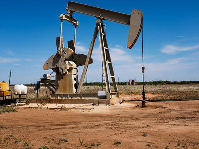

## Table of Contents

## What is bitumen and how is it formed?

Bitumen is a thick, sticky, black substance that looks like tar. It is also called asphalt. People use it to make roads and to fix roofs. It is very important in construction because it helps to hold things together and make them waterproof.

Bitumen is formed from crude oil, which comes from deep under the ground. Over millions of years, tiny plants and animals that lived in the sea died and sank to the bottom. They got buried under layers of mud and sand. The heat and pressure from these layers turned the remains into crude oil. Bitumen is what is left after the lighter parts of the crude oil are taken away.

## What are the primary sources of bitumen?

Bitumen comes mostly from crude oil. People get crude oil by drilling deep into the ground where it has been trapped for millions of years. The crude oil is then taken to a refinery, where it is heated and separated into different parts. Bitumen is the thick, heavy part that is left after the lighter parts like gasoline and diesel are taken away.

Another source of bitumen is oil sands, also called tar sands. These are found in places like Canada and Venezuela. Oil sands are a mixture of sand, water, clay, and bitumen. To get the bitumen out, people have to dig up the oil sands and use hot water or steam to separate the bitumen from the sand. This process is more difficult and expensive than getting bitumen from [crude oil](/wiki/crude-oil), but it is still an important source.

## What are the physical properties of bitumen?

Bitumen is a thick, sticky, black liquid that looks a lot like tar. It feels soft and gooey when you touch it, but it can get harder when it cools down or when it is mixed with other things. Bitumen does not mix with water, which is why it is used to make things waterproof. It also does not let water pass through it, which makes it good for sealing roofs and roads.

When bitumen is heated, it becomes easier to work with because it gets softer and flows more easily. But when it cools down, it can turn into a solid that is strong and durable. This makes it very useful for building things that need to last a long time, like roads and highways. Bitumen also sticks well to different surfaces, which helps it hold things together and keep them in place.

## How does the chemical composition of bitumen affect its uses?

The chemical composition of bitumen is made up of lots of different things, like hydrocarbons, which are made from hydrogen and carbon atoms. These hydrocarbons can be big or small, and this affects how sticky and thick the bitumen is. When the hydrocarbons are bigger, the bitumen is thicker and stickier, which makes it good for things like sealing roofs and making roads. Smaller hydrocarbons make the bitumen less thick, which can be useful in other ways, like in making asphalt mixes that are easier to spread.

The chemicals in bitumen also make it good at not letting water through. This is because bitumen does not mix with water, which is important for keeping roofs and roads dry. The chemicals also help bitumen stick well to different surfaces. This means that when bitumen is used to glue things together, like stones in a road, it holds them tight and keeps them in place for a long time. So, the chemical makeup of bitumen is what makes it so useful for building and fixing things.

## What are the different grades of bitumen and their applications?

Bitumen comes in different grades, and each grade is used for different things. One common way to grade bitumen is by how hard or soft it is, which is measured by something called the penetration test. The penetration grade tells you how far a needle can sink into the bitumen in a certain amount of time. For example, bitumen with a penetration grade of 60/70 is pretty hard and is often used for roads because it can handle heavy traffic and hot weather. Softer bitumen, like a grade of 80/100, is used for things like sealing roofs because it is easier to spread and can fill in cracks better.

Another way to grade bitumen is by how it performs when it's hot, which is measured by the viscosity grade. This tells you how thick the bitumen is when it's heated up. Bitumen with a high viscosity grade, like VG30, is used for roads in places with very hot weather because it stays strong even when it gets really warm. Bitumen with a lower viscosity grade, like VG10, is used in cooler places or for things that don't need to be as strong, like driveways.

There are also special grades of bitumen for specific jobs. For example, polymer-modified bitumen (PMB) has extra chemicals added to it to make it even better at sticking to things and not letting water through. This type is often used for roads that get a lot of heavy traffic or for fixing cracks in roads. Cutback bitumen is another special type where lighter oils are mixed in to make it easier to use in cold weather. Each grade of bitumen is chosen based on what it needs to do and where it will be used.

## Can you explain the process of bitumen extraction?

Bitumen extraction usually happens in two main ways, depending on where the bitumen is found. The first way is from crude oil. People drill deep into the ground to get the crude oil out. They then take the crude oil to a big place called a refinery. At the refinery, they heat up the crude oil and separate it into different parts. Bitumen is the thick, heavy part that's left after they take away the lighter parts like gasoline and diesel. This process is pretty common and used all over the world.

The second way to get bitumen is from oil sands, which are found in places like Canada and Venezuela. Oil sands are a mix of sand, water, clay, and bitumen. To get the bitumen out, people dig up the oil sands and then use hot water or steam to separate the bitumen from the sand. This process is harder and costs more money than getting bitumen from crude oil, but it's still important because there's a lot of bitumen in oil sands. After separating the bitumen, they might need to clean it up a bit more before it can be used for things like making roads.

## What are the common methods of bitumen testing and quality control?

Bitumen needs to be tested to make sure it is good enough to use for building roads and fixing roofs. One common test is the penetration test, which checks how hard or soft the bitumen is. They do this by seeing how far a needle can sink into the bitumen in a certain amount of time. Another test is the softening point test, which tells you at what temperature the bitumen starts to get soft. This is important because bitumen needs to stay strong even when it gets hot outside. They also do a ductility test to see how well the bitumen can stretch without breaking, which is good to know for making sure roads don't crack.

Quality control also includes checking how thick the bitumen is when it's hot, which is called the viscosity test. This helps make sure the bitumen can be spread easily when it's warm. Another important test is the flash point test, which checks how hot the bitumen can get before it starts to burn. This is important for safety reasons when working with bitumen. Lastly, they might do a solubility test to see if the bitumen can mix with certain chemicals, which helps understand its purity and how well it will work in different situations. All these tests help make sure the bitumen is good quality and will work well for its intended use.

## How is bitumen used in road construction and what are its benefits?

Bitumen is used in road construction to make roads strong and smooth. It is mixed with stones, sand, and other materials to make asphalt. This asphalt is then spread out and rolled flat to make the road surface. Bitumen helps hold everything together and makes the road waterproof, so water doesn't get inside and damage it. It also makes the road flexible, so it can handle the weight of cars and trucks without cracking.

The benefits of using bitumen in road construction are many. First, bitumen makes roads last longer because it is tough and can handle heavy traffic. It also helps keep the road smooth, which makes driving safer and more comfortable. Bitumen is also good for the environment because it can be recycled and reused, which saves money and resources. Overall, bitumen helps make roads that are strong, safe, and good for everyone.

## What are the environmental impacts of using bitumen?

Using bitumen can have some bad effects on the environment. When people get bitumen from oil sands, they use a lot of water and energy. This can harm the land and make the air dirty. Also, when bitumen is used to make roads, it can give off gases that are not good for the air. If bitumen is spilled, it can hurt plants and animals, and it is hard to clean up because it is so sticky.

But there are also some good things about bitumen for the environment. Bitumen can be recycled and used again, which saves resources and energy. Roads made with bitumen can last a long time, so they do not need to be fixed as often. This means less building work and less use of new materials, which is better for the environment. Overall, while bitumen can cause some problems, it also has benefits if it is used carefully and responsibly.

## How does bitumen compare to other materials used in waterproofing and sealing?

Bitumen is often used for waterproofing and sealing because it is very good at keeping water out. It is thick and sticky, so it can fill in cracks and gaps really well. People use bitumen to fix roofs and make roads because it sticks to different surfaces and does not let water through. Compared to other materials like cement or silicone, bitumen is cheaper and easier to work with. It can be heated up and spread out easily, which makes it a popular choice for big projects.

Other materials like silicone and polyurethane are also used for waterproofing and sealing. Silicone is very flexible and can be used on many different surfaces, but it is more expensive than bitumen. Polyurethane is strong and lasts a long time, but it can be harder to apply and might need special tools. Each material has its own good points and bad points, but bitumen is often chosen because it is easy to use, affordable, and does a good job at keeping things dry.

## What advancements have been made in bitumen technology in recent years?

In recent years, scientists have been working to make bitumen even better for building roads and fixing roofs. One big advancement is making bitumen with special chemicals called polymers. These polymers make the bitumen stronger and more flexible. This means roads made with this new bitumen can handle heavy traffic and hot weather without breaking or getting too soft. Another cool thing is that people have found ways to recycle old bitumen and use it again, which helps save resources and is good for the environment.

Another advancement is in how bitumen is made and used. Scientists have figured out ways to make bitumen that is easier to spread and work with, even in cold weather. This helps workers build roads faster and more safely. Also, new machines and tools have been made to test bitumen and make sure it is good quality. These tools help make sure the bitumen will last a long time and do its job well, which is important for building strong roads and roofs.

## What are the future prospects and potential innovations in the bitumen industry?

In the future, the bitumen industry is expected to keep growing and changing. One big area of focus will be making bitumen even better for the environment. Scientists are working on ways to make bitumen that uses less energy and water to produce. They are also trying to find new ways to recycle old bitumen so it can be used again, which helps save resources and reduce waste. Another important thing is making bitumen that lasts longer and can handle different weather conditions better. This means roads and roofs made with this new bitumen will not need to be fixed as often, which saves money and is good for the environment.

Another exciting area is new technology and innovations. Scientists are looking into adding special materials to bitumen to make it stronger and more flexible. For example, they might use tiny bits of rubber or plastic to make the bitumen better at handling heavy traffic and hot weather. They are also working on smart bitumen that can fix itself if it gets damaged. This could mean roads that last even longer and need less maintenance. Overall, the future of the bitumen industry looks bright, with lots of new ideas and technologies that could make bitumen even better for building and fixing things.

## References & Further Reading

[1]: Platt, J., Flaxman, S., Wang, H., & Zhao, T. (2018). ["Distributed Representations with Label Smoothed Embedding."](https://www.sciencedirect.com/science/article/pii/S221128552030567X) arXiv preprint arXiv:1805.00879.

[2]: Anderson, R.C. (2004). ["Bituminous Binders and Mixes."](https://www.tandfonline.com/doi/abs/10.1080/14680629.2004.9689992) Elsevier Applied Science Publishers.

[3]: ["Asphalt Materials Science and Technology"](https://www.sciencedirect.com/book/9780128002735/asphalt-materials-science-and-technology) by James G. Speight

[4]: Narayan, S., & Reinstein, M. (2011). ["Offshore: A Neutral Perspective on Oil Prices."](https://www.semanticscholar.org/paper/New-evidence-on-oil-price-and-firm-returns-Narayan-Sharma/f437009632ac571daba3341b833099895e9a9ad5) Journal of Energy Markets.

[5]: Wong, J.C. (2015). ["Anticipatory Optimization for Asset Trading with Nonsmooth Transaction Costs."](https://onlinelibrary.wiley.com/doi/full/10.1002/aaai.12098) Springer Science & Business Media.