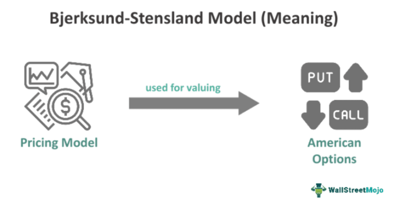

## Table of Contents

## What is the Bjerksund-Stensland model?

The Bjerksund-Stensland model is a way to figure out how much an American option is worth. An American option is a type of investment where you can choose to buy or sell something at a certain price before a specific date. This model is useful because it gives a good estimate without being too complicated. It was made by two people named Bjerksund and Stensland, and it's often used by people who work with these kinds of investments.

The model works by thinking about what would happen if you could choose to use your option at any time before it expires. It takes into account things like how much time is left until the option expires, how much the thing you can buy or sell is worth right now, and how much it might change in the future. The Bjerksund-Stensland model is especially good for options that let you buy something, which are called call options. It helps people make smart choices about when to use their options to get the most value.

## Who are Bjerksund and Stensland, and why did they develop this model?

Bjerksund and Stensland are two researchers named Petter Bjerksund and Gunnar Stensland. They worked on financial math and wanted to help people understand the value of American options better. American options are special because you can use them at any time before they expire, not just at the end like European options. This makes them harder to value because you have to think about all the possible times someone might choose to use the option.

They developed their model to make it easier to figure out how much an American option is worth without using a computer to do lots of calculations. Their model is simpler and faster than other methods but still gives good results. It's especially useful for call options, which are options that let you buy something. By creating this model, Bjerksund and Stensland helped people in finance make better decisions about when to use their options to get the most value.

## How does the Bjerksund-Stensland model differ from the Black-Scholes model?

The Bjerksund-Stensland model and the Black-Scholes model are both used to figure out how much options are worth, but they work in different ways. The Black-Scholes model is used for European options, which can only be used at the end of their life. It uses math to predict the price of the option based on things like the current price of the stock, how much the stock price might change, how long until the option expires, and the [interest rate](/wiki/interest-rate-trading-strategies). The Black-Scholes model is simpler but it doesn't work well for American options because it doesn't account for the possibility of using the option early.

On the other hand, the Bjerksund-Stensland model is made for American options, which can be used at any time before they expire. This model takes into account the possibility of using the option early, which makes it more complex but also more accurate for American options. It's especially good for call options, where you can buy something. The Bjerksund-Stensland model gives a good estimate of the option's value without needing a lot of complicated calculations, making it useful for people in finance who need quick and reliable answers.

## What types of options can the Bjerksund-Stensland model price?

The Bjerksund-Stensland model is mainly used for pricing American options. American options are special because you can use them at any time before they expire, not just at the end like European options. This model is really good at figuring out the value of American call options, which are options that let you buy something. It helps people in finance decide when to use their options to get the best value.

Even though the Bjerksund-Stensland model is most accurate for American call options, it can also be used for American put options, which let you sell something. However, it's not as good at pricing put options as it is at pricing call options. The model takes into account things like how much time is left until the option expires, the current price of the stock, and how much the stock price might change in the future. This makes it a useful tool for anyone who needs to understand the value of American options quickly and accurately.

## What are the key assumptions of the Bjerksund-Stensland model?

The Bjerksund-Stensland model makes some guesses about how the world works to figure out how much an American option is worth. It assumes that the price of the thing you can buy or sell with the option, like a stock, moves in a way that's easy to predict. This means it thinks the price will change smoothly over time, without big jumps or sudden drops. It also guesses that you can borrow and lend money at the same interest rate, and that you can do this as much as you want without any limits.

Another big guess the model makes is that the option can only be used once, and after you use it, you can't do anything else with it. It also assumes that everyone knows everything about the market and that there are no surprises. This means everyone has the same information and can make the same guesses about what will happen next. These guesses help make the math easier, but they might not always match what happens in real life.

## How is the Bjerksund-Stensland model used in practice?

In practice, the Bjerksund-Stensland model is used by people who work in finance to figure out how much American options are worth. These options can be used at any time before they expire, which makes them tricky to value. The model helps these workers by giving them a quick and pretty accurate estimate of the option's value. They use it to make decisions about when to buy, sell, or use the option to get the best possible return on their investment. For example, if a trader has an American call option, the model can help them decide if it's better to use the option now or wait until later.

The model is especially useful because it's not too complicated, so it can be used without a lot of fancy computer programs. This makes it easier for people to use it every day in their work. They might use it to check the value of options they are thinking about buying or to help them plan their trading strategies. By understanding the value of their options better, they can make smarter choices and hopefully make more money.

## What are the mathematical formulas behind the Bjerksund-Stensland model?

The Bjerksund-Stensland model has some math formulas that help figure out the value of American options. For call options, which let you buy something, the model uses a formula that looks at the current price of the stock, the price you can buy it at with the option (called the strike price), how much time is left until the option expires, and how much the stock price might change in the future. The formula also thinks about the interest rate and any money you might get from the stock, like dividends. It uses these pieces of information to find a number called the critical stock price. If the stock price is higher than this critical price, it's better to use the option right away. If it's lower, you should wait.

For put options, which let you sell something, the Bjerksund-Stensland model uses a similar idea but with a different formula. It also looks at the current stock price, the strike price, time until expiration, and how much the stock price might change. But for put options, the formula finds a different critical stock price. If the stock price is lower than this critical price, it's better to use the option right away. If it's higher, you should wait. Both formulas help people in finance make smart choices about their options by giving them a good guess of when to use them to get the most value.

## How accurate is the Bjerksund-Stensland model compared to other option pricing models?

The Bjerksund-Stensland model is pretty good at figuring out how much American options are worth, especially call options. It's not as complicated as some other models that need a lot of computer power, so it's easier to use every day. When you compare it to other models like the binomial model, which can be very accurate but also very slow, the Bjerksund-Stensland model is a good middle ground. It gives you a close enough answer without taking too long, which is helpful for people who need quick decisions in the stock market.

However, the Bjerksund-Stensland model isn't perfect. It works best for call options and can be less accurate for put options. Also, like all models, it makes some guesses about how the world works, like assuming the stock price changes smoothly over time. In real life, stock prices can jump around a lot, so the model's guesses might not always be spot on. But for many people in finance, the Bjerksund-Stensland model is a useful tool because it's quick and gives a good enough estimate most of the time.

## What are the limitations of the Bjerksund-Stensland model?

The Bjerksund-Stensland model is really helpful for figuring out the value of American options, but it has some limits. One big limit is that it works better for call options, which let you buy something, than for put options, which let you sell something. So, if you're trying to find the value of a put option, you might not get as good an answer as you would with a call option. Another problem is that the model makes some guesses about how the world works. It thinks that the price of the stock will change smoothly over time, but in real life, stock prices can jump around a lot. This means the model's guesses might not always be right.

Also, the Bjerksund-Stensland model doesn't take into account some things that can affect option prices, like if the stock pays dividends or if there are big events coming up that could change the stock price a lot. These things can make a big difference in the real world, but the model doesn't think about them. So, while the Bjerksund-Stensland model is a good tool for getting a quick and pretty accurate guess about the value of an American option, it's not perfect and might not always give you the best answer in every situation.

## Can the Bjerksund-Stensland model be used for American options?

Yes, the Bjerksund-Stensland model is made to figure out how much American options are worth. American options are special because you can use them at any time before they expire, not just at the end like European options. The model helps people in finance by giving them a quick and pretty accurate guess about the option's value. It's really good for call options, which let you buy something. Traders use it to decide when it's best to use their options to get the most value out of them.

Even though the Bjerksund-Stensland model is useful, it has some limits. It works better for call options than for put options, which let you sell something. Also, the model makes some guesses about how the stock market works, like thinking the stock price will change smoothly over time. In real life, stock prices can jump around, so the model's guesses might not always be right. But for many people in finance, the Bjerksund-Stensland model is still a handy tool because it's quick and gives a good enough estimate most of the time.

## How has the Bjerksund-Stensland model been tested and validated?

The Bjerksund-Stensland model has been tested and checked by many people in finance to see how well it works. They did this by comparing the model's guesses about option prices to real prices in the market. They also compared it to other models, like the binomial model, which is very accurate but takes a lot more time to use. These tests showed that the Bjerksund-Stensland model is good at figuring out the value of American call options. It gives a close enough answer without needing a lot of complicated calculations, which makes it useful for people who need quick answers.

Even though the model works well for call options, it's not as good at figuring out the value of put options. Researchers found that the model's guesses for put options can be less accurate. This is because the model makes some guesses about how the world works, like thinking that stock prices change smoothly over time. In real life, stock prices can jump around a lot, so the model's guesses might not always be right. But overall, the Bjerksund-Stensland model has been shown to be a helpful tool for people in finance who need to understand the value of American options quickly and pretty accurately.

## What recent developments or improvements have been made to the Bjerksund-Stensland model?

Since the Bjerksund-Stensland model was first made, people have been trying to make it better. One big improvement is that researchers have found ways to make the model work better for put options, which let you sell something. They did this by changing some parts of the math to fit put options better. Another improvement is that some people have added ways to think about things like dividends, which the original model didn't consider. Dividends are money that a company pays to its shareholders, and they can affect how much an option is worth.

These changes have made the Bjerksund-Stensland model more useful for people in finance. Now, it can give a better guess about the value of both call and put options, and it can take into account more things that happen in the real world. But even with these improvements, the model still makes some guesses about how the world works. So, while it's a good tool for quick and pretty accurate estimates, it's not perfect and might not always give the best answer in every situation.

## References & Further Reading

[1]: Bjerksund, P., & Stensland, G. (1993). "Closed-Form Approximation for American Options." Scandinavian Journal of Management, 9(1), 87-99.

[2]: Black, F., & Scholes, M. (1973). "The Pricing of Options and Corporate Liabilities." Journal of Political Economy, 81(3), 637-654.

[3]: Hull, J. C. (2009). [Options, Futures, and Other Derivatives](https://www.amazon.com/Options-Futures-Other-Derivatives-9th/dp/0133456315) (8th Edition). Pearson Education.

[4]: Wilmott, P. (2006). [Paul Wilmott Introduces Quantitative Finance](https://www.amazon.com/Paul-Wilmott-Introduces-Quantitative-Finance/dp/0471498629) (2nd Edition). Wiley.

[5]: Gatheral, J. (2006). [The Volatility Surface: A Practitioner's Guide](https://onlinelibrary.wiley.com/doi/book/10.1002/9781119202073) (Wiley Finance) by Jim Gatheral.

[6]: Hull, J. C., & White, A. (1993). "Efficient Procedures for Valuing European and American Path-Dependent Options." Journal of Derivatives, 1(1), 21-31.