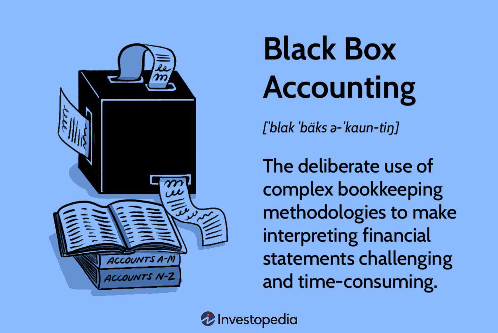

This article examines accounting methods with a focus on black box accounting. Black box accounting involves intricate bookkeeping practices that often make financial statement interpretation difficult. Such practices possess limitations, particularly in algorithmic trading. Accounting methods, while crucial for financial transparency, can sometimes obscure a company's true financial health. Non-transparent practices like black box accounting present significant challenges to algorithmic trading, which relies on accurate financial data to function effectively.

Algorithmic trading systems utilize programmed algorithms to execute trading strategies, requiring precise data inputs to make informed decisions. However, when financial data is manipulated or incompletely reported due to black box techniques, it can lead to inaccurate predictions and decisions in trading models. In these scenarios, traders can experience substantial financial losses, emphasizing the need for transparency. Financial misrepresentations, albeit within the legal frameworks, pose ethical dilemmas by concealing actual risks that could affect investor confidence.



The purpose of this article is to scrutinize the relationship between accounting practices and their effect on trading efficiency and accuracy. We aim to provide insight into the ways black box accounting can influence investor and stakeholder decisions by obscuring the true financial status of a company. With an understanding of these mechanisms, investors can better shield themselves from potential financial misrepresentations. This exploration will help highlight the crucial role accounting integrity plays in ensuring the reliability of financial markets.

## Table of Contents

## Understanding Black Box Accounting

Black box accounting involves the strategic use of intricate bookkeeping techniques designed to obfuscate a company's financial reality. This approach is often employed by firms aiming to conceal debts and liabilities, thereby presenting a more favorable financial position to investors and other stakeholders. Although such practices adhere to established accounting frameworks like Generally Accepted Accounting Principles (GAAP) or International Financial Reporting Standards (IFRS), they take advantage of ambiguities within these standards to produce misleading financial disclosures.

The ethical concerns surrounding black box accounting arise from its potential to obscure the true financial health of a company. By manipulating financial data, companies can portray themselves in a different light, thereby affecting investor decisions and market perceptions. This is executed through several techniques, the most notable being the restatement of revenues and the creation of off-the-books partnerships.

Restatement of revenues involves adjusting financial reports post-publication, often to reflect changes that make past performance look more favorable retrospectively. This can mislead stakeholders into believing that the company is performing better than it actually is. Off-the-[books](/wiki/algo-trading-books) partnerships or special purpose entities (SPEs) are another method where firms shift liabilities and debts to separate legal entities that are not included in the parent company's financial statements. This maneuver allows companies to hide financial obligations from direct scrutiny.

For investors, understanding these methods is crucial to avoid being misled by manipulated financial reports. Recognizing signs of black box accounting practices can prevent potential financial misrepresentations from influencing investment decisions. While the practice itself may not be illegal under current regulatory frameworks, it runs counter to the ethical standards of transparency and accuracy in financial reporting crucial for maintaining market integrity.

## Accounting Limitations in Algo Trading

Algorithmic trading systems rely heavily on financial data accuracy and transparency. When data is compromised, trading algorithms can make flawed decisions, potentially leading to substantial financial losses. Black box accounting practices, which often obscure or distort a company's financial positioning, pose significant risks to these systems. 

The effectiveness of [algorithmic trading](/wiki/algorithmic-trading) is contingent upon the validity of input data. When financial statements are manipulated through black box accounting techniques, such as revenue restatement or off-balance-sheet entities, the resulting datasets can mislead trading algorithms. These systems, which are built to analyze historical and real-time data, depend on the integrity of that data for risk assessment and strategic decision-making. Erroneous data can cause the algorithms to execute trades based on skewed financial health metrics, leading to substantial trading errors and potential market disruptions.

One of the core issues lies in the algorithms' reliance on quantitative data without the capability to interpret potential qualitative discrepancies. For instance, a trading system evaluating a company with overstated revenue may misjudge the company's market value and recommend unwarranted investments, making the algorithmic decision-making process vulnerable to inaccuracies in financial reporting. 

The lack of transparency in accounting can also hinder effective risk management within algorithmic trading. Proper risk management algorithms integrate multiple data points, including financial statements, market trends, and credit assessments. If one or more of these data inputs are falsified due to black box accounting, the risk management system may inaccurately assess risk exposure, resulting in potential financial hazards.

Historical cases highlight these limitations vividly. For example, trading strategies based on financial data from companies engaged in deceptive accounting practices have experienced swift devaluations upon revelations of misconduct, underscoring the essential need for clear and precise data. As algorithmic trading grows in complexity and scope, the demand for unambiguous financial data increases, thus emphasizing the need for stringent regulatory measures and audit systems that prioritize transparency.

In summary, the viability of algorithmic trading significantly relies on straightforward and honest financial data. As long as black box accounting persists, there will remain substantial challenges to ensuring the precision and validity of automated trading systems. Adequate measures to enhance accounting transparency are crucial for mitigating risks associated with algorithmic trading decisions influenced by hidden financial misrepresentations.

## Examples and Case Studies

Historical examples such as Enron significantly illustrate the perils of black box accounting, underscoring the catastrophic impact that non-transparent accounting practices can have on financial markets. The Enron scandal, which erupted in the early 2000s, involved the notorious use of special purpose entities (SPEs) to hide debt and inflate profits. These SPEs operated outside Enron's balance sheet, creating an illusion of enormous profitability while concealing the company's true financial liabilities. This misleading representation ultimately led to Enron's dramatic collapse, wiping out billions in shareholder value and eroding investor trust.

Enron is not an isolated case; similar instances have underscored the dangers of opaque accounting. The collapse of WorldCom in 2002 further illustrated the severe consequences of poor accounting practices. WorldCom engaged in fraudulent accounting techniques, including falsely capitalizing operating expenses, which eventually resulted in one of the largest bankruptcies in American history. These cases highlight how misleading financial statements can severely distort investor decision-making, severely affecting market stability.

These significant events have informed the development of current regulatory and auditing standards. The aftermath of Enron and WorldCom scandals led to the establishment of the Sarbanes-Oxley Act in 2002, a landmark reform aimed at enhancing corporate governance and financial transparency. This legislation introduced stringent rules for auditing practices and increased accountability for company executives, leading to a more robust financial reporting environment.

Algorithmic trading systems, deeply dependent on accurate financial data, can be especially vulnerable to the repercussions of hidden accounting practices. The accuracy of these systems hinges on the integrity of their input data; therefore, any misrepresentation can lead to erroneous trading decisions with substantial financial consequences. For instance, consider a scenario where a trading algorithm relies on inflated revenue reports from a company using black box accounting. The algorithm, unable to distinguish between accurate and misleading reports, might engage in buy or sell actions based on false data, potentially leading to significant financial losses. This highlights the importance of transparent and accurate accounting in ensuring not only market stability but also the operational efficiency of algorithmic trading systems. 

Current case studies illustrate these vulnerabilities. For example, studies have examined algorithmic trading failures due to data anomalies traced back to poor accounting disclosures. These examples reinforce the necessity for more robust auditing mechanisms and the integration of advanced data verification processes within trading systems to mitigate risks associated with financial misstatements.

In conclusion, historical instances of black box accounting have paved the way for more stringent regulatory frameworks and auditing practices. They serve as a reminder of the critical need for transparency in accounting, particularly in a world increasingly dominated by algorithmic trading systems.

## Regulatory Measures and Ethical Considerations

Following the accounting scandals involving Enron and other major corporations in the early 2000s, regulatory measures have been significantly reinforced to address deceptive accounting practices. A landmark legislative response to these scandals was the Sarbanes-Oxley Act of 2002 (SOX), which introduced extensive reforms to enhance corporate transparency and financial accountability.

The Sarbanes-Oxley Act primarily targets both corporate governance and financial disclosure, placing the onus on companies to provide truthful financial information. Section 302 of SOX, for example, mandates that senior executives certify the accuracy of financial statements personally. This provision is designed to ensure accountability at the highest levels of management, reducing the likelihood of fraudulent financial reporting.

Section 404 of SOX requires management and external auditors to report on the adequacy of a company’s internal controls over financial reporting. This requirement aims to identify and rectify weaknesses within a company’s reporting infrastructure, thereby minimizing the risk of errors and fraud in financial documents.

Beyond SOX, other regulatory measures, such as the Dodd-Frank Wall Street Reform and Consumer Protection Act, seek to improve market integrity through enhanced transparency and stricter oversight of financial institutions. The Public Company Accounting Oversight Board (PCAOB) was also established under SOX to oversee the audits of public companies, ensuring that audit practices are rigorous and thorough.

Ethical considerations remain at the core of transparent financial reporting, with the implementation of these regulations underscoring the importance of honesty and accuracy. Ethical accounting practices contribute to overall market stability and investor confidence, fostering fair trading environments where stakeholders can make informed decisions based on reliable data.

Despite the strengthened regulatory framework, the effectiveness of these measures in mitigating financial risks consistently requires assessment. Cases like the financial crisis of 2008 demonstrate that while regulations can deter and reduce fraudulent activity, they do not eliminate it entirely. Continuous evaluation and adaptation of regulatory practices are necessary to address evolving challenges in financial markets.

Ethical accounting practices, supported by strong regulatory frameworks, are vital. They ensure transparency and accountability in financial reporting, thus preventing corporate misconduct and safeguarding market integrity. As financial markets evolve, maintaining robust ethical standards and regulatory measures is essential for protecting the interests of all stakeholders.

## Leveraging Data Analytics to Detect Hidden Assets

Data analytics has emerged as a crucial tool for uncovering hidden assets and ensuring transparent accounting practices. With the advent of advanced technologies, such as [artificial intelligence](/wiki/ai-artificial-intelligence) (AI) and [machine learning](/wiki/machine-learning), organizations can analyze vast amounts of financial data to identify irregularities that may indicate concealed financial activities.

The primary strength of data analytics lies in its ability to process large datasets and detect patterns or anomalies that human observation might miss. By employing sophisticated algorithms, companies can flag inconsistencies in financial statements, thereby enhancing the accuracy and reliability of financial reporting.

AI-driven solutions, particularly those based on machine learning, are capable of learning from historical data to predict and detect anomalies in real-time. These systems can be trained to recognize typical accounting behaviors and identify deviations that could signify potential misreporting or fraud. The application of unsupervised learning models, such as clustering and anomaly detection algorithms, can be particularly effective in spotting non-conforming entries in financial ledgers.

For example, clustering algorithms can group similar financial entries together, highlighting outliers that may represent unconventional transactions. Anomaly detection models, such as Isolation Forest or One-Class SVM, can isolate suspicious transactions based on their rarity or deviation from established patterns. The mathematical foundation of an Isolation Forest relies on the fact that anomalies are "few and different"; hence, they are more likely to be isolated by random cuts in the feature space. This can be implemented in Python as follows:

```python
from sklearn.ensemble import IsolationForest

# Assume 'financial_data' is a Pandas DataFrame containing the financial metrics
model = IsolationForest(n_estimators=100, contamination=0.1, random_state=42)
model.fit(financial_data)

# Predicting anomalies
anomalies = model.predict(financial_data)
# Anomalous entries will have value -1
anomalous_entries = financial_data[anomalies == -1]
```

Case studies illustrating the successful use of data analytics in uncovering hidden accounting practices abound. For instance, the implementation of AI tools by firms like Deloitte has enabled the detection of accounting anomalies that manual audits failed to capture. These tools have been pivotal in identifying revenue recognition irregularities and off-balance-sheet liabilities.

Furthermore, an example from the financial industry includes a scenario where machine learning was utilized to analyze transaction data, uncovering a pattern of backdated transactions that inflated revenue figures fraudulently. By examining time-stamped data and correlating it with other financial metrics, the analytics tools could provide evidence of manipulating accounting periods to paint a more favorable financial picture.

The integration of data analytics into the auditing process not only helps in revealing hidden assets but also assists in promoting a culture of transparency and accountability in financial reporting. By leveraging these advanced technologies, companies can foster greater trust among investors and stakeholders, ultimately leading to more stable and transparent financial markets.

## Conclusion

The integrity of accounting methods is crucial for ensuring the reliability of financial markets. Transparent and accurate accounting practices allow investors to make informed decisions based on genuine data representations of a company's financial health. Black box accounting practices, by obscuring financial realities, pose significant risks. These risks necessitate that investors and stakeholders understand and address the limitations of these practices to safeguard their interests and financial investments.

In algorithmic trading, the reliance on accurate and transparent financial data is paramount. Algorithms, designed to make rapid trading decisions based on available data, may generate flawed outcomes when fed with distorted information from non-transparent accounting. To maintain accuracy and efficiency, algorithmic trading systems must adapt and incorporate robust safeguards against potential manipulations in financial reporting.

Promoting transparency and accountability in accounting offers substantial benefits to all market stakeholders. Regulatory frameworks and technological advancements such as data analytics provide tools to enhance financial statement accuracy and detect anomalies. By fostering an environment where clear and truthful reporting is prioritized, the potential for financial disturbances due to misleading accounting is minimized. As investors and trading systems continue to navigate complex financial landscapes, the collective effort to uphold accounting integrity remains a cornerstone of market stability and trust.

## References & Further Reading

[1]: U.S. Congress. (2002). ["Sarbanes-Oxley Act of 2002."](https://www.congress.gov/bill/107th-congress/house-bill/3763) 

[2]: Cohan, W. D. (2009). ["House of Cards: A Tale of Hubris and Wretched Excess on Wall Street."](https://www.amazon.com/House-Cards-Hubris-Wretched-Excess/dp/0767930894) Doubleday.

[3]: Healy, P. M., & Palepu, K. G. (2003). ["The fall of Enron."](https://papers.ssrn.com/sol3/papers.cfm?abstract_id=417840) Journal of Economic Perspectives, 17(2), 3-26.

[4]: Jain, P. K. (2005). ["Financial market design and the equity premium: Electronic versus floor trading."](https://onlinelibrary.wiley.com/doi/10.1111/j.1540-6261.2005.00822.x) Journal of Financial Services Research, 27(1), 5-20.

[5]: Kaal, W. A. (2019). ["Financial Regulation and Technology: What is in the Lifetime of a Financial Innovation?"](https://papers.ssrn.com/sol3/papers.cfm?abstract_id=3409548) University of Illinois Law Review, 2019(4), 1127-1174.

[6]: Nixon, J. R., & Spector, B. I. (2003). ["Accounting and Business Ethics: Insights on Enron."](https://www.researchgate.net/publication/216443667_Can_Work_Make_You_Sick_A_Meta-Analysis_of_the_Relationships_Between_Job_Stressors_and_Physical_Symptoms) Journal of Business Ethics, 45(1/2), 147-160.

[7]: Peregrin, T. (2002). ["Algorithmic Trading: The Basics."](https://trendspider.com/learning-center/algorithmic-trading-the-basics/) Financial Analysts Journal, 58(2), 56-70.

[8]: Tang, Y., & Akram, M. (2012). ["Detecting Financial Fraud Using Data Mining Techniques: A Decade Review from 2000 to 2010."](https://www.researchgate.net/publication/311557850_Detecting_Financial_Fraud_Using_Data_Mining_Techniques_A_Decade_Review_from_2004_to_2015) International Journal of Information Management, 32(3), 476-478.