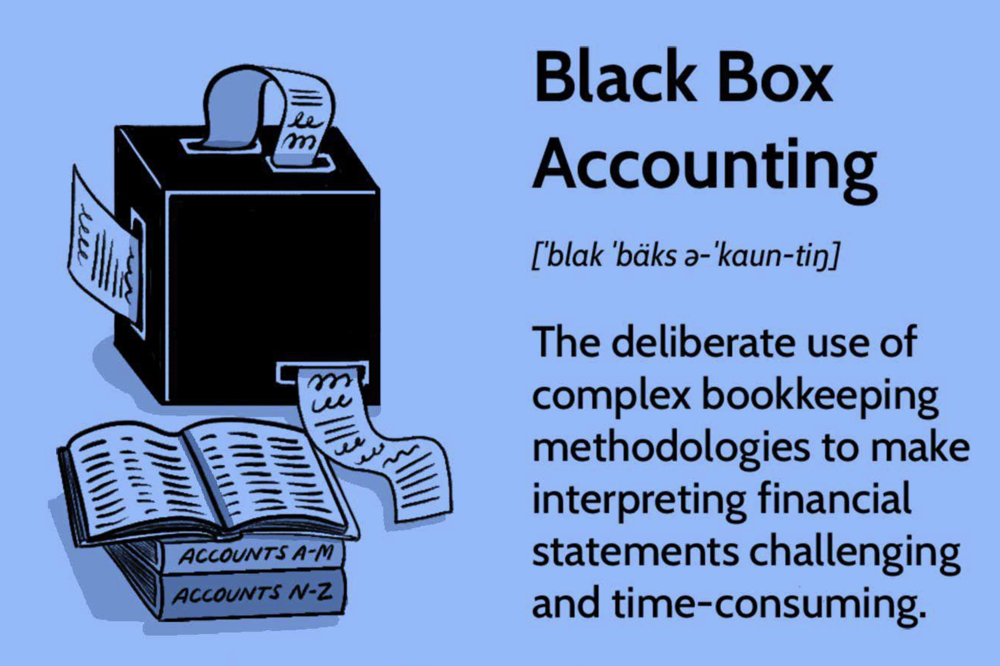

## Table of Contents

## What is black box accounting?

Black box accounting is when a company keeps its financial information hidden or hard to understand. It's like a "black box" where you can't see what's inside. Companies might do this to hide problems or to make their financial situation look better than it really is. This can be confusing for investors, shareholders, and even regulators who need clear information to make good decisions.

When a company uses black box accounting, it can lead to big problems. For example, if a company hides its debts or losses, it might seem healthy when it's actually in trouble. This can cause investors to lose money if the company suddenly fails. It can also lead to legal issues if regulators find out that the company is not being honest about its finances. That's why transparency and clear financial reporting are important for trust and stability in business.

## How does black box accounting differ from traditional accounting?

Black box accounting and traditional accounting are different in how they handle financial information. Traditional accounting follows clear rules and standards, like Generally Accepted Accounting Principles (GAAP) or International Financial Reporting Standards (IFRS). These rules make sure that a company's financial statements are easy to understand and compare. Companies using traditional accounting show all their financial details openly, so everyone can see their profits, losses, debts, and assets.

On the other hand, black box accounting hides or makes financial information hard to understand. Companies using this method might not follow the standard rules, and they might use complicated methods or not show all their financial details. This makes it tough for investors, shareholders, and regulators to know the real financial health of the company. Black box accounting can be used to hide problems or make the company look better than it really is, which can lead to mistrust and even legal trouble.

## What are the primary techniques used in black box accounting?

Black box accounting involves several techniques that companies use to hide or obscure their financial information. One common technique is the use of complex financial structures, such as off-balance-sheet entities. These are separate companies or partnerships that a company might use to keep debts or losses off their main financial statements. By doing this, a company can make its financial situation look better than it really is. Another technique is the manipulation of revenue recognition, where a company might record sales or income before they are actually earned, making their profits look higher.

Another method used in black box accounting is the use of aggressive accounting policies, where companies might stretch or bend accounting rules to their advantage. For example, they might use different depreciation methods to lower their reported expenses or inflate their assets. Additionally, companies might engage in "cookie jar" accounting, where they save up reserves during good times and then use these reserves to smooth out earnings during bad times, making their financial performance seem more consistent than it really is. These techniques can make it very hard for outsiders to understand the true financial health of the company.

Overall, black box accounting relies on a lack of transparency and the use of complex or non-standard accounting practices. By using these techniques, companies can create a confusing picture of their finances, which can mislead investors, shareholders, and regulators. This not only affects trust but can also lead to serious legal and financial consequences if the practices are discovered and proven to be misleading or fraudulent.

## Can you explain the concept of data reconciliation in black box accounting?

Data reconciliation in black box accounting is when a company tries to make its hidden or confusing financial numbers match up with what's actually happening. Imagine you have two sets of numbers: one set that you show to the public and another set that's the real, true numbers. Data reconciliation is the process of making these two sets look the same, even if they're not. Companies might use tricks or complex methods to adjust the numbers so that everything seems to add up, but it's all about hiding the truth.

This process can be very tricky because it involves changing numbers in a way that's hard to spot. For example, a company might move money around between different accounts or use special accounting methods to make the numbers look right. The goal is to make sure that when someone looks at the financial statements, they don't see the real problems or losses. But if someone digs deeper or if the company gets audited, these tricks might be found out, leading to big trouble for the company.

## What role does machine learning play in black box accounting?

Machine learning can make black box accounting even trickier. Companies might use machine learning to find patterns in their financial data and then use these patterns to hide or change numbers in a way that's hard to spot. For example, a company could use machine learning to predict how much money they will make and then adjust their financial statements to match these predictions, even if the real numbers are different. This makes it really hard for people looking at the financial statements to see what's really going on.

But machine learning can also help catch black box accounting. Smart computer programs can look at a lot of financial data and find strange patterns or numbers that don't make sense. If a company is using black box accounting, these programs might be able to spot the tricks they're using. This can help auditors and regulators find out if a company is hiding the truth about its money, which is important for keeping trust and making sure companies are honest.

## How can black box accounting improve financial reporting?

Black box accounting might seem like it could make financial reporting better by making a company's numbers look more stable and predictable. If a company uses black box accounting, they can smooth out their earnings and make it look like they're doing well even during tough times. This can make investors feel more confident and might help the company's stock price stay steady. By using complex methods to hide losses or debts, a company can create a picture of financial health that's easier for people to understand and trust.

However, the truth is that black box accounting doesn't really improve financial reporting in the long run. It's like putting a nice cover on a broken machine – it might look good on the outside, but the problems are still there. When companies use black box accounting, they're not being honest about their real financial situation. This can lead to big problems later on, like sudden drops in stock prices or even legal trouble if regulators find out what's going on. In the end, clear and honest financial reporting is the best way to keep trust and make sure everyone knows the true state of a company's finances.

## What are the common challenges faced when implementing black box accounting?

Implementing black box accounting can be really tricky. One big challenge is keeping the financial tricks hidden. Companies have to use complex methods and move money around in ways that are hard to spot. If someone finds out what they're doing, it could lead to big trouble like legal problems or losing trust from investors. It's like trying to hide a big secret – it takes a lot of work to make sure no one finds out.

Another challenge is making sure all the numbers add up. When you're using black box accounting, you're working with two sets of numbers: the real ones and the ones you show to the public. Trying to make these match can be really hard. Companies might have to keep changing things to make sure everything looks right, which can be confusing and stressful. If they mess up, it could be easy for someone to see that something's not right.

Finally, keeping up with all the rules and regulations is tough. Even though black box accounting tries to bend or break these rules, companies still have to be careful. Regulators and auditors are always looking for companies that aren't being honest about their money. If a company gets caught, the consequences can be really serious. So, while black box accounting might seem like a way to make things look better, it's full of risks and challenges that can make it hard to pull off.

## How does black box accounting handle complex financial transactions?

Black box accounting makes complex financial transactions even harder to understand. When a company does a big deal or moves a lot of money around, they might use black box accounting to hide what's really going on. They do this by using special methods or moving money into different accounts so that it's hard for people to see the real numbers. This can make the financial statements look simple, but they're actually hiding a lot of complicated stuff underneath.

The main idea is to make everything look smooth and easy. So, if a company buys another company or does a big project, they might use black box accounting to make it seem like it's not a big deal. They do this by changing the numbers or using off-the-books accounts to keep the real details hidden. This way, the financial reports look clean and simple, but they don't show the true complexity of what the company is doing.

## What are the ethical considerations involved in using black box accounting?

Using black box accounting raises big ethical questions. It's not honest to hide or change financial numbers to make a company look better than it really is. When a company does this, they're not telling the truth to investors, shareholders, and the people who trust them. This can lead to people making bad choices because they don't know the real situation. It's like lying, and it can hurt a lot of people if the company gets into trouble later on.

On top of that, black box accounting goes against the rules that are there to keep things fair and clear. These rules, like GAAP or IFRS, are meant to make sure everyone can understand a company's financial health. When a company uses black box accounting, they're breaking these rules and making it hard for people to trust them. This can lead to legal problems and damage the company's reputation. In the end, being honest and clear about finances is the right thing to do, even if it's hard.

## How can organizations ensure the accuracy and reliability of black box accounting systems?

Ensuring the accuracy and reliability of black box accounting systems is tricky because they're designed to hide or change financial numbers. The best way to make sure these systems are accurate is by having strong internal controls. This means setting up rules and checks inside the company to make sure no one can change the numbers without being caught. It's like having a watchdog that keeps an eye on everything to make sure it's all honest. Also, regular audits by outside experts can help. These audits can look deep into the numbers and find any tricks or hidden problems, making sure the financial reports are as accurate as possible.

Another important thing is to use technology wisely. Companies can use software and tools to track and analyze their financial data in real-time. This can help spot any strange changes or patterns that might be signs of black box accounting. But it's also important to train the people who use these systems. They need to understand how to use them the right way and know the rules they have to follow. By combining strong internal controls, regular audits, and smart use of technology, companies can make their black box accounting systems more accurate and reliable, even though it's a tough challenge.

## What are the future trends in black box accounting technology?

In the future, black box accounting might get even trickier because of new technology. Companies could use advanced computer programs and artificial intelligence to hide their financial numbers better. These programs can learn from data and find new ways to change the numbers without being caught. This means that black box accounting could become more common and harder to spot. Companies might use these tools to make their financial reports look good, even if they're not telling the whole truth.

On the other hand, technology can also help stop black box accounting. New software and AI tools can be used to check financial data and find any strange patterns or numbers that don't make sense. These tools can look at a lot of data very quickly and help auditors and regulators catch companies that are using black box accounting. As technology gets better, it might become easier to find and stop these dishonest practices, making financial reporting more honest and clear for everyone.

## How does black box accounting integrate with existing ERP systems?

Black box accounting can work with existing ERP (Enterprise Resource Planning) systems by using the data that these systems collect. ERP systems keep track of all the money coming in and going out of a company, as well as other important information like inventory and sales. Companies using black box accounting might use special software or tricks to change the numbers in the ERP system. This way, they can make their financial reports look different from what's really happening. It's like putting a secret layer on top of the ERP system to hide the true numbers.

But, it's not easy to do this without getting caught. ERP systems are designed to be clear and help companies follow the rules. So, if a company tries to change the numbers in the ERP system, they have to be very careful. They might need to use more software or tricks to make sure no one notices what they're doing. This can make things very complicated and risky. If someone finds out, the company could get into big trouble. So, even though black box accounting can be done with ERP systems, it's a dangerous game that can lead to problems.

## References & Further Reading

[1]: U.S. Congress. (2002). ["Sarbanes-Oxley Act of 2002."](https://www.congress.gov/bill/107th-congress/house-bill/3763) 

[2]: Cohan, W. D. (2009). ["House of Cards: A Tale of Hubris and Wretched Excess on Wall Street."](https://www.amazon.com/House-Cards-Hubris-Wretched-Excess/dp/0767930894) Doubleday.

[3]: Healy, P. M., & Palepu, K. G. (2003). ["The fall of Enron."](https://papers.ssrn.com/sol3/papers.cfm?abstract_id=417840) Journal of Economic Perspectives, 17(2), 3-26.

[4]: Jain, P. K. (2005). ["Financial market design and the equity premium: Electronic versus floor trading."](https://onlinelibrary.wiley.com/doi/10.1111/j.1540-6261.2005.00822.x) Journal of Financial Services Research, 27(1), 5-20.

[5]: Kaal, W. A. (2019). ["Financial Regulation and Technology: What is in the Lifetime of a Financial Innovation?"](https://papers.ssrn.com/sol3/papers.cfm?abstract_id=3409548) University of Illinois Law Review, 2019(4), 1127-1174.

[6]: Nixon, J. R., & Spector, B. I. (2003). ["Accounting and Business Ethics: Insights on Enron."](https://www.researchgate.net/publication/216443667_Can_Work_Make_You_Sick_A_Meta-Analysis_of_the_Relationships_Between_Job_Stressors_and_Physical_Symptoms) Journal of Business Ethics, 45(1/2), 147-160.

[7]: Peregrin, T. (2002). ["Algorithmic Trading: The Basics."](https://trendspider.com/learning-center/algorithmic-trading-the-basics/) Financial Analysts Journal, 58(2), 56-70.

[8]: Tang, Y., & Akram, M. (2012). ["Detecting Financial Fraud Using Data Mining Techniques: A Decade Review from 2000 to 2010."](https://www.researchgate.net/publication/311557850_Detecting_Financial_Fraud_Using_Data_Mining_Techniques_A_Decade_Review_from_2004_to_2015) International Journal of Information Management, 32(3), 476-478.