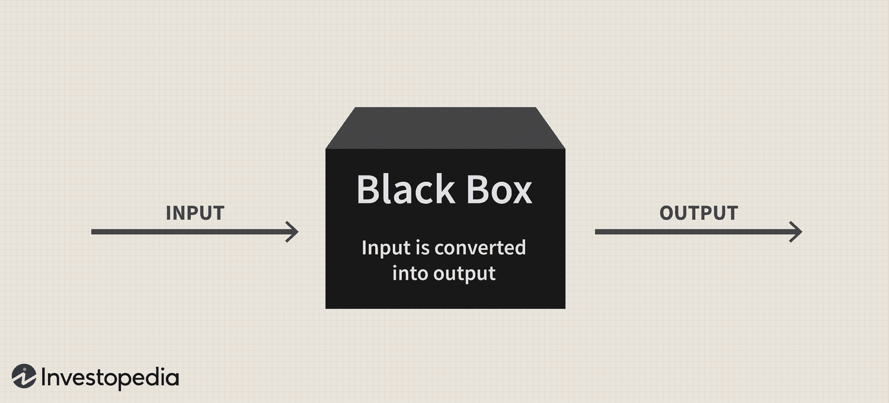

## Table of Contents

## What is a black box model?

A black box model is a type of system or algorithm where you can see what goes in and what comes out, but you don't know how it works inside. Imagine a magic box: you put something in, and it gives you a result, but you can't see the magic happening inside. In the world of computers and technology, black box models are often used in machine learning and artificial intelligence. For example, when you use a voice assistant like Siri or Alexa, it understands your commands and responds, but you don't know the exact steps it takes to do that.

These models are useful because they can handle complex problems and make accurate predictions or decisions without needing to explain every step. However, this can also be a problem because it's hard to trust or improve something when you don't understand how it works. People in fields like medicine, finance, and law need to know why a model makes certain decisions, especially when those decisions affect people's lives. So, while black box models are powerful tools, they also create challenges about transparency and trust.

## How does a black box model differ from other types of models?

A black box model is different from other types of models because you can't see how it makes decisions or predictions. It's like a magic trick where you see the start and the end, but not the middle part. Other models, like white box models, are more like a clear glass box where you can see all the steps and understand exactly how it works. For example, in a white box model, if you're trying to predict the weather, you can see all the data and calculations that lead to the forecast.

In contrast, a black box model might give you a very accurate weather forecast, but you won't know which data or calculations it used. This makes black box models great for handling complex problems where the exact process isn't as important as getting a good result. However, it can be a problem in situations where understanding the process is crucial, like in medical diagnoses or legal decisions. That's why people often prefer transparent models, where they can see and trust the steps being taken.

## What are the basic components of a black box model?

A black box model has three main parts: the input, the processing part, and the output. The input is the information you give to the model, like data or questions. The processing part is the secret part where the model does its work. You can't see what's happening inside, but it uses complicated math and rules to figure things out. The output is the result the model gives you, like an answer or a prediction.

Even though you can't see inside the black box, it still uses important things like algorithms and data to work. Algorithms are like recipes that tell the model how to use the data to make decisions. The data is the information the model learns from, and it can come from many places, like the internet or sensors. So while the inside of the black box is a mystery, it's still using these basic parts to do its job.

## Can you explain the concept of opacity in black box models?

Opacity in black box models means that you can't see or understand how the model works inside. It's like looking at a dark window where you can't see what's happening on the other side. When you use a black box model, you give it some information and it gives you a result, but you don't know the steps it took to get there. This makes the model's process hidden or "opaque."

This opacity can be a problem because it's hard to trust something when you don't know how it works. For example, if a black box model is used to decide if someone gets a loan, people might want to know why the decision was made. If the model can't explain its reasoning, it might seem unfair or biased. On the other hand, opacity can be useful when the exact process isn't as important as getting a good result, like in some types of predictions or recommendations.

## What are some common applications of black box models?

Black box models are often used in areas where predicting or deciding things is important but the exact way it works isn't as crucial. For example, in online shopping, black box models help recommend products to you. They look at what you've bought or looked at before and suggest things you might like. You don't need to know how the model decides what to show you, as long as the recommendations are good. Another common use is in self-driving cars. These cars use black box models to understand the road and make quick decisions about steering or braking. The important thing is that the car drives safely, not how it figures out what to do.

In the world of finance, black box models help with things like predicting stock prices or detecting fraud. They can look at huge amounts of data and find patterns that humans might miss. As long as the predictions are accurate, the details of how the model works don't matter as much. In healthcare, black box models can help diagnose diseases or suggest treatments based on a patient's data. While doctors might want to understand the reasoning behind these suggestions, the models can still be useful for finding patterns in large datasets that could lead to better patient care.

## How are black box models used in machine learning?

In machine learning, black box models are used to make predictions or decisions based on data. These models can handle very complex problems, like recognizing faces in photos or understanding what people are saying in voice recordings. The model looks at the data you give it, does some secret math inside, and then tells you what it thinks will happen or what it thinks you should do. You don't need to know how it figures things out, as long as it gives you good results. For example, when you use a search engine, a black box model helps figure out which results are most relevant to your query, but you don't see how it makes those choices.

These models are really useful in areas where the exact process isn't as important as getting a good outcome. For instance, in online advertising, black box models can predict which ads you're most likely to click on. They look at your past behavior and other data to make these predictions, and the ads get shown to you without you knowing how the model decided which ones to display. However, because you can't see inside the black box, it can be hard to trust the model, especially in important situations like medical diagnoses or legal decisions where understanding the reasoning is crucial.

## What are the advantages of using black box models in data analysis?

Black box models are great for data analysis because they can handle really complicated problems easily. They look at a lot of data and find patterns that people might not see. This makes them useful for things like predicting what customers might buy next or figuring out if a credit card is being used fraudulently. Because black box models can deal with so much data and make good guesses, they save time and effort compared to trying to do the same thing by hand or with simpler methods.

However, even though black box models are powerful, they can be hard to trust because you can't see how they work inside. This is okay for some things, like recommending movies or ads, where the exact process doesn't matter as much as getting a good result. But in important areas like medicine or law, people need to understand why the model makes certain decisions. So while black box models are very helpful for data analysis, they also have challenges when it comes to transparency and trust.

## What are the limitations or challenges associated with black box models?

One big challenge with black box models is that they are hard to understand. Because you can't see how they work inside, it's tough to trust them completely. This is a problem in important areas like medicine or law, where people need to know why a decision was made. For example, if a black box model decides not to give someone a loan, the person might want to know the reason. If the model can't explain itself, it might seem unfair or biased.

Another limitation is that black box models can be hard to fix or improve. If the model makes a mistake, you can't easily figure out why and fix it because the inside is hidden. This can be frustrating for people who want to make the model work better. Also, because these models are so complex, they need a lot of data to work well. If you don't have enough data, the model might not give good results.

Lastly, there can be legal and ethical issues with black box models. Some places have rules that say decisions affecting people's lives need to be explained. If a black box model can't do this, it might not be allowed to be used. This is especially important in fields like healthcare and finance, where decisions can have big impacts on people's lives. So while black box models are powerful, these challenges mean they need to be used carefully.

## How can the performance of a black box model be evaluated?

To evaluate how well a black box model is doing, you can use different ways to check its results. One common way is to use a test set, which is data the model hasn't seen before. You give this data to the model and see if its predictions or decisions are right. If the model does well on this new data, it means it's good at figuring things out. You can also compare the model's results to what a person would do or to other models to see if it's better or worse.

Another way to check a black box model's performance is by looking at how sure it is about its answers. Some models can tell you how confident they are in their predictions. If a model is often very sure but wrong, it might not be trustworthy. You can also use special numbers like accuracy, precision, and recall to measure how well the model is doing. These numbers help you understand if the model is good at finding what you're looking for and if it makes a lot of mistakes. By using these methods, you can get a good idea of how well a black box model works, even if you can't see inside it.

## What techniques are used to interpret or explain the decisions made by black box models?

To help understand the decisions made by black box models, people use something called "explainable AI" techniques. One way to do this is by using a method called LIME, which stands for Local Interpretable Model-agnostic Explanations. LIME looks at one decision the model made and tries to explain why it made that choice. It does this by changing the input data a little bit and seeing how the model's decision changes. This can give you a good idea of which parts of the data were most important for the model's decision.

Another technique is SHAP, which stands for SHapley Additive exPlanations. SHAP looks at how each piece of data affects the model's decision, kind of like figuring out who contributed what in a group project. By using SHAP, you can see which data points pushed the model towards its final decision and by how much. These techniques help make black box models a bit more understandable, even if you can't see everything happening inside them.

## How do regulatory and ethical considerations impact the use of black box models?

Regulatory and ethical considerations play a big role in how black box models are used. In many places, there are rules that say decisions affecting people's lives need to be explained. For example, if a black box model is used to decide if someone gets a loan or a job, the person has a right to know why the decision was made. If the model can't explain its reasoning, it might not be allowed to be used. This is important in areas like healthcare, where a doctor needs to understand why a model suggests a certain treatment, or in finance, where a bank needs to justify why someone's loan application was rejected.

Ethically, using black box models can be tricky because people might feel unfairly treated if they don't understand the decisions made about them. For example, if a black box model decides who gets into a school or who gets a job, and it can't explain why, people might think the model is biased or discriminatory. This can lead to mistrust and harm to people's lives. That's why many experts say it's important to make black box models more transparent and understandable, so people can trust the decisions and feel they are treated fairly.

## What future developments can we expect in the field of black box modeling?

In the future, we can expect black box models to become even better at understanding and explaining their decisions. Researchers are working hard on making these models more transparent. They are developing new ways, like better versions of LIME and SHAP, to help us see inside the black box. This means that even though the models will still be complex, we'll be able to trust them more because we'll understand how they make choices. This is important for using these models in areas like healthcare and finance, where people need to know why decisions are made.

Another big change we might see is the use of more ethical guidelines for black box models. As people become more aware of how these models affect our lives, there will be stronger rules about how they can be used. Governments and organizations might create new laws to make sure these models are fair and don't harm anyone. This could mean that black box models will need to explain their decisions in a way that everyone can understand, making them more trustworthy and easier to use in important decisions.

## What is the role of Machine Learning and AI in trading?

Machine learning and AI technologies are reshaping the landscape of trading by enabling computers to learn from data, identify patterns, and make autonomous decisions, all with minimal human intervention. At its core, machine learning involves training algorithms to discern complex patterns within vast datasets, allowing them to make informed decisions and predictions. In the context of financial trading, these capabilities are utilized to analyze enormous volumes of financial data, thus enhancing the ability to predict market trends and execute trades at the most opportune times.

The training of [machine learning](/wiki/machine-learning) algorithms in trading typically involves feeding them large datasets that include historical prices, trade volumes, and other relevant financial indicators. These datasets serve as the foundation for the algorithm to recognize patterns and correlations, which are vital for making predictive analyses. For instance, supervised learning techniques, where a model is trained on labeled input-output pairs, are commonly used in this domain. Bayesian regression or decision tree algorithms might be employed to predict stock prices based on historical data and influencing factors. The formula for a simple linear regression model often used in financial predictions is:

$$
y = \beta_0 + \beta_1 x_1 + \beta_2 x_2 + \ldots + \beta_n x_n + \varepsilon
$$

where $y$ is the predicted value, $x_1, x_2, \ldots, x_n$ are the features, $\beta$ are the coefficients learned by the model, and $\varepsilon$ is the error term.

Deploying these algorithms in live trading environments requires careful consideration of latency and computational efficiency, especially in high-frequency trading ([HFT](/wiki/high-frequency-trading-strategies)) scenarios where trades are conducted over thousandths of a second. Models are often implemented in robust programming environments such as Python, leveraging libraries like TensorFlow or PyTorch, to ensure they can handle real-time data streams and complex computations efficiently.

One significant area where machine learning has found its application is sentiment analysis. By processing large volumes of unstructured data from news articles, social media, and financial reports, AI systems can gauge market sentiment, which can be crucial for forecasting asset price movements. For example, natural language processing (NLP) techniques are employed to convert textual data into meaningful indicators of market mood. Another application is market forecasting, where algorithms are deployed to anticipate market shifts and advise on future positions. In portfolio management, machine learning aids in optimizing asset allocation, balancing risk, and improving investment returns by continuously learning from market dynamics.

The overarching goal of implementing machine learning and AI in trading is to enhance operational efficiency, increase profitability, and substantially reduce the emotional bias common in manual trading. By automating the decision-making process, these technologies promote a more objective and data-driven approach to trading, ultimately leading to better outcomes for traders and financial institutions.

By leveraging machine learning in trading, the industry not only underscores speed and precision but also taps into the unparalleled capabilities of these technologies to discover hidden market dynamics, ensuring that the decision-making process is guided by data and predictive insights rather than intuition alone. This evolution in trading mechanisms provides the competitive edge necessary in today's high-stakes financial environments.

## References & Further Reading

[1]: Bergstra, J., Bardenet, R., Bengio, Y., & Kégl, B. (2011). ["Algorithms for Hyper-Parameter Optimization."](https://papers.nips.cc/paper/4443-algorithms-for-hyper-parameter-optimization) Advances in Neural Information Processing Systems 24.

[2]: ["Advances in Financial Machine Learning"](https://www.amazon.com/Advances-Financial-Machine-Learning-Marcos/dp/1119482089) by Marcos Lopez de Prado

[3]: ["Evidence-Based Technical Analysis: Applying the Scientific Method and Statistical Inference to Trading Signals"](https://www.amazon.com/Evidence-Based-Technical-Analysis-Scientific-Statistical/dp/0470008741) by David Aronson

[4]: ["Machine Learning for Algorithmic Trading"](https://github.com/stefan-jansen/machine-learning-for-trading) by Stefan Jansen

[5]: ["Quantitative Trading: How to Build Your Own Algorithmic Trading Business"](https://www.amazon.com/Quantitative-Trading-Build-Algorithmic-Business/dp/1119800064) by Ernest P. Chan