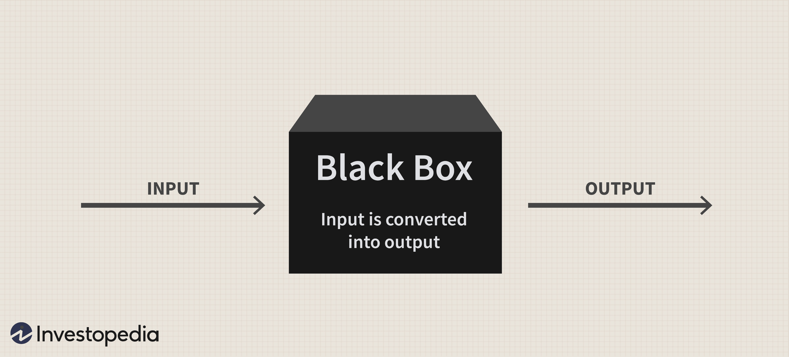

## Table of Contents

## What is a black box trading strategy?

A black box trading strategy is a type of trading method where the details of how it works are kept secret. Traders use computer programs to buy and sell stocks, but they don't share how these programs make their decisions. It's called a "black box" because, like a mysterious box, you can see what goes in and what comes out, but you can't see what's happening inside.

People use black box strategies because they believe it can help them make more money by finding patterns in the market that others can't see. However, because the details are secret, it can be risky. If something goes wrong, it's hard to figure out why, and it can be difficult to trust the strategy completely.

## How does a black box trading strategy work?

A black box trading strategy uses a computer program to make decisions about buying and selling stocks. The program looks at lots of information like stock prices, market trends, and other data. It uses special math formulas and rules to decide when to trade. Traders who use this strategy don't tell anyone exactly how their program works. They keep it a secret to protect their advantage in the market.

Because the details are secret, it's like a magic trick where you see the result but not how it's done. People who use black box strategies hope that their secret formulas will help them make more money than others. But, because no one knows the exact steps the program takes, it can be risky. If the market changes in a way the program didn't expect, it might make bad trades, and it can be hard to fix the problem because the inside workings are hidden.

## What are the key components of a black box trading system?

A black box trading system has a few main parts that help it work. The first part is the data. This includes information like stock prices, market trends, and other numbers that the system uses to make decisions. The system collects this data all the time so it can see what's happening in the market. The second part is the algorithm. This is a set of rules and math formulas that the system follows to decide when to buy or sell stocks. The algorithm is like a secret recipe that the trader keeps hidden from others.

The third part is the execution system. This is what actually buys and sells the stocks based on what the algorithm says. It needs to be fast and reliable so it can make trades at the right time. The last part is the monitoring and risk management tools. Even though the details of the system are secret, traders still need to watch how it's doing and make sure it's not taking too many risks. These tools help them keep an eye on things and make changes if needed, even if they can't see the exact steps the system is taking.

## What are the advantages of using a black box trading strategy?

One advantage of using a black box trading strategy is that it can help traders make money faster. The computer program can look at lots of information very quickly and find patterns that people might miss. This can lead to making trades that are more likely to be successful. Since the details of the strategy are secret, other traders can't copy it easily, which can give the person using the black box an edge in the market.

Another benefit is that a black box system can work without needing a lot of attention from the trader. Once the program is set up, it can keep making trades on its own, following the secret rules and formulas. This means the trader doesn't have to spend all their time watching the market. They can focus on other things while the computer does the work. This can save time and reduce stress for the trader.

## What are the potential risks and disadvantages of black box trading?

One big risk of black box trading is that it can be hard to understand why the system is making certain trades. Since the details of how the program works are kept secret, if something goes wrong, it's tough to figure out what happened and fix it. This lack of transparency can make it hard to trust the system completely. If the market changes in a way the program didn't expect, it might make bad trades, and it can be difficult to stop the losses because the inner workings are hidden.

Another disadvantage is that black box trading can lead to big losses if the secret formulas stop working. Because the system relies on the algorithm to make all the decisions, any mistake or flaw in the program can cause problems. If other traders figure out what the black box is doing, they might start to do the opposite, which could hurt the performance of the strategy. Also, since the trader doesn't know exactly how the system is making its choices, they might not be able to adjust the strategy quickly enough when the market changes.

## How can someone start implementing a black box trading strategy?

To start using a black box trading strategy, you first need to learn about how the stock market works and how to write computer programs. You'll need to collect a lot of data about stocks, like prices and market trends. Then, you'll have to create your own secret formula, or algorithm, that looks at this data and decides when to buy or sell. This part can be hard because you need to know a lot about both trading and coding. Once you have your algorithm, you'll need to set up a system that can use it to make trades automatically.

After you have your black box system ready, you'll need to test it to see if it works well. You can do this by using old market data to see how your strategy would have done in the past. This is called [backtesting](/wiki/backtesting). If your system looks good in the tests, you can start using it with real money, but you'll need to watch it closely. Even though the details of your strategy are secret, you should still use tools to keep an eye on how it's doing and manage any risks. Remember, black box trading can be tricky, so always be ready to learn and make changes if something goes wrong.

## What types of data are typically used in black box trading models?

Black box trading models use a lot of different kinds of data to make their decisions. They look at stock prices, which tell them how much stocks are worth at any moment. They also check trading volumes, which show how many stocks are being bought and sold. Other important data includes financial reports from companies, like how much money they are making or losing, and economic indicators, like unemployment rates or inflation numbers, which can affect the whole market. News and social media can also be part of the data, because they can influence how people feel about certain stocks.

All this data helps the black box model find patterns and make guesses about what might happen next in the market. The model uses math formulas to turn this data into trading decisions. For example, if the model sees that a stock's price is going up and the company is doing well, it might decide to buy that stock. The key is that the model keeps looking at new data all the time, so it can change its decisions quickly if the market changes.

## How do black box trading strategies adapt to market changes?

Black box trading strategies adapt to market changes by constantly taking in new data. They look at things like stock prices, trading volumes, and news all the time. If the market starts to change, the black box can see this new information and use its secret math formulas to decide if it should buy or sell stocks differently. This means the strategy can change its actions quickly without needing a person to tell it what to do.

Even though the details of how the black box works are secret, the system still needs to keep learning and adjusting. Sometimes, the market might do something the black box didn't expect, like a big drop in prices or a sudden news event. When this happens, the black box uses its data to try and figure out what's going on and change its trading plan. This helps the strategy stay useful even when the market is hard to predict.

## Can you explain the role of machine learning in black box trading?

Machine learning plays a big role in black box trading. It helps the computer program learn from the data it sees. The program can look at lots of information like stock prices and market trends, and it uses this data to find patterns. Over time, the [machine learning](/wiki/machine-learning) part of the black box gets better at spotting these patterns and making decisions about when to buy or sell stocks. This means the strategy can change and improve without someone having to tell it what to do.

Even though machine learning makes the black box smarter, it also makes it more mysterious. Because the program learns on its own, it can be hard to understand exactly why it's making certain trades. The details of how the machine learning works are part of the secret formula, so even the people using the black box might not know all the steps it's taking. This can be risky because if the market changes in a way the program didn't expect, it might make bad trades, and it can be tough to figure out what went wrong.

## What are some common misconceptions about black box trading?

One common misconception about black box trading is that it's a magic solution that always makes money. People might think that because it uses fancy computer programs and secret formulas, it can predict the market perfectly. But that's not true. Black box trading can make mistakes, and it can lose money just like any other trading strategy. The market is always changing, and even the best programs can't predict everything.

Another misconception is that black box trading is completely automatic and doesn't need any human help. While it's true that the computer program can make trades on its own, people still need to keep an eye on it. Traders have to check if the system is working right and make sure it's not taking too many risks. Even though the details of the strategy are secret, it's important to watch and adjust it when needed.

## How do regulatory bodies view black box trading strategies?

Regulatory bodies often have a careful view of black box trading strategies. They worry that these secret programs might cause big problems in the market. Because the details of how black box strategies work are hidden, it can be hard for regulators to know if they are safe and fair. They want to make sure that these systems don't cause big swings in stock prices or hurt other traders. So, they keep a close eye on black box trading to try and stop any bad things from happening.

At the same time, regulators know that black box trading can be good for the market. It can help make trading faster and more efficient. But they still need to make rules to keep everything under control. They might ask traders to share some information about their black box strategies, so they can check if they are following the rules. This way, they can balance the benefits of black box trading with the need to keep the market safe and fair for everyone.

## What advanced techniques can enhance the performance of a black box trading system?

One way to make a black box trading system work better is by using something called [deep learning](/wiki/deep-learning). This is a type of machine learning that can look at very complex patterns in data. By using deep learning, the black box can get better at figuring out what's going on in the market and making smarter trades. It's like teaching the computer to see things in the data that it couldn't see before, which can help it make more money.

Another technique is to use something called ensemble methods. This means using more than one black box model at the same time. Each model might look at the data a little differently, and by combining their decisions, the system can make better trades. It's like having a team of experts instead of just one, and the team can often make better choices than any single person. This can help the black box trading system be more reliable and successful.

## References & Further Reading

[1]: Bergstra, J., Bardenet, R., Bengio, Y., & Kégl, B. (2011). ["Algorithms for Hyper-Parameter Optimization."](https://dl.acm.org/doi/10.5555/2986459.2986743) Advances in Neural Information Processing Systems 24.

[2]: ["Advances in Financial Machine Learning"](https://www.amazon.com/Advances-Financial-Machine-Learning-Marcos/dp/1119482089) by Marcos Lopez de Prado

[3]: ["Evidence-Based Technical Analysis: Applying the Scientific Method and Statistical Inference to Trading Signals"](https://www.amazon.com/Evidence-Based-Technical-Analysis-Scientific-Statistical/dp/0470008741) by David Aronson

[4]: ["Machine Learning for Algorithmic Trading"](https://github.com/stefan-jansen/machine-learning-for-trading) by Stefan Jansen

[5]: ["Quantitative Trading: How to Build Your Own Algorithmic Trading Business"](https://books.google.com/books/about/Quantitative_Trading.html?id=j70yEAAAQBAJ) by Ernest P. Chan