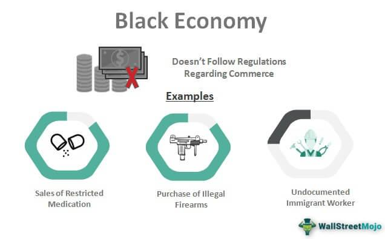

In today's interconnected economy, the terms black market, black economy, and informal economy are often used interchangeably. Each represents a realm of economic activity that operates beyond the reach of government regulation and oversight. These sectors thrive where government restrictions and high taxation create incentives for individuals and businesses to seek alternative avenues for transactions and employment. 

The black market, frequently referenced in discussions of illegal activities, represents a significant and clandestine segment of the global economy. It includes the trade of goods and services that are either illegal themselves or traded in violation of regulatory frameworks. The informal economy, meanwhile, comprises legal activities conducted without official oversight, including forms of employment that go unregistered and untaxed. Unauthorized trading of legitimate goods for tax evasion purposes also constitutes a crucial part of these underground economies.



With the rise of technology, these traditional paradigms of clandestine trading have evolved, presenting new challenges and opportunities. Algorithmic trading, commonly associated with legitimate financial markets, has seeped into these secretive domains, enabling transactions at speeds and scales previously unimaginable. This fusion of technological prowess with covert economic activities has reshaped the landscape of the black market, enhancing both its reach and complexity. 

This article explores these phenomena, examining how they function and influence modern society. It also investigates the crucial role that technology and algorithmic trading now play in the continuing evolution of these obscure yet vastly impactful markets. Understanding these dynamics is essential for policymakers and authorities as they attempt to regulate and integrate these economies into the formal sector, ensuring both economic stability and social welfare.

## Table of Contents

## Understanding the Black Market and Informal Economy

The black market and the informal economy represent segments of economic activity that operate outside governmental purview and regulation. The black market is typically associated with illegal activities, including the trade of goods and services that are prohibited by law, or those that are conducted in violation of tax laws. This sector is characterized by the high demand for restricted items such as narcotics, weapons, and counterfeit goods, which drives their exchange despite legal prohibitions and potential penalties.

In contrast, the informal economy encompasses legal activities that are conducted outside formal, regulated, and taxable frameworks. Examples include casual labor, domestic work, and small-scale entrepreneurship that may not be officially registered or taxed. Transactions in the informal economy are often based on trust and personal relationships rather than formal contracts or regulatory oversight.

Both the black market and informal economy thrive due to certain economic and regulatory conditions. High taxation and stringent regulations can create incentives for individuals and businesses to bypass official channels to maximize profits or maintain affordability. For example, a heavily taxed product may see a parallel market emerge, offering it at lower prices by avoiding tax levies. Similarly, strict regulations that limit access to certain services can lead to an informal supply that meets the unmet demand.

This symbiotic relationship between demand, regulation, and economic activity plays a central role in sustaining these non-official economies. Individuals operating within these markets often respond to financial necessity, a lack of legal employment opportunities, or the unavailability of specific goods. The persistence of these markets presents significant challenges to official economic policies and budget allocations, as they can undermine tax revenues and skew economic data.

## Four Types of Black Economies

The black economy encompasses a variety of activities that operate outside of legal frameworks, often for the purposes of evading taxes, bypassing regulations, or engaging in prohibited trade. It can be categorized into four distinct types: the illegal economy, the unreported economy, the unrecorded economy, and the informal economy.

**The Illegal Economy**: This segment involves transactions of goods and services that are outlawed by legal statutes. Common examples include the trafficking of narcotics, illegal arms trading, human trafficking, and illicit wildlife trade. This economy thrives due to high demand for these restricted goods, often fetching substantial profits due to their scarcity and legal risks involved.

**The Unreported Economy**: Activities within this section are legal but remain concealed from tax authorities to avoid taxation. Individuals and businesses engage in tax evasion by not reporting income generated through legal means. As a result, governments lose significant tax revenue, which could have been used for public services. 

**The Unrecorded Economy**: Economic activities in this sector are not reflected in official statistics or national accounts, often due to lack of data collection or underreporting. This can include small-scale agriculture, subsistence farming, or home-based industries that operate without formal registration. The unrecorded economy complicates economic planning and policy making due to the obscurity of its impact on the overall market.

**The Informal Economy**: Consisting of activities that, while legal, occur outside of formal labor markets or lack the formal contracts characterizing traditional employment. Examples include casual jobs like domestic work, babysitting, or small, cash-only businesses. The informal economy is significant in many developing countries, providing employment and income for those who are unable to access formal job markets.

These types collectively illustrate the multifaceted nature of the black economy, highlighting diverse motives and mechanisms through which entities operate outside regulated environments. Each type poses unique challenges to economic policy and regulation, requiring nuanced approaches to integration and oversight.

## The Role of Technology in the Black Economy

Advancements in technology have significantly altered the landscape of the black economy, particularly through the rise of cryptocurrencies and the dark web. Cryptocurrencies, such as Bitcoin, have been pivotal in providing a level of anonymity that traditional financial systems could not offer. The decentralization and encryption inherent in cryptocurrencies facilitate transactions that evade governmental oversight.

The dark web, a subset of the deep web, hosts a multitude of marketplaces that cater to illicit activities. These platforms leverage the Tor network, which anonymizes users by directing internet traffic through a free, worldwide, volunteer overlay network consisting of thousands of relays. This process conceals a user's location and usage from network surveillance or traffic analysis.

The integration of cryptocurrencies in these dark web marketplaces complicates efforts by law enforcement to track financial flows. The blockchain, while transparent, only reveals wallet addresses and transaction amounts, not the identities behind them. This anonymity is compounded by [cryptocurrency](/wiki/cryptocurrency) tumblers, or mixers, which are services that blend potentially identifiable cryptocurrency funds with others, thus obscuring the original source and destination.

Advancements in encryption and secure communication technologies also play a role in fortifying black market transactions. Modern encryption algorithms, such as AES (Advanced Encryption Standard) and RSA (Rivest-Shamir-Adleman), secure communication between buyers and sellers, rendering it nearly impossible for third parties, including law enforcement agencies, to intercept and decipher messages without the proper decryption keys.

These technological shifts present a formidable challenge to regulatory bodies. Traditional methods of surveillance and control are rendered insufficient, prompting the need for innovative approaches. For instance, governments are increasingly focusing on blockchain analytics to trace cryptocurrency movements. Companies specializing in blockchain analysis, such as Chainalysis and Elliptic, utilize pattern recognition and [machine learning](/wiki/machine-learning) algorithms to identify illicit transactions and link them to real-world entities.

Code sample for a simple blockchain transaction lookup using a hypothetical `blockchain_api`:

```python
import blockchain_api

def trace_transaction(transaction_id):
    transaction = blockchain_api.get_transaction(transaction_id)
    return {
        'amount': transaction.amount,
        'from': transaction.sender_address,
        'to': transaction.recipient_address,
        'timestamp': transaction.timestamp
    }

transaction_details = trace_transaction('abcd1234')
print(transaction_details)
```

Despite these efforts, the rapid evolution of technology continues to outpace regulatory frameworks, requiring adaptive strategies and international cooperation to effectively address the expanding black economy facilitated by technological progress.

## Algorithmic Trading in the Black Market

Algorithmic trading, widely referred to as algo trading, represents an innovative approach in the execution of financial trades through pre-programmed algorithms. These algorithms enable transactions at speeds and frequencies beyond human capability, optimizing various market conditions. In the context of black markets, algo trading is increasingly being leveraged to streamline the trade of illicit goods and services.

This technology's incorporation into black market operations has significantly enhanced the efficiency of illegal transactions. By automating the buy-and-sell process, traders reduce the time and effort needed to complete transactions, while minimizing their exposure to legal risks. The use of sophisticated algorithms allows for the automatic adjustment of prices and quantities based on market demand—mirroring legitimate financial markets but focusing on illicit commodities.

The optimization algorithms employed in these settings often use techniques similar to those found in high-frequency trading ([HFT](/wiki/high-frequency-trading-strategies)). For instance, they may implement statistical models to predict price movements and execute trades when conditions align favorably. A typical algorithm could work as follows:

```python
import numpy as np

# Example of a simple algorithm to determine optimal trade time
prices = np.array([100, 105, 102, 110, 108]) # Example price data
threshold = 5 # Threshold for price change

def determine_trade(prices, threshold):
    trades = []
    for i in range(1, len(prices)):
        price_change = prices[i] - prices[i - 1]
        if abs(price_change) >= threshold:
            trades.append((i, prices[i], 'buy' if price_change > 0 else 'sell'))
    return trades

optimal_trades = determine_trade(prices, threshold)
print(optimal_trades)
```

This hypothetical Python script identifies optimal trading times based on threshold changes in price data, illustrating the kind of logic that could underpin black market algo trading strategies.

By shifting to algorithmic systems, black market participants can also evade traditional forms of detection and intervention by authorities. These algorithms often incorporate elements of machine learning to adapt to changing conditions and avoid detection. Furthermore, encryption and anonymization features allow for the masking of transaction endpoints, further complicating efforts at law enforcement intervention.

Overall, the integration of algo trading into black markets has revolutionized how illegal goods are bought and sold. By harnessing technology, traders have vastly increased the scale and scope of their operations. This presents a significant challenge to regulatory bodies tasked with monitoring and controlling these clandestine economic activities. As algorithmic systems become more advanced, the tactics employed in black market trading will likely evolve, necessitating continuous adaptations by law enforcement and policy makers.

## Costs and Benefits of the Black Economy

The black economy, encompassing both illicit and informal activities, introduces a mixed array of benefits and drawbacks. 

One of the notable benefits is the provision of economic opportunities and access to goods and services otherwise restricted or heavily regulated. For individuals within these economies, engaging in black market activities can offer a supplementary or primary source of income. In regions with limited employment opportunities or heavily controlled markets, the black economy can be a crucial economic outlet. For instance, individuals may find jobs in sectors such as unregulated street vending or unofficial labor markets that do not require formal qualifications or compliance with regulatory standards.

However, the black economy presents significant challenges. The most direct impact is on public finance. Tax evasion, a common practice within the black economy, directly undermines government revenues. The formula for tax gap estimation, $TG = TR - TCR$, highlights this issue, where $TG$ represents the tax gap, $TR$ is total tax revenue potential, and $TCR$ is the tax revenue collected. This gap affects government budgets allocated for essential public services such as healthcare, education, and infrastructure. As these markets continue to evade formal taxation, the financial resources necessary for public welfare diminish, putting pressure on legal taxpayers and affecting economic stability.

In oppressive regimes or regions experiencing conflict, black markets often turn into indispensable channels for acquiring vital goods and services. When legitimate supply chains break down due to war or political instability, black markets may fill the void, providing communities with food, medicine, and essential supplies. Under these circumstances, they act as survival mechanisms, albeit at a potential moral cost due to the lack of regulation and oversight.

While providing certain economic opportunities, the black economy's overall impact tends to be burdensome on societal structures and governance. It poses a dilemma where the immediate benefits of participation may outweigh the long-term repercussions for both individuals and societies, leading to a cycle of regulatory evasion and economic instability.

## Conclusion

The black and informal economies remain intricate and persistent components of the global market landscape, propelled by an enduring demand for goods and services often outside the purview of formal economic structures and state oversight. These underground networks thrive on the dynamic interplay between supply and demand where conventional regulations fall short, fostering a parallel economy that is as adaptable as it is concealed.

Technological advancements have significantly bolstered these economies, with [algorithmic trading](/wiki/algorithmic-trading) epitomizing the cutting-edge tools employed to enhance efficiency and minimize risk in black market transactions. The advent and proliferation of cryptocurrencies, along with encryption facilitated by the dark web, have further entrenched these economies by offering an anonymous and decentralized mode of exchange. This anonymity challenges traditional means of surveillance and control that governments have historically used.

The intersection of technology and clandestine economic activity presents both challenges and opportunities for policymakers. On one hand, the resilience and adaptability of these markets necessitate sophisticated regulatory frameworks capable of responding to rapidly evolving technological tools. Creating such frameworks requires an understanding of the nuanced ways in which technology is harnessed within these economies. On the other hand, the innovative nature of algorithmic trading and cryptocurrency can offer insights into enhancing legal market operations, ultimately contributing to economic growth and security.

Addressing the implications of black and informal economies requires adaptive strategies that balance regulation with economic freedoms. Policymakers must recognize that as technology evolves, so too will the strategies used by those engaged in these hidden economies. Collaborative international efforts, alongside advancements in technology and data analytics, will be crucial in monitoring and managing these complex economic environments. Such efforts can aid in mitigating the adverse effects on public finance and governance while still allowing for economic innovation and development.

## References & Further Reading

[1]: Feige, E. L. (1989). ["The Underground Economies: Tax Evasion and Information Distortion."](https://www.semanticscholar.org/paper/The-Underground-Economies%3A-Tax-Evasion-and-Thomas-Feige/1d4bfffd43319d4a7ad7f45f709248286a950763) Cambridge University Press.

[2]: Schneider, F., & Enste, D. H. (2000). ["Shadow Economies: Size, Causes, and Consequences."](https://www.aeaweb.org/articles?id=10.1257/jel.38.1.77) Journal of Economic Literature, 38(1), 77-114.

[3]: Reuter, P. (Ed.). (2003). ["The Economics of the Global Illicit Drug Trade."](https://www.jstor.org/stable/resrep45154.9) RAND Corporation.

[4]: Mai, R. (2021). ["Cryptocurrency and Darknet Transactions: Analyzing Patterns and Opportunities for Law Enforcement."](https://www.researchgate.net/publication/354328712_Crypto_Currency_Regulation_and_Law_Enforcement_Perspectives) Journal of Financial Policing, 4(1), 50-68.

[5]: Vigna, P. & Casey, M. J. (2016). ["The Age of Cryptocurrency: How Bitcoin and the Blockchain Are Challenging the Global Economic Order."](https://dl.acm.org/doi/10.5555/2717097) St. Martin's Griffin.

[6]: Chan, E. P. (2017). ["Algorithmic Trading: Winning Strategies and Their Rationale."](https://github.com/ftvision/quant_trading_echan_book) Wiley Trading Series.