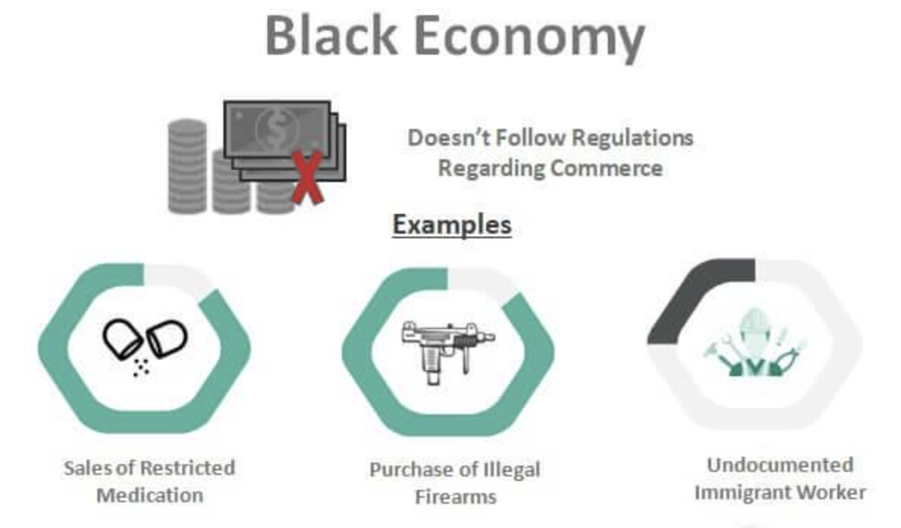

## Table of Contents

## What is the black economy?

The black economy, also known as the shadow economy or underground economy, is the part of a country's economic activity that is not recorded or taxed by the government. This includes money earned from illegal activities like drug dealing or smuggling, as well as legal work that is not reported, like a babysitter who gets paid in cash and doesn't tell the tax office.

People might work in the black economy for different reasons. Some do it to avoid paying taxes, while others might find it hard to get a regular job. Working in the black economy can seem like a quick way to earn money, but it can also be risky. If caught, people can face fines or even jail time. Plus, it can make it harder for the government to plan and provide services, because they don't have a clear picture of the economy.

## What is the black market?

The black market is a place where people buy and sell things that are not allowed by the law or are hard to get legally. It's like a secret store where you can find things that are banned, like certain drugs, or things that are in short supply, like during a war when food might be scarce.

People use the black market for many reasons. Sometimes they want to avoid paying taxes or they need something that they can't get any other way. But buying and selling on the black market is risky. If you get caught, you could get in big trouble with the law. Also, the things you buy might not be safe or good quality because there's no one checking them.

## How do the black economy and black market differ?

The black economy and the black market are related but different. The black economy is all the money and work that happens without the government knowing. It includes both legal work, like a gardener getting paid in cash without reporting it, and illegal activities, like selling drugs. The black economy is bigger than just buying and selling; it's about all the hidden money that moves around.

The black market, on the other hand, is specifically about buying and selling things that are illegal or hard to get legally. For example, if a country bans a certain medicine, people might still sell it on the black market. The black market is a part of the black economy, but not all of the black economy is about trading things. The black market focuses on the exchange of goods and services, while the black economy covers a wider range of hidden economic activities.

## What are common goods and services traded in the black market?

In the black market, people often trade things that are against the law or hard to get legally. This can include drugs like marijuana, cocaine, or heroin. These are illegal in many places, so people buy and sell them secretly. Another common item is fake money or counterfeit goods, like fake designer bags or watches. People also trade weapons on the black market because they can be hard to get legally and are often used for illegal activities.

Besides these, the black market can also be a place to find things that are in short supply. During a war or a crisis, things like food, medicine, or fuel might be hard to get, so people might turn to the black market. Sometimes, people sell stolen goods there too, like electronics or jewelry. These items might be cheaper, but they come with risks because buying and selling on the black market is illegal and can get you in trouble with the law.

## What are the reasons people participate in the black economy?

People join the black economy for different reasons. One big reason is to avoid paying taxes. If someone gets paid in cash and doesn't tell the government, they can keep more money for themselves. Another reason is because they might not be able to find a regular job. This can happen if they don't have the right skills or if the economy is bad. So, they might take a job in the black economy to make ends meet.

Sometimes, people are part of the black economy because they are doing things that are against the law. They might sell drugs or stolen goods because it's a way to make money quickly. But it's risky because if they get caught, they could go to jail. Overall, people join the black economy to make more money or because they don't have many other choices, but it can lead to big problems if they get caught.

## How does the black economy impact the official economy?

The black economy can hurt the official economy in many ways. When people earn money and don't pay taxes on it, the government loses money. This means there's less money for important things like schools, hospitals, and roads. Also, businesses that follow the rules can lose out because they have to compete with people in the black economy who don't pay taxes or follow regulations. This can make it hard for honest businesses to stay open.

On the other hand, the black economy can sometimes help the official economy too. For example, if someone can't find a job and they work in the black economy, they still have money to spend on things like food and clothes. This can help keep some businesses going. But overall, the black economy makes it hard for the government to know what's really happening in the economy, which can make it harder to plan and make good decisions.

## What are the legal consequences of participating in the black market?

If you get caught participating in the black market, you can face serious legal consequences. These can include fines, which are like a punishment where you have to pay money, or even jail time. The exact punishment depends on what you did and the laws in your country. For example, selling illegal drugs can lead to much harsher penalties than selling fake goods.

Besides fines and jail, your record can be affected too. Having a criminal record can make it hard to find a job or rent a place to live later on. It's a big problem that can follow you for a long time. So, even though the black market might seem like an easy way to make money or get things you need, the risks are high and the consequences can be life-changing.

## How do governments attempt to combat the black economy?

Governments try to fight the black economy in many ways. They use laws and rules to make it harder for people to work or trade without being noticed. They might increase the punishments for not paying taxes or selling illegal things. They also use special teams to watch and catch people who are part of the black economy. These teams can check businesses and follow money to find out if someone is hiding their earnings.

Another way governments tackle the black economy is by making it easier for people to follow the rules. They can simplify the tax system so it's not so hard to report earnings. They might also help people find regular jobs by creating programs that teach new skills or help with job searches. By making it easier to do things the right way, fewer people might turn to the black economy.

Governments also use technology to keep an eye on the black economy. They might use computer programs to look at money movements and find strange patterns that could mean someone is hiding money. They can also work with banks to track big money transfers. By using technology, governments can find and stop more activities in the black economy.

## Can you provide historical examples of black markets?

During World War II, black markets were common in many countries. In Europe, things like food, clothes, and fuel were hard to get because of the war. So, people would buy and sell these things on the black market. For example, in Nazi-occupied France, people traded goods like butter, meat, and cigarettes. The black market helped people survive when they couldn't get what they needed legally. But it was risky because if the police caught you, you could get in big trouble.

Another example is from the Soviet Union during the 1970s and 1980s. The government controlled the economy and many things were hard to find in stores. So, people turned to the black market to get things like jeans, music records, and even food. It was a way to get things that were not available in the official stores. The black market was so big that almost everyone knew someone who was involved in it. Even though it was against the law, it was a part of everyday life for many people.

In more recent times, during the economic crisis in Venezuela starting around 2014, black markets became very important. The official economy was struggling, and basic things like food and medicine were hard to find. So, people would buy and sell these things on the black market. The prices were often very high, but it was the only way for many people to get what they needed. The government tried to stop it, but the black market kept growing because people had no other choice.

## What are the economic theories explaining the existence of black markets?

One economic theory that explains the existence of black markets is the theory of supply and demand. When something is hard to get legally, like during a war or when a government puts strict rules on what people can buy, the demand for that thing goes up. If the official supply can't meet this demand, people will look for other ways to get what they need. This creates a black market where people can buy and sell things that are banned or in short supply. The black market helps fill the gap between what people want and what they can legally get.

Another theory is about the cost of following the law. If the rules and taxes are too high or too hard to follow, people might decide it's easier and cheaper to work in the black economy. For example, if taxes are very high, someone might choose to get paid in cash and not report it to keep more money. Or, if it's hard to get a permit to sell something, they might sell it illegally instead. This theory suggests that black markets grow when the official rules make legal business too hard or too expensive.

## How do technological advancements affect the black economy?

Technology has made the black economy bigger and harder to stop. With the internet, people can now buy and sell things on the black market from anywhere in the world. Websites on the dark web let people trade illegal things like drugs, weapons, and fake money without being easily caught. Also, using apps and online payments makes it easier to hide money and not pay taxes. People can get paid for work without anyone knowing, which adds to the black economy.

But technology also helps governments fight the black economy. They use computer programs to watch money movements and find strange patterns that might mean someone is hiding money. Governments can also use technology to check businesses and make sure they are following the rules. So, while technology makes the black economy grow, it also gives governments new tools to catch people who are breaking the law.

## What are some case studies of large-scale black market operations?

One big example of a black market operation was the Silk Road. It was a website on the dark web where people could buy and sell illegal things like drugs, fake money, and stolen goods. It started in 2011 and was run by a man named Ross Ulbricht. People used bitcoins to pay for things, which made it hard for the police to track. The Silk Road became very popular and made a lot of money. In 2013, the FBI shut it down and arrested Ulbricht. He was sent to jail for a long time. The Silk Road showed how the internet could make the black market bigger and harder to stop.

Another example is the counterfeit goods market in China. In places like Guangzhou, people make and sell fake designer bags, watches, and clothes. These fake goods are sold not just in China but all over the world. It's a big business because the fakes look a lot like the real thing but cost much less. The Chinese government has tried to stop it, but it's hard because so many people are involved. This black market affects big companies that lose money because people buy the fakes instead of the real products. It shows how black markets can grow very large and be tough to control.

## References & Further Reading

[1]: Feige, E. L. (1989). ["The Underground Economies: Tax Evasion and Information Distortion."](https://www.semanticscholar.org/paper/The-Underground-Economies%3A-Tax-Evasion-and-Thomas-Feige/1d4bfffd43319d4a7ad7f45f709248286a950763) Cambridge University Press.

[2]: Schneider, F., & Enste, D. H. (2000). ["Shadow Economies: Size, Causes, and Consequences."](https://www.aeaweb.org/articles?id=10.1257/jel.38.1.77) Journal of Economic Literature, 38(1), 77-114.

[3]: Reuter, P. (Ed.). (2003). ["The Economics of the Global Illicit Drug Trade."](https://www.jstor.org/stable/resrep45154.9) RAND Corporation.

[4]: Mai, R. (2021). ["Cryptocurrency and Darknet Transactions: Analyzing Patterns and Opportunities for Law Enforcement."](https://www.researchgate.net/publication/354328712_Crypto_Currency_Regulation_and_Law_Enforcement_Perspectives) Journal of Financial Policing, 4(1), 50-68.

[5]: Vigna, P. & Casey, M. J. (2016). ["The Age of Cryptocurrency: How Bitcoin and the Blockchain Are Challenging the Global Economic Order."](https://dl.acm.org/doi/10.5555/2717097) St. Martin's Griffin.

[6]: Chan, E. P. (2017). ["Algorithmic Trading: Winning Strategies and Their Rationale."](https://github.com/ftvision/quant_trading_echan_book) Wiley Trading Series.