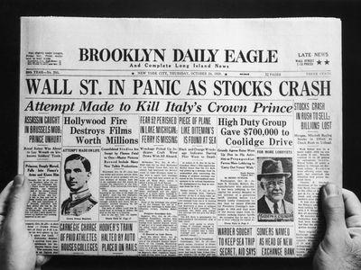

## Table of Contents

## What is the Black Friday Stock Market Crash?

The Black Friday Stock Market Crash happened on September 24, 1869. It was a big event in the United States. It started because two men, Jay Gould and Jim Fisk, tried to control the gold market. They bought a lot of gold to make its price go up. They wanted to make a lot of money from this.

But their plan failed when the government decided to sell a lot of gold. This made the price of gold drop very quickly. Many people lost a lot of money because of this. It caused a lot of problems in the economy. This event is called the Black Friday Stock Market Crash because it happened on a Friday and it was a very bad day for the stock market.

## When did the Black Friday Stock Market Crash occur?

The Black Friday Stock Market Crash happened on September 24, 1869. This was a big event in the United States. It happened because two men, Jay Gould and Jim Fisk, tried to control the gold market. They bought a lot of gold to make its price go up. They wanted to make a lot of money from this.

But their plan did not work. The government decided to sell a lot of gold. This made the price of gold drop very quickly. Many people lost a lot of money because of this. It caused a lot of problems in the economy. This event is called the Black Friday Stock Market Crash because it happened on a Friday and it was a very bad day for the stock market.

## What were the immediate causes of the Black Friday Stock Market Crash?

The immediate cause of the Black Friday Stock Market Crash was the actions of Jay Gould and Jim Fisk. These two men tried to control the gold market by buying a lot of gold. They wanted to make the price of gold go up so they could make a lot of money. They kept buying more and more gold, which made the price go up a lot.

But their plan failed because the government decided to step in. The government sold a lot of gold all at once. This made the price of gold drop very quickly. When the price of gold fell, many people lost a lot of money. This sudden drop in the gold price caused the stock market to crash on that Friday, which is why it is called the Black Friday Stock Market Crash.

## How did the Black Friday Stock Market Crash affect the general public?

The Black Friday Stock Market Crash hurt many people. A lot of people lost their money because the price of gold dropped so fast. People who had bought gold hoping to make money saw their plans fail. Farmers were hit hard too. They needed to sell their crops, but the price of gold falling made it hard for them to make money from their crops. This made life very tough for many families.

The crash also made the economy weaker. Businesses that relied on gold prices going up lost a lot of money. This meant some businesses had to close, and people lost their jobs. The government had to help by giving out money to try and fix the problems. It took a long time for things to get better, and many people remembered how hard it was to get through that time.

## What were the long-term economic impacts of the Black Friday Stock Market Crash?

The Black Friday Stock Market Crash had big effects on the economy that lasted a long time. It made people lose trust in the stock market and in gold as a way to make money. This made it harder for businesses to get money they needed to grow. Many businesses had to close because they couldn't get the money they needed. This slowed down the whole economy and made it hard for the country to grow.

It also changed how the government worked with the economy. After the crash, the government started to watch the gold market more closely. They made new rules to stop people like Jay Gould and Jim Fisk from trying to control the market again. These rules helped make the economy more stable over time. But it took many years for the economy to fully recover from the crash, and people remembered the hard times it caused.

## How did the government respond to the Black Friday Stock Market Crash?

After the Black Friday Stock Market Crash, the government took quick action to try to fix the problems. They sold a lot of gold to make the price go down, which is what caused the crash in the first place. But after the crash, they wanted to help people who lost money. The government gave out money to help businesses and people who were struggling. They also tried to make new rules to stop people from trying to control the market again.

The government also started to watch the gold market more closely. They made new laws to keep the market fair and stable. These new rules helped make sure that no one person or group could control the price of gold like Jay Gould and Jim Fisk tried to do. Over time, these changes helped the economy get stronger and more stable. But it took many years for things to get back to normal after the crash.

## What were the key differences between the Black Friday and other major stock market crashes?

The Black Friday Stock Market Crash in 1869 was different from other major stock market crashes because it was caused by people trying to control the gold market. Jay Gould and Jim Fisk bought a lot of gold to make its price go up, but their plan failed when the government sold gold and made the price drop. This crash was not about stocks going down, but about gold prices falling fast. Other crashes, like the one in 1929, were about stocks losing value because of problems in the whole economy, not just gold.

Another big difference is how the government responded. After Black Friday, the government quickly sold gold to stop people from controlling the market. They also made new rules to watch the gold market more closely and help people who lost money. In other crashes, like the 2008 financial crisis, the government had to help banks and big businesses, and they made new rules to stop risky behavior in the stock market. The Black Friday crash was more about gold and quick government action, while other crashes were about bigger economic problems and longer recovery times.

## What role did speculation play in the Black Friday Stock Market Crash?

Speculation played a big part in the Black Friday Stock Market Crash. Jay Gould and Jim Fisk were trying to make the price of gold go up by buying a lot of it. They hoped that if the price went up, they could sell the gold for a lot more money than they paid for it. This is called speculation because they were betting that the price would keep going up. But when the government decided to sell a lot of gold, the price fell fast. This made their plan fail and caused the crash.

The speculation by Gould and Fisk hurt a lot of people. Many others were also betting on gold prices going up, so when the price dropped, they lost money too. This made the stock market crash even worse. Speculation can be risky because it's like gambling on prices going up or down. In this case, the speculation led to a big problem that affected the whole economy.

## How did the Black Friday Stock Market Crash influence financial regulations?

The Black Friday Stock Market Crash made the government see that they needed to make new rules to keep the market safe. They started watching the gold market more closely to stop people like Jay Gould and Jim Fisk from trying to control it again. The government made new laws to make sure the market was fair and stable. These rules helped stop big problems like the crash from happening again.

The crash also showed that the government needed to be ready to help people when things went wrong. They gave out money to help businesses and people who lost a lot. This was important because it helped the economy get back on track. Over time, these changes made the market more stable, but it took many years for everything to get better after the crash.

## What lessons can be learned from the Black Friday Stock Market Crash to prevent future crashes?

The Black Friday Stock Market Crash teaches us that trying to control the market can lead to big problems. Jay Gould and Jim Fisk tried to make the price of gold go up by buying a lot of it. But when the government sold gold and made the price drop, it caused a crash. This shows that too much speculation and trying to control prices can hurt a lot of people. It's important for people to be careful and not bet too much on prices going up or down.

The government also learned from the crash that they need to watch the market closely and make rules to keep it fair. After the crash, they made new laws to stop people from controlling the market and to help those who lost money. This helped make the economy more stable over time. So, one big lesson is that the government needs to step in to protect people and make sure the market works well. By doing this, they can help prevent big crashes like the one on Black Friday from happening again.

## How did international markets react to the Black Friday Stock Market Crash?

The Black Friday Stock Market Crash in 1869 was a big event in the United States, but it also had effects on international markets. At that time, the U.S. was becoming more connected to other countries through trade and finance. When the price of gold dropped fast in the U.S., it made people in other countries worried. They were worried because they traded with the U.S. and used gold in their own economies. This worry made some international markets shaky because people were not sure what would happen next.

Even though the crash started in the U.S., it showed other countries that big problems in one place can affect the whole world. Countries started to think more about how to protect their own economies from problems in other places. They began to watch their markets more closely and think about making their own rules to keep things stable. The Black Friday crash was a lesson for everyone that the world's economies are connected, and what happens in one country can have big effects everywhere.

## What are some of the most authoritative sources for further reading on the Black Friday Stock Market Crash?

If you want to learn more about the Black Friday Stock Market Crash, a good book to read is "The Age of Betrayal: The Triumph of Money in America, 1865-1900" by Jack Beatty. This book talks about the time when the crash happened and explains how Jay Gould and Jim Fisk tried to control the gold market. It also shows how their actions led to the crash and the problems it caused for many people.

Another good source is the "Journal of Economic History." This journal has articles written by experts about the Black Friday crash. One important article is "The Black Friday Gold Scandal" by Robert F. Bruner and Sean D. Carr. This article gives a detailed look at what happened and why it was so important. It's a great place to learn more about the crash and its effects on the economy.

## References & Further Reading

[1]: Acharya, V. V., & Richardson, M. (Eds.). (2009). ["Restoring Financial Stability: How to Repair a Failed System."](https://onlinelibrary.wiley.com/doi/book/10.1002/9781118258163) Wiley Finance.

[2]: ["The Great Crash 1929"](https://en.wikipedia.org/wiki/Wall_Street_Crash_of_1929) by John Kenneth Galbraith

[3]: Kirilenko, A. A., Kyle, A. S., Samadi, M., & Tuzun, T. (2017). ["The Flash Crash: High-Frequency Trading in an Electronic Market."](https://www.jstor.org/stable/26652722) The Review of Financial Studies, 30(7), 2220-2253.

[4]: Lewis, M. (2014). ["Flash Boys: A Wall Street Revolt."](https://en.wikipedia.org/wiki/Flash_Boys) W. W. Norton & Company.

[5]: Shiller, R. J. (2008). ["The Subprime Solution: How Today's Global Financial Crisis Happened, and What to Do About It."](https://www.jstor.org/stable/j.cttq94jd) Princeton University Press.

[6]: Weatherall, J. O. (2013). ["The Physics of Wall Street: A Brief History of Predicting the Unpredictable."](https://archive.org/details/physicsofwallstr0000weat_l4q5) Mariner Books.