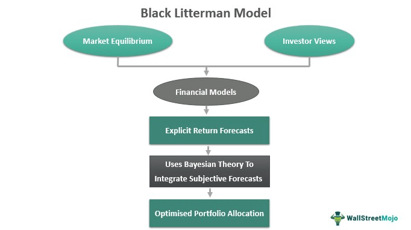

In today's financial markets, where rapid decisions and risk management are essential, effective portfolio management and algorithmic trading are pivotal tools for investors seeking to maximize returns. These strategies are built on financial models that allow decision-makers to balance potential gains against risks. Among the models gaining attention is the Black-Litterman Model, a quantitative approach that integrates both investor insights and market data to provide a comprehensive framework for asset allocation.

This article aims to examine the relationship between financial modeling, portfolio management, the Black-Litterman Model, and algorithmic trading. Financial modeling provides a mathematical representation of an investor’s economic landscape, facilitating informed decisions by analyzing risk and return dynamics. Portfolio management utilizes these models to achieve specific financial goals, creating strategies that balance risk with potential returns.

The Black-Litterman Model, developed by Fischer Black and Robert Litterman, stands out by incorporating subjective investor views with objective market equilibrium data, making it a sophisticated tool for generating intuitive portfolio allocations. By blending both quantitative and qualitative insights, this model provides a stable and intuitive allocation that can enhance traditional mean-variance optimization.

Algorithmic trading involves using computer algorithms to execute trades based on set criteria, adapting portfolio weights dynamically. The integration of algorithms with the Black-Litterman Model allows for a synergy that leverages both to adjust swiftly to changing market conditions and personal insights, optimizing investment strategies in real-time.

Through this exploration, the article will provide you with a comprehensive understanding of these components and their real-world applications, showcasing how they can be harmonized to optimize investment strategies effectively.

## Table of Contents

## Understanding Financial Modeling and Portfolio Management

Financial modeling is a critical component of modern finance, providing a quantitative framework for evaluating and projecting the behavior of financial assets, projects, or entire markets. At its core, financial modeling involves developing mathematical representations of financial scenarios, ranging from single asset valuations to comprehensive forecasting models for corporate performance. The models often rely on historical data, statistical algorithms, and assumptions about future market conditions to predict variables such as asset prices, interest rates, and economic indicators. This quantitative approach enables financial analysts to assess potential risks and returns, facilitating informed decision-making.

Portfolio management, by contrast, is the strategic process of selecting and overseeing a collection of investments that meet the long-term financial aims and risk tolerances of individuals or institutions. It involves continuously balancing the trade-off between risk and return by selecting the optimal mix of assets in a portfolio. This can include equities, fixed income, derivatives, and other asset classes. The primary objective is to construct a portfolio that maximizes returns while minimizing overall risk, typically measured by portfolio [volatility](/wiki/volatility-trading-strategies). Diversification is a key strategy in portfolio management, helping to spread risk across different asset types to achieve more stable returns.

Together, financial modeling and portfolio management create a comprehensive system for managing investments. Quantitative models are integral to developing asset allocation strategies and are employed to simulate various market scenarios, test hypotheses, and optimize portfolios. For example, the expected return of a portfolio can be calculated using the formula:

$$
E(R_p) = \sum_{i=1}^{n} w_i E(R_i)
$$

where $E(R_p)$ is the expected return of the portfolio, $w_i$ is the weight of asset $i$ in the portfolio, and $E(R_i)$ is the expected return of asset $i$.

The application of quantitative models helps in understanding the dynamics between risk and return, enabling portfolio managers to adjust their strategies accordingly. For instance, risk management techniques such as Value at Risk (VaR) and Conditional Value at Risk (CVaR) are often employed to assess the likelihood of portfolio losses. By incorporating these models, portfolio managers can better anticipate potential downturns and implement hedging strategies to mitigate financial loss.

In practice, financial modeling and portfolio management are inextricably linked processes that work together to optimize investment decisions. By leveraging quantitative insights, financial professionals can develop robust investment strategies that align with their clients' financial objectives, adapting to the ever-changing landscape of global markets.

 to the Black-Litterman Model

The Black-Litterman Model, developed by Fischer Black and Robert Litterman in 1990 during their tenure at Goldman Sachs, is a sophisticated financial model that enhances traditional mean-variance optimization by integrating investor views with market equilibrium. Traditional mean-variance optimization, introduced by Harry Markowitz, focuses on maximizing expected return for a given level of risk by selecting a mix of various assets. However, this framework often struggles with input sensitivity and unrealistic portfolio allocations.

The Black-Litterman Model addresses these limitations by combining quantitative and qualitative insights, allowing investors to adjust the standard market equilibrium toward their expectations. This is achieved by taking the equilibrium market returns, predicted by the Capital Asset Pricing Model (CAPM), as a starting point, then blending them with subjective views provided by the investors. These views reflect the expected outperformance or underperformance of certain assets relative to the market equilibrium.

Mathematically, the model starts with the equilibrium excess returns vector, $\Pi$, computed as:

$$
\Pi = \tau \cdot \Sigma \cdot w
$$

where $\tau$ is a scalar representing the uncertainty in the equilibrium return, $\Sigma$ is the covariance matrix of asset returns, and $w$ is the market capitalization weights vector.

Investor views are expressed in a views matrix $P$ and a corresponding vector $Q$, which represent the expectations about specific assets. The confidence in these views is captured in the diagonal covariance matrix $\Omega$.

The model then computes the blended expected returns, $\mu$, using the formula:

$$
\mu = [( \tau \cdot \Sigma )^{-1} + P^T \Omega^{-1} P]^{-1} [( \tau \cdot \Sigma )^{-1} \Pi + P^T \Omega^{-1} Q]
$$

This approach generates portfolios that align more closely with investor intuition and are less sensitive to estimation errors. Consequently, the Black-Litterman Model aids in producing more stable and intuitive portfolio allocations, leading to investment strategies better tailored to the investor's insights and views on market dynamics. The model's ability to seamlessly integrate qualitative judgments with quantitative analysis makes it a valuable tool in modern portfolio management.

## How the Black-Litterman Model Works

The Black-Litterman Model begins with the foundation of market equilibrium. This is typically represented by a mean-variance optimized portfolio, which reflects the market's consensus expectations. The mean-variance optimization approach, originally developed by Harry Markowitz, is based on the idea of maximizing returns for a given level of risk by choosing the proportions of various assets. However, traditional mean-variance optimization has limitations, mainly due to its sensitivity to the estimation of expected returns and covariances. 

The Black-Litterman Model addresses these limitations by integrating subjective views from investors with the market equilibrium returns. These views are inputs that reflect the investor's unique expectations of returns, diverging from the market consensus. Mathematically, this is achieved through a Bayesian framework. The model assumes that the equilibrium returns are normally distributed and follows the equation:

$$
r_{\text{BL}} = \Pi + \tau \Sigma P^T (P \tau \Sigma P^T + \Omega)^{-1} (q - P \Pi)
$$

Where:
- $r_{\text{BL}}$: the adjusted expected returns vector (Black-Litterman returns).
- $\Pi$: the equilibrium excess returns calculated from the Capital Asset Pricing Model (CAPM).
- $\tau$: a scalar representing the uncertainty in the CAPM-implied returns, usually a small positive value.
- $\Sigma$: the covariance matrix of the asset returns.
- $P$: a matrix that identifies the assets involved in the investor's views.
- $\Omega$: a diagonal covariance matrix representing the uncertainty of the investor's views.
- $q$: a vector of the investor's view-specific returns.

The implementation of the Black-Litterman Model involves several steps. First, the equilibrium returns ($\Pi$) are deduced using a market capitalization-weighted average of excess returns, which are derived based on the market's risk aversion level and the covariance matrix. Next, investor views are formulated, where each view has weights ($P$) and an expected return ($q$) with associated uncertainty ($\Omega$). These views are incorporated into the model to adjust the equilibrium returns into the Black-Litterman returns ($r_{\text{BL}}$).

This integration results in a refined set of expected returns that combine market insights with investor expectations, leading to more stable and rational portfolio allocations. The model effectively accounts for subjective insights by blending them with systematic market behavior, thus providing a balanced approach in portfolio construction. Through these steps, the Black-Litterman Model enables investors to tailor asset allocations that align with market signals and personal insights while accounting for inherent uncertainties in the views expressed.

## Role of Algorithmic Trading

Algorithmic trading leverages computer algorithms to execute trades efficiently based on predefined criteria, allowing for precision, speed, and reduced costs. This technology, when integrated with the Black-Litterman Model, enhances portfolio management by aligning allocation strategies with quantitative insights and qualitative views.

The Black-Litterman Model adjusts traditional mean-variance optimization, accommodating investor insights and expectations in portfolio allocation. By employing [algorithmic trading](/wiki/algorithmic-trading), these adjustments can be seamlessly implemented, thanks to the computational power and efficiency of algorithms. This integration allows portfolios to be dynamically managed, with algorithmic trading systems capable of responding rapidly to fluctuations in market conditions and shifts in investor sentiment.

Algorithms can automate the complex calculations required by the Black-Litterman Model. For instance, the model starts with equilibrium returns derived from the Capital Asset Pricing Model (CAPM):

$$
E[R] = R_f + \beta (E[R_m] - R_f)
$$

where $E[R]$ is the expected return, $R_f$ is the risk-free rate, $\beta$ is the beta value reflecting market risk exposure, and $E[R_m]$ is the expected market return. Algorithms help in quickly iterating over these calculations across numerous assets, allowing portfolio managers to update expected returns based on new data and insights.

In a practical scenario, suppose new market data or revised investor views necessitate an adjustment to the portfolio. An algorithm could automatically recalculate the optimal weights for the assets in the portfolio using the Black-Litterman Model:

$$
w^* = \Pi + \tau \Sigma P'^*(\tau P \Sigma P' + \Omega)^{-1}(Q - P\Pi)
$$

where $w^*$ represents the adjusted portfolio weights, $\Pi$ is the equilibrium excess return vector, $\tau$ is a scalar indicating the confidence level in the equilibrium model, $\Sigma$ is the covariance matrix of excess returns, $P$ is the matrix that identifies the assets involved in the views, $\Omega$ is a diagonal covariance matrix of error terms of the views, and $Q$ is the vector of the view on returns.

The ability of algorithms to process and interpret these adjustments in real-time offers a significant advantage, enabling portfolios to remain aligned with desired risk-return profiles even as market conditions evolve. This adaptability is paramount in the fast-paced financial markets, where the speed and accuracy of execution can directly impact investment outcomes.

Furthermore, the synergy between algorithmic trading and the Black-Litterman Model offers enhanced monitoring of trading activities. Algorithms can flag discrepancies or unusual patterns, ensuring that portfolio allocations are continuously optimized and aligned with strategic objectives.

In conclusion, the integration of the Black-Litterman Model into algorithmic trading strategies exemplifies a robust approach to contemporary portfolio management, empowering investors to leverage both model-driven insights and rapid execution to adapt to ever-changing financial landscapes.

## Advantages and Challenges of the Black-Litterman Model

The Black-Litterman Model presents several compelling advantages that make it a valuable tool for investors seeking to optimize their portfolios. A significant advantage is its capacity to integrate investor insights effectively. Traditional models rely heavily on historical data and often treat expected returns as fixed, which can lead to allocations that do not necessarily reflect the investor's views or insights about future market conditions. The Black-Litterman Model addresses this limitation by allowing investors to express subjective views, which are then systematically incorporated into the model's output. This results in more intuitive and potentially robust portfolio allocations that better align with investor expectations.

One of the critical technical merits of the Black-Litterman Model is its ability to mitigate issues related to input sensitivity. Traditional mean-variance optimization models are notoriously sensitive to the inputs of expected returns and covariances. Small changes in these inputs can lead to significantly different portfolio allocations, making the process highly unstable and often impractical. The Black-Litterman Model mitigates this by blending empirical market data with investor views, leading to more stable and reliable allocations. This blending is performed through a mathematical approach that can be loosely summarized as:

$$
E[R] = \Pi + \tau \cdot (\Omega^{-1} + P^{T} \Sigma^{-1} P)^{-1} (Q - P\Pi)
$$

where $E[R]$ is the vector of adjusted expected returns, $\Pi$ is the implied market equilibrium returns, $\tau$ is a scalar representing the uncertainty in the equilibrium returns, $\Omega$ is the uncertainty of the views, $P$ is the matrix representing the views, $\Sigma$ is the covariance matrix, and $Q$ is the vector of expected returns implied by the views.

Despite these advantages, the Black-Litterman Model also poses several challenges. The complexity of the model can be daunting, necessitating a deep understanding of both financial theory and advanced statistical methods. Proper implementation requires accurate estimation of market equilibrium returns and careful derivation of investor views with associated confidence levels. Misestimations can lead to suboptimal allocations.

Furthermore, the requirement for investor confidence in their views can be both a strength and a stumbling block. While the model effectively uses these insights, it assumes that the investor has accurate and informed expectations, which may not always be the case. Overconfidence in speculative insights can skew the model's outputs just as significantly as inaccuracy in input measurements.

Overall, while the Black-Litterman Model offers a sophisticated mechanism for enhancing portfolio management, it demands precision and careful judgment from its users. Investors must be cognizant of the model's assumptions and prepared to tackle the technical challenges involved in its application.

## Applications and Case Studies

The Black-Litterman Model is widely adopted across various financial institutions for its ability to provide a more nuanced approach to portfolio allocation. Asset management firms, pension funds, and insurance companies leverage this model to align with strategic investment goals while balancing risk and return. Below, we explore some specific case studies and applications of the Black-Litterman Model to illustrate its use in practical scenarios.

### Case Study: Goldman Sachs
Goldman Sachs, where the Black-Litterman Model was first developed, has long utilized this approach in its asset allocation strategies. The model's integration allows the firm to incorporate market forecasts and investor sentiment into their investment process. By doing so, they achieve a more stable and balanced portfolio that aligns with both market conditions and internal expectations. At Goldman Sachs, the application of the Black-Litterman Model underpins the allocation of various asset classes, allowing for adjustments based on both quantitative data and qualitative insights.

### Case Study: BlackRock
BlackRock, one of the largest asset managers globally, employs the Black-Litterman Model to enhance its investment decision-making framework. The company uses the model to navigate uncertainties in global markets by incorporating their proprietary views on future returns into the asset allocation process. This not only provides a disciplined structure for asset allocation but also enhances the robustness of the investment portfolio by mitigating input sensitivity issues that are inherent in traditional models.

### Use in Pension Funds
Pension funds are generally characterized by their long-term investment horizons and the need to balance growth with stability. The Black-Litterman Model assists these funds by providing a mechanism to incorporate macroeconomic views and expected asset class performances. This results in asset allocation strategies that are more aligned with the fund's liabilities and financial goals. Pension funds often use this model to better adjust their portfolios in response to changing economic outlooks and demographic shifts.

### Use in Insurance Companies
Insurance companies utilize the Black-Litterman Model to optimize their investment portfolios given the regulatory and capital constraints they face. The model helps in blending market equilibrium with insights such as anticipated [interest rate](/wiki/interest-rate-trading-strategies) changes and economic trends, ensuring that the portfolios are both risk-adjusted and aligned with the company's long-term obligations. This application optimizes the return on invested premiums while maintaining compliance with regulatory capital requirements.

### Conclusion
Across these case studies and applications, the Black-Litterman Model proves to be a vital tool in the toolkit of sophisticated financial players. Its ability to integrate investor views and market data makes it indispensable for entities seeking to optimize their portfolio returns while managing risks effectively. By harnessing the model's strengths, firms like Goldman Sachs and BlackRock continue to refine their strategic asset allocations, offering valuable insights into modern portfolio management practices.

## Conclusion

The Black-Litterman Model represents a significant advancement in portfolio management and algorithmic trading, offering investors a sophisticated method for enhancing their asset allocation decisions. By carefully integrating both market data and investor insights, the model provides a nuanced approach that enhances traditional mean-variance optimization frameworks. Unlike conventional models that might solely rely on historical market data, the Black-Litterman Model allows for the incorporation of subjective investor views, thereby leading to more balanced portfolio allocations. 

This integration is facilitated by the model's mathematical framework, which merges expected returns from market equilibrium with investor-generated forecasts, adjusting the weights accordingly. As a result, the allocations produced are more intuitive and aligned with investor expectations, creating robust and adaptable investment strategies.

Though adopting the Black-Litterman Model necessitates an understanding of complex quantitative principles, including aspects of Bayesian [statistics](/wiki/bayesian-statistics), its potential benefits are substantial. Investors equipped with these skills can yield portfolios that not only aim for optimal returns but are also resilient to market volatilities by dynamically adapting to shifts in market conditions and new information.

For modern investors, particularly those employing algorithmic trading strategies, the Black-Litterman Model offers a compatible framework. By integrating this model, algorithms can dynamically adjust portfolio weights in response to market changes and evolving investor views, therefore enhancing decision-making capabilities and strategic agility.

In conclusion, investors looking to refine their strategies and achieve superior risk-adjusted returns should consider incorporating the Black-Litterman Model in conjunction with algorithmic trading. This dual approach leverages the strengths of both methodologies, paving the way for more informed and potentially successful investment outcomes.

## References & Further Reading

[1]: Black, F., & Litterman, R. (1991). ["Asset Allocation: Combining Investor Views with Market Equilibrium"](https://typeset.io/papers/asset-allocation-combining-investor-views-with-market-2cu0wd6hzv). Goldman Sachs Fixed Income Research.

[2]: Meucci, A. (2005). ["The Black-Litterman Approach: Original Model and Extensions"](https://papers.ssrn.com/sol3/papers.cfm?abstract_id=1117574). SSRN Electronic Journal.

[3]: He, G., & Litterman, R.B. (1999). ["The Intuition Behind Black-Litterman Model Portfolios"](https://www.cis.upenn.edu/~mkearns/finread/intuition.pdf). Investment Management Research.

[4]: Idzorek, T. M. (2004). ["A Step-by-Step Guide to the Black-Litterman Model: Incorporating user-specified confidence levels"](https://people.duke.edu/~charvey/Teaching/BA453_2006/Idzorek_onBL.pdf). Ibbotson Associates, Chicago.

[5]: Satchell, S., & Scowcroft, A. (2000). ["Implementing the Black-Litterman Model in Portfolio Construction"](https://www.semanticscholar.org/paper/A-demystification-of-the-Black%E2%80%93Litterman-model%3A-and-Satchell-Scowcroft/71414d2f1971e95eaeab3f3d70edea95b3cfef28). Journal of Asset Management.