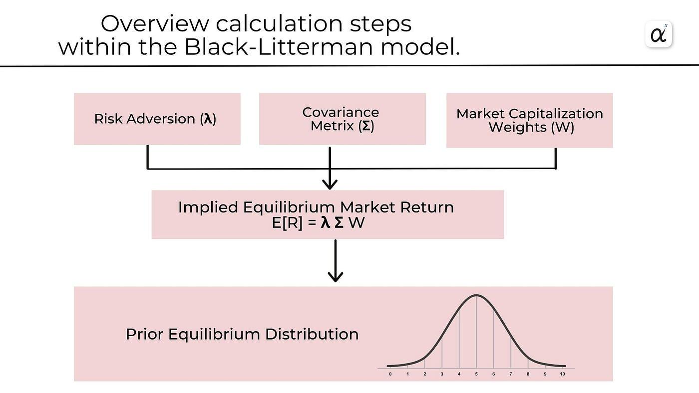

## Table of Contents

## What is the Black–Litterman model?

The Black–Litterman model is a tool used in finance to help investors figure out how to spread their money across different investments. It was created by Fischer Black and Robert Litterman in the 1990s. This model starts with the idea that markets are generally right, so it uses the overall market's view as a starting point. Then, it lets investors add their own views or predictions about how certain investments might do better or worse than the market expects. By mixing these personal views with the market's view, the model helps create a more balanced and potentially more accurate investment plan.

The way the Black–Litterman model works is by taking the market's expected returns and combining them with the investor's own predictions. It uses a mathematical formula to blend these two sets of information. This helps to reduce the risk of making big mistakes based on just one person's guesses. The model also helps investors see how confident they should be in their own views compared to the market's views. By doing this, it gives a clearer picture of where to put money to get the best balance between risk and reward.

## Who developed the Black–Litterman model and when was it introduced?

The Black–Litterman model was developed by Fischer Black and Robert Litterman. Fischer Black was a famous economist and Robert Litterman was a financial expert. They worked together at Goldman Sachs, a big bank, when they created this model.

The model was introduced in the 1990s. It was a new way to help investors decide where to put their money. Before the Black–Litterman model, it was hard for investors to mix their own ideas with what the market thought. This model made it easier and more scientific.

## How does the Black–Litterman model differ from traditional portfolio optimization models?

The Black–Litterman model is different from traditional portfolio optimization models because it starts with the market's view instead of just the investor's guesses. Traditional models, like the one created by Harry Markowitz, focus a lot on the investor's own predictions about how different investments will do. These models can lead to big mistakes if the investor's guesses are wrong. The Black–Litterman model, on the other hand, uses the market's expected returns as a starting point. This means it already includes a lot of information from many people, making it a more stable base to work from.

Another big difference is how the Black–Litterman model mixes the investor's views with the market's views. Traditional models don't do this well. They might take the investor's guesses and use them directly, which can be risky. The Black–Litterman model uses a special formula to blend the investor's views with the market's views. This helps to balance out the risk and make the investment plan more reliable. By doing this, the model helps investors feel more confident about their choices and reduces the chance of big mistakes.

## What are the key components of the Black–Litterman model?

The Black–Litterman model has two main parts: the market's view and the investor's view. The market's view is like a big picture of what everyone thinks about different investments. It's based on how the market is doing right now and what it expects to happen in the future. This part is important because it gives a solid starting point that includes a lot of information from many people. The investor's view is what the person putting money into the investments thinks might happen. This could be different from what the market thinks, and it's based on the investor's own research or feelings about certain investments.

The model uses a special formula to mix these two views together. It takes the market's expected returns and combines them with the investor's predictions. This formula helps to balance out the risk and make the investment plan more reliable. By doing this, the model helps investors see how confident they should be in their own views compared to the market's views. It also helps to create a more balanced and potentially more accurate investment plan by reducing the chance of big mistakes based on just one person's guesses.

## How does the Black–Litterman model incorporate investor views into asset allocation?

The Black–Litterman model helps investors figure out where to put their money by mixing what they think with what the market thinks. It starts with the market's view, which is like a big picture of what everyone believes about different investments. This market view is based on how the market is doing now and what it expects in the future. By using this as a starting point, the model makes sure the investment plan is based on a lot of information from many people, making it more stable and less risky.

Then, the model adds the investor's own thoughts about how certain investments might do better or worse than what the market expects. The model uses a special formula to blend these personal views with the market's view. This helps to balance out the risk and make the investment plan more reliable. By doing this, the model helps investors feel more confident about their choices and reduces the chance of big mistakes based on just one person's guesses.

## What is the role of the equilibrium market return in the Black–Litterman model?

The equilibrium market return is a key part of the Black–Litterman model. It's like the starting point for figuring out where to put money. The equilibrium market return is what the market thinks different investments will earn in the future. It's based on how the market is doing right now and what it expects to happen. By using this as a starting point, the model makes sure the investment plan is based on a lot of information from many people, making it more stable and less risky.

The Black–Litterman model then mixes the equilibrium market return with the investor's own thoughts about how certain investments might do better or worse than what the market expects. This mixing is done using a special formula that helps balance out the risk and make the investment plan more reliable. By starting with the equilibrium market return, the model helps investors feel more confident about their choices and reduces the chance of big mistakes based on just one person's guesses.

## How does the model handle uncertainty in investor views?

The Black–Litterman model deals with uncertainty in investor views by using a special way to mix the investor's guesses with what the market thinks. It knows that the investor might not be totally sure about their predictions, so it uses something called a "confidence level" to show how sure the investor is. This confidence level helps the model decide how much to trust the investor's views compared to the market's views. If the investor is not very sure, the model will lean more on the market's view. But if the investor feels very confident, the model will give more weight to their guesses.

By doing this, the Black–Litterman model makes a balanced plan that takes both the market's and the investor's views into account. It helps to make the investment choices more reliable by not relying too much on one person's guesses. This way, the model reduces the risk of big mistakes and helps investors feel more confident about where to put their money.

## What is the mathematical formula used to combine the investor’s views with the market equilibrium?

The Black–Litterman model uses a special math formula to mix the investor's guesses with the market's view. This formula is called the "Black–Litterman formula." It starts with the market's expected returns, which are like the market's guesses about how different investments will do. The investor then adds their own thoughts about how certain investments might do better or worse than what the market thinks. The formula uses something called a "confidence level" to show how sure the investor is about their guesses. If the investor is very sure, their guesses get more weight in the mix. If they're not so sure, the market's view gets more weight.

The formula then blends these two sets of guesses together. It does this in a way that tries to balance out the risk and make the investment plan more reliable. The result is a new set of expected returns that take into account both the market's view and the investor's view. This helps the investor make better choices about where to put their money, reducing the chance of big mistakes based on just one person's guesses. By using this formula, the Black–Litterman model helps investors feel more confident about their investment plan.

## Can you explain the concept of the 'confidence matrix' in the Black–Litterman model?

The 'confidence matrix' in the Black–Litterman model is a way to show how sure the investor is about their guesses. It's like a tool that helps the model decide how much to trust the investor's views compared to the market's views. When an investor has a guess about how an investment will do, they also need to say how confident they are in that guess. This confidence is put into the confidence matrix, which is just a table that shows how sure the investor is about each of their guesses. If the investor is very sure about a guess, the number in the confidence matrix will be high. If they're not so sure, the number will be low.

The confidence matrix is really important because it helps the Black–Litterman model mix the investor's guesses with the market's guesses in a smart way. If the investor is very confident, their guesses will have more weight in the final plan. But if they're not so sure, the model will lean more on what the market thinks. By using the confidence matrix, the model can balance out the risk and make a more reliable investment plan. This helps the investor feel more confident about their choices because the plan takes into account both their own views and the market's views, reducing the chance of big mistakes.

## How does the Black–Litterman model adjust portfolio weights based on new information or changes in views?

The Black–Litterman model is really good at changing how much money an investor puts into different investments when they get new information or change their mind about something. It starts with what the market thinks, which is like a big guess about how all investments will do. Then, the investor can add their own guesses about how certain investments might do better or worse than what the market thinks. If the investor gets new information or changes their mind, they can update their guesses. The model uses a special math formula to mix these new guesses with the market's guesses. This formula looks at how sure the investor is about their new guesses, which is shown in something called the confidence matrix. If the investor is very sure about their new guesses, those guesses will have more weight in the final plan.

When the investor updates their guesses, the Black–Litterman model changes how much money goes into each investment. It does this in a way that tries to balance out the risk and make the investment plan more reliable. If the new information makes the investor think an investment will do much better than before, the model might put more money into that investment. But if the new information makes them think it will do worse, the model might put less money into it. By doing this, the model helps the investor feel more confident about their choices because it takes into account both their own new views and the market's views, reducing the chance of big mistakes.

## What are some practical applications of the Black–Litterman model in portfolio management?

The Black–Litterman model is really useful for people who manage money and want to make smart choices about where to put it. One big way it's used is in big investment firms where they handle lots of money for different people. These firms use the model to mix what they think about investments with what the market thinks. This helps them make a plan that's not just based on one person's guesses but includes a lot of information from the market. By doing this, they can create a more balanced and safer investment plan that's less likely to go wrong.

Another way the Black–Litterman model is used is by individual investors who want to make their own investment choices. These people might have their own ideas about how certain investments will do, but they also know that the market's view is important. The model helps them blend their own thoughts with the market's thoughts in a smart way. It shows them how confident they should be in their own guesses and helps them adjust their investment plan when they get new information. This makes it easier for them to feel good about their choices and manage their money better.

## What are the limitations and criticisms of the Black–Litterman model?

The Black–Litterman model is really helpful, but it has some problems too. One big issue is that it can be hard to figure out what the market thinks. The model starts with the market's view, but getting that right can be tricky. If the market's view is wrong, the whole plan can be off. Another problem is that the model needs a lot of math and numbers to work right. Not everyone knows how to do all that math, so it can be hard to use the model correctly. Also, the model assumes that the investor's guesses and the market's guesses are mixed in a certain way, but that might not always be the best way to do it.

Another criticism is that the Black–Litterman model can be too focused on the market's view. Some people think it doesn't give enough weight to the investor's own ideas. If an investor has a really good guess about an investment, the model might not use it as much as it should. Also, the model can be sensitive to how confident the investor says they are about their guesses. If the investor isn't good at figuring out how sure they are, the model might not work well. These problems mean that while the Black–Litterman model is a good tool, it's not perfect and needs to be used carefully.

## What is the Black–Litterman Model and how can it be understood?

The Black–Litterman model is a sophisticated portfolio optimization method that resolves some of the limitations associated with traditional mean-variance optimization. Developed by Fischer Black and Robert Litterman at Goldman Sachs in the early 1990s, the model refines asset allocation by incorporating both market equilibrium assumptions and investor insights.

At the core of the Black–Litterman model is the equilibrium assumption. This is based on the idea that market equilibrium returns, often represented by a global market capitalization-weighted index, encapsulate the collective wisdom of the market. In this framework, the expected returns derived from historical market data serve as a neutral starting point. This equilibrium view is instrumental in counteracting the extreme and often unintuitive weights derived from conventional mean-variance models, which can sometimes be sensitive to slight changes in the inputs.

The Black–Litterman model takes this a step further by allowing investors to incorporate their own views on asset performance. Investors can adjust the equilibrium returns based on their insights or information about specific assets. These views are integrated into the model in a systematic way, balancing them against the equilibrium returns to produce modified expected returns. The process of integrating investor views is achieved using a parameter often termed as 'view confidence,' allowing the model to adapt based on how strongly the investor holds their beliefs relative to the market consensus.

Mathematically, the Black–Litterman model combines the equilibrium returns with investor views through a Bayesian-like process. This involves the following steps:

1. **Estimation of Equilibrium Excess Returns:** This is typically expressed as:
$$
   \Pi = \delta \Sigma w_m

$$
   where $\Pi$ represents the equilibrium excess returns, $\delta$ is the risk aversion coefficient, $\Sigma$ is the covariance matrix of returns, and $w_m$ is the market capitalization weight vector.

2. **Incorporation of Investor Views:** Investor views can be expressed in the form \[Q = P \cdot \mu + \epsilon\]
   Here, $Q$ represents the investor's expected returns for certain assets or portfolios, while $P$ is a matrix representing the assets that are involved in the views, and $\epsilon$ is the noise or error term of the views.

3. **Combining Equilibrium and Views:** The combined expected returns ($\mu_{\text{BL}}$) are then obtained by blending $\Pi$ and $Q$ using a weighting that reflects the confidence in the investor views:
$$
   \mu_{\text{BL}} = [( \tau \Sigma )^{-1} + P^T \Omega^{-1} P]^{-1}[( \tau \Sigma )^{-1} \Pi + P^T \Omega^{-1} Q]

$$
   Here, $\tau$ is a scalar parameter that reflects the uncertainty in the equilibrium returns, and $\Omega$ is the covariance matrix of the view errors, representing the confidence in the views.

The result of this sophisticated blending approach is a set of expected returns that can be used to perform portfolio optimization with greater stability and realism than traditional methods. The Black–Litterman model provides a solid platform for achieving optimal portfolio allocation by systematically integrating market data and subjective investor beliefs, enhancing the robustness and applicability of modern portfolio practices.

## How is Modern Portfolio Theory Applied?

The Black–Litterman model plays a significant role in modern portfolio theory, particularly by addressing some of the inherent limitations of traditional mean-variance optimization. In conventional approaches, such as the Markowitz mean-variance framework, portfolio optimization heavily relies on estimates of expected returns for different assets. These estimates are typically based on historical data, which may not accurately predict future performance due to market [volatility](/wiki/volatility-trading-strategies) and the influence of unforeseen [factor](/wiki/factor-investing)s.

One of the key enhancements provided by the Black–Litterman model is its sophisticated method for incorporating investor views along with market equilibrium assumptions. By doing so, this model creates a more balanced and realistic estimation of expected returns. The model begins with a market equilibrium, represented by the Capital Asset Pricing Model (CAPM) implied returns, from which investors can then adjust based on their proprietary views on future performance. This shift is mathematically expressed as a combination of the equilibrium excess returns vector $\Pi$ and the view-adjusted returns. 

The Black–Litterman formula for expected returns, $\mu$, can be represented as:

$$
\mu = \Pi + \tau \Sigma P^T (P \tau \Sigma P^T + \Omega)^{-1} (Q - P \Pi)
$$

Here, $\Sigma$ is the covariance matrix of excess returns, $P$ is the matrix expressing the investor's views, $Q$ represents the returns expected from these views, $\tau$ is a scalar indicating the uncertainty in the prior estimate of risk, and $\Omega$ is the diagonal covariance matrix of error terms of the views.

The challenge of estimating expected returns is thus mitigated as the Black–Litterman model doesn't solely rely on historical data. Instead, it simultaneously considers market consensus and the subjective insights of investors, offering a more nuanced and flexible framework for asset allocation. This results in portfolios that are not only more aligned with actual market conditions but also reflective of investor convictions.

Moreover, the integration of this model into portfolio theory brings about more stable and robust optimization. By reducing the sensitivity to estimation errors and providing a mechanism to blend rational market expectations with investor-specific insights, it alleviates many of the pitfalls found in traditional methodologies. As a result, the Black–Litterman model offers a compelling solution to one of the most critical challenges in portfolio management: the reliable estimation of expected returns, ultimately leading to more efficient and effective investment decision-making.

## References & Further Reading

[1]: Black, F., & Litterman, R. (1992). ["Global Portfolio Optimization."](https://people.duke.edu/~charvey/Teaching/BA453_2006/Black_Litterman_Global_Portfolio_Optimization_1992.pdf) Financial Analysts Journal, 20(5), 1-8.

[2]: Idzorek, T. M. (2005). ["A Step-by-Step Guide to the Black-Litterman Model: Incorporating User-Specified Confidence Levels."](https://people.duke.edu/~charvey/Teaching/BA453_2006/Idzorek_onBL.pdf) Working Paper.

[3]: Meucci, A. (2005). ["The Black-Litterman Approach: Original Model and Extensions."](https://www.researchgate.net/publication/228205727_The_Black-Litterman_Approach_Original_Model_and_Extensions) Journal of Asset Management, 6(5), 318-338.

[4]: Satchell, S., & Scowcroft, A. (2000). ["A Demystification of the Black-Litterman Model: Managing Quantitative and Traditional Portfolio Management."](https://www.researchgate.net/publication/31962785_A_demystification_of_the_Black-Litterman_model_Managing_quantitative_and_traditional_portfolio_construction) Journal of Asset Management, 1(2), 138-150.

[5]: He, G., & Litterman, R. (1999). ["The Intuition Behind Black-Litterman Model Portfolios."](https://people.duke.edu/~charvey/Teaching/BA453_2004/GS_The_intuition_behind.pdf) Investment Management, Journal of Portfolio Management, 25(5), 44-51.