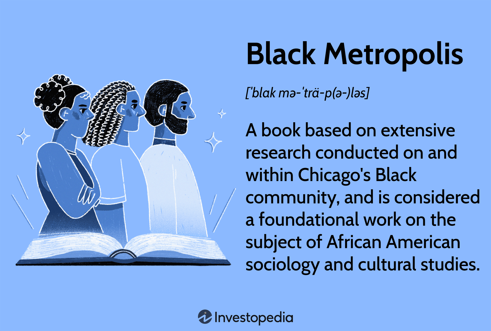

The concept of the "Black Metropolis" emerged in the mid-20th century as a critical framework for understanding the socio-economic dynamics of African American communities within urban environments. This term gained prominence primarily through the pioneering work of sociologists St. Clair Drake and Horace R. Cayton. Their seminal publication, "Black Metropolis: A Study of Negro Life in a Northern City" (1945), provided an in-depth analysis of Chicago's African American community during the early 20th century, particularly focusing on the period between the two World Wars. This work not only offered insights into the daily experiences of African Americans but also laid the groundwork for subsequent urban sociological studies by highlighting issues such as racial segregation, economic disparity, and cultural identity.

"Black Metropolis" is significant for its empirical approach to studying African American life in Chicago, a major destination during the Great Migration. The book meticulously documented the lives and struggles of Black residents in a northern city, offering a nuanced portrayal of their community's resilience amidst systemic racial barriers. It brought to light the complexities of urban life for African Americans, examining factors like employment, housing, and social mobility, thus becoming a foundational text in both sociology and urban studies. By providing a comprehensive view of the socio-economic landscape of the Black community, Drake and Cayton's work challenged prevailing stereotypes and highlighted the profound impact of institutional racism on urban development and social structures.



Furthermore, the insights offered by "Black Metropolis" extend beyond sociology and urban studies, finding relevance in contemporary fields such as algorithmic trading in financial markets. Urban studies and demographic insights have long been intertwined with economic predictions and decisions. The rich socio-economic data captured in works like "Black Metropolis" can inform algorithms that predict market trends by incorporating an understanding of urban demographics and socio-economic behaviors. For instance, patterns of consumer behavior or housing market fluctuations, deeply rooted in the socio-economic conditions of urban populations, can be critical inputs for developing more accurate and responsive trading algorithms.

In conclusion, the "Black Metropolis" not only advanced the understanding of racial and social dynamics in urban settings but also provided a platform for interdisciplinary research, bridging sociology, urban studies, and economic fields like algorithmic trading. This intersection underscores the importance of integrating socio-economic insights into technology-driven domains to address complex market dynamics and societal challenges comprehensively.

## Table of Contents

## Understanding the Black Metropolis

St. Clair Drake and Horace R. Cayton's seminal work, "Black Metropolis: A Study of Negro Life in a Northern City," was grounded in comprehensive research methodology conducted in the 1940s, which sought to explore the complex social fabric of Chicago's Black community. Their study focused on employing qualitative research methods, including participant observation, interviews, and the collection of historical records. This multi-faceted approach allowed the researchers to gain deeper insights into the lived experiences of African Americans in the urban landscape of Chicago.

The backdrop to this study was the Great Migration, a pivotal period during the early 20th century when millions of African Americans relocated from the rural Southern United States to the urban North. This mass movement was fueled by the search for economic opportunities and the escape from the oppression of Jim Crow laws. Chicago emerged as a prime destination due to its burgeoning industrial economy, promising jobs and a chance for a better life.

The Great Migration significantly altered the demographic and cultural landscape of Chicago. The influx of Black migrants led to the establishment of distinct neighborhoods, most notably the South Side, which became known as the Black Metropolis, or Bronzeville. This area rapidly developed into a vibrant cultural and economic enclave, characterized by a unique blend of businesses, religious institutions, social organizations, and cultural outlets catering to the Black community.

Drake and Cayton's research documented how these historical conditions fostered the growth of an autonomous Black urban community with its own socio-economic dynamics. The Black Metropolis became a microcosm of resilience and self-sufficiency, with Black-owned businesses and institutions flourishing despite systemic racism and segregation. However, it was not without its internal challenges, as class stratification and economic disparity existed within the community itself.

Their work presented an intricate portrait of race relations and economic marginalization in urban America. It highlighted the significant role of the Black Metropolis in shaping a distinct identity and culture amidst adversities, thereby contributing to the broader narrative of African American history. Understanding this background provides crucial insights into the social and economic forces that defined an essential chapter of urban development in the United States.

## Sociological Insights and Urban Studies

"Black Metropolis: A Study of Negro Life in a Northern City" by St. Clair Drake and Horace R. Cayton provides significant sociological insights into race, class, and the urban experience within the context of Chicago's South Side during the early 20th century. The book examines how African American communities navigated systemic racism and developed their distinct culture and social structures, offering a comprehensive analysis of urban life in a racially segregated environment.

Drake and Cayton's research highlights critical aspects of urban sociology, notably the interaction between race and class. Their findings underscore the existence of a dual economy within Black communities, driven by both race-based exclusion from broader economic opportunities and a parallel internal economy that thrived despite these challenges. This nuanced understanding of socio-economic dynamics elevated awareness about how external socio-political forces shape community development.

The book's insights have had a profound influence on contemporary urban studies, especially concerning issues like redlining and socio-economic segregation. Drake and Cayton's work laid a foundation for understanding how discriminatory practices, such as redlining, systematically marginalized Black neighborhoods. These insights have informed policies aimed at combating socio-economic disparities and prompted further studies exploring the intricate links between race, space, and economic opportunity in urban settings.

In current urban sociology, the relevance of "Black Metropolis" persists. The book offers a historical lens through which to view modern urban issues and emphasizes the importance of acknowledging and addressing systemic inequalities. Contemporary scholars continue to draw from Drake and Cayton's work to dissect ongoing phenomena such as gentrification, racialized poverty, and the socio-spatial dynamics affecting minority communities.

Moreover, the methodological approaches employed in "Black Metropolis" have inspired subsequent research, emphasizing the importance of ethnographic studies and detailed community analysis in understanding urban challenges. The focus on empirical data collection and community narratives remains a cornerstone of sociological research, providing a robust framework for examining the complexities of urban life.

In summary, "Black Metropolis" serves as a seminal text in urban sociology, offering enduring insights into the interplay of race, class, and urban spaces. Its contributions have not only enhanced the understanding of past urban conditions but also continue to inform policy discussions and academic inquiries addressing contemporary urban challenges.

## Algorithmic Trading and Urban Sociology

The concept of the "Black Metropolis," as explored by St. Clair Drake and Horace R. Cayton, provides valuable insights into how socio-economic and demographic data can be harnessed for modern applications, particularly [algorithmic trading](/wiki/algorithmic-trading) in financial markets. The Black Metropolis study examined urban demographics, socio-economic patterns, and the cultural dynamics of Chicago’s Black community in the early 20th century. These insights continue to inform contemporary models for understanding and predicting economic behaviors in urban environments.

Socio-economic data derived from urban studies offer a nuanced perspective on consumer behavior, spending patterns, and economic activity, all of which can be crucial variables in developing financial algorithms. In algorithmic trading, these data points can be integrated into quantitative models to enhance prediction accuracy. For instance, socio-economic indicators like employment rates, housing patterns, and consumer confidence can be transposed into financial models as variables influencing market trends.

A practical application is seen in the development of algorithms that account for regional economic disparities, inspired by the Black Metropolis findings on segregated economic zones. By encoding such socio-economic data into an algorithm, traders can achieve a refined estimation of market fluctuations. An example of this is [factor](/wiki/factor-investing) models used in quantitative finance, where:
$$
R_t = \alpha + \beta_1 X_1 + \beta_2 X_2 + ... + \epsilon_t
$$
where $R_t$ is the return at time $t$, $\alpha$ is the intercept, $\beta_1, \beta_2, \ldots$ are the coefficients of socio-economic factors $X_1, X_2, \ldots$, and $\epsilon_t$ is the error term.

These factor models can be enhanced with [machine learning](/wiki/machine-learning) techniques, such as random forests or neural networks, which can process vast datasets of demographic and socio-economic indicators to improve accuracy in predictions. For instance, a Python implementation might look like:
```python
from sklearn.ensemble import RandomForestRegressor
import pandas as pd

# Assuming socio_economic_data is a DataFrame containing our socioeconomic indicators
X = socio_economic_data.drop(columns=['market_return'])
y = socio_economic_data['market_return']

model = RandomForestRegressor(n_estimators=100, random_state=42)
model.fit(X, y)

predictions = model.predict(X_new)  # X_new being new data for prediction
```

Moreover, understanding urban socio-economic trends facilitates more informed trading decisions by recognizing underlying market influencers. For example, a demographic shift detected through changes in urban population [statistics](/wiki/bayesian-statistics) could foreshadow increased demand in certain sectors, thereby signaling buying opportunities in related stocks or commodities.

Thus, drawing on urban sociology insights, as exemplified by the Black Metropolis, enables the design of sophisticated algorithms that better grasp the complexities inherent in market dynamics, ultimately contributing to more effective and informed financial decision-making.

## Criticism and Legacy

The landmark study "Black Metropolis: A Study of Negro Life in a Northern City" by St. Clair Drake and Horace R. Cayton has faced criticisms, particularly regarding its focus on male achievement and economic progression. Critics argue that the study's emphasis on male success narratives may have overshadowed the experiences and contributions of women within Chicago's Black community during the period of its analysis. This concentration on economic accomplishment often privileged a male-centric perspective, which could sideline other significant social dynamics and roles within the community (Hirsch, Arnold R., "From the Great Migration to the Great Depression: Black Women in Chicago, 1915-1930," Labor History, Vol. 26, No. 4, 1985).

Another critique concerns the portrayal of urban life that arguably perpetuated stereotypes. Some critics suggest that in highlighting specific aspects of life in Chicago's Black districts, the study unintentionally reinforced certain generalized images of urban African American communities, which have sometimes been leveraged to uphold negative stereotypes. The nuances of urban living, such as cultural vibrancy, were occasionally overshadowed by a focus on socio-economic challenges and racial struggles (Wilson, William Julius, "The Truly Disadvantaged: The Inner City, the Underclass, and Public Policy," University of Chicago Press, 1987).

Despite these criticisms, "Black Metropolis" has left a profound legacy on sociology and urban studies. Its comprehensive examination of the socio-economic structures of a Northern city provided a critical lens through which later scholars could explore issues of race, class, and urban development. This work laid foundational groundwork for understanding racial segregation, contributing significantly to debates around systemic inequality and policy development.

Still, considering its limitations, many argue that it is crucial to view "Black Metropolis" as a product of its time, advocating for the continuous evolution of urban sociology to incorporate more diverse voices and experiences. The study's blend of thorough empirical investigation with sociological theory has maintained its status as a seminal text, inspiring subsequent research to embrace more inclusive and intersectional approaches.

In conclusion, while "Black Metropolis" may have been critiqued for its gender focus and urban portrayals, its contributions to understanding the complexities of urban Black life remain invaluable. The study has informed generations of scholars and continues to influence debates on urban policy and social justice. The dialogue it sparked underscores the necessity for sociology to evolve and broaden its scope, ensuring a more holistic exploration of our diverse urban landscapes.

## Conclusion

"Black Metropolis: A Study of Negro Life in a Northern City" by St. Clair Drake and Horace R. Cayton serves as a seminal work in the field of urban sociology, offering profound insights into race, class, and urban dynamics. The concept of the Black Metropolis, as explored in this study, highlights the complex socio-economic structures within urban environments, notably through its comprehensive examination of mid-20th-century Chicago's African American community.

The book's pioneering approach laid the groundwork for subsequent urban studies and enriched our understanding of socio-economic segregation and racial dynamics. Contemporary urban sociology continues to draw on these insights to address issues such as redlining and the urban experience of marginalized communities. Additionally, the legacy of "Black Metropolis" resonates in today's study of algorithmic trading within financial markets. The interplay of socio-economic data with algorithmic processes enables more nuanced trading strategies, exemplifying how urban studies inform economic models.

Researchers are encouraged to pursue further interdisciplinary exploration bridging sociology, urban studies, and finance. By understanding urban socio-economic trends and their historical context, analysts can develop smarter trading algorithms and address broader societal challenges. The enduring impact of "Black Metropolis" on sociological discourse and its continuing relevance underscore the potential of interdisciplinary studies to illuminate complex contemporary issues. Promoting dialogue among various academic fields will be essential in tackling modern urban and economic challenges effectively.

## References & Further Reading

[1]: St. Clair Drake & Horace R. Cayton. ["Black Metropolis: A Study of Negro Life in a Northern City"](https://en.wikipedia.org/wiki/Black_Metropolis). University of Chicago Press, 1993.

[2]: Hirsch, Arnold R. (1985). ["From the Great Migration to the Great Depression: Black Women in Chicago, 1915–1930"](https://www.erudit.org/en/journals/uhr/1985-v13-n3-uhr0790/1018113ar.pdf). Labor History, Vol. 26, No. 4.

[3]: Wilson, William Julius. ["The Truly Disadvantaged: The Inner City, the Underclass, and Public Policy"](https://archive.org/details/trulydisadvantag00wilsrich). University of Chicago Press, 1987.

[4]: Pattillo, Mary. ["Black on the Block: The Politics of Race and Class in the City"](https://press.uchicago.edu/ucp/books/book/chicago/B/bo4149945.html). University of Chicago Press, 2007.

[5]: Logan, John R. & Harvey L. Molotch. ["Urban Fortunes: The Political Economy of Place"](https://www.amazon.com/Urban-Fortunes-Political-Economy-Anniversary/dp/0520254287). University of California Press, 2007.