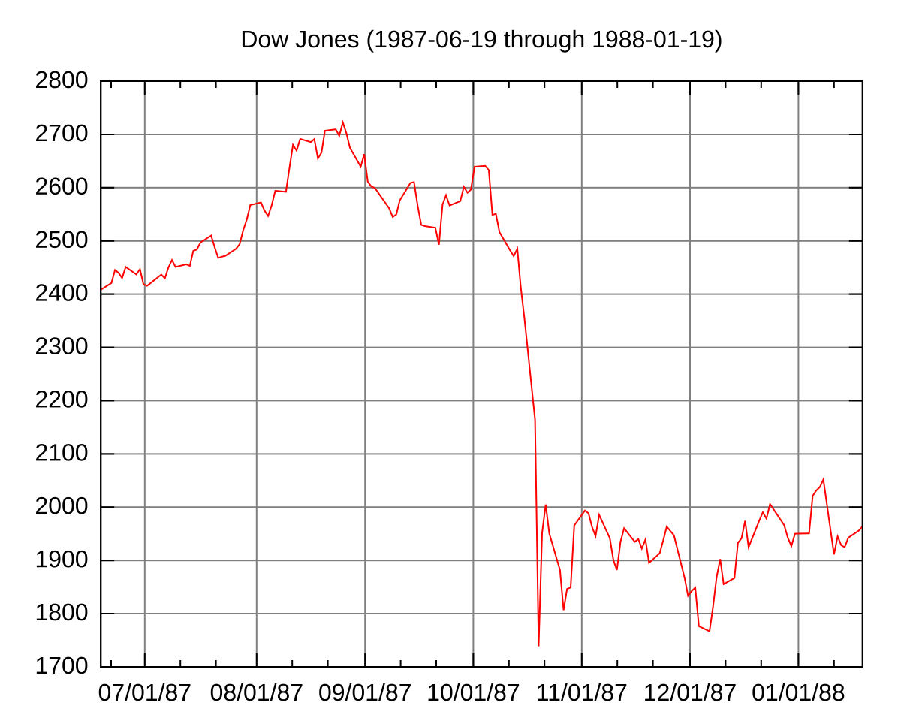

## Table of Contents

## What is Black Monday?

Black Monday refers to October 19, 1987, when stock markets around the world crashed. It was one of the most significant single-day drops in stock market history. On that day, the Dow Jones Industrial Average, which is a key measure of the U.S. stock market, fell by 22.6%. This huge drop caused panic among investors and led to widespread selling of stocks.

The causes of Black Monday are still debated, but some reasons include the use of new computer trading programs that automatically sold stocks when prices started to fall. Also, there were worries about the U.S. economy and rising interest rates. The crash had a big impact, leading to changes in how stock markets operate to prevent such big drops in the future. Despite the severity of Black Monday, the markets eventually recovered, but it remains a reminder of how quickly things can change in the world of finance.

## When did Black Monday occur?

Black Monday happened on October 19, 1987. It was a big day because the stock market in the United States and around the world dropped a lot. The Dow Jones Industrial Average, which tells us how the U.S. stock market is doing, went down by 22.6%. This was a huge drop and it made a lot of people worried.

People still talk about why Black Monday happened. Some say it was because of new computer programs that sold stocks quickly when prices started to fall. Others think it was because people were worried about the U.S. economy and high interest rates. After Black Monday, people made changes to stop such big drops from happening again. Even though it was a scary time, the markets got better eventually.

## What caused the stock market crash on Black Monday?

Black Monday, which happened on October 19, 1987, was a big stock market crash. Many people think it was caused by new computer programs that made trades quickly. These programs were set to sell stocks if prices started to go down. So, when prices began to fall, the computers sold a lot of stocks very fast, making prices drop even more.

Another reason might have been worries about the U.S. economy and high interest rates. People were scared that the economy was not doing well and that borrowing money would become more expensive. This fear made them want to sell their stocks, which added to the panic and the big drop in the stock market.

After Black Monday, people learned a lot and made changes to try to stop such big crashes from happening again. Even though it was a scary time, the stock market did get better over time. But Black Monday is still remembered as a reminder of how quickly things can change in the world of money.

## How did Black Monday affect the global economy?

Black Monday on October 19, 1987, had a big impact on the global economy. It started in the U.S. when the stock market crashed, and it quickly spread to other countries. Many stock markets around the world also dropped a lot. This made people everywhere worried about their money and the economy. Businesses found it harder to get money to grow because banks were more careful about lending. Some people lost their jobs because companies had less money to pay them.

After Black Monday, governments and people who run the stock markets made changes to try to stop such big crashes from happening again. They put in new rules to slow down trading and make it safer. Even though it was a scary time, the world economy did get better over time. But Black Monday showed everyone how connected the global economy is and how quickly problems in one place can affect everyone else.

## What were the immediate impacts of Black Monday on the stock market?

On Black Monday, October 19, 1987, the stock market in the United States saw a huge drop. The Dow Jones Industrial Average fell by 22.6%, which was the biggest one-day drop ever. This caused a lot of panic among people who owned stocks. They started selling their stocks quickly, which made the prices go down even more. The trading [volume](/wiki/volume-trading-strategy) was very high because so many people were trying to sell at the same time.

The effects of Black Monday were not just in the U.S. Stock markets in other countries like Australia, Hong Kong, and the UK also fell a lot. This showed how connected the world's economies are. The big drop in stock prices made it harder for businesses to get money to grow because banks were more careful about lending. It also made people worried about their money and the economy in general.

## How did governments and financial institutions respond to Black Monday?

After Black Monday, governments and financial institutions quickly worked to fix the problems caused by the big stock market drop. They made new rules to stop such big crashes from happening again. One of the main things they did was to set up "circuit breakers." These are rules that stop trading for a short time if the stock market drops a lot in one day. This gives everyone a chance to calm down and think before they keep trading. They also made changes to how stocks are traded, making it slower and more controlled.

Another important thing they did was to improve how information is shared. They wanted to make sure everyone had the same information so that no one was left out or surprised. This was meant to make the market more fair and stable. Governments also worked to help the economy recover by making it easier for businesses to get money to grow. They did this by lowering interest rates and making other changes to help the economy get better. All these actions helped to bring back trust in the stock market and the economy.

## What lessons were learned from Black Monday?

Black Monday taught us a lot about how the stock market works and how to make it safer. One big lesson was that computer programs can make things worse if they start selling stocks too fast when prices go down. This made people realize they needed to slow down trading and add rules like circuit breakers. These rules stop trading for a little while if the market drops a lot, giving everyone time to calm down and think.

Another lesson was how important it is for everyone to have the same information. When some people know more than others, it can cause panic and big drops in the market. So, after Black Monday, rules were made to make sure information is shared fairly. This helps keep the market stable and fair for everyone.

Finally, Black Monday showed us how connected the world's economies are. When the U.S. market crashed, it affected markets everywhere. This made governments and financial leaders work together to help the global economy recover. They learned to be ready for big changes and to help each other when things go wrong.

## How did Black Monday influence future financial regulations?

Black Monday showed everyone that the stock market could crash really fast and hurt a lot of people. This made governments and people who run the stock market think about new rules to keep things safer. One big change they made was adding circuit breakers. These are like emergency brakes for the stock market. If prices start falling too fast, trading stops for a little bit. This gives everyone a chance to calm down and think before they keep trading. They also made trading slower and more controlled so computers couldn't sell stocks too quickly and make things worse.

Another important change was making sure everyone has the same information. Before Black Monday, some people knew more than others, which made the market unfair and caused panic. So, new rules were made to share information better. This helps keep the market fair and stable for everyone. Also, Black Monday showed how connected the world's economies are. When the U.S. market crashed, it affected markets everywhere. This made governments work together to help the global economy recover. They learned to be ready for big changes and to help each other when things go wrong.

## What were the long-term effects of Black Monday on investor behavior?

Black Monday made a big change in how people think about investing. Before the crash, many people thought the stock market would always go up. But after Black Monday, they learned that the market can go down a lot, too. This made investors more careful. They started to think more about the risks of losing money and not just about making money. Many people began to spread their money out more, putting it into different kinds of investments like bonds and real estate, not just stocks. This way, if the stock market went down again, they wouldn't lose everything.

Another long-term effect was that investors started to pay more attention to what was happening in the economy and the world. They wanted to know more about things like interest rates, government policies, and global events that could affect the stock market. This made them more likely to do their own research and not just follow what everyone else was doing. Over time, this led to a more thoughtful and careful approach to investing. People learned that it's important to be ready for big changes and to have a plan for what to do if the market goes down.

## How did technological factors contribute to the severity of the crash on Black Monday?

One big reason Black Monday was so bad was because of new computer programs that were used for trading. These programs were set up to sell stocks automatically if prices started to go down. When the market began to drop, these computers sold a lot of stocks very fast, which made prices fall even more. This was called "program trading." It was like a snowball rolling down a hill, getting bigger and faster as it went. The computers didn't stop to think like people do; they just kept selling, making the crash worse.

Another way technology made the crash worse was because of how fast information could move. Back then, people used phones and fax machines to trade, and it was hard to keep up with everything that was happening. When the market started to crash, the news spread quickly, and more people got scared and started selling their stocks. This made the drop in the market even bigger. So, the fast computers and quick information made Black Monday a lot worse than it might have been without them.

## What role did program trading play in the events of Black Monday?

Program trading played a big part in making Black Monday so bad. These were new computer programs that were set to sell stocks automatically if prices started to drop. When the market began to fall, these computers started selling a lot of stocks very quickly. This made prices go down even more. It was like a chain reaction; the more the computers sold, the lower the prices went, and the more they sold. This made the crash much worse than it might have been if people were making the decisions instead of computers.

Because of program trading, the stock market dropped a lot faster than anyone expected. The computers didn't stop to think like people do; they just followed their rules to sell. This caused a huge amount of selling in a short time, which led to the big drop in stock prices on Black Monday. It showed everyone how dangerous it can be when computers control trading without human oversight.

## How have market safeguards implemented post-Black Monday changed the dynamics of stock market crashes?

After Black Monday, people who run the stock market made new rules to stop big crashes from happening again. One of the most important rules is called "circuit breakers." These are like emergency brakes for the stock market. If the market starts to drop too fast, trading stops for a little while. This gives everyone a chance to calm down and think before they keep trading. It helps stop the kind of fast selling that made Black Monday so bad. Another change was making trading slower and more controlled. This way, computers can't sell stocks too quickly and make the market crash even more.

These new rules have changed how stock market crashes happen. They make the market safer and more stable. Now, if the market starts to drop a lot, it's more likely to pause and give people time to think. This can help stop a small drop from turning into a big crash. Also, because of these rules, investors feel more confident. They know that there are systems in place to protect them from big, sudden drops. So, while crashes can still happen, the new safeguards make them less likely to be as bad as Black Monday.

## What was the role of algorithmic trading on Black Monday?

Algorithmic trading played a pivotal role in the heightened [volatility](/wiki/volatility-trading-strategies) observed during Black Monday, primarily through strategies such as portfolio insurance. Portfolio insurance was designed to protect investors from significant losses by automatically selling off assets as they declined in value. The theory was to maintain a certain level of investment value by mimicking the effects of a put option, effectively hedging against falling markets. However, this strategy inadvertently exacerbated the market downturn.

The mechanism of portfolio insurance relied heavily on algorithmic systems to execute large volumes of trades without human intervention. As market prices began to fall, these automated systems commenced a barrage of sell orders in an attempt to mitigate risk, but this led to a feedback loop. The increased selling pressure triggered further declines in stock prices, which, in turn, activated even more sell orders. This self-reinforcing cycle of selling contributed to the rapid and severe decline in the market, as each wave of automatic sales only deepened the downward spiral.

This phenomenon can be understood in terms of a basic feedback loop, where an initial trigger – a market decline – leads to algorithm-driven sell orders, fueling further market declines. Mathematically, if we denote $P_t$ as the price level at time $t$ and $S$ as the cumulative sell pressure initiated by [algorithmic trading](/wiki/algorithmic-trading), the relationship could be simplistically represented as:

$$
S = f(P_t)
$$

where $f(P_t)$ is a function describing the sell pressure as a response to price levels. The nature of this function was such that it increased steeply as prices fell, resulting in enhanced sell pressure and further declines in $P_t$.

Despite its good intentions to shield investments, the portfolio insurance strategy inadvertently accelerated market falls by amplifying sell-offs. The lack of human oversight in these trading algorithms meant there was no intervention to moderate the severity of these automatic sell orders, which highlighted the critical need for tempered integration of such systems.

The events of Black Monday stressed the importance of designing algorithmic trading systems that do not merely react mechanically to fluctuations, but incorporate more sophisticated risk management protocols. This includes the potential integration of circuit breakers or other regulatory measures to pause trading under extreme conditions. Consequently, Black Monday served as a stark lesson for the financial industry, urging a reconsideration of algorithmic trading's impact and the careful integration of technology in financial systems.

## References & Further Reading

Brady Commission Report, A Brief History of the 1987 Stock Market Crash, provides a comprehensive analysis of the market dynamics leading up to and following Black Monday. It offers an essential understanding of the mechanisms at play and the regulatory gaps that were identified.

Research papers examining investor behavior during past market crashes give insight into psychological and economic responses triggered by such financial events. These studies cover aspects like panic selling, investor sentiment, and the impact of market uncertainty on trading decisions.

Publications and studies on algorithmic trading and market regulations discuss the evolution and impact of automated trading strategies, highlighting the balance between leveraging technology and ensuring market stability. These works explore topics such as algorithmic efficiency, systemic risks, and regulatory measures implemented to safeguard financial systems.

Books and articles exploring the evolution of trading strategies post-Black Monday address changes in trading paradigms in response to the 1987 crash. They assess developments in risk management practices, the advancement of trading technology, and the adaptation of financial strategies in an ever-evolving market landscape.

Documentation on circuit breakers and regulatory responses to market volatility provides detailed accounts of the measures introduced to curb market instability. These documents outline the implementation of mechanisms to halt trading temporarily during severe market movements, promoting investor protection and preventing panic-induced sell-offs.

