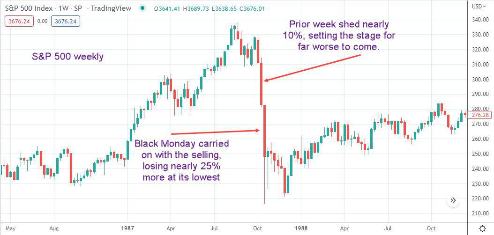

October 19, 1987, known in financial history as Black Monday, marks a pivotal moment when the Dow Jones Industrial Average (DJIA) suffered an unprecedented one-day decline of 22.6%. This catastrophic event sent shockwaves throughout global financial markets, setting a somber precedent for market volatility.

The rapid advancements in technology during the 1980s introduced algorithmic trading strategies which played a controversial role in the Black Monday crisis. Algorithmic trading, particularly strategies like portfolio insurance designed to mitigate risk, inadvertently contributed to the market’s nosedive. These systems, operating automatically without human intervention, served as a catalyst, creating a feedback loop that accelerated sell-offs. Consequently, Black Monday became a critical case study for financial analysts globally, emphasizing the unintended repercussions of automated trading systems and compelling a reevaluation of trading practices.

The focus of this article is to examine the causative factors, the immediate and distant consequences, and the critical lessons extracted from Black Monday in the context of algorithmic trading. By evaluating the historical significance and the impact on modern financial systems, we aim to understand how this seminal event influenced regulatory changes and trading systems still relevant today.

Understanding Black Monday is not merely about reflecting on past failures; it is about comprehending the dynamics of financial markets and their susceptibility to high-frequency trading mechanisms. The episode underscores the necessity for a symbiotic relationship between technological innovation and human oversight in trading strategies. As financial markets continue to evolve, these insights remain crucial for fostering robust and resilient economic environments.

## Table of Contents

## The Role of Algorithmic Trading on Black Monday

Algorithmic trading played a pivotal role in the heightened volatility observed during Black Monday, primarily through strategies such as portfolio insurance. Portfolio insurance was designed to protect investors from significant losses by automatically selling off assets as they declined in value. The theory was to maintain a certain level of investment value by mimicking the effects of a put option, effectively hedging against falling markets. However, this strategy inadvertently exacerbated the market downturn.

The mechanism of portfolio insurance relied heavily on algorithmic systems to execute large volumes of trades without human intervention. As market prices began to fall, these automated systems commenced a barrage of sell orders in an attempt to mitigate risk, but this led to a feedback loop. The increased selling pressure triggered further declines in stock prices, which, in turn, activated even more sell orders. This self-reinforcing cycle of selling contributed to the rapid and severe decline in the market, as each wave of automatic sales only deepened the downward spiral.

This phenomenon can be understood in terms of a basic feedback loop, where an initial trigger – a market decline – leads to algorithm-driven sell orders, fueling further market declines. Mathematically, if we denote $P_t$ as the price level at time $t$ and $S$ as the cumulative sell pressure initiated by [algorithmic trading](/wiki/algorithmic-trading), the relationship could be simplistically represented as:

$$
S = f(P_t)
$$

where $f(P_t)$ is a function describing the sell pressure as a response to price levels. The nature of this function was such that it increased steeply as prices fell, resulting in enhanced sell pressure and further declines in $P_t$.

Despite its good intentions to shield investments, the portfolio insurance strategy inadvertently accelerated market falls by amplifying sell-offs. The lack of human oversight in these trading algorithms meant there was no intervention to moderate the severity of these automatic sell orders, which highlighted the critical need for tempered integration of such systems.

The events of Black Monday stressed the importance of designing algorithmic trading systems that do not merely react mechanically to fluctuations, but incorporate more sophisticated risk management protocols. This includes the potential integration of circuit breakers or other regulatory measures to pause trading under extreme conditions. Consequently, Black Monday served as a stark lesson for the financial industry, urging a reconsideration of algorithmic trading's impact and the careful integration of technology in financial systems.

## Causes of Black Monday

Black Monday, the stock market crash on October 19, 1987, was the result of multiple converging factors that highlighted the systemic vulnerabilities inherent in the global financial markets. One of the primary contributors was the increasing globalization and interconnectedness of financial systems. As markets around the world became more interwoven during the 1980s, the vulnerabilities in one region could swiftly and broadly affect others. This interconnectedness meant that financial disturbances could propagate rapidly across borders, amplifying the effects of local downturns on a global scale.

Economic conditions preceding Black Monday also laid the groundwork for instability. Notably, rising trade deficits were a significant concern. Trade deficits indicate that a country is importing more goods and services than it is exporting, which can lead to national debt and affect currency stability. Simultaneously, increasing interest rates added pressure to the markets. Higher interest rates raise the cost of borrowing, which can slow economic growth and reduce corporate profits. Together, these indicators can create a prelude to market stress, making the financial environment more susceptible to shocks.

The technological advancements in trading, particularly in computerized trading systems, played a crucial role in the rapid market declines observed on Black Monday. The 1980s marked the rise of automated and algorithmic trading strategies intended to boost efficiency and profitability. While these systems were designed to optimize trading by executing orders at high speeds, they inadvertently introduced new [volatility](/wiki/volatility-trading-strategies) through mechanisms that could exacerbate rapid sell-offs. For instance, the advent of portfolio insurance strategies, which involved selling stock index futures as a hedge against falling market values, contributed to the feedback loop of selling pressure. When markets began to decline, these automated systems triggered additional sell orders, further intensifying the downtrend and speed of the market collapse.

The combination of these economic and technological elements facilitated the accelerated descent observed globally on Black Monday. The interconnectedness of financial markets, economic stressors like trade deficits and interest rates, and the unchecked [momentum](/wiki/momentum) of computerized trading synergized to create an environment ripe for a significant crash. Understanding these contributing factors provides insight into how systemic risks can materialize, underscoring the necessity for vigilance in monitoring and managing both economic indicators and technological innovations in trading.

## Lessons Learned and Regulatory Changes

Black Monday of October 19, 1987, demonstrated the urgent need for regulatory measures to mitigate future market crashes. The unprecedented market volatility experienced on that day prompted several key interventions designed to stabilize financial markets and protect investors.

One of the significant regulatory measures introduced in the wake of Black Monday was the implementation of circuit breakers. Circuit breakers are mechanisms designed to temporarily halt trading on exchanges when substantial price declines occur. Their purpose is to provide a pause during extreme market volatility, allowing time for information dissemination and reducing panic-induced sell-offs. By temporarily stopping trading, circuit breakers aim to prevent a feedback loop of declining prices and forced liquidations.

In addition to circuit breakers, there was an increased focus on the oversight and testing of algorithmic trading systems. Algorithmic trading, which had significantly influenced the market downturn on Black Monday, required stricter regulatory scrutiny to ensure that these systems did not amplify market instability. Regulators advocated for more rigorous testing environments and safeguards in algorithmic strategies to understand and mitigate their potential risks.

Black Monday also highlighted the importance of diversification in investment portfolios and effective risk management strategies. The market crash underscored the dangers of over-reliance on a single trading strategy, such as portfolio insurance, which failed spectacularly during the crash. Investors and financial institutions realized the necessity of a diversified approach to mitigate risks associated with market volatility.

Overall, the regulatory changes introduced after Black Monday were designed to foster a more resilient financial system. By implementing circuit breakers, enhancing oversight of algorithmic trading, and promoting portfolio diversification, regulators aimed to create a foundation for more stable and secure financial markets. These measures served to protect investors by reducing the likelihood and impact of future market crashes.

## Relevance to Contemporary Algorithmic Trading

The lessons from Black Monday in 1987 continue to resonate within today's financial markets, underscoring the ongoing need for vigilance in algorithmic trading. The event highlighted vulnerabilities that can arise from automated trading systems, and these insights have informed the development of contemporary trading practices and regulatory frameworks.

Contemporary algorithmic trading strategies necessitate diligent oversight and robust risk management frameworks to mitigate potential systemic disruptions. With the advent and proliferation of high-frequency trading ([HFT](/wiki/high-frequency-trading-strategies)), the complexity of trading algorithms has increased dramatically. HFT strategies employ lightning-fast transactions to capitalize on minute price discrepancies, but the speed and [volume](/wiki/volume-trading-strategy) of trades can exacerbate market volatility. Effective monitoring and regulation are essential to ensure these strategies do not lead to significant market dislocations as seen on Black Monday.

Global interconnectedness of financial markets has further heightened the need for awareness of international economic indicators. Economic events and policy changes in one part of the world can have immediate ripple effects across global markets due to rapid information dissemination and coordinated trading strategies. This interconnectedness necessitates comprehensive risk assessment approaches that account for various geopolitical and macroeconomic factors.

Additionally, advancements in technology call for continuous updates to trading algorithms to accurately reflect changing market dynamics and conditions. Algorithms must be agile and adaptable, built with considerations for diverse factors including [liquidity](/wiki/liquidity-risk-premium), market depth, and investor behavior. Incorporating [machine learning](/wiki/machine-learning) techniques can enhance the ability of these systems to learn from market patterns and adapt to new information, optimizing trading outcomes while minimizing risk.

In summary, technological innovations must be balanced with human oversight to harness the efficiencies of algorithmic trading while safeguarding against potential systemic risks. The principles gleaned from Black Monday continue to inform the development of resilient market frameworks, emphasizing adaptability in algorithmic trading practices to achieve long-term market stability.

## Conclusion

Black Monday remains a pertinent reminder of the profound impacts that algorithmic trading can have on financial markets. This historical event highlighted the dual-edged nature of technological advancements in trading, emphasizing the critical need for a balanced approach that integrates both technological and human oversight. While algorithmic trading brings significant efficiencies and capabilities to market operations, it also introduces systemic risks that can amplify market volatility if not properly managed.

The necessity to harness these technological efficiencies while proactively mitigating associated risks cannot be overstated. Market participants and regulators must collaborate to ensure that algorithmic systems are developed with robust risk management frameworks. These frameworks should be capable of responding to sudden market changes and preventing feedback loops that can lead to catastrophic sell-offs.

Moreover, the financial landscape is continuously evolving. Therefore, the strategies employed in algorithmic trading must adapt alongside these changes to remain effective and relevant. This involves not only updating algorithms to reflect current market conditions but also integrating insights from historical crises like Black Monday to better anticipate and respond to potential future disruptions.

Lessons gleaned from past crises are invaluable in constructing resilient market frameworks. By acknowledging and addressing the shortcomings of previous systems, stakeholders can build more adaptive and stable infrastructures. These insights ensure that financial markets are better equipped to withstand potential shocks, ultimately protecting investors and preserving market integrity for the future.

## References & Further Reading

Brady Commission Report, A Brief History of the 1987 Stock Market Crash, provides a comprehensive analysis of the market dynamics leading up to and following Black Monday. It offers an essential understanding of the mechanisms at play and the regulatory gaps that were identified.

Research papers examining investor behavior during past market crashes give insight into psychological and economic responses triggered by such financial events. These studies cover aspects like panic selling, investor sentiment, and the impact of market uncertainty on trading decisions.

Publications and studies on algorithmic trading and market regulations discuss the evolution and impact of automated trading strategies, highlighting the balance between leveraging technology and ensuring market stability. These works explore topics such as algorithmic efficiency, systemic risks, and regulatory measures implemented to safeguard financial systems.

Books and articles exploring the evolution of trading strategies post-Black Monday address changes in trading paradigms in response to the 1987 crash. They assess developments in risk management practices, the advancement of trading technology, and the adaptation of financial strategies in an ever-evolving market landscape.

Documentation on circuit breakers and regulatory responses to market volatility provides detailed accounts of the measures introduced to curb market instability. These documents outline the implementation of mechanisms to halt trading temporarily during severe market movements, promoting investor protection and preventing panic-induced sell-offs.