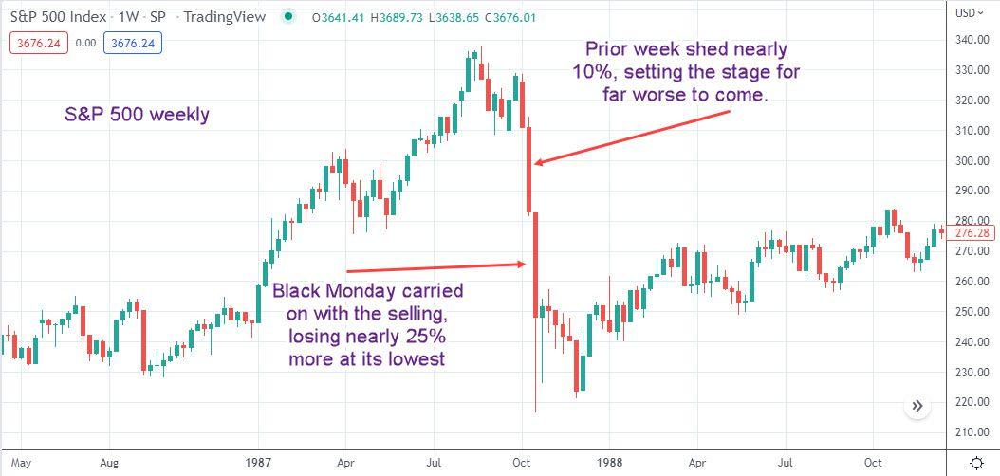

## Table of Contents

## What is Black Monday?

Black Monday refers to a very bad day in the stock market that happened on October 19, 1987. On this day, the stock market in the United States crashed, and the value of many stocks fell a lot. It was called Black Monday because it was a dark day for investors who lost a lot of money. The drop in stock prices was very big, about 22.6% in one day, which was the biggest one-day drop in the history of the stock market.

The reasons for Black Monday are not completely clear, but many people think it was because of computer trading programs. These programs were set to automatically sell stocks if prices started to fall, and this made the prices fall even more. Also, there was a lot of worry about the economy and high interest rates at the time. Black Monday made people very scared and led to changes in how the stock market works to try to prevent such big drops from happening again.

## When did Black Monday occur?

Black Monday happened on October 19, 1987. It was a big day because the stock market in the United States crashed. This means that the prices of many stocks fell a lot on that day.

The crash was very big. The stock market lost about 22.6% of its value in just one day. This was the biggest one-day drop ever in the stock market. It was called Black Monday because it was a very bad day for people who had invested money in the stock market.

## What were the immediate causes of Black Monday?

The immediate causes of Black Monday on October 19, 1987, were not completely clear, but many people think that computer trading programs played a big role. These programs were set up to automatically sell stocks if their prices started to fall. When the prices did start to drop, these programs kicked in and started selling a lot of stocks very quickly. This made the prices fall even more because there were so many stocks being sold at the same time.

Another reason for Black Monday was the worry about the economy and high interest rates. At that time, people were concerned that the economy might not do well, and high interest rates made borrowing money more expensive. This made investors nervous, and some started selling their stocks to avoid losing more money. All these factors together led to the big drop in stock prices on Black Monday.

## How did Black Monday affect the global economy?

Black Monday had a big effect on the global economy. When the stock market in the United States crashed, it caused panic and fear around the world. Many other countries' stock markets also dropped a lot because they were connected to the U.S. market. Investors in other countries saw what happened in the U.S. and started selling their stocks too, which made stock prices fall in places like Europe and Asia. This showed how closely linked the global economy is, and how a big event in one country can affect many others.

The crash also made people and governments think about how to make the stock market safer. After Black Monday, new rules and systems were put in place to try to stop such big drops from happening again. These changes were not just in the U.S., but in other countries too. The global economy slowly recovered, but Black Monday was a reminder of how important it is to keep an eye on the stock market and to have plans ready for when things go wrong.

## What were the stock market losses on Black Monday?

On Black Monday, October 19, 1987, the stock market in the United States lost a lot of money. The Dow Jones Industrial Average, which is a way to measure how the stock market is doing, dropped by about 22.6% in just one day. This was the biggest one-day drop in the history of the stock market. It meant that people who had invested in the stock market saw the value of their investments go down a lot on that day.

The losses were not just in the U.S. Because the world's economies are connected, other countries' stock markets also went down a lot. For example, stock markets in Europe and Asia also saw big drops because investors there were scared by what happened in the U.S. and started selling their stocks too. The total amount of money lost around the world because of Black Monday was huge, and it took a long time for the stock markets to recover.

## What measures were taken by governments and financial institutions in response to Black Monday?

After Black Monday, governments and financial institutions took several steps to make the stock market safer. They realized that computer trading programs had played a big role in the crash, so they started to put in place new rules to control these programs. They also created something called "circuit breakers," which are like emergency stops for the stock market. If the market starts to drop a lot, these circuit breakers can pause trading for a while to give everyone a chance to calm down and think.

Another important thing they did was to improve how information is shared between different parts of the financial world. They made sure that everyone had the same information at the same time, which helped to prevent panic and confusion. Governments also worked together more to keep an eye on the global economy and to be ready to help each other if something bad happened again. These changes helped to make the stock market more stable and to prevent another big crash like Black Monday.

## How did Black Monday influence future financial regulations?

Black Monday had a big impact on how financial markets are regulated. After the crash, people realized that computer trading programs were a big problem. These programs were set to automatically sell stocks if prices dropped, which made the drop even worse. So, governments and financial institutions made new rules to control these programs. They also introduced "circuit breakers," which are like emergency stops for the stock market. If the market starts to drop a lot, these circuit breakers can pause trading for a while. This gives everyone a chance to calm down and think before things get worse.

Another important change was better communication and information sharing. After Black Monday, regulators made sure that everyone in the financial world had the same information at the same time. This helped to prevent panic and confusion. Governments also started working together more closely to watch the global economy. They wanted to be ready to help each other if another big crash happened. These changes helped to make the stock market more stable and to prevent another crash like Black Monday.

## What were the long-term economic impacts of Black Monday?

Black Monday had big effects on the economy that lasted a long time. After the crash, people were very scared and worried about losing more money. This made them more careful about where they put their money. They started to invest in safer places, like bonds, instead of stocks. This change in how people invested helped to make the stock market more stable over time. It also led to new rules and systems that made the stock market safer and less likely to crash again.

The crash also made governments and financial institutions around the world work together more. They started to share information better and watch the global economy more closely. This helped to prevent big problems in one country from causing crashes in other countries. Over time, the economy got better, and the stock market recovered. But Black Monday showed everyone how important it is to keep the stock market safe and to be ready for big problems.

## How did trading technology and program trading contribute to Black Monday?

Trading technology and program trading played a big role in causing Black Monday. At that time, computers were starting to be used more in the stock market. Some programs were set up to automatically sell stocks if their prices started to drop. When the market began to fall on Black Monday, these programs kicked in and started selling a lot of stocks very quickly. This made the prices fall even more because there were so many stocks being sold at the same time. It was like a snowball effect, where the more the prices dropped, the more the programs sold, and the more the prices dropped.

The use of these trading programs was a big reason why the crash happened so fast and was so big. Before Black Monday, people didn't realize how much these programs could affect the market. The crash showed everyone that computers and automatic trading could make the market go down very quickly. After Black Monday, people started to think more about how to control these programs to make the stock market safer. They made new rules to stop these programs from causing another big crash.

## What lessons were learned from Black Monday regarding market stability?

Black Monday taught people a lot about keeping the stock market stable. One big lesson was about computer trading programs. These programs were set to automatically sell stocks if prices started to drop, and they made the crash happen faster and bigger. After Black Monday, people realized that these programs needed to be controlled better. They made new rules to stop these programs from causing another big crash. They also created "circuit breakers," which are like emergency stops for the stock market. If the market starts to drop a lot, these circuit breakers can pause trading for a while to give everyone a chance to calm down and think.

Another important lesson was about how the global economy is connected. When the U.S. stock market crashed, it scared investors in other countries too. They started selling their stocks, and this made stock markets in Europe and Asia drop a lot. This showed everyone that a big event in one country can affect many others. After Black Monday, governments and financial institutions started working together more. They shared information better and watched the global economy more closely. This helped to prevent big problems in one country from causing crashes in other countries. Over time, these changes helped to make the stock market more stable and less likely to crash again.

## How did Black Monday compare to other major stock market crashes in history?

Black Monday, which happened on October 19, 1987, was one of the biggest stock market crashes in history. The stock market lost about 22.6% of its value in just one day, which was the biggest one-day drop ever. This crash was different from other big crashes because it happened so fast. Many people think it was because of computer trading programs that automatically sold stocks when prices started to drop. This made the prices fall even more and caused a big panic. Other big crashes, like the Wall Street Crash of 1929, took longer to happen and were caused by different things, like problems in the economy and banks failing.

Another big crash that people often compare to Black Monday is the 2008 Financial Crisis. The 2008 crash was also very bad, but it happened over a longer time. It started with problems in the housing market and spread to the whole economy. Banks and big companies failed, and many people lost their jobs. Unlike Black Monday, the 2008 crash was not just about the stock market but about the whole financial system. Both crashes led to big changes in how the stock market and the economy are watched and controlled, but they were caused by different things and affected the world in different ways.

## What are the ongoing debates among economists about the causes and effects of Black Monday?

Economists still talk a lot about what caused Black Monday and what it did to the world. Many people think that computer trading programs were a big reason for the crash. These programs were set up to sell stocks automatically if prices started to drop. When prices did start to fall, the programs kicked in and sold a lot of stocks very quickly. This made prices fall even more and caused a big panic. But some economists argue that there were other reasons too, like worries about the economy and high interest rates. They think these worries made people nervous and start selling their stocks, which helped cause the crash.

There is also a lot of debate about how Black Monday affected the world. Some economists believe that the crash made people more careful about where they put their money. They started investing in safer places like bonds instead of stocks. This change helped to make the stock market more stable over time. Other economists think that the crash showed how connected the global economy is. When the U.S. stock market crashed, it scared investors in other countries, and their stock markets dropped too. This made governments and financial institutions work together more to watch the global economy and prevent big problems. Overall, Black Monday led to new rules and systems to make the stock market safer, but economists still argue about how big of an effect it had and what the best ways to keep the market stable are.

## References & Further Reading

[1]: Brady Commission. (1988). ["Report of the Presidential Task Force on Market Mechanisms."](https://www.sechistorical.org/collection/papers/1980/1988_0101_BradyReport.pdf) United States Government Printing Office.

[2]: Carlson, M. (2006). ["A Brief History of the 1987 Stock Market Crash with a Discussion of the Federal Reserve Response."](https://www.federalreserve.gov/pubs/feds/2007/200713/200713pap.pdf) Finance and Economics Discussion Series Divisions of Research & Statistics and Monetary Affairs, Federal Reserve Board, Washington, D.C.

[3]: Shiller, R. J. (1987). ["Investor Behavior in the October 1987 Stock Market Crash: Survey Evidence"](https://www.sciencedirect.com/science/article/pii/S0889158305800024) National Bureau of Economic Research.

[4]: Gomber, P., Arndt, B., Lutat, M., & Uhle, T. (2011). ["High-frequency trading."](https://papers.ssrn.com/sol3/papers.cfm?abstract_id=1858626) Business & Information Systems Engineering, 3(2), 53-62.

[5]: Malkiel, B. G. (1996). ["A Random Walk Down Wall Street: The Time-tested Strategy for Successful Investing."](https://www.academia.edu/10850809/A_Random_Walk_Down_Wall_Street_The_Time_Tested_Strategy_for_Successful_Investing) W. W. Norton & Company.