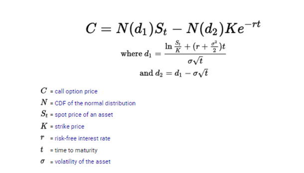

## Table of Contents

## What is the Black-Scholes Equation?

The Black-Scholes Equation is a mathematical model used to calculate the value of financial options, which are contracts that give the buyer the right to buy or sell an asset at a specific price before a certain date. Developed by economists Fischer Black and Myron Scholes in 1973, this equation helps investors determine how much an option is worth by considering factors like the current price of the asset, the option's strike price, the time until the option expires, the risk-free interest rate, and the volatility of the asset's price.

The equation assumes that the price of the underlying asset follows a lognormal distribution, meaning that its logarithm is normally distributed. This assumption helps simplify the complex nature of option pricing into a more manageable formula. While the Black-Scholes model has been widely adopted and is considered a cornerstone in financial economics, it does have limitations. For example, it assumes that markets are efficient, that there are no transaction costs or taxes, and that the risk-free rate and volatility of the underlying asset remain constant over the option's life. Despite these limitations, the Black-Scholes Equation remains a fundamental tool for traders and financial analysts.

## Who developed the Black-Scholes Equation?

The Black-Scholes Equation was developed by economists Fischer Black and Myron Scholes. They worked on it in the early 1970s and published their famous paper in 1973. Their work changed how people think about and value options, which are financial contracts.

Fischer Black and Myron Scholes worked with another economist, Robert Merton, who helped develop the equation further. In 1997, Myron Scholes and Robert Merton won the Nobel Prize in Economics for their work on the Black-Scholes model. Sadly, Fischer Black had passed away in 1995, so he couldn't share in the prize. Their equation is still used today to help people figure out how much options are worth.

## What are the key assumptions of the Black-Scholes model?

The Black-Scholes model makes some important guesses to keep things simple. It thinks that the price of the thing you're buying or selling, like a stock, moves in a way that can be predicted using math. This is called a lognormal distribution. It also assumes that you can buy or sell the stock whenever you want, without any extra costs like taxes or fees. The model believes that the interest rate you can get without any risk, like from a government bond, stays the same over time. It also thinks that how much the stock price jumps around, called volatility, stays the same too.

Another big guess is that the model thinks the market is perfect. This means that everyone knows everything they need to know about the stock, and they all agree on what it's worth. The model also assumes that you can borrow and lend money at the same risk-free rate. These guesses help make the math easier, but they don't always match up with the real world. For example, stock prices can be affected by news or events that are hard to predict, and the cost of trading can change. Still, the Black-Scholes model is a useful tool that helps people figure out what options might be worth.

## How is the Black-Scholes Equation used in finance?

The Black-Scholes Equation is a tool that helps people in finance figure out how much an option is worth. An option is like a special contract that gives you the right to buy or sell something, like a stock, at a set price before a certain date. The equation uses things like the current price of the stock, the price you can buy or sell it at with the option, how long you have until the option runs out, the interest rate you can get without risk, and how much the stock price might jump around. By putting all these things into the equation, people can get a good guess on what the option should cost.

In the world of finance, the Black-Scholes Equation is super important because it helps traders and investors make smart choices. They use it to see if an option is a good deal or not. For example, if the equation says an option should cost $5 but someone is selling it for $4, that might be a good buy. It's also used by big companies and banks to manage risk. They can use the equation to figure out how to protect themselves if stock prices go up or down a lot. Even though the equation makes some guesses that aren't always true in real life, it's still a big help in the financial world.

## What are the main components of the Black-Scholes formula?

The Black-Scholes formula is made up of several important parts that help figure out the value of an option. The first part is the current price of the stock or asset that the option is based on. Another key part is the strike price, which is the price you can buy or sell the stock at if you use the option. The formula also needs to know how long the option lasts, which is called the time to expiration. It uses the risk-free interest rate, which is the rate you can get on safe investments like government bonds. Finally, the formula includes the volatility of the stock's price, which is how much the price might change over time.

All these parts work together in the Black-Scholes formula to give a number that shows what the option should be worth. The formula uses a special kind of math called calculus to mix all these parts together. It assumes that the stock's price follows a certain pattern, called a lognormal distribution, and that you can buy and sell the stock easily without extra costs. Even though the formula makes some guesses that might not always be true, it's still very useful for people in finance to make smart choices about buying and selling options.

## Can you explain the mathematical derivation of the Black-Scholes Equation?

The Black-Scholes Equation comes from a special kind of math called stochastic calculus, which deals with things that change randomly over time. Imagine you have a stock and an option on that stock. The goal is to find a way to balance out the risks of owning the stock and the option so that you can figure out what the option is worth. To do this, you create a portfolio that includes the stock and the option, and you adjust it so that the total value stays the same no matter what happens to the stock price. This is called a risk-neutral portfolio. The key idea is that in this risk-neutral world, the expected return on the stock is the same as the risk-free interest rate. By using this idea, you can set up a math problem that shows how the value of the option changes over time.

To actually get to the Black-Scholes Equation, you use a special formula called Ito's Lemma, which helps you handle the random changes in the stock price. Ito's Lemma lets you turn the problem into a partial differential equation, which is a type of math equation that involves rates of change in more than one variable. In this case, the variables are the stock price and time. The equation says that the rate of change of the option's value over time, plus the rate of change of the option's value with respect to the stock price times the rate of change of the stock price, minus half the rate of change of the option's value with respect to the stock price squared times the volatility squared, equals the risk-free interest rate times the option's value. This might sound complicated, but it's just a way to balance out all the changes happening in the option and the stock. Solving this equation gives you the Black-Scholes formula, which tells you the price of the option based on the current stock price, the strike price, the time left until the option expires, the risk-free interest rate, and the stock's volatility.

## What are the limitations of the Black-Scholes model?

The Black-Scholes model has some big guesses that don't always match the real world. For one, it thinks that the stock price moves in a special way that's easy to predict with math, called a lognormal distribution. But in real life, stock prices can jump around because of news or big events that are hard to guess. The model also says you can buy and sell stocks anytime without extra costs like taxes or fees, but that's not always true. It thinks the interest rate you get from safe investments like government bonds stays the same, and the stock's volatility, or how much the price might change, stays the same too. But in the real world, these things can change a lot.

Another big problem is that the Black-Scholes model thinks the market is perfect. It assumes everyone knows everything about the stock and they all agree on what it's worth. But in reality, people might not have all the information, and they might see the stock's value differently. The model also doesn't think about what might happen if the company that issued the stock goes bankrupt, or if the stock doesn't pay dividends. These are important things that can affect an option's value. Even with these limits, the Black-Scholes model is still a useful tool for figuring out what options might be worth, but you have to remember it's not perfect and sometimes needs to be adjusted to fit the real world better.

## How does the Black-Scholes model handle dividends?

The Black-Scholes model doesn't directly include dividends in its basic form. Dividends are payments that companies sometimes give to people who own their stock. When a company pays a dividend, it can lower the stock's price because the money comes out of the company's value. Since the Black-Scholes model assumes the stock price follows a certain pattern, it doesn't account for these sudden drops in price caused by dividends. 

To make the model work with dividends, people use a few different ways to adjust it. One way is to lower the stock price by the expected dividend amount right before the dividend is paid. Another way is to use a different version of the model that takes dividends into account from the start. This adjusted model can give a better guess on what the option is worth when the stock pays dividends. Even though these changes help, they still might not be perfect because predicting dividends can be tricky.

## What are some common modifications to the Black-Scholes model?

People often change the Black-Scholes model to make it fit the real world better. One common change is to add in dividends. Since the original model doesn't think about dividends, people adjust the stock price to account for them. They might lower the stock price by the expected dividend amount right before it's paid, or they might use a special version of the model that includes dividends from the start. Another change is to account for early exercise, which is when someone uses an option before it runs out. The basic Black-Scholes model thinks people only use options at the end, but some options, like American options, can be used early. To fix this, people use a different model or make adjustments to guess when someone might use the option early.

Another way people change the Black-Scholes model is to handle big jumps in stock prices. The original model assumes stock prices change smoothly, but in real life, they can jump a lot because of news or events. To deal with this, people use models that can handle these jumps, like the Merton jump-diffusion model. Also, the Black-Scholes model thinks the stock's volatility, or how much it might change, stays the same. But in real life, volatility can change a lot. So, people use models like the Heston model, which lets volatility change over time. These changes help the model be more accurate and useful in the real world, even though they make it a bit more complicated.

## How does the Black-Scholes model account for volatility?

The Black-Scholes model uses something called volatility to figure out how much the price of a stock might change over time. Volatility is like a guess about how jumpy the stock price might be. In the model, it's used as a number that stays the same the whole time the option is alive. This number helps the model predict how much the option's value might go up or down as the stock price moves around.

Even though the Black-Scholes model treats volatility as a constant, real life is different. In the real world, how much a stock's price might change can go up or down a lot. Because of this, people sometimes use other models that let volatility change over time, like the Heston model. These other models can give a better guess on what an option might be worth when the stock's volatility isn't staying the same.

## What is the role of the risk-free rate in the Black-Scholes Equation?

The risk-free rate is an important part of the Black-Scholes Equation. It's the interest rate you can get from very safe investments, like government bonds. In the model, it helps figure out what an option is worth by showing what you could earn if you put your money in a safe place instead of buying the option. The risk-free rate is used to balance out the time value of money, which means how much more money is worth in the future because you could have invested it.

Even though the Black-Scholes model thinks the risk-free rate stays the same the whole time the option is alive, in real life, this rate can change. This is one reason why people sometimes use other models that can handle changes in the risk-free rate. But in the basic Black-Scholes model, the risk-free rate is a key number that helps predict the option's value by comparing it to what you could earn safely.

## How can the Black-Scholes model be used to price exotic options?

The Black-Scholes model is mainly used for pricing simple options like European options, which can only be used at the end of their life. But it can also help with more complex options, called exotic options, which have special rules or features. Exotic options might let you use them early, have different ways to pay out, or depend on more than one stock. To use the Black-Scholes model for these options, you need to make some changes to fit the special rules of the exotic option.

One way to use the Black-Scholes model for exotic options is by breaking the option into smaller, simpler parts that the model can handle. For example, if an exotic option can be used early, you can use a different version of the model, like the binomial model, to guess when someone might use it early. Another way is to use a computer to run the Black-Scholes model many times with different guesses about how the stock price might change. This can give you a good idea of what the exotic option might be worth, even though it's more complicated than a simple option.

## What is the Black-Scholes Model and how does it work?

The Black-Scholes model serves as a foundational framework for pricing European-style options, influential in financial engineering due to its systematic and analytical approach. The model is built upon several core assumptions that allow for the derivation of theoretical option prices. These assumptions include the concept of constant volatility, meaning market volatility does not change over the life of the option. Additionally, it presumes that stock prices follow a lognormal distribution, permitting continuous price paths and aligning with real financial returns' characteristics to some extent. Another critical assumption is the absence of arbitrage opportunities, which implies that the market is efficient, and all equivalent financial instruments have the same expected rate of return.

The Black-Scholes formula is expressed as follows for a European call option:

$$
C(S, t) = S N(d_1) - X e^{-r(T-t)} N(d_2)
$$

where:
- $S$ is the current stock price,
- $X$ is the strike price of the option,
- $r$ is the risk-free interest rate,
- $T$ is the time to expiration,
- $N$ is the cumulative distribution function of the standard normal distribution,
- $d_1 = \frac{\ln(S/X) + (r + \sigma^2/2)(T-t)}{\sigma\sqrt{T-t}}$,
- $d_2 = d_1 - \sigma\sqrt{T-t}$,
- $\sigma$ is the volatility of the stock price.

These assumptions enable the model to integrate key parameters like stock price, time, interest rates, and [volatility](/wiki/volatility-trading-strategies), leading to a calculated theoretical price of an option. This systematic evaluation is crucial in reducing uncertainty in pricing and is instrumental for risk management and strategic trading decisions. The Black-Scholes model establishes a benchmark pricing mechanism, often used by traders and financial engineers to assess option value and implement hedging strategies competently. By offering a quantitative method for understanding market volatility and calculating option prices, it assists in developing more sophisticated models and trading strategies that account for dynamic market conditions.

## What is the Derivation of the Black-Scholes Equation?

The derivation of the Black-Scholes equation involves sophisticated mathematical tools, notably Itô's calculus and stochastic differential equations (SDEs). The core concept relies on constructing a hedged portfolio that theoretically eliminates risk through continuous adjustment over time.

The stock price is modeled using geometric Brownian motion (GBM), a fundamental concept in financial mathematics. This model captures the price evolution, defined by the SDE:

$$
dS_t = \mu S_t dt + \sigma S_t dW_t
$$

where $S_t$ is the stock price at time $t$, $\mu$ denotes the expected return rate, $\sigma$ represents the stock's volatility, and $dW_t$ is a Wiener process or standard Brownian motion.

In deriving the Black-Scholes partial differential equation (PDE), the aim is to develop a risk-neutral valuation framework. To achieve this, one constructs a portfolio consisting of a position in the stock and a position in the option, adjusting the composition dynamically to offset risk. This portfolio's evolution is governed by:

$$
d\Pi = \frac{\partial \Pi}{\partial S} dS + \frac{\partial \Pi}{\partial t} dt + \frac{1}{2} \frac{\partial^2 \Pi}{\partial S^2} \sigma^2 S^2 dt
$$

By choosing the correct proportion of the stock to hold (i.e., setting the delta $\Delta$ of the portfolio), we eliminate the randomness caused by the $dW_t$ term. Applying the no-[arbitrage](/wiki/arbitrage) condition implies that the portfolio should earn the risk-free rate $r$, leading to the Black-Scholes PDE:

$$
\frac{\partial V}{\partial t} + \frac{1}{2} \sigma^2 S^2 \frac{\partial^2 V}{\partial S^2} + rS \frac{\partial V}{\partial S} - rV = 0
$$

Solving this PDE under appropriate boundary conditions, typically for a European call or put option, yields the well-known Black-Scholes formula. This formula provides a theoretical estimate for an option's price and informs [algorithmic trading](/wiki/algorithmic-trading) decisions regarding optimal entry and [exit](/wiki/exit-strategy) points in the market.

In algorithmic trading, these solutions are integrated to fine-tune trading strategies that capitalize on calculated positions hedged against undesirable changes in volatility and stock prices, ensuring that positions are aligned with no-arbitrage principles.

## How is the Black-Scholes model applied in algorithmic trading?

The Black-Scholes model plays a pivotal role in algorithmic trading, particularly in the valuation and execution of options strategies. 

Traders leverage the Black-Scholes model to calculate the fair value of options, providing a systematic method to determine whether an option is underpriced or overpriced in the market. This valuation is crucial for executing trades based on intrinsic and extrinsic value components, facilitating informed decision-making, and aligning trades with market expectations. By employing the Black-Scholes formula, which involves parameters such as the current stock price (S), the option's strike price (K), the time to expiration (T), the risk-free [interest rate](/wiki/interest-rate-trading-strategies) (r), and the volatility of the stock (σ), traders can effectively assess option pricing: 

$$
C(S, t) = SN(d_1) - Ke^{-r(T-t)}N(d_2)
$$

Where:

$$
d_1 = \frac{\ln\left(\frac{S}{K}\right) + (r + \frac{\sigma^2}{2})(T-t)}{\sigma\sqrt{T-t}}
$$

$$
d_2 = d_1 - \sigma\sqrt{T-t}
$$

Here, $N(d)$ is the cumulative distribution function of the standard normal distribution.

An essential aspect of applying the Black-Scholes model involves outputs such as implied volatility and the Greeks—Delta, Gamma, Theta, Vega, and Rho. These metrics are integral for portfolio management and risk assessment. Implied volatility, derived from option prices, offers insights into market expectations regarding stock volatility, enabling traders to measure the risk of option positions. The Greeks provide sensitivity analysis, assisting in predicting changes in option value concerning different factors, such as price movement or time decay, thus offering a thorough framework for risk navigation.

In high-frequency trading ([HFT](/wiki/high-frequency-trading-strategies)), the rapid computation of option prices and real-time implied volatility assessments enhance both profitability and precision. By swiftly processing vast datasets and executing orders in fractions of a second, these algorithms enable traders to capitalize on transient market inefficiencies. Integration of the Black-Scholes model within these algorithms ensures that trades adhere to quantitative strategies, optimizing both risk management and return on investment.

By proficiently integrating the Black-Scholes model into algorithmic trading systems, traders can adapt to continually changing market conditions. This adaptability is crucial for optimizing the balance between risk and return, ensuring robust trading strategies that align with dynamic financial environments.

## References & Further Reading

Key references for understanding the Black-Scholes model and its implications in algorithmic trading include seminal papers such as "The Pricing of Options and Corporate Liabilities" by Fischer Black and Myron Scholes. This foundational work introduced the Black-Scholes formula for option pricing, an essential tool now used extensively in financial markets. Additionally, Robert Merton's "Theory of Rational Option Pricing" complements this by extending the methodology and discussing its applications in various market conditions.

Academic journals frequently publish articles exploring the evolution of option pricing models, from classical approaches to contemporary adaptations in high-frequency trading environments. Articles in journals like the Journal of Financial Economics often feature analyses on how these models are fine-tuned to meet the demands of ever-changing market conditions.

For those new to financial mathematics, "Options, Futures, and Other Derivatives" by John C. Hull serves as an excellent introductory text, covering the basics of option pricing, including detailed explanations of the Black-Scholes model.

Online platforms offering courses in Quantitative Finance, such as Coursera and edX, provide practical experience with these concepts, integrating theory with applications using tools like Python. These resources help bridge the gap between theoretical knowledge and practical implementation, crucial for effective algorithmic trading.

Professional networks and forums also facilitate discussions on the latest advancements in option pricing models and trading strategies. Engaging with these communities allows practitioners to stay informed on emerging trends and refine their trading algorithms for enhanced market performance.

