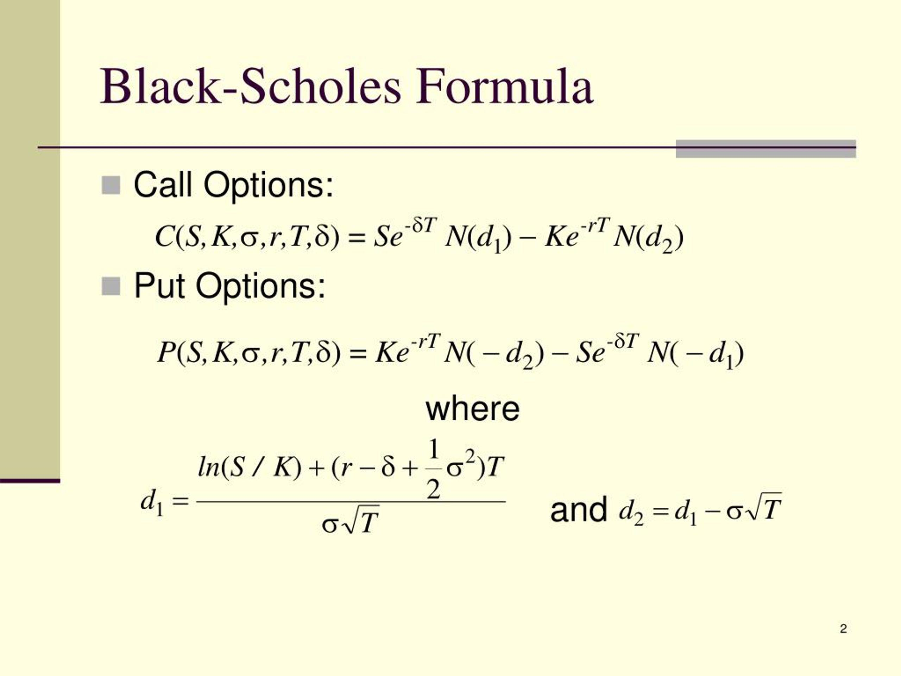

Algorithmic trading, frequently termed as algo trading, employs advanced computational models and sophisticated software to facilitate high-speed, high-volume trading activities. This approach leverages the power of algorithms to execute trades with precision and agility, thereby catering to the dynamic demands of financial markets. A cornerstone of algorithmic trading is the Black-Scholes model, a seminal framework in the field of financial engineering, specifically in option pricing.

The Black-Scholes model was developed by economists Fischer Black and Myron Scholes and subsequently expanded upon by Robert Merton. This model provides a structured methodology for calculating the theoretical price of European-style options. It does so by integrating parameters such as the current stock price, the option's strike price, time to expiration, risk-free rate, and volatility, thus offering a quantitative approach to options pricing.

This model is crucial for analyzing market dynamics as it helps traders comprehend volatility and assess risk factors critical for strategic decision-making. By understanding the intricacies of the Black-Scholes framework, traders can evaluate the fair value of options, assess market trends, and make informed choices that enhance their trading strategies and risk management practices.

Mastering the Black-Scholes model equips traders with the ability to devise robust trading algorithms that are less vulnerable to market fluctuations, thereby providing a competitive edge in the fast-paced trading environment. Its theoretical insights and practical applications form the backbone of numerous trading strategies that capitalize on market inefficiencies, optimize entry and exit points, and ultimately improve trading performance.

## Table of Contents

## Understanding the Black-Scholes Model

The Black-Scholes model serves as a foundational framework for pricing European-style options, influential in financial engineering due to its systematic and analytical approach. The model is built upon several core assumptions that allow for the derivation of theoretical option prices. These assumptions include the concept of constant volatility, meaning market volatility does not change over the life of the option. Additionally, it presumes that stock prices follow a lognormal distribution, permitting continuous price paths and aligning with real financial returns' characteristics to some extent. Another critical assumption is the absence of arbitrage opportunities, which implies that the market is efficient, and all equivalent financial instruments have the same expected rate of return.

The Black-Scholes formula is expressed as follows for a European call option:

$$
C(S, t) = S N(d_1) - X e^{-r(T-t)} N(d_2)
$$

where:
- $S$ is the current stock price,
- $X$ is the strike price of the option,
- $r$ is the risk-free interest rate,
- $T$ is the time to expiration,
- $N$ is the cumulative distribution function of the standard normal distribution,
- $d_1 = \frac{\ln(S/X) + (r + \sigma^2/2)(T-t)}{\sigma\sqrt{T-t}}$,
- $d_2 = d_1 - \sigma\sqrt{T-t}$,
- $\sigma$ is the volatility of the stock price.

These assumptions enable the model to integrate key parameters like stock price, time, interest rates, and [volatility](/wiki/volatility-trading-strategies), leading to a calculated theoretical price of an option. This systematic evaluation is crucial in reducing uncertainty in pricing and is instrumental for risk management and strategic trading decisions. The Black-Scholes model establishes a benchmark pricing mechanism, often used by traders and financial engineers to assess option value and implement hedging strategies competently. By offering a quantitative method for understanding market volatility and calculating option prices, it assists in developing more sophisticated models and trading strategies that account for dynamic market conditions.

## Derivation of the Black-Scholes Equation

The derivation of the Black-Scholes equation involves sophisticated mathematical tools, notably Itô's calculus and stochastic differential equations (SDEs). The core concept relies on constructing a hedged portfolio that theoretically eliminates risk through continuous adjustment over time.

The stock price is modeled using geometric Brownian motion (GBM), a fundamental concept in financial mathematics. This model captures the price evolution, defined by the SDE:

$$
dS_t = \mu S_t dt + \sigma S_t dW_t
$$

where $S_t$ is the stock price at time $t$, $\mu$ denotes the expected return rate, $\sigma$ represents the stock's volatility, and $dW_t$ is a Wiener process or standard Brownian motion.

In deriving the Black-Scholes partial differential equation (PDE), the aim is to develop a risk-neutral valuation framework. To achieve this, one constructs a portfolio consisting of a position in the stock and a position in the option, adjusting the composition dynamically to offset risk. This portfolio's evolution is governed by:

$$
d\Pi = \frac{\partial \Pi}{\partial S} dS + \frac{\partial \Pi}{\partial t} dt + \frac{1}{2} \frac{\partial^2 \Pi}{\partial S^2} \sigma^2 S^2 dt
$$

By choosing the correct proportion of the stock to hold (i.e., setting the delta $\Delta$ of the portfolio), we eliminate the randomness caused by the $dW_t$ term. Applying the no-[arbitrage](/wiki/arbitrage) condition implies that the portfolio should earn the risk-free rate $r$, leading to the Black-Scholes PDE:

$$
\frac{\partial V}{\partial t} + \frac{1}{2} \sigma^2 S^2 \frac{\partial^2 V}{\partial S^2} + rS \frac{\partial V}{\partial S} - rV = 0
$$

Solving this PDE under appropriate boundary conditions, typically for a European call or put option, yields the well-known Black-Scholes formula. This formula provides a theoretical estimate for an option's price and informs [algorithmic trading](/wiki/algorithmic-trading) decisions regarding optimal entry and [exit](/wiki/exit-strategy) points in the market.

In algorithmic trading, these solutions are integrated to fine-tune trading strategies that capitalize on calculated positions hedged against undesirable changes in volatility and stock prices, ensuring that positions are aligned with no-arbitrage principles.

## Application of Black-Scholes in Algorithmic Trading

The Black-Scholes model plays a pivotal role in algorithmic trading, particularly in the valuation and execution of options strategies. 

Traders leverage the Black-Scholes model to calculate the fair value of options, providing a systematic method to determine whether an option is underpriced or overpriced in the market. This valuation is crucial for executing trades based on intrinsic and extrinsic value components, facilitating informed decision-making, and aligning trades with market expectations. By employing the Black-Scholes formula, which involves parameters such as the current stock price (S), the option's strike price (K), the time to expiration (T), the risk-free [interest rate](/wiki/interest-rate-trading-strategies) (r), and the volatility of the stock (σ), traders can effectively assess option pricing: 

$$
C(S, t) = SN(d_1) - Ke^{-r(T-t)}N(d_2)
$$

Where:

$$
d_1 = \frac{\ln\left(\frac{S}{K}\right) + (r + \frac{\sigma^2}{2})(T-t)}{\sigma\sqrt{T-t}}
$$

$$
d_2 = d_1 - \sigma\sqrt{T-t}
$$

Here, $N(d)$ is the cumulative distribution function of the standard normal distribution.

An essential aspect of applying the Black-Scholes model involves outputs such as implied volatility and the Greeks—Delta, Gamma, Theta, Vega, and Rho. These metrics are integral for portfolio management and risk assessment. Implied volatility, derived from option prices, offers insights into market expectations regarding stock volatility, enabling traders to measure the risk of option positions. The Greeks provide sensitivity analysis, assisting in predicting changes in option value concerning different factors, such as price movement or time decay, thus offering a thorough framework for risk navigation.

In high-frequency trading ([HFT](/wiki/high-frequency-trading-strategies)), the rapid computation of option prices and real-time implied volatility assessments enhance both profitability and precision. By swiftly processing vast datasets and executing orders in fractions of a second, these algorithms enable traders to capitalize on transient market inefficiencies. Integration of the Black-Scholes model within these algorithms ensures that trades adhere to quantitative strategies, optimizing both risk management and return on investment.

By proficiently integrating the Black-Scholes model into algorithmic trading systems, traders can adapt to continually changing market conditions. This adaptability is crucial for optimizing the balance between risk and return, ensuring robust trading strategies that align with dynamic financial environments.

## Advantages and Limitations

The Black-Scholes model offers a standardized approach to pricing options and managing risk, establishing itself as a universal benchmark across financial markets. This mathematical elegance allows for the theoretical determination of an option's price, providing traders and financial institutions with a foundational framework to base their decisions on.

However, the model rests on assumptions that may not align with real-world conditions. One key assumption is that of constant volatility, which suggests that market volatility does not change over the life of the option. In reality, volatility is dynamic and can fluctuate due to a multitude of factors. Additionally, the model assumes a lognormal distribution of stock prices, which may not always accurately reflect market behavior.

Another significant limitation of the Black-Scholes model is its disregard for transaction costs and the assumption of continuous trading. In practical terms, most markets do not operate in a continuous manner and possess costs that can significantly impact the profitability and feasibility of trading strategies.

Despite these limitations, many traders and financial engineers adapt the Black-Scholes model to better accommodate the dynamic nature of markets. By incorporating stochastic volatility models or using alternative distributions, traders can enhance their decision-making processes and improve risk management. This adaptability is crucial as it allows practitioners to not only use the Black-Scholes model as a baseline but also refine their strategies to exploit current market conditions effectively.

In conclusion, while the Black-Scholes model provides a useful framework for understanding options pricing, its assumptions necessitate modifications to align with the complexities of real-world markets. Adjusting the model to capture market nuances aids in enhancing profitability, managing risk, and maintaining a competitive advantage.

## Conclusion

The Black-Scholes model remains a cornerstone in the domain of option pricing, substantially contributing to the framework of algorithmic trading. By providing a rigorous method for estimating the fair value of options, the model assists traders and financial institutions in making informed and strategic decisions. Despite the robustness and mathematical elegance of the model, its foundational assumptions—such as constant volatility and lognormal distribution of asset prices—often diverge from real market conditions. This divergence highlights the importance of adaptable strategies to address these discrepancies.

To optimize the utility of the Black-Scholes model, it is crucial to understand and refine the assumptions and parameters within the model. Traders and financial analysts frequently employ adaptive techniques to align the model more closely with empirical observations, thus enhancing its predictive accuracy and risk management capabilities. By continuously adjusting the model's parameters, such as volatility input, market participants can better capture and exploit market inefficiencies. 

Furthermore, sophisticated algorithmic trading strategies leverage the Black-Scholes model to accurately assess and mitigate risk, improving overall financial outcomes. Utilizing real-time data and computational algorithms, traders can dynamically adapt to market fluctuations, ensuring decisions are based on the most reliable information available. This adaptability not only maximizes return on investment but also fortifies financial strategies against unforeseen market shifts, ultimately amplifying the effectiveness of the Black-Scholes model in the continuously evolving landscape of financial trading.

## Further Resources

For those interested in deepening their understanding of the Black-Scholes model and its application in algorithmic trading, numerous resources are available. A highly recommended textbook is "Options, Futures, and Other Derivatives" by John C. Hull. This comprehensive guide covers a wide array of derivative securities, their valuation, and their use in risk management, providing foundational knowledge essential for mastering the Black-Scholes model.

Online courses in Quantitative Finance are invaluable for those seeking practical experience with the Black-Scholes model in trading strategies. Platforms such as Coursera, edX, and Udacity offer programs taught by industry experts and academic professionals, focusing on quantitative methods, financial engineering, and algorithmic trading techniques. These courses often provide case studies and interactive assignments, allowing for hands-on practice in real-world scenarios.

Academic journals, forums, and professional networks are also critical for staying updated with the latest advancements in financial mathematics. Journals such as the Journal of Financial Economics and the Review of Financial Studies frequently publish articles on innovations in option pricing models, algorithmic trading, and risk assessment. Engaging with professional networks like the Global Association of Risk Professionals (GARP) and forums such as QuantNet can offer deeper insights and facilitate discussions with experts and peers in the field.

By leveraging these resources, individuals can enhance their proficiency in utilizing the Black-Scholes model, enabling them to make more informed and strategic trading decisions.

## References & Further Reading

Key references for understanding the Black-Scholes model and its implications in algorithmic trading include seminal papers such as "The Pricing of Options and Corporate Liabilities" by Fischer Black and Myron Scholes. This foundational work introduced the Black-Scholes formula for option pricing, an essential tool now used extensively in financial markets. Additionally, Robert Merton's "Theory of Rational Option Pricing" complements this by extending the methodology and discussing its applications in various market conditions.

Academic journals frequently publish articles exploring the evolution of option pricing models, from classical approaches to contemporary adaptations in high-frequency trading environments. Articles in journals like the Journal of Financial Economics often feature analyses on how these models are fine-tuned to meet the demands of ever-changing market conditions.

For those new to financial mathematics, "Options, Futures, and Other Derivatives" by John C. Hull serves as an excellent introductory text, covering the basics of option pricing, including detailed explanations of the Black-Scholes model.

Online platforms offering courses in Quantitative Finance, such as Coursera and edX, provide practical experience with these concepts, integrating theory with applications using tools like Python. These resources help bridge the gap between theoretical knowledge and practical implementation, crucial for effective algorithmic trading.

Professional networks and forums also facilitate discussions on the latest advancements in option pricing models and trading strategies. Engaging with these communities allows practitioners to stay informed on emerging trends and refine their trading algorithms for enhanced market performance.

