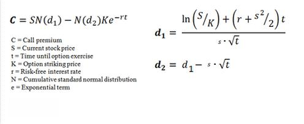

Options trading presents a range of complex strategies and models, with the Black-Scholes Model standing out as a fundamental concept for pricing financial derivatives. The Black-Scholes Model provides a mathematical and theoretical framework essential for understanding options pricing. Introduced in the early 1970s by Fischer Black, Myron Scholes, and Robert Merton, this model has since become an integral part of financial markets, offering traders a standardized approach to assess options' value.

The model calculates the theoretical price of options by employing present stock prices, dividends, risk-free interest rates, time to expiration, and asset volatility. This formula serves as a base for both individual traders and financial institutions, aiding in the effective management of portfolios and risk. While the Black-Scholes Model originally focused on options pricing, its underlying principles have found application in algorithmic trading, which has dramatically changed the landscape of trading derivatives.



Algorithmic trading automates trading decisions, relying on models like Black-Scholes to optimize strategies based on pre-set criteria. This evolution emphasizes the importance of comprehending these core models to navigate modern financial markets successfully. Although the Black-Scholes Model has limitations—such as assumptions about constant volatility and risk-free rates—it remains crucial for those seeking to enhance their trading approaches. As the field of algorithmic trading continues to grow, evolving beyond its current capabilities, understanding foundational models like Black-Scholes is more relevant than ever.

## Table of Contents

## History of the Black-Scholes Model

The Black-Scholes model, a cornerstone of modern financial theory, was developed in 1973 by economists Fischer Black, Myron Scholes, and later Robert Merton, who expanded on the work. This model represented a significant advance in the field of theoretical finance by providing a systematic approach to option pricing. Prior to its introduction, the methodologies for determining option prices lacked the theoretical rigour that Black-Scholes offered, which accounted for several key factors such as current stock prices, dividends, fixed interest rates, time to expiration, and volatility.

The Black-Scholes model employs the concept of a risk-neutral world, where the expected return of a security is the risk-free rate. It assumes that financial markets are efficient, options are European-style (exercisable only at expiration), and that the returns of assets are normally distributed. Despite these assumptions, the model gained widespread adoption because it addressed the complexity of pricing financial derivatives in a mathematically pleasing format.

The original Black-Scholes formula for pricing a call option is expressed as:

$$
C = S_0 N(d_1) - X e^{-rT} N(d_2)
$$

Where:
- $C$ is the call option price
- $S_0$ is the current stock price
- $X$ is the strike price
- $r$ is the risk-free interest rate
- $T$ is the time to expiration (in years)
- $N(\cdot)$ is the cumulative distribution function of the standard normal distribution
- $d_1$ and $d_2$ are intermediate calculations:

$$
d_1 = \frac{\ln(S_0/X) + (r + \sigma^2/2)T}{\sigma \sqrt{T}}
$$
$$
d_2 = d_1 - \sigma \sqrt{T}
$$

In 1997, Myron Scholes and Robert Merton were awarded the Nobel Memorial Prize in Economic Sciences for their revolutionary work in options pricing. Although Fischer Black had passed away in 1995, the Nobel Committee acknowledged his essential contributions to the development of the model. This accolade highlighted the model's profound impact on both academic finance and the practical realm of trading.

The Black-Scholes model laid the groundwork for further research and practical applications, influencing the methods employed in today’s financial markets. Its introduction marked the transition of options pricing from an art based on intuition and speculation to a science grounded in mathematics. Despite its limitations, which include assumptions like constant [volatility](/wiki/volatility-trading-strategies) and risk-free interest rates, the model remains an integral tool for traders and financial institutions globally.

## How the Black-Scholes Model Works

The Black-Scholes Model provides a mathematical framework for pricing European options, fundamentally assuming that the prices of underlying assets like stocks or futures adhere to a lognormal distribution over time. This assumption is crucial because asset prices cannot logically be negative, and a lognormal distribution appropriately reflects this by skewing prices positively.

The model employs several key variables to estimate option prices:

1. **Current Asset Price (S)**: This is the present value of the underlying stock or asset. The model posits that increases in this price will lead to higher call option values.

2. **Strike Price (K)**: This is the predetermined price at which the option can be exercised. For call options, as the strike price increases, the value of the call option decreases, and vice versa.

3. **Time to Expiration (T)**: The duration remaining until the option's expiration affects the option value. Generally, the more time until expiration, the higher the value of the option, due to potential price movement opportunities.

4. **Risk-Free Interest Rate (r)**: This is the theoretical return on an investment with zero risk, often represented by government bond yields. Higher interest rates typically increase call option values by reducing the present value of the strike price.

5. **Volatility ($\sigma$)**: A measure of how much the asset's price can vary, volatility is a critical factor in the model. Higher volatility suggests a greater likelihood of the asset price moving above the strike price, thus increasing the call option's value.

The relationship between these variables is captured in the continuous-time framework of the model. In a simplified Python implementation, these dynamics can be expressed as:

```python
import numpy as np
from scipy.stats import norm

def black_scholes_call_price(S, K, T, r, sigma):
    d1 = (np.log(S / K) + (r + 0.5 * sigma**2) * T) / (sigma * np.sqrt(T))
    d2 = d1 - sigma * np.sqrt(T)
    call_price = (S * norm.cdf(d1)) - (K * np.exp(-r * T) * norm.cdf(d2))
    return call_price
```

In this code, `d1` and `d2` represent intermediate calculations capturing the cumulative probability distributions, crucial for determining the theoretical option prices. The function `black_scholes_call_price` computes the call option's price given an asset's current parameters.

The assumptions of the Black-Scholes Model, while essential for formulating its equations, can impose limitations in practical applications, such as the requirement for constant volatility and interest rates. Nevertheless, the model remains a foundational tool in financial markets, offering insights into the dynamics of options pricing.

## Black-Scholes Formula

The Black-Scholes formula is a fundamental tool in financial mathematics, specifically used for calculating the theoretical prices of European call and put options. This model utilizes properties of a normal distribution to estimate option prices, incorporating factors such as asset volatility and time decay, which significantly affect option valuation.

The core of the Black-Scholes formula involves a set of inputs: the current price of the underlying asset ($S$), the option's strike price ($K$), the risk-free [interest rate](/wiki/interest-rate-trading-strategies) ($r$), the time to expiration ($T$), and the volatility of the asset ($\sigma$). The formula for a call option ($C$) is expressed as:

$$

C = S \cdot N(d_1) - K \cdot e^{-rT} \cdot N(d_2)
$$

where:

$$
d_1 = \frac{\ln(S/K) + (r + \sigma^2/2)T}{\sigma \sqrt{T}}
$$

$$
d_2 = d_1 - \sigma \sqrt{T}
$$

In this formulation, $N(d)$ represents the cumulative distribution function of the standard normal distribution, signifying the probabilities that the option will end up in-the-money.

The Black-Scholes formula similarly calculates the price of a put option ($P$):

$$
P = K \cdot e^{-rT} \cdot N(-d_2) - S \cdot N(-d_1)
$$

These computations involve advanced mathematical concepts, such as stochastic calculus and differential equations, making manual calculations complex. However, the widespread integration of this formula in various online calculators and trading platforms simplifies the process for traders and investors, allowing them to harness this tool efficiently without delving into intricate mathematics.

In practical applications, this formula is readily implemented using programming languages. For instance, Python's libraries can efficiently compute these values, enabling traders to automate option pricing as part of their trading strategy:

```python
from math import exp, log, sqrt
from scipy.stats import norm

def black_scholes_call(S, K, T, r, sigma):
    d1 = (log(S / K) + (r + sigma**2 / 2) * T) / (sigma * sqrt(T))
    d2 = d1 - sigma * sqrt(T)
    call_price = S * norm.cdf(d1) - K * exp(-r * T) * norm.cdf(d2)
    return call_price

def black_scholes_put(S, K, T, r, sigma):
    d1 = (log(S / K) + (r + sigma**2 / 2) * T) / (sigma * sqrt(T))
    d2 = d1 - sigma * sqrt(T)
    put_price = K * exp(-r * T) * norm.cdf(-d2) - S * norm.cdf(-d1)
    return put_price
```

By taking into account factors such as volatility and time, the Black-Scholes formula provides a structured and quantitative method for deriving theoretical option prices, thus facilitating informed decision-making in financial markets.

## Volatility Skew and Its Impact

Volatility skew is an important concept in options pricing, highlighting the deviations in implied volatility observed for in-the-money and out-of-the-money options compared to at-the-money options. This phenomenon presents challenges to the assumptions made by the Black-Scholes model, particularly the assumption of normally distributed asset returns.

The Black-Scholes model posits that the returns of the underlying asset follow a lognormal distribution, which implies a symmetrical distribution of returns (i.e., no skewness) and thin tails (i.e., low kurtosis). However, empirical observations have consistently demonstrated significant skewness and kurtosis in asset returns, indicating that extreme movements in asset prices are more frequent than those predicted by the normal distribution. This discrepancy is particularly evident during periods of market turbulence.

The stock market crash of 1987, also known as Black Monday, prominently exposed the limitations of the normal distribution assumption. During this crash, the market experienced an unprecedented drop, with the Dow Jones Industrial Average plummeting by over 22% in a single day. This event highlighted the inadequacies of the Black-Scholes model in accounting for extreme market movements. As a consequence, option prices began to reflect a "volatility smile," a pattern where implied volatility is higher for deep in-the-money and out-of-the-money options compared to at-the-money options. This contrasts with the Black-Scholes model's prediction of a flat volatility surface.

The "volatility smile" suggests that market participants anticipate a higher probability of extreme price movements, either upwards or downwards, which the normal distribution fails to capture. This anticipation is incorporated into option prices through adjustments in implied volatility. In practice, traders and risk managers account for these anomalies by using modified versions of the Black-Scholes model or entirely different models that better capture the observed market dynamics, such as the stochastic volatility models or those incorporating jumps.

Understanding volatility skew is crucial for effective risk management and options trading strategies. It enables market participants to better evaluate the pricing and risk associated with various options, leading to more informed decisions. Therefore, while the Black-Scholes model provides a foundational framework, adapting its use to account for real-world phenomena like the volatility skew is essential for aligning theoretical models with market realities.

## Benefits and Limitations of the Model

The Black-Scholes Model stands as a cornerstone in the world of financial derivatives, offering a systematic approach for pricing options. One of the primary benefits of the model is its ability to provide a standardized method for pricing options, which enhances market transparency and efficiency. This standardization enables clearer communication of pricing across different market participants and has contributed to the widespread adoption of options trading.

From a risk management perspective, the Black-Scholes Model aids investors in assessing the profitability and risks associated with various options strategies. By quantifying potential outcomes and associated probabilities, the model assists in portfolio optimization. Investors can adjust their asset allocations based on the theoretical prices calculated by the model, thus optimizing their risk-return profiles.

Despite these advantages, the Black-Scholes Model has inherent limitations due to its underlying assumptions. It operates under the premise that markets are frictionless and that trading can occur continuously, without accounting for transaction costs and [liquidity](/wiki/liquidity-risk-premium) constraints. The model is specifically tailored for European-style options, which can only be exercised at expiration, thus limiting its applicability to American options, which can be exercised at any time before expiration.

Another critical assumption is that of constant volatility. In reality, volatility is often variable, and assumptions of constancy can lead to mispricing. While the model assumes that the risk-free interest rate remains constant, real-market interest rates are subject to fluctuations influenced by economic policies and conditions. The model also presumes a lognormal distribution of asset prices, which may not fully capture real-world anomalies like jumps in stock prices or the presence of heavy tails.

These limitations underscore the importance of using the Black-Scholes Model as a starting point rather than a definitive solution. Traders and analysts frequently employ adjustments or alternative models to account for the dynamic nature of financial markets. Despite its constraints, the Black-Scholes Model remains a vital tool whose insights continue to shape and inform financial strategies and technologies.

## Integration with Algorithmic Trading

Algorithmic trading, commonly referred to as algo trading, has fundamentally transformed the landscape of financial markets. This transformation is largely due to the integration of quantitative models like the Black-Scholes Model, which provides a cryptographic framework for pricing financial derivatives, into trading algorithms. By leveraging these models, traders and institutions can automate and optimize decision-making processes. The mechanisms of [algorithmic trading](/wiki/algorithmic-trading) involve executing orders based on a set of pre-defined criteria. These criteria enable market participants to navigate complex market dynamics and capitalize on fleeting opportunities with remarkable speed and precision.

Python, among other programming languages, has emerged as a preferred tool for implementing algorithmic trading strategies. Due to its simplicity and the availability of comprehensive libraries for data analysis and [machine learning](/wiki/machine-learning), Python is adept at handling real-time data inputs essential for trading decisions. For instance, libraries such as NumPy, Pandas, and SciPy facilitate complex numerical computations and data manipulation, while others like PyAlgoTrade and Zipline are specifically tailored for [backtesting](/wiki/backtesting) trading strategies.

To illustrate, consider a basic Python script using the Black-Scholes formula to compute the theoretical price of a European call option:

```python
import numpy as np
from scipy.stats import norm

def black_scholes(S, K, T, r, sigma):
    d1 = (np.log(S / K) + (r + 0.5 * sigma ** 2) * T) / (sigma * np.sqrt(T))
    d2 = d1 - sigma * np.sqrt(T)
    call_price = S * norm.cdf(d1) - K * np.exp(-r * T) * norm.cdf(d2)
    return call_price

# Example parameters
S = 100  # current stock price
K = 105  # strike price
T = 1    # time to expiration in years
r = 0.05 # risk-free interest rate
sigma = 0.2 # volatility

call_option_price = black_scholes(S, K, T, r, sigma)
print(f"Theoretical Call Option Price: ${call_option_price:.2f}")
```

This type of computational capability, when integrated within a trading algorithm, can continuously evaluate market conditions and execute trades when specified conditions are met. Such strategies may involve delta hedging, volatility [arbitrage](/wiki/arbitrage), or risk management techniques that are critical in today's fast-paced markets.

The expansion of algorithmic trading is further amplified by the advancements in [artificial intelligence](/wiki/ai-artificial-intelligence) and machine learning. These technologies facilitate sophisticated pattern recognition and predictive analytics, providing traders with a competitive edge in forecasting price movements and optimizing portfolios. Techniques such as neural networks, decision trees, and [reinforcement learning](/wiki/reinforcement-learning) are increasingly being applied to refine trading strategies and extract actionable insights from vast datasets.

In summary, the integration of the Black-Scholes Model and similar quantitative methods into algorithmic trading platforms is pivotal for enhancing trading efficiency and efficacy. As technology continues to evolve, the capacity for more sophisticated, adaptive, and data-driven trading strategies will become even more pronounced, underscoring the essentiality of an in-depth understanding of these foundational models.

## Conclusion

The Black-Scholes Model remains a pivotal tool in financial markets for pricing options, offering a robust framework for traders and financial analysts. Despite its limitations—such as the assumption of constant volatility and its applicability primarily to European-style options—the model has fundamentally shaped the landscape of options pricing. Its ability to provide a standardized method for determining the fair value of options has increased market transparency and efficiency, thus enabling more informed investment decisions and effective risk management.

Understanding and effectively utilizing the Black-Scholes Model contributes to enhanced trading strategies by providing insights into the relationship between underlying asset prices, volatility, and option pricing. This understanding is crucial, especially in volatile markets, where even small price movements can significantly affect option values.

As algorithmic trading becomes more prevalent, the need for refinement and adaptation of foundational models like Black-Scholes for contemporary finance grows. Incorporating real-time data, machine learning, and artificial intelligence into trading strategies may address some of the limitations of the model, such as the volatility skew and changing market conditions. Consequently, the integration of the Black-Scholes Model with advanced technologies is essential for optimizing trading decisions in an increasingly automated trading environment.

In conclusion, while the Black-Scholes Model is not without its challenges and assumptions, it remains an essential component of financial mathematics. Mastery of this model, combined with modern technological advancements, provides traders with a powerful toolkit for navigating the complexities of today's financial markets.

## References & Further Reading

[1]: Black, F., & Scholes, M. (1973). ["The Pricing of Options and Corporate Liabilities."](https://www.jstor.org/stable/1831029) Journal of Political Economy, 81(3), 637-654.

[2]: Merton, R. C. (1973). ["Theory of Rational Option Pricing."](https://www.jstor.org/stable/3003143) The Bell Journal of Economics and Management Science, 4(1), 141-183.

[3]: Hull, J. C. (2017). ["Options, Futures, and Other Derivatives."](https://www.semanticscholar.org/paper/Options%2C-Futures%2C-and-Other-Derivatives-Hull/89bdee500c8623864fc9eb7a471546aa713acc44) Pearson Education.

[4]: Wilmott, P. (2006). ["Paul Wilmott Introduces Quantitative Finance."](https://www.amazon.com/Paul-Wilmott-Introduces-Quantitative-Finance/dp/0470319585) John Wiley & Sons.

[5]: Gatheral, J. (2006). ["The Volatility Surface: A Practitioner’s Guide."](https://www.wiley.com/en-us/The+Volatility+Surface%3A+A+Practitioner%27s+Guide-p-9780471792512) Wiley Finance.

[6]: Haug, E. G. (2007). ["The Complete Guide to Option Pricing Formulas."](https://www.amazon.com/Complete-Guide-Option-Pricing-Formulas/dp/0786312408) McGraw Hill Professional.