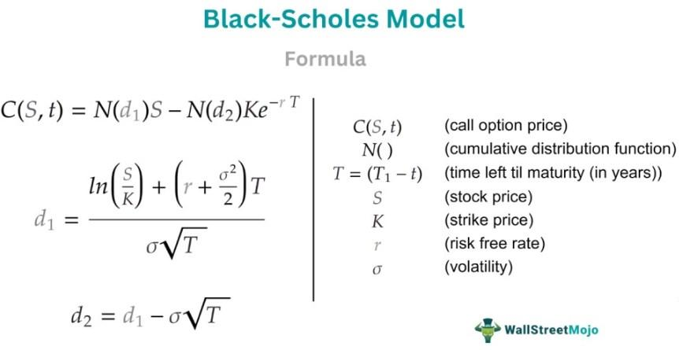

## Table of Contents

## What is the Black-Scholes Model?

The Black-Scholes Model is a mathematical formula used to calculate the theoretical price of options, which are financial instruments that give the buyer the right, but not the obligation, to buy or sell an asset at a certain price before a certain date. Developed by economists Fischer Black and Myron Scholes in 1973, this model helps investors determine how much an option should be worth based on factors like the current price of the underlying asset, the option's strike price, the time until the option expires, the risk-free interest rate, and the expected volatility of the asset's price.

The model assumes that the price of the underlying asset follows a lognormal distribution, meaning that the asset's price changes are random but tend to increase over time. It also assumes that markets are efficient, meaning all known information is already reflected in the asset's price, and that there are no transaction costs or taxes. While the Black-Scholes Model is widely used and considered a groundbreaking achievement in financial economics, it has limitations. For instance, it does not account for sudden large price movements or changes in market conditions, which can lead to inaccuracies in the calculated option prices. Despite these limitations, the model remains a fundamental tool for options traders and financial analysts.

## Who developed the Black-Scholes Model and when?

The Black-Scholes Model was developed by economists Fischer Black and Myron Scholes. They came up with this model in 1973. Fischer Black and Myron Scholes worked together to create a way to figure out how much an option should cost.

An option is like a special kind of contract that lets you buy or sell something at a set price before a certain time. The Black-Scholes Model helps people guess the price of these options by looking at things like the current price of the item, how long until the option ends, and how much the price might change. This model was a big deal in the world of money and helped a lot of people make better decisions about buying and selling options.

## What are the key assumptions of the Black-Scholes Model?

The Black-Scholes Model makes some guesses about how the world works to help figure out the price of options. One big guess is that the price of the thing you're buying or selling with the option moves in a special way. It thinks the price changes are random but usually go up over time. This is called a lognormal distribution. The model also thinks that the market is smart and already knows everything important, so the price of the thing is always right based on what everyone knows. It also assumes that you don't have to pay any extra fees or taxes when you buy or sell the option.

Another important guess is that you can borrow and lend money at a certain interest rate without any risk. This is called the risk-free interest rate. The model also thinks that you can always buy or sell the thing the option is for whenever you want, and that the price of the thing moves smoothly without big jumps. These guesses help make the math easier, but they don't always match the real world perfectly. For example, prices can jump suddenly, and markets aren't always as smart as the model thinks. Even with these limits, the Black-Scholes Model is still a big help for people trying to figure out what options should cost.

## How is the Black-Scholes Model used to price options?

The Black-Scholes Model helps people figure out how much an option should cost. An option is like a special deal that lets you buy or sell something at a set price before a certain time. To use the model, you need to know a few things: the current price of the thing you're buying or selling, the price you can buy or sell it at with the option (called the strike price), how long until the option ends, the interest rate for borrowing money without risk, and how much the price of the thing might change (called volatility). The model uses a special math formula to mix all these things together and come up with a number that says what the option should be worth.

Even though the Black-Scholes Model is really helpful, it makes some guesses that don't always match the real world. For example, it thinks the price of the thing moves smoothly and doesn't jump around, and that the market always knows everything important. But in real life, prices can change suddenly, and markets aren't always perfect. Still, the model is a big tool for people who trade options because it gives them a good starting point to guess what an option should cost. By using the Black-Scholes Model, traders can make smarter choices about buying and selling options.

## What are the inputs required for the Black-Scholes formula?

The Black-Scholes formula needs a few pieces of information to figure out the price of an option. You need to know the current price of the thing you're buying or selling with the option. This is called the underlying asset. You also need to know the price at which you can buy or sell the asset with the option, which is called the strike price. Another important piece of information is how long you have until the option expires. This is called the time to expiration. You also need to know the interest rate for borrowing money without any risk, which is called the risk-free interest rate. Finally, you need to know how much the price of the asset might change, which is called volatility.

All these pieces of information go into the Black-Scholes formula to help calculate what the option should be worth. The formula mixes these numbers together in a special way to come up with a price for the option. Even though the Black-Scholes Model is very useful, it makes some guesses that don't always match the real world perfectly. For example, it assumes that the price of the asset moves smoothly and doesn't jump around, and that the market always knows everything important. But in real life, prices can change suddenly, and markets aren't always perfect. Still, the model is a big help for people who trade options because it gives them a good starting point to guess what an option should cost.

## Can you explain the Black-Scholes formula in simple terms?

The Black-Scholes formula is a math tool that helps people figure out how much an option should cost. An option is like a special deal that lets you buy or sell something at a set price before a certain time. To use the formula, you need to know the current price of the thing you're buying or selling, which we call the underlying asset. You also need to know the price at which you can buy or sell the asset with the option, called the strike price. Other important pieces of information are how long you have until the option expires, the interest rate for borrowing money without any risk, and how much the price of the asset might change, which is called volatility. The formula takes all these numbers and mixes them together in a special way to come up with a price for the option.

Even though the Black-Scholes formula is really helpful, it makes some guesses that don't always match the real world. For example, it thinks the price of the asset moves smoothly and doesn't jump around, and that the market always knows everything important. But in real life, prices can change suddenly, and markets aren't always perfect. Still, the formula is a big help for people who trade options because it gives them a good starting point to guess what an option should cost. By using the Black-Scholes formula, traders can make smarter choices about buying and selling options.

## What is the difference between call and put options in the context of the Black-Scholes Model?

In the world of options, there are two main types: call options and put options. A call option gives you the right, but not the obligation, to buy something at a set price before a certain time. For example, if you think the price of a stock will go up, you might buy a call option to buy that stock at today's price, hoping to make a profit when the price rises. In the Black-Scholes Model, the formula for pricing a call option takes into account the current price of the stock, the price at which you can buy it (the strike price), how long until the option expires, the interest rate for borrowing money without risk, and how much the stock's price might change (volatility).

On the other hand, a put option gives you the right, but not the obligation, to sell something at a set price before a certain time. If you think the price of a stock will go down, you might buy a put option to sell that stock at today's price, hoping to make a profit when the price falls. The Black-Scholes Model also has a formula for pricing put options, using the same factors as the call option formula. The main difference in the formulas is how they handle the possibility of the stock price being less than the strike price at expiration, which is more relevant for put options. Both formulas help traders figure out what these options should cost, but they do it in slightly different ways based on whether you're looking to buy or sell the underlying asset.

## How does the Black-Scholes Model handle dividends?

The Black-Scholes Model was originally made without thinking about dividends, which are payments companies sometimes give to people who own their stock. But people found a way to include dividends in the model. When a company pays a dividend, the price of its stock usually goes down by the amount of the dividend on the day it's paid. So, to handle dividends in the Black-Scholes Model, you can lower the stock price by the present value of the expected dividends that will be paid before the option expires. This way, the model can still work well even when dividends are part of the picture.

This adjustment means that the model takes into account the fact that the stock price might drop because of dividends. By doing this, the Black-Scholes Model can still give a good guess on what an option should cost, even if the company pays dividends. It's like telling the model, "Hey, remember that the stock price might go down a bit because of these payments, so let's adjust our calculations accordingly." This makes the model more useful for people who trade options on stocks that pay dividends.

## What are some limitations and criticisms of the Black-Scholes Model?

The Black-Scholes Model has some big problems that people talk about. One problem is that it thinks the price of the thing you're buying or selling moves smoothly without any big jumps. But in real life, prices can change suddenly, like when something big happens in the news. The model also thinks the market always knows everything important, but markets can be wrong sometimes. Another issue is that the model doesn't think about extra costs like fees or taxes, which can make a big difference in what an option should cost. Also, the model assumes you can always buy or sell the thing whenever you want, but sometimes that's not true.

Another criticism is that the Black-Scholes Model doesn't handle dividends well. Dividends are payments companies give to people who own their stock, and they can change the price of the stock. The model can be adjusted to think about dividends, but it's not perfect. Some people also say the model is too simple because it only looks at a few things to figure out the price of an option. Real life is more complicated, and there are other things that can affect the price. Even with these problems, the Black-Scholes Model is still really helpful for people who trade options because it gives them a good starting point to guess what an option should cost.

## How can the Black-Scholes Model be adjusted for American options?

The Black-Scholes Model was made for European options, which can only be used at the end of their life. American options are different because you can use them anytime before they end. To make the Black-Scholes Model work for American options, you need to think about the chance that someone might use the option early. This makes the math more complicated because you have to guess when the best time to use the option might be. One way to do this is by using a computer to try out lots of different times and see which one gives the best price for the option. This method is called a numerical method, and it helps figure out how much an American option should cost.

Even though the Black-Scholes Model can be changed to work with American options, it's still not perfect. The model makes some guesses about how the world works that don't always match up with real life. For example, it thinks the price of the thing you're buying or selling moves smoothly without any big jumps, but prices can change suddenly in real life. Also, the model doesn't think about extra costs like fees or taxes, which can make a big difference in what an option should cost. Despite these problems, the adjusted Black-Scholes Model can still give people a good starting point to guess what an American option should cost, helping them make smarter choices about buying and selling these options.

## What are some advanced modifications or extensions to the Black-Scholes Model?

People have made the Black-Scholes Model better by adding new ideas to it. One big change is the binomial model, which breaks down the time until the option ends into smaller pieces. This model imagines that the price of the thing you're buying or selling can go up or down at each little step. By trying out all the different ways the price could move, the binomial model can figure out a more accurate price for the option. Another change is the Black-Scholes-Merton model, which adds in the idea of dividends. This model adjusts the price of the stock to account for the money the company pays out to its owners, making the guess about the option's price more realistic.

Another important modification is the use of stochastic volatility models, like the Heston model. These models say that the amount the price might change, called volatility, isn't always the same but can move around over time. This makes the model more like real life, where the ups and downs of prices can change a lot. There are also models that think about how prices can jump suddenly, called jump-diffusion models. These models help deal with big, unexpected changes in prices, which the original Black-Scholes Model didn't handle well. By adding these new ideas, people can get a better guess about what options should cost, even though the models are more complicated to use.

## How does the Black-Scholes Model perform under extreme market conditions?

The Black-Scholes Model doesn't do well during very crazy times in the market. It thinks that prices move smoothly without big jumps, but in real life, things can change suddenly. When there's a big event, like a financial crisis, the model can give wrong guesses about what options should cost. This is because it doesn't expect the big, sudden changes that can happen. During these wild times, the model might say an option is worth a lot less than it really is, or a lot more, which can lead to big mistakes for people who use it to make decisions.

Even though the Black-Scholes Model has problems during extreme market conditions, people still use it a lot. They know it's not perfect, but it gives a good starting point to guess option prices. Traders might use other tools and their own experience to adjust the model's guesses when the market gets really crazy. This way, they can still make smart choices about buying and selling options, even when the world of money is acting in unexpected ways.

## What is the History of the Black-Scholes Model?

The Black-Scholes model, a cornerstone of modern financial theory, was developed in 1973 by economists Fischer Black, Myron Scholes, and later Robert Merton, who expanded on the work. This model represented a significant advance in the field of theoretical finance by providing a systematic approach to option pricing. Prior to its introduction, the methodologies for determining option prices lacked the theoretical rigour that Black-Scholes offered, which accounted for several key factors such as current stock prices, dividends, fixed interest rates, time to expiration, and volatility.

The Black-Scholes model employs the concept of a risk-neutral world, where the expected return of a security is the risk-free rate. It assumes that financial markets are efficient, options are European-style (exercisable only at expiration), and that the returns of assets are normally distributed. Despite these assumptions, the model gained widespread adoption because it addressed the complexity of pricing financial derivatives in a mathematically pleasing format.

The original Black-Scholes formula for pricing a call option is expressed as:

$$
C = S_0 N(d_1) - X e^{-rT} N(d_2)
$$

Where:
- $C$ is the call option price
- $S_0$ is the current stock price
- $X$ is the strike price
- $r$ is the risk-free interest rate
- $T$ is the time to expiration (in years)
- $N(\cdot)$ is the cumulative distribution function of the standard normal distribution
- $d_1$ and $d_2$ are intermediate calculations:

$$
d_1 = \frac{\ln(S_0/X) + (r + \sigma^2/2)T}{\sigma \sqrt{T}}
$$
$$
d_2 = d_1 - \sigma \sqrt{T}
$$

In 1997, Myron Scholes and Robert Merton were awarded the Nobel Memorial Prize in Economic Sciences for their revolutionary work in options pricing. Although Fischer Black had passed away in 1995, the Nobel Committee acknowledged his essential contributions to the development of the model. This accolade highlighted the model's profound impact on both academic finance and the practical realm of trading.

The Black-Scholes model laid the groundwork for further research and practical applications, influencing the methods employed in today’s financial markets. Its introduction marked the transition of options pricing from an art based on intuition and speculation to a science grounded in mathematics. Despite its limitations, which include assumptions like constant [volatility](/wiki/volatility-trading-strategies) and risk-free interest rates, the model remains an integral tool for traders and financial institutions globally.

## What is the Black-Scholes Formula?

The Black-Scholes formula is a fundamental tool in financial mathematics, specifically used for calculating the theoretical prices of European call and put options. This model utilizes properties of a normal distribution to estimate option prices, incorporating factors such as asset volatility and time decay, which significantly affect option valuation.

The core of the Black-Scholes formula involves a set of inputs: the current price of the underlying asset ($S$), the option's strike price ($K$), the risk-free [interest rate](/wiki/interest-rate-trading-strategies) ($r$), the time to expiration ($T$), and the volatility of the asset ($\sigma$). The formula for a call option ($C$) is expressed as:

$$

C = S \cdot N(d_1) - K \cdot e^{-rT} \cdot N(d_2)
$$

where:

$$
d_1 = \frac{\ln(S/K) + (r + \sigma^2/2)T}{\sigma \sqrt{T}}
$$

$$
d_2 = d_1 - \sigma \sqrt{T}
$$

In this formulation, $N(d)$ represents the cumulative distribution function of the standard normal distribution, signifying the probabilities that the option will end up in-the-money.

The Black-Scholes formula similarly calculates the price of a put option ($P$):

$$
P = K \cdot e^{-rT} \cdot N(-d_2) - S \cdot N(-d_1)
$$

These computations involve advanced mathematical concepts, such as stochastic calculus and differential equations, making manual calculations complex. However, the widespread integration of this formula in various online calculators and trading platforms simplifies the process for traders and investors, allowing them to harness this tool efficiently without delving into intricate mathematics.

In practical applications, this formula is readily implemented using programming languages. For instance, Python's libraries can efficiently compute these values, enabling traders to automate option pricing as part of their trading strategy:

```python
from math import exp, log, sqrt
from scipy.stats import norm

def black_scholes_call(S, K, T, r, sigma):
    d1 = (log(S / K) + (r + sigma**2 / 2) * T) / (sigma * sqrt(T))
    d2 = d1 - sigma * sqrt(T)
    call_price = S * norm.cdf(d1) - K * exp(-r * T) * norm.cdf(d2)
    return call_price

def black_scholes_put(S, K, T, r, sigma):
    d1 = (log(S / K) + (r + sigma**2 / 2) * T) / (sigma * sqrt(T))
    d2 = d1 - sigma * sqrt(T)
    put_price = K * exp(-r * T) * norm.cdf(-d2) - S * norm.cdf(-d1)
    return put_price
```

By taking into account factors such as volatility and time, the Black-Scholes formula provides a structured and quantitative method for deriving theoretical option prices, thus facilitating informed decision-making in financial markets.

## References & Further Reading

[1]: Black, F., & Scholes, M. (1973). ["The Pricing of Options and Corporate Liabilities."](https://www.jstor.org/stable/1831029) Journal of Political Economy, 81(3), 637-654.

[2]: Merton, R. C. (1973). ["Theory of Rational Option Pricing."](https://www.jstor.org/stable/3003143) The Bell Journal of Economics and Management Science, 4(1), 141-183.

[3]: Hull, J. C. (2017). ["Options, Futures, and Other Derivatives."](https://www.semanticscholar.org/paper/Options%2C-Futures%2C-and-Other-Derivatives-Hull/89bdee500c8623864fc9eb7a471546aa713acc44) Pearson Education.

[4]: Wilmott, P. (2006). ["Paul Wilmott Introduces Quantitative Finance."](https://www.amazon.com/Paul-Wilmott-Introduces-Quantitative-Finance/dp/0470319585) John Wiley & Sons.

[5]: Gatheral, J. (2006). ["The Volatility Surface: A Practitioner’s Guide."](https://www.wiley.com/en-us/The+Volatility+Surface%3A+A+Practitioner%27s+Guide-p-9780471792512) Wiley Finance.

[6]: Haug, E. G. (2007). ["The Complete Guide to Option Pricing Formulas."](https://www.amazon.com/Complete-Guide-Option-Pricing-Formulas/dp/0786312408) McGraw Hill Professional.