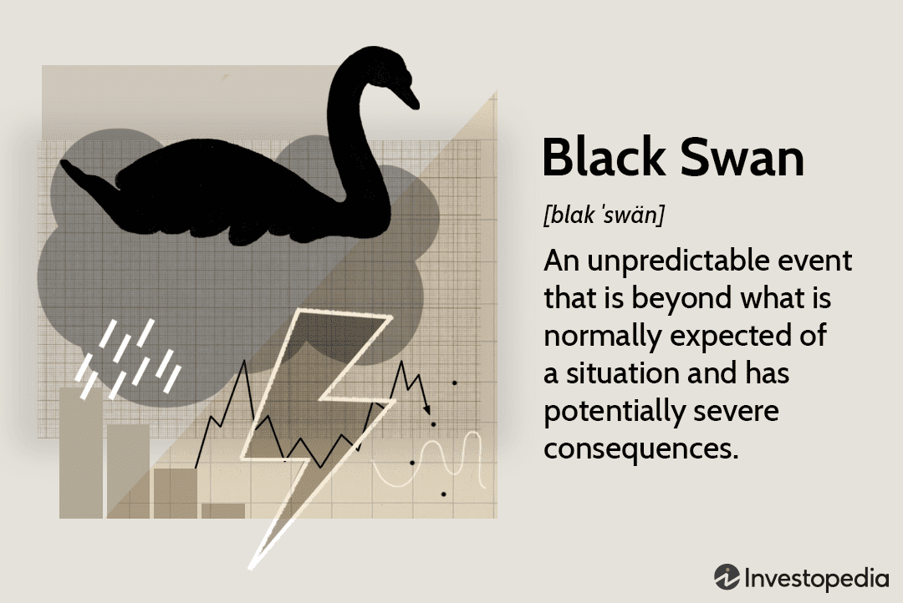

## Table of Contents

## What is a Black Swan event?

A Black Swan event is a rare and unexpected occurrence that has a big impact on the world. These events are hard to predict and can cause a lot of surprise and disruption. The term comes from the idea that people used to think all swans were white until black swans were discovered in Australia.

Examples of Black Swan events include the 2008 financial crisis and the COVID-19 pandemic. These events were not foreseen by most people and led to major changes in how we live and work. Even though they are rare, Black Swan events remind us that we need to be ready for unexpected things that can change everything.

## Can you provide examples of historical Black Swan events?

One famous Black Swan event was the September 11, 2001, terrorist attacks in the United States. Before that day, most people did not think such a large-scale attack on American soil was possible. The attacks led to big changes in security and how countries fight terrorism. It also affected the world's economy and changed how people travel.

Another example is the invention of the internet. In the early days, no one could predict how much it would change the world. It started as a way for scientists to share information, but it grew into something that connects people everywhere and changes how we work, learn, and even shop. The internet's impact on daily life was a huge surprise.

The global financial crisis of 2008 is also a Black Swan event. Many people thought the economy was strong, but then housing markets crashed, and big banks failed. This led to a worldwide economic downturn that affected jobs and money everywhere. It was a shock that showed how connected and fragile the world's economy can be.

## How do Black Swan events impact financial markets?

Black Swan events can shake up financial markets a lot. When something unexpected happens, like a big economic crisis or a global health emergency, it can make stock prices go up and down wildly. Investors might panic and start selling their stocks, which can make the market fall quickly. This happened during the 2008 financial crisis when many people lost a lot of money because they didn't see the crisis coming.

These events can also change how people think about investing. After a Black Swan event, investors might become more careful and look for safer places to put their money. They might move their money from stocks to things like gold or government bonds, which are seen as more secure. This shift can affect the whole market, making some investments go down in value while others go up. Overall, Black Swan events remind everyone that the market can be unpredictable and that being ready for surprises is important.

## What are the characteristics of a Black Swan event?

A Black Swan event is something that almost nobody sees coming. It's a surprise that nobody expects, and it's very rare. Because it's so unexpected, people don't plan for it, and when it happens, it shocks everyone. These events are hard to predict because they don't follow the usual patterns or rules that we're used to.

When a Black Swan event happens, it has a huge impact. It can change the world in big ways, like how we live, work, and even think about the future. For example, the 2008 financial crisis and the COVID-19 pandemic were Black Swan events that affected economies, jobs, and health systems everywhere. After these events, people often look back and try to understand what happened, but at the time, it feels like the world has turned upside down.

## How can investors prepare for Black Swan events?

Investors can prepare for Black Swan events by spreading their money across different types of investments. This is called diversification. Instead of putting all their money in one place, like stocks, they can also invest in things like bonds, real estate, or even gold. This way, if one type of investment goes down because of a Black Swan event, the others might not be affected as much. It's like not putting all your eggs in one basket.

Another way to prepare is by having an emergency fund. This is money set aside that you can use if something unexpected happens. Having some cash saved up can help you get through tough times without having to sell your investments at a bad time. It's also a good idea to stay informed about the world and keep learning about different things that could affect the market. While you can't predict a Black Swan event, being ready for surprises can make a big difference.

## What role does diversification play in mitigating the impact of Black Swan events?

Diversification is like spreading your money around so that you're not depending on just one thing. If you only invest in one type of thing, like stocks, and a Black Swan event happens that makes stock prices fall a lot, you could lose a lot of money. But if you have your money in different places, like stocks, bonds, and maybe even gold, then if one of those goes down, the others might not be affected as much. This can help you lose less money when something unexpected happens.

Having a mix of investments can also make you feel more secure. When you know your money is spread out, you might worry less about big surprises like Black Swan events. It's not a perfect shield, but it can help cushion the blow. By not putting all your eggs in one basket, you're giving yourself a better chance to weather the storm when something really unexpected comes along.

## How do Black Swan events affect different asset classes?

Black Swan events can shake up all kinds of investments in different ways. When something unexpected happens, like a big economic crisis or a global health emergency, it can make stock prices go up and down a lot. People might get scared and start selling their stocks, which can make the stock market fall quickly. On the other hand, things like gold or government bonds might go up in value because people see them as safer places to put their money during scary times.

Other kinds of investments, like real estate, can also feel the impact. For example, during the 2008 financial crisis, a lot of people couldn't pay their mortgages, and that made housing prices drop a lot. Even things like commodities, which are things you can touch like oil or wheat, can be affected. If a Black Swan event messes up supply chains or makes people use less of something, the prices of those commodities can change a lot.

## What is the difference between a Black Swan event and a normal market fluctuation?

A Black Swan event is a big surprise that nobody sees coming and it changes everything. It's really rare and can shake up the whole world, like the 2008 financial crisis or the COVID-19 pandemic. These events are hard to predict because they don't follow the usual patterns we're used to. When they happen, they can make stock prices go crazy and affect all kinds of investments in a big way.

A normal market fluctuation is just the ups and downs that happen every day in the market. These changes are expected and happen because of things like company news, economic reports, or even just people buying and selling. They don't usually cause big shocks to the whole world like a Black Swan event does. Instead, they're part of the normal rhythm of the market, and investors can usually plan for them because they're more predictable.

## How can advanced statistical models help in predicting Black Swan events?

Advanced statistical models can help in predicting Black Swan events by looking at lots of data and finding patterns that might not be obvious at first. These models use fancy math to try and spot early signs of something big and unexpected coming. For example, they might look at how different markets are connected or how people are behaving in ways that could signal a big change. While these models can't predict Black Swan events perfectly because they're so rare and unexpected, they can help us be more ready for surprises by showing us what to watch out for.

Even though these models are really smart, they still have limits. Black Swan events are so unusual that they often don't fit into the patterns that the models are looking for. So, while these models can help us see some warning signs, they can't tell us exactly when or how a Black Swan event will happen. But by using these models along with other ways of staying informed and prepared, investors and businesses can be better ready for the unexpected and maybe not be as surprised when something big happens.

## What are the psychological effects of Black Swan events on investors?

Black Swan events can make investors feel really scared and unsure. When something big and unexpected happens, like a huge economic crisis or a global health emergency, it can shake up their confidence. They might start to worry a lot about losing money and feel like they can't trust the market anymore. This fear can make them want to sell all their investments quickly, even if it means selling at a loss, because they're afraid things will get even worse.

After a Black Swan event, investors might also start to think differently about risk. They might become more careful and look for safer places to put their money, like in gold or government bonds. This change in how they see risk can affect what they choose to invest in for a long time. Even though these events are rare, the memory of them can stick with investors, making them more cautious and less likely to take big chances in the future.

## How do Black Swan events influence long-term investment strategies?

Black Swan events can make investors rethink their long-term investment strategies. When something big and unexpected happens, like a huge economic crisis or a global health emergency, it can show investors that even the safest plans can go wrong. This might make them want to spread their money across different kinds of investments more than before. They might also decide to keep some money in really safe places, like savings accounts or government bonds, so they have something to fall back on if another big surprise happens.

After a Black Swan event, investors might also become more careful about taking risks. They might choose to invest in things that are less likely to lose a lot of value all at once. This change can affect their long-term plans because they might not go for big, risky investments anymore. Instead, they might focus on steady, slower growth that feels safer. Even though Black Swan events are rare, the memory of them can stick with investors, making them more cautious and changing how they think about their money for years to come.

## What are the regulatory and policy implications following a Black Swan event?

After a Black Swan event, governments and regulators often make new rules and policies to try to stop something like it from happening again. They look at what went wrong and try to fix it. For example, after the 2008 financial crisis, the U.S. government made new laws like the Dodd-Frank Act to make banks safer and to watch them more closely. These new rules are meant to make the economy stronger and to help people feel more secure about their money.

These new policies can also change how businesses work. Companies might have to follow stricter rules about how they handle money or report what they're doing. This can make it harder for them to take big risks, but it can also make the whole system safer. Governments might also start programs to help people who lost jobs or money because of the Black Swan event. Overall, the goal is to learn from the surprise and make things better for the future.

## References & Further Reading

[1]: Taleb, N. N. (2007). ["The Black Swan: The Impact of the Highly Improbable"](https://www.jstor.org/stable/23045073). Random House.

[2]: Baker, S. R., Bloom, N., Davis, S. J., & Terry, S. J. (2020). ["Covid-Induced Economic Uncertainty"](https://www.nber.org/system/files/working_papers/w26983/w26983.pdf). National Bureau of Economic Research.

[3]: Bouchaud, J.P., & Potters, M. (2003). ["Theory of Financial Risk and Derivative Pricing: From Statistical Physics to Risk Management"](https://www.cambridge.org/core/books/theory-of-financial-risk-and-derivative-pricing/5BBBA04CE72ED9E5E7C1C028D9A94FCB). Cambridge University Press.

[4]: Mandelbrot, B. B., & Hudson, R. L. (2004). ["The (Mis)Behavior of Markets: A Fractal View of Risk, Ruin, and Reward"](https://books.google.com/books/about/The_Mis_Behaviour_of_Markets.html?id=zg91TAIs6bgC). Basic Books.

[5]: Aldridge, I. (2013). ["High-Frequency Trading: A Practical Guide to Algorithmic Strategies and Trading Systems"](https://www.ahmetbeyefendi.com/wp-content/uploads/2020/07/High-Frequency-Trading-Irene-Aldridge.pdf). Wiley.

[6]: Cont, R. (2001). ["Empirical properties of asset returns: Stylized facts and statistical issues"](http://rama.cont.perso.math.cnrs.fr/pdf/empirical.pdf). Quantitative Finance.

[7]: Lopez de Prado, M. (2018). ["Advances in Financial Machine Learning"](https://books.google.com/books/about/Advances_in_Financial_Machine_Learning.html?id=oU9KDwAAQBAJ). Wiley.