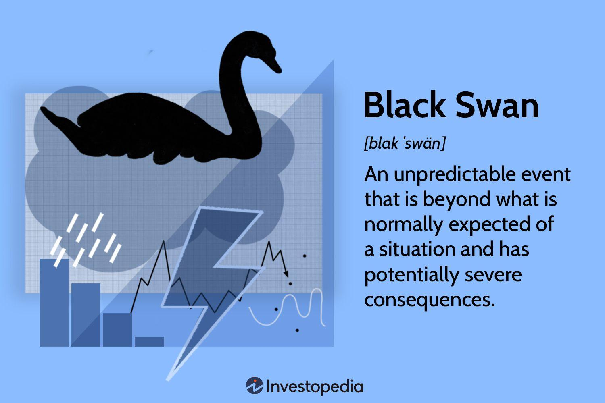

Financial history is a compelling field of study that examines the evolution and transformations of financial markets over time. This discipline is particularly pertinent to the stock market, where understanding past trends, events, and disruptions is crucial for making informed decisions. A fundamental aspect of financial history is its documentation of market behavior, cycles of growth and recession, and the impact of external forces on market dynamics.

One of the most intriguing concepts that arise in financial discussions is the term "Black Swan," popularized by Nassim Nicholas Taleb. A Black Swan event is characterized by its rarity, unpredictability, and significant impact on the financial markets. These events often defy conventional forecasts and models, delivering shocks that reverberate across economies. Black Swan events challenge the assumptions and risk assessments traditionally used by financial practitioners and call attention to the inherent uncertainties within the market system.



The advent of algorithmic trading has also reshaped the landscape of modern financial systems. Algorithmic trading, or algo trading, involves the use of computer algorithms to execute trades at speeds and frequencies beyond human capability. These algorithms rely on pre-defined criteria and mathematical models to make trading decisions, significantly increasing efficiency and trading volume. While algo trading brings numerous advantages, such as improved liquidity and reduced transaction costs, it also carries risks. In certain instances, these algorithms have been implicated in exacerbating market volatility, especially during unexpected events.

This article will explore these concepts in greater depth. It will start by examining Black Swan events, diving into their characteristics and historical examples like the 2008 financial crisis and the 1987 Black Monday. The next section will analyze specific historical crises, such as the 1929 Wall Street Crash, and their long-term implications on the global economy. Further, the article will assess the role of algo trading in modern markets, discussing how it can both mitigate and amplify the effects of such unpredictable occurrences. Subsequently, it will offer strategies for risk management and insights into the challenges posed by excessive reliance on complex financial models. Finally, it will provide key lessons for modern investors, focusing on the blend of technological advancements and traditional risk management techniques. Understanding these elements is vital for anyone aiming to navigate the volatile waters of the financial markets effectively.

## Table of Contents

## Understanding Black Swan Events

Black Swan events are defined as unpredictable and exceedingly rare occurrences that can have significant consequences on financial markets and economies. The term, popularized by statistician and former trader Nassim Nicholas Taleb, encapsulates the idea that these events lie outside regular expectations and have a massive impact. Taleb identifies three key characteristics of Black Swan events: rarity, extreme impact, and retrospective predictability. Despite their unpredictability, once they occur, such events are often rationalized in hindsight as if they could have been foreseen.

Historically, Black Swan events have significantly impacted stock markets globally. One of the most notable instances is the 2008 financial crisis, a severe global economic downturn that was precipitated by the collapse of major financial institutions and a dramatic loss of consumer wealth. The crisis was characterized by widespread panic in financial markets, resulting in stock market crashes and a liquidity crisis. Its consequences were felt worldwide, leading to recessions in numerous economies and prompting a re-evaluation of risk management practices in financial institutions.

Another significant Black Swan event in financial history is Black Monday, which occurred on October 19, 1987. On this day, stock markets around the world experienced an unprecedented crash, with the Dow Jones Industrial Average (DJIA) plummeting by 22.6% in a single day. The causes of Black Monday remain a topic of discussion, but factors such as program trading, illiquidity, and market psychology are often cited. The event highlighted the vulnerabilities in market mechanisms and led to the development of regulatory measures like circuit breakers to prevent future occurrences of such [volatility](/wiki/volatility-trading-strategies).

Other historical examples of Black Swan events include the bursting of the Dot-com bubble in the early 2000s, which saw the collapse of numerous internet companies and a substantial loss in market value, and the fall of Long-Term Capital Management (LTCM) in 1998. LTCM, a highly leveraged [hedge fund](/wiki/hedge-fund-trading-strategies), suffered catastrophic losses due to a combination of its high-risk strategies and unforeseen market conditions, necessitating a rescue by financial institutions to avoid widespread market disruption.

These events underscore the limitations of conventional financial models that rely on historical data to predict future market behavior. They challenge the assumptions of normal distribution and the efficacy of risk assessment models based on past trends. Understanding Black Swan events and their characteristics is crucial for investors and policymakers to mitigate potential impacts and develop strategies that accommodate the unpredictable nature of financial markets.

## Historical Examples and Analysis

The financial markets have witnessed several critical moments throughout history that profoundly impacted economies around the world. A deeper understanding of these events can provide valuable insights into the dynamics of financial systems and the occurrence of Black Swan events. Here, we explore such historical instances, examining their causes, consequences, and lessons learned.

### The 2008 Financial Crisis

The 2008 financial crisis, often regarded as the most severe since the Great Depression, was primarily triggered by the collapse of the housing bubble in the United States. This crisis was rooted in the widespread issuance of subprime mortgages, which were loans given to borrowers with poor credit history. The financial instruments backed by these loans, such as mortgage-backed securities and collateralized debt obligations, were sold globally by financial institutions seeking higher returns.

As default rates on subprime mortgages rose, the value of these securities plummeted, leading to significant losses for banks worldwide. Notably, the bankruptcy of Lehman Brothers in September 2008 marked a pivotal moment, intensifying the crisis and leading to widespread panic in financial markets. The repercussions included severe disruptions in the global banking system, a decline in consumer wealth, and prolonged economic recession.

Governments and central banks responded with significant interventions, including bailouts and monetary policy measures, to stabilize the financial system. The crisis highlighted weaknesses in financial regulation and the interconnectedness of global markets, prompting reforms such as the Dodd-Frank Act to enhance oversight and protect against future systemic risks.

### The 1929 Wall Street Crash

The 1929 Wall Street Crash, also known as Black Tuesday, was a precipitous decline in U.S. stock prices, marking the beginning of the Great Depression. Several factors contributed to this crash, including speculative stock buying with borrowed money, known as margin trading, and an overinflated stock market driven by investor optimism.

From September to October 1929, stock prices fell dramatically, wiping out significant wealth and leading to a banking crisis as banks called in loans to cover losses. The ensuing economic downturn had long-lasting global effects, leading to a sharp decline in industrial production, mass unemployment, and severe deflation.

The crash underscored the dangers of excessive speculation and the need for better financial regulation. It led to reforms such as the Glass-Steagall Act, which separated commercial and investment banking, aiming to prevent conflicts of interest and reduce the risk of future financial panics.

### The Tech Bubble and the Collapse of Long-Term Capital Management

The technology bubble of the late 1990s, also known as the dot-com bubble, was characterized by excessive speculation in internet-based companies. Investors, anticipating massive growth potential, significantly overvalued tech stocks, often disregarding traditional valuation metrics. However, by March 2000, the bubble burst, leading to a massive sell-off in tech stocks and significant wealth destruction.

This event highlighted the consequences of herd behavior and the dangers of market speculation without substantive financial performance. It also underscored the importance of adhering to [fundamental analysis](/wiki/fundamental-analysis) and maintaining diversified portfolios to mitigate sector-specific risks.

Conversely, the collapse of Long-Term Capital Management (LTCM) in 1998 demonstrated the peril of highly leveraged investment strategies. LTCM, a hedge fund led by renowned economists and traders, used complex mathematical models to identify [arbitrage](/wiki/arbitrage) opportunities. However, the fund's excessive leverage magnified its losses when Russia defaulted on its debt, leading to a [liquidity](/wiki/liquidity-risk-premium) crisis.

The Federal Reserve organized a rescue to prevent broader financial instability, illustrating the systemic risks posed by large, interconnected financial institutions and underscoring the need for prudent risk management practices. 

In summary, these historical financial events spotlight the importance of understanding market dynamics, investor behavior, and regulatory environments to anticipate and mitigate future disruptions in financial systems.

## The Role of Algo Trading

Algorithmic trading, often referred to as algo trading, is a method of executing orders using automated and pre-programmed trading instructions. These instructions take into account variables such as time, price, and [volume](/wiki/volume-trading-strategy), with the purpose of generating profits at a speed and frequency that is impossible for a human trader to achieve. Algorithmic trading has gained significant traction in financial markets due to its ability to process complex calculations rapidly and execute trades across diverse financial instruments.

The significance of [algorithmic trading](/wiki/algorithmic-trading) in today's financial markets cannot be overstated. It accounts for a substantial percentage of transactions on major stock exchanges, such as the New York Stock Exchange (NYSE) and the NASDAQ. This growth is driven by several factors, including the desire for cost efficiency, the ability to leverage large data sets for strategic decision-making, and the overall increase in market complexity which renders traditional trading methods less effective.

Algorithmic trading can both mitigate and amplify the effects of Black Swan events. Black Swan events are characterized by their unpredictability and potential for extreme consequences. While algo trading can mitigate the effects of such events by executing stop-loss orders, deploying hedging strategies, and rapidly adjusting positions to minimize losses, it can also amplify them. During periods of market stress, the sheer speed and volume of trades executed by algorithms can exacerbate volatility. For example, automated selling can trigger stop-loss orders, leading to a cascade of selling activity and significantly magnifying market declines.

A notable case study where algorithmic trading played a central role during market volatility is the "Flash Crash" of May 6, 2010. On this day, the U.S. stock market experienced an unprecedented 1,000-point drop within minutes, largely attributed to a single large sell algorithm. The algorithm was designed to aggressively sell E-mini S&P 500 futures contracts, a move that cascaded into a series of selling reactions by other algorithms, leading to widespread panic and a sharp market decline. This event highlighted the double-edged nature of algorithmic trading—its ability to both create liquidity and induce extreme price movements.

Another example is the volatility experienced during the COVID-19 pandemic's early days. As global markets reacted to the uncertainty, algo trading systems were tested under extreme conditions. Many algorithms had to be recalibrated in real-time to adapt to the rapid changes in volatility and market structure, showcasing both their vulnerability and resilience.

Algorithmic trading undeniably offers numerous advantages in modern financial markets. However, investors and regulators must remain vigilant, understanding its potential to both stabilize and destabilize markets. Employing robust risk management strategies and ensuring regulatory oversight are critical to harnessing the benefits of algo trading without succumbing to its potential pitfalls.

## Preparing for Black Swan Events

To effectively prepare for Black Swan events, which are rare and unpredictable occurrences with substantial impact, individuals and institutions must implement robust risk management and diversification strategies. Risk management involves identifying potential threats to financial stability and implementing measures to mitigate their effects. Diversification, on the other hand, is the process of allocating investments across various financial instruments or sectors to reduce exposure to any single asset or risk [factor](/wiki/factor-investing).

Contingency planning plays a crucial role in handling unexpected market disruptions. By establishing a well-thought-out contingency plan, investors and firms can swiftly respond to crises, minimizing losses. Key components of contingency planning include establishing emergency protocols, identifying alternative funding sources, and maintaining open communication channels to ensure quick decision-making. Additionally, maintaining liquidity is vital as it provides the necessary flexibility to maneuver through financial turbulence. Liquid assets can be quickly exchanged for cash without significant loss of value, allowing investors to meet urgent financial obligations or seize opportunities that arise in volatile markets.

The reliance on complex financial models for predictions and decision-making carries inherent risks. While these models can offer valuable insights, they are often based on historical data and assumptions that may not hold during extreme market conditions. Over-reliance on such models can lead to a false sense of security and may exacerbate the impact of Black Swan events. Models often fail to accurately predict rare events due to the non-linear and chaotic nature of financial markets during periods of crisis.

To illustrate the potential pitfalls, consider a portfolio that uses a Value at Risk (VaR) model to estimate potential losses. While VaR can be useful, it often underestimates the likelihood and impact of extreme market events, as it assumes normally distributed returns. This assumption rarely holds true during Black Swan events, where the tail risks are significantly underestimated.

```python
import numpy as np

# Simulate a simple portfolio's daily returns
np.random.seed(42)
daily_returns = np.random.normal(0.001, 0.02, 1000)  # mean=0.001, std=0.02

# Calculate VaR at 95% confidence level
confidence_level = 0.95
portfolio_value = 1000000  # Assume a portfolio value of $1,000,000
sorted_returns = np.sort(daily_returns)
index = int((1 - confidence_level) * len(sorted_returns))
VaR = portfolio_value * sorted_returns[index]

print("Portfolio Value at Risk (VaR) at 95% confidence level: ${:.2f}".format(-VaR))
```

By exercising caution and not solely depending on complex models, investors can better manage risks associated with Black Swan events. Strategies like stress testing, scenario analysis, and maintaining a diversified portfolio can help withstand market shocks. Additionally, fostering a mindset of adaptability and continuous learning can equip investors and institutions to proactively navigate the uncertainties of financial markets.

## Lessons for Modern Investors

Historical Black Swan events provide invaluable lessons for modern investors by highlighting vulnerabilities in financial systems and human psychology. Recognizing these vulnerabilities is pivotal in preparing for future market disruptions.

One key lesson is the importance of diversification. Black Swan events, by nature, are highly unpredictable, making it crucial for investors to spread risk across different asset classes and geographical regions. For instance, during the 2008 financial crisis, portfolios heavily concentrated in mortgage-backed securities suffered significant losses. Diversification acts as a buffer, reducing the negative impact of any single asset's downturn.

Another essential strategy is maintaining liquidity. During financial turmoil, liquid assets provide flexibility, allowing investors to capitalize on emerging opportunities or meet obligations without selling assets at distressed prices. The 2008 crisis underscored the dangers of liquidity shortages when many institutions were forced into fire sales to raise cash quickly.

Contingency planning is also vital. This involves stress-testing portfolios against various adverse scenarios to identify potential weaknesses. By simulating conditions similar to historical Black Swan events, investors can establish action plans that trigger predefined responses, such as rebalancing portfolios or altering asset allocations.

Additionally, over-reliance on complex financial models can be perilous. While advancements in financial modeling improve decision-making capabilities, models often fail to account for extreme, unforeseen events. The reliance on flawed risk models contributed to the downfall of Long-Term Capital Management (LTCM) in the late 1990s. Investors should complement algorithmic models with traditional risk management techniques, such as judgment and experience, to create a balanced approach.

Technology, particularly algorithmic trading, presents both opportunities and risks. It enhances market efficiency and can execute trades faster than human intervention. However, it can exacerbate volatility during unforeseen disruptions, as seen in the 2010 Flash Crash. Striking the right balance between leveraging technology and employing sound risk management principles is crucial.

For modern investors, the integration of these historical lessons with contemporary strategies is vital. This means regularly revising investment strategies to ensure they align with changing market conditions and potential Black Swan scenarios. By combining technology with traditional wisdom, investors can navigate uncertainties more effectively. Adaptability, awareness, and continuous education remain key components in mitigating the risks associated with future Black Swan events.

## Conclusion

The exploration of financial history and Black Swan events illuminates the intricate dynamics of the stock market and offers crucial insights for modern investors. Throughout history, unexpected and catastrophic occurrences have shaped the financial landscape, revealing the fragility and interconnectedness of global markets. Understanding these events, such as the 1929 Wall Street Crash and the 2008 financial crisis, is imperative for recognizing their characteristics and potential triggers. Nassim Nicholas Taleb's criteria for Black Swan events emphasize their unpredictability, rarity, and the profound consequences they [carry](/wiki/carry-trading).

Algorithmic trading adds another layer of complexity to the modern financial ecosystem. As a crucial tool for enhancing market efficiency, it also poses a risk by potentially exacerbating market volatility during Black Swan scenarios. Through historical analyses and case studies, we discern the dual nature of algorithmic strategies in navigating crises.

Preparedness remains the cornerstone of financial resilience. By employing strategies for risk management, diversification, and effective contingency planning, investors can safeguard against unpredictable disruptions. Avoiding over-reliance on complex financial models, while embracing both technological advancements and traditional risk management techniques, forms the foundation for a balanced approach in facing future uncertainties.

In summary, grasping the lessons of financial history and Black Swan events equips investors to anticipate and mitigate emergent risks. While the future of financial markets remains inherently uncertain, continuous learning and adaptability are vital. By staying informed and responsive, investors can better protect their interests and contribute to a more stable financial environment.

## References & Further Reading

[1]: Taleb, N. N. (2007). ["The Black Swan: The Impact of the Highly Improbable."](https://www.jstor.org/stable/23045073) Random House.

[2]: Lo, A. W., & MacKinlay, A. C. (1999). ["A Non-Random Walk Down Wall Street."](https://www.jstor.org/stable/j.ctt7tccx) Princeton University Press.

[3]: Gorton, G. B. (2012). ["Misunderstanding Financial Crises: Why We Don't See Them Coming."](https://archive.org/details/misunderstanding0000gort) Oxford University Press.

[4]: Patterson, S. (2013). ["Dark Pools: The Rise of the Machine Traders and the Rigging of the U.S. Stock Market."](https://www.amazon.com/Dark-Pools-Machine-Traders-Rigging/dp/0307887189) Crown Business.

[5]: Shiller, R. J. (2000). ["Irrational Exuberance."](https://press.princeton.edu/books/paperback/9780691173122/irrational-exuberance) Princeton University Press.

[6]: MacKenzie, D. (2008). ["An Engine, Not a Camera: How Financial Models Shape Markets."](https://academic.oup.com/mit-press-scholarship-online/book/20588) MIT Press.

[7]: Lewis, M. (2010). ["The Big Short: Inside the Doomsday Machine."](https://books.google.com/books/about/The_Big_Short_Inside_the_Doomsday_Machin.html?id=eParwQ0YdrcC) W. W. Norton & Company.

[8]: Jarrow, R. A. (Ed.). (2019). ["Quantitative Asset Management: Factor Investing and Algorithmic Trading."](https://business.cornell.edu/faculty-research/faculty/raj15/) CRC Press.