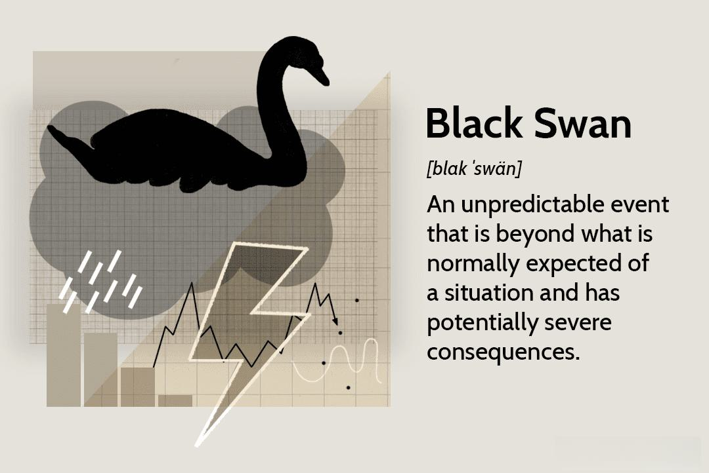

## Table of Contents

## What is a Black Swan event?

A Black Swan event is a rare and unexpected occurrence that has a huge impact on the world. These events are hard to predict because they are so unusual and surprising. For example, the global financial crisis in 2008 was a Black Swan event because almost no one saw it coming, but it affected economies all over the world.

The term "Black Swan" comes from the idea that people used to think all swans were white. When black swans were discovered in Australia, it showed that what was thought to be impossible could actually happen. In the same way, Black Swan events challenge our assumptions and show us that even very unlikely things can happen and change everything.

## Can you give examples of Black Swan events in the stock market?

One big Black Swan event in the stock market was the stock market crash of 1929. This event started the Great Depression, which was a very tough time for the whole world. People lost a lot of money very quickly because nobody expected the stock market to fall so hard. It was a surprise that changed how people thought about investing and led to new rules to try to stop it from happening again.

Another example is the dot-com bubble burst in the early 2000s. Before it happened, many people thought that internet companies would keep growing and making money forever. But suddenly, in 2000, a lot of these companies failed, and their stock prices dropped a lot. This was a Black Swan event because it was unexpected and it showed that the excitement about internet companies was not based on reality. It made people more careful about investing in new technology.

The 2008 financial crisis is also a Black Swan event. It started with problems in the housing market in the United States, but it quickly spread to the whole world. Banks failed, and the stock market crashed. People lost jobs and homes, and governments had to step in to help. This event was a big surprise because many experts thought the economy was strong. It showed how connected and fragile the global financial system can be.

## How do Black Swan events impact the stock market?

Black Swan events can shake up the stock market a lot. When these surprising things happen, people get scared and start selling their stocks quickly. This makes stock prices drop fast. For example, during the 2008 financial crisis, the stock market lost a lot of value because banks were failing and people were losing trust in the economy. The sudden drop in stock prices can make people lose a lot of money and can lead to a bigger economic problem.

After a Black Swan event, the stock market can take a long time to recover. It can be hard for people to feel safe investing again because they remember how bad things got. New rules and changes might be made to try to stop the same thing from happening again. For instance, after the 1929 crash, new laws were made to protect investors. But even with these changes, the memory of the Black Swan event can make the market more careful and less likely to take big risks for a while.

## What are the characteristics of a Black Swan event?

A Black Swan event is something that almost nobody expects to happen, but when it does, it changes everything in a big way. These events are really rare and hard to predict. Before a Black Swan event happens, people might think that it's impossible or so unlikely that it's not worth worrying about. But then, when it does happen, it surprises everyone because it's so different from what they thought could happen.

When a Black Swan event happens, it has a huge impact. It can shake up the world, like how the 2008 financial crisis affected economies everywhere. After the event, people look back and try to understand why it happened. They might change their plans and rules to try to avoid the same thing happening again. But because these events are so unexpected, it's hard to be ready for them.

## How can investors prepare for Black Swan events?

Investors can prepare for Black Swan events by spreading their money around in different types of investments. This is called diversification. Instead of putting all their money into one thing, like just stocks, they can also invest in bonds, real estate, or even keep some money in savings. By doing this, if a Black Swan event hits one area hard, like the stock market, their other investments might not be affected as much. This can help them lose less money and recover faster.

Another way to get ready is to have a plan for what to do if something really bad happens. This means thinking about what could go wrong and deciding ahead of time how to react. For example, an investor might decide to sell some stocks if the market drops a certain amount. Having a plan can help them stay calm and make smart choices instead of panicking when things get tough. It's also a good idea to keep learning about the world and the economy, so they can be more ready for surprises.

## What role does risk management play in dealing with Black Swan events?

Risk management is really important when it comes to dealing with Black Swan events. It's all about figuring out what could go wrong and trying to be ready for it. Even though Black Swan events are hard to predict, good risk management means looking at all kinds of risks, even the ones that seem really unlikely. By doing this, investors can set up plans and rules to help them handle these big surprises better. For example, they might decide to keep some money in safe places, like savings accounts, so they have something to fall back on if the stock market crashes.

Having a strong risk management plan can also help investors stay calm and make smart choices during a Black Swan event. Instead of panicking and selling everything when things get bad, they can follow their plan. This might mean selling some stocks to cut losses or holding onto certain investments that they believe will recover. By thinking about risks ahead of time and having a plan, investors can be more prepared to face the unexpected and protect their money better.

## How do Black Swan events affect different types of investments?

Black Swan events can shake up different types of investments in different ways. When something unexpected and big happens, like a financial crisis, stocks usually get hit hard. People get scared and start selling their stocks quickly, which makes the prices drop a lot. This can lead to big losses for people who have a lot of money in the stock market. But not all investments are affected the same way. For example, if someone has money in bonds, which are usually seen as safer than stocks, they might not lose as much. Bonds can act like a cushion during tough times because they don't go up and down as much as stocks.

Other types of investments, like real estate, can also feel the impact of Black Swan events, but it might take longer to see the effects. If the economy gets really bad because of a Black Swan event, people might not be able to pay their mortgages, and this can lead to more homes being sold for less money. This can make real estate prices drop. But real estate can also be a good way to spread out risk because it's not as tied to the stock market. Having money in different places, like real estate, stocks, and bonds, can help investors lose less money when a Black Swan event happens.

## What are the psychological effects of Black Swan events on investors?

Black Swan events can make investors feel really scared and unsure. When something unexpected and big happens, like a stock market crash, people can start to panic. They might sell their investments quickly because they're afraid of losing more money. This fear can make them make bad choices, like selling everything at a low price instead of waiting for things to get better. It's hard to stay calm when everything seems to be falling apart, and this can lead to a lot of stress and worry.

After a Black Swan event, investors might also feel less confident about investing in the future. They remember how bad things got and might be afraid that it could happen again. This can make them more careful and less likely to take risks. They might keep their money in safer places, like savings accounts, instead of investing in stocks or other things that could grow their money. Over time, as things get better, they might start to feel more confident again, but it can take a while to get over the fear and shock of a Black Swan event.

## How can one predict or anticipate Black Swan events?

It's really hard to predict Black Swan events because they are so unexpected and rare. These events are called Black Swans because, just like people used to think all swans were white until they found black ones, we think some things can't happen until they do. Experts look at a lot of data and try to guess what might happen in the future, but Black Swan events are so different and surprising that they usually can't be seen coming. Even though we can't predict them exactly, we can think about what could go wrong and try to be ready for surprises.

One way to anticipate Black Swan events is to always be learning and thinking about different risks. This means looking at the world and the economy and trying to understand how things are connected. By doing this, we can see some things that might be weak or could cause big problems. For example, if a lot of people are borrowing too much money, that could be a sign that a financial crisis might happen. We can't know for sure, but by staying alert and thinking about different possibilities, we can be a bit more ready for the unexpected.

## What are the long-term effects of Black Swan events on the economy?

Black Swan events can have big effects on the economy that last a long time. When something unexpected and bad happens, like a financial crisis or a global health emergency, it can make the economy slow down. Companies might lose money and have to let people go, which means more people are out of work. This can make people spend less money, and when people spend less, businesses make less money, and the economy can get stuck in a cycle of being slow. Governments might need to step in with money and new rules to help fix things, but it can take years for the economy to get back to normal.

After a Black Swan event, people and businesses might change how they do things to try to be more ready for the next surprise. For example, after the 2008 financial crisis, new rules were made to make banks safer and to stop the same kind of crisis from happening again. People might also be more careful with their money and think more about risks. Even though these changes can help, they can also make the economy grow more slowly because people are less likely to take big risks. So, Black Swan events can change how the economy works and how people think about money for a long time.

## How have financial regulations changed in response to Black Swan events?

After big and unexpected events like the 2008 financial crisis, governments and banks made new rules to try to stop the same thing from happening again. They made banks keep more money in reserve, so they could handle tough times better. They also made rules about how much risk banks could take, to make sure they were not too risky. These changes were meant to make the financial system stronger and safer, so that if another big surprise happened, it wouldn't hurt the economy as much.

These new rules also changed how people and businesses think about money. Banks have to be more careful about who they lend money to and how much they lend. This can make it harder for some people to get loans, but it also means that banks are less likely to fail. Governments also started watching the financial system more closely, to spot problems before they get too big. Even though these changes can slow down the economy a bit, they are meant to help protect it from big shocks in the future.

## What advanced strategies can be used to mitigate the impact of Black Swan events on a portfolio?

One advanced strategy to protect a portfolio from Black Swan events is to use something called tail-risk hedging. This means buying special investments that do well when the market crashes. These investments, like put options on stock indexes, can help make up for the money lost in other parts of the portfolio when things go really bad. By having these hedges, an investor can lose less money during a big surprise event. It's like having insurance for the portfolio, but it can be expensive and might not pay off if a Black Swan event doesn't happen.

Another strategy is to use a risk parity approach. This means spreading out the risk evenly across different types of investments, like stocks, bonds, and commodities. Instead of just focusing on how much money is in each investment, risk parity looks at how much risk each investment adds to the portfolio. This can help balance things out so that if one type of investment gets hit hard by a Black Swan event, the others might not be affected as much. It can make the portfolio more stable and better able to handle big surprises.

A third strategy is to use scenario analysis and stress testing. This involves looking at different bad things that could happen and seeing how the portfolio would do in those situations. By testing the portfolio against different Black Swan events, like a big stock market crash or a sudden economic downturn, investors can find weak spots and make changes to be more ready. This kind of planning can help them react better when a real surprise happens, and it can make them feel more confident about their investments even in tough times.

## References & Further Reading

[1]: Taleb, N. N. (2007). ["The Black Swan: The Impact of the Highly Improbable."](https://www.jstor.org/stable/23045073) Random House.

[2]: Lo, A. W., & MacKinlay, A. C. (1999). ["A Non-Random Walk Down Wall Street."](https://www.jstor.org/stable/j.ctt7tccx) Princeton University Press.

[3]: Gorton, G. B. (2012). ["Misunderstanding Financial Crises: Why We Don't See Them Coming."](https://archive.org/details/misunderstanding0000gort) Oxford University Press.

[4]: Patterson, S. (2013). ["Dark Pools: The Rise of the Machine Traders and the Rigging of the U.S. Stock Market."](https://www.amazon.com/Dark-Pools-Machine-Traders-Rigging/dp/0307887189) Crown Business.

[5]: Shiller, R. J. (2000). ["Irrational Exuberance."](https://press.princeton.edu/books/paperback/9780691173122/irrational-exuberance) Princeton University Press.

[6]: MacKenzie, D. (2008). ["An Engine, Not a Camera: How Financial Models Shape Markets."](https://academic.oup.com/mit-press-scholarship-online/book/20588) MIT Press.

[7]: Lewis, M. (2010). ["The Big Short: Inside the Doomsday Machine."](https://books.google.com/books/about/The_Big_Short_Inside_the_Doomsday_Machin.html?id=eParwQ0YdrcC) W. W. Norton & Company.

[8]: Jarrow, R. A. (Ed.). (2019). ["Quantitative Asset Management: Factor Investing and Algorithmic Trading."](https://business.cornell.edu/faculty-research/faculty/raj15/) CRC Press.